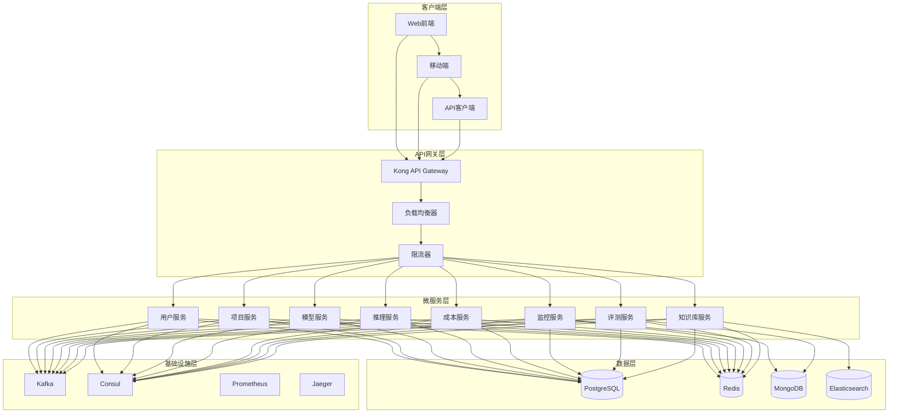

# LLMOps平台Golang后端架构设计

> **架构类型**: 后端架构设计  
> **技术栈**: Golang + 微服务架构  
> **更新日期**: 2025-10-17

## 一、架构概述

### 1.1 设计目标

基于Golang技术栈构建高性能、可扩展、易维护的LLMOps平台后端架构，支持大规模LLM运营平台的核心功能需求。

### 1.2 核心原则

- **高性能**: 利用Golang的并发特性和性能优势
- **可扩展**: 微服务架构，支持水平扩展
- **易维护**: 清晰的代码结构和模块化设计
- **高可用**: 容错机制和故障恢复
- **安全性**: 多层次安全防护

### 1.3 技术选型

#### 核心框架
- **Web框架**: Gin (高性能HTTP框架)
- **ORM**: GORM (功能丰富的ORM库)
- **数据库**: PostgreSQL (主数据库) + Redis (缓存)
- **消息队列**: Apache Kafka (异步处理)
- **服务发现**: Consul (服务注册与发现)
- **配置管理**: Viper (配置管理)
- **日志**: Logrus (结构化日志)

#### 基础设施
- **容器化**: Docker + Kubernetes
- **监控**: Prometheus + Grafana
- **链路追踪**: Jaeger
- **API网关**: Kong
- **负载均衡**: Nginx

## 二、整体架构

### 2.1 架构图



### 2.2 服务划分

#### 核心业务服务
1. **用户服务** (user-service)
   - 用户管理、认证授权
   - 角色权限管理
   - 组织租户管理

2. **项目服务** (project-service)
   - 项目管理
   - 成员管理
   - 资源配置

3. **模型服务** (model-service)
   - 模型管理
   - 版本控制
   - 部署管理

4. **推理服务** (inference-service)
   - 模型推理
   - 负载均衡
   - 缓存管理

5. **成本服务** (cost-service)
   - 成本计算
   - 预算管理
   - 计费规则

6. **监控服务** (monitoring-service)
   - 指标收集
   - 告警管理
   - 日志处理

7. **评测服务** (evaluation-service)
   - 评测任务
   - 结果分析
   - 报告生成

8. **知识库服务** (knowledge-service)
   - 知识库管理
   - 文档处理
   - 检索服务

#### 基础设施服务
1. **API网关** (api-gateway)
2. **配置服务** (config-service)
3. **通知服务** (notification-service)
4. **文件服务** (file-service)

## 三、技术架构

### 3.1 项目结构

```
llmops-backend/
├── cmd/                    # 应用入口
│   ├── user-service/
│   ├── project-service/
│   ├── model-service/
│   ├── inference-service/
│   ├── cost-service/
│   ├── monitoring-service/
│   ├── evaluation-service/
│   └── knowledge-service/
├── internal/               # 内部包
│   ├── app/               # 应用层
│   │   ├── handler/       # HTTP处理器
│   │   ├── service/       # 业务逻辑
│   │   ├── repository/    # 数据访问
│   │   └── middleware/    # 中间件
│   ├── domain/            # 领域层
│   │   ├── entity/        # 实体
│   │   ├── valueobject/   # 值对象
│   │   ├── repository/    # 仓储接口
│   │   └── service/       # 领域服务
│   ├── infrastructure/    # 基础设施层
│   │   ├── database/      # 数据库
│   │   ├── cache/         # 缓存
│   │   ├── message/       # 消息队列
│   │   └── external/      # 外部服务
│   └── pkg/               # 公共包
│       ├── config/        # 配置
│       ├── logger/        # 日志
│       ├── validator/     # 验证
│       ├── response/      # 响应
│       └── utils/         # 工具
├── api/                   # API定义
│   ├── proto/             # gRPC定义
│   └── openapi/           # OpenAPI定义
├── deployments/           # 部署配置
│   ├── docker/
│   └── k8s/
├── scripts/               # 脚本
├── docs/                  # 文档
├── tests/                 # 测试
├── go.mod
├── go.sum
└── Makefile
```

### 3.2 核心组件设计

#### 3.2.1 应用层 (Application Layer)

```go
// 用户服务处理器示例
type UserHandler struct {
    userService    domain.UserService
    authService    domain.AuthService
    logger         *logrus.Logger
    validator      *validator.Validate
}

func (h *UserHandler) CreateUser(c *gin.Context) {
    var req CreateUserRequest
    if err := c.ShouldBindJSON(&req); err != nil {
        h.logger.Error("Invalid request", err)
        response.Error(c, http.StatusBadRequest, "Invalid request")
        return
    }
    
    if err := h.validator.Struct(req); err != nil {
        response.Error(c, http.StatusBadRequest, "Validation failed")
        return
    }
    
    user, err := h.userService.CreateUser(c.Request.Context(), req)
    if err != nil {
        h.logger.Error("Failed to create user", err)
        response.Error(c, http.StatusInternalServerError, "Failed to create user")
        return
    }
    
    response.Success(c, user)
}
```

#### 3.2.2 领域层 (Domain Layer)

```go
// 用户实体
type User struct {
    ID           uint      `json:"id" gorm:"primaryKey"`
    UUID         string    `json:"uuid" gorm:"uniqueIndex"`
    Username     string    `json:"username" gorm:"uniqueIndex"`
    Email        string    `json:"email" gorm:"uniqueIndex"`
    PasswordHash string    `json:"-"`
    FirstName    string    `json:"first_name"`
    LastName     string    `json:"last_name"`
    Status       string    `json:"status"`
    CreatedAt    time.Time `json:"created_at"`
    UpdatedAt    time.Time `json:"updated_at"`
}

// 用户服务接口
type UserService interface {
    CreateUser(ctx context.Context, req CreateUserRequest) (*User, error)
    GetUser(ctx context.Context, id uint) (*User, error)
    UpdateUser(ctx context.Context, id uint, req UpdateUserRequest) (*User, error)
    DeleteUser(ctx context.Context, id uint) error
    ListUsers(ctx context.Context, req ListUsersRequest) (*ListUsersResponse, error)
}

// 用户仓储接口
type UserRepository interface {
    Create(ctx context.Context, user *User) error
    GetByID(ctx context.Context, id uint) (*User, error)
    GetByEmail(ctx context.Context, email string) (*User, error)
    Update(ctx context.Context, user *User) error
    Delete(ctx context.Context, id uint) error
    List(ctx context.Context, req ListUsersRequest) ([]*User, int64, error)
}
```

#### 3.2.3 基础设施层 (Infrastructure Layer)

```go
// 数据库实现
type userRepository struct {
    db     *gorm.DB
    logger *logrus.Logger
}

func (r *userRepository) Create(ctx context.Context, user *User) error {
    if err := r.db.WithContext(ctx).Create(user).Error; err != nil {
        r.logger.Error("Failed to create user", err)
        return err
    }
    return nil
}

func (r *userRepository) GetByID(ctx context.Context, id uint) (*User, error) {
    var user User
    if err := r.db.WithContext(ctx).First(&user, id).Error; err != nil {
        if errors.Is(err, gorm.ErrRecordNotFound) {
            return nil, ErrUserNotFound
        }
        r.logger.Error("Failed to get user by ID", err)
        return nil, err
    }
    return &user, nil
}

// 缓存实现
type userCache struct {
    redis  *redis.Client
    logger *logrus.Logger
}

func (c *userCache) Get(ctx context.Context, key string) (*User, error) {
    data, err := c.redis.Get(ctx, key).Result()
    if err != nil {
        if err == redis.Nil {
            return nil, ErrCacheMiss
        }
        return nil, err
    }
    
    var user User
    if err := json.Unmarshal([]byte(data), &user); err != nil {
        return nil, err
    }
    
    return &user, nil
}

func (c *userCache) Set(ctx context.Context, key string, user *User, expiration time.Duration) error {
    data, err := json.Marshal(user)
    if err != nil {
        return err
    }
    
    return c.redis.Set(ctx, key, data, expiration).Err()
}
```

## 四、数据架构

### 4.1 数据库设计

#### 4.1.1 主数据库 (PostgreSQL)

```sql
-- 用户表
CREATE TABLE users (
    id BIGSERIAL PRIMARY KEY,
    uuid UUID NOT NULL DEFAULT gen_random_uuid(),
    username VARCHAR(50) NOT NULL UNIQUE,
    email VARCHAR(255) NOT NULL UNIQUE,
    password_hash VARCHAR(255) NOT NULL,
    first_name VARCHAR(100),
    last_name VARCHAR(100),
    phone VARCHAR(20),
    avatar_url VARCHAR(500),
    status VARCHAR(20) NOT NULL DEFAULT 'active',
    email_verified BOOLEAN DEFAULT FALSE,
    phone_verified BOOLEAN DEFAULT FALSE,
    two_factor_enabled BOOLEAN DEFAULT FALSE,
    last_login_at TIMESTAMP WITH TIME ZONE,
    created_at TIMESTAMP WITH TIME ZONE NOT NULL DEFAULT NOW(),
    updated_at TIMESTAMP WITH TIME ZONE NOT NULL DEFAULT NOW()
);

-- 项目表
CREATE TABLE projects (
    id BIGSERIAL PRIMARY KEY,
    uuid UUID NOT NULL DEFAULT gen_random_uuid(),
    name VARCHAR(200) NOT NULL,
    code VARCHAR(50) NOT NULL,
    description TEXT,
    type VARCHAR(20) NOT NULL DEFAULT 'general',
    status VARCHAR(20) NOT NULL DEFAULT 'active',
    visibility VARCHAR(20) NOT NULL DEFAULT 'private',
    settings JSONB DEFAULT '{}',
    metadata JSONB DEFAULT '{}',
    owner_id BIGINT NOT NULL REFERENCES users(id),
    tenant_id BIGINT NOT NULL,
    organization_id BIGINT,
    created_at TIMESTAMP WITH TIME ZONE NOT NULL DEFAULT NOW(),
    updated_at TIMESTAMP WITH TIME ZONE NOT NULL DEFAULT NOW()
);

-- 模型表
CREATE TABLE models (
    id BIGSERIAL PRIMARY KEY,
    uuid UUID NOT NULL DEFAULT gen_random_uuid(),
    name VARCHAR(200) NOT NULL,
    code VARCHAR(50) NOT NULL,
    description TEXT,
    type VARCHAR(50) NOT NULL,
    category VARCHAR(50),
    framework VARCHAR(50),
    base_model VARCHAR(100),
    model_size VARCHAR(50),
    precision VARCHAR(20),
    status VARCHAR(20) NOT NULL DEFAULT 'active',
    tags TEXT[],
    metadata JSONB DEFAULT '{}',
    settings JSONB DEFAULT '{}',
    owner_id BIGINT NOT NULL REFERENCES users(id),
    project_id BIGINT NOT NULL REFERENCES projects(id),
    created_at TIMESTAMP WITH TIME ZONE NOT NULL DEFAULT NOW(),
    updated_at TIMESTAMP WITH TIME ZONE NOT NULL DEFAULT NOW()
);

-- 索引
CREATE INDEX idx_users_email ON users(email);
CREATE INDEX idx_users_username ON users(username);
CREATE INDEX idx_users_status ON users(status);
CREATE INDEX idx_projects_owner_id ON projects(owner_id);
CREATE INDEX idx_projects_tenant_id ON projects(tenant_id);
CREATE INDEX idx_models_project_id ON models(project_id);
CREATE INDEX idx_models_type ON models(type);
CREATE INDEX idx_models_status ON models(status);
```

#### 4.1.2 缓存设计 (Redis)

```go
// 缓存键设计
const (
    UserCacheKey     = "user:%d"
    ProjectCacheKey  = "project:%d"
    ModelCacheKey    = "model:%d"
    SessionCacheKey  = "session:%s"
    TokenCacheKey    = "token:%s"
)

// 缓存配置
type CacheConfig struct {
    UserTTL     time.Duration `yaml:"user_ttl"`
    ProjectTTL  time.Duration `yaml:"project_ttl"`
    ModelTTL    time.Duration `yaml:"model_ttl"`
    SessionTTL  time.Duration `yaml:"session_ttl"`
    TokenTTL    time.Duration `yaml:"token_ttl"`
}
```

### 4.2 数据访问层

```go
// 数据库连接配置
type DatabaseConfig struct {
    Host     string `yaml:"host"`
    Port     int    `yaml:"port"`
    User     string `yaml:"user"`
    Password string `yaml:"password"`
    DBName   string `yaml:"dbname"`
    SSLMode  string `yaml:"sslmode"`
    MaxConns int    `yaml:"max_conns"`
    MinConns int    `yaml:"min_conns"`
}

// 数据库初始化
func InitDatabase(config DatabaseConfig) (*gorm.DB, error) {
    dsn := fmt.Sprintf("host=%s port=%d user=%s password=%s dbname=%s sslmode=%s",
        config.Host, config.Port, config.User, config.Password, config.DBName, config.SSLMode)
    
    db, err := gorm.Open(postgres.Open(dsn), &gorm.Config{
        Logger: logger.Default.LogMode(logger.Info),
    })
    if err != nil {
        return nil, err
    }
    
    sqlDB, err := db.DB()
    if err != nil {
        return nil, err
    }
    
    sqlDB.SetMaxOpenConns(config.MaxConns)
    sqlDB.SetMaxIdleConns(config.MinConns)
    sqlDB.SetConnMaxLifetime(time.Hour)
    
    return db, nil
}
```

## 五、服务间通信

### 5.1 同步通信 (gRPC)

```protobuf
// user.proto
syntax = "proto3";

package user.v1;

option go_package = "github.com/llmops/api/proto/user/v1";

service UserService {
    rpc CreateUser(CreateUserRequest) returns (CreateUserResponse);
    rpc GetUser(GetUserRequest) returns (GetUserResponse);
    rpc UpdateUser(UpdateUserRequest) returns (UpdateUserResponse);
    rpc DeleteUser(DeleteUserRequest) returns (DeleteUserResponse);
    rpc ListUsers(ListUsersRequest) returns (ListUsersResponse);
}

message CreateUserRequest {
    string username = 1;
    string email = 2;
    string password = 3;
    string first_name = 4;
    string last_name = 5;
}

message CreateUserResponse {
    User user = 1;
}

message User {
    uint64 id = 1;
    string uuid = 2;
    string username = 3;
    string email = 4;
    string first_name = 5;
    string last_name = 6;
    string status = 7;
    int64 created_at = 8;
    int64 updated_at = 9;
}
```

### 5.2 异步通信 (Kafka)

```go
// 消息生产者
type MessageProducer struct {
    producer sarama.AsyncProducer
    logger   *logrus.Logger
}

func (p *MessageProducer) SendUserCreated(ctx context.Context, user *User) error {
    message := &UserCreatedMessage{
        UserID:    user.ID,
        Username:  user.Username,
        Email:     user.Email,
        CreatedAt: user.CreatedAt,
    }
    
    data, err := json.Marshal(message)
    if err != nil {
        return err
    }
    
    msg := &sarama.ProducerMessage{
        Topic: "user.created",
        Key:   sarama.StringEncoder(fmt.Sprintf("%d", user.ID)),
        Value: sarama.ByteEncoder(data),
    }
    
    select {
    case p.producer.Input() <- msg:
        return nil
    case <-ctx.Done():
        return ctx.Err()
    }
}

// 消息消费者
type MessageConsumer struct {
    consumer sarama.ConsumerGroup
    logger   *logrus.Logger
}

func (c *MessageConsumer) ConsumeUserCreated(ctx context.Context, message *UserCreatedMessage) error {
    // 处理用户创建事件
    c.logger.Info("User created", "user_id", message.UserID)
    
    // 发送欢迎邮件
    // 初始化用户设置
    // 记录审计日志
    
    return nil
}
```

## 六、安全架构

### 6.1 认证授权

```go
// JWT认证中间件
func JWTAuthMiddleware() gin.HandlerFunc {
    return func(c *gin.Context) {
        token := c.GetHeader("Authorization")
        if token == "" {
            response.Error(c, http.StatusUnauthorized, "Missing authorization header")
            c.Abort()
            return
        }
        
        if !strings.HasPrefix(token, "Bearer ") {
            response.Error(c, http.StatusUnauthorized, "Invalid authorization header format")
            c.Abort()
            return
        }
        
        token = strings.TrimPrefix(token, "Bearer ")
        
        claims, err := jwt.ParseToken(token)
        if err != nil {
            response.Error(c, http.StatusUnauthorized, "Invalid token")
            c.Abort()
            return
        }
        
        c.Set("user_id", claims.UserID)
        c.Set("username", claims.Username)
        c.Set("roles", claims.Roles)
        c.Set("permissions", claims.Permissions)
        
        c.Next()
    }
}

// 权限检查中间件
func RequirePermission(permission string) gin.HandlerFunc {
    return func(c *gin.Context) {
        permissions, exists := c.Get("permissions")
        if !exists {
            response.Error(c, http.StatusForbidden, "No permissions found")
            c.Abort()
            return
        }
        
        permList, ok := permissions.([]string)
        if !ok {
            response.Error(c, http.StatusForbidden, "Invalid permissions format")
            c.Abort()
            return
        }
        
        if !contains(permList, permission) {
            response.Error(c, http.StatusForbidden, "Insufficient permissions")
            c.Abort()
            return
        }
        
        c.Next()
    }
}
```

### 6.2 数据加密

```go
// 密码加密
func HashPassword(password string) (string, error) {
    hash, err := bcrypt.GenerateFromPassword([]byte(password), bcrypt.DefaultCost)
    if err != nil {
        return "", err
    }
    return string(hash), nil
}

func VerifyPassword(password, hash string) bool {
    err := bcrypt.CompareHashAndPassword([]byte(hash), []byte(password))
    return err == nil
}

// 敏感数据加密
type Encryptor struct {
    key []byte
}

func (e *Encryptor) Encrypt(plaintext string) (string, error) {
    block, err := aes.NewCipher(e.key)
    if err != nil {
        return "", err
    }
    
    gcm, err := cipher.NewGCM(block)
    if err != nil {
        return "", err
    }
    
    nonce := make([]byte, gcm.NonceSize())
    if _, err := io.ReadFull(rand.Reader, nonce); err != nil {
        return "", err
    }
    
    ciphertext := gcm.Seal(nonce, nonce, []byte(plaintext), nil)
    return base64.StdEncoding.EncodeToString(ciphertext), nil
}
```

## 七、监控与日志

### 7.1 日志设计

```go
// 日志配置
type LogConfig struct {
    Level      string `yaml:"level"`
    Format     string `yaml:"format"`
    Output     string `yaml:"output"`
    FilePath   string `yaml:"file_path"`
    MaxSize    int    `yaml:"max_size"`
    MaxBackups int    `yaml:"max_backups"`
    MaxAge     int    `yaml:"max_age"`
}

// 日志初始化
func InitLogger(config LogConfig) *logrus.Logger {
    logger := logrus.New()
    
    level, err := logrus.ParseLevel(config.Level)
    if err != nil {
        level = logrus.InfoLevel
    }
    logger.SetLevel(level)
    
    if config.Format == "json" {
        logger.SetFormatter(&logrus.JSONFormatter{
            TimestampFormat: time.RFC3339,
        })
    }
    
    if config.Output == "file" {
        writer, err := rotatelogs.New(
            config.FilePath+".%Y%m%d%H%M",
            rotatelogs.WithLinkName(config.FilePath),
            rotatelogs.WithMaxAge(time.Duration(config.MaxAge)*24*time.Hour),
            rotatelogs.WithRotationTime(time.Hour),
        )
        if err != nil {
            log.Fatal("Failed to create log file", err)
        }
        logger.SetOutput(writer)
    }
    
    return logger
}

// 结构化日志
func (h *UserHandler) CreateUser(c *gin.Context) {
    logger := h.logger.WithFields(logrus.Fields{
        "handler": "UserHandler",
        "method":  "CreateUser",
        "request_id": c.GetString("request_id"),
    })
    
    logger.Info("Creating user")
    
    // 业务逻辑...
    
    logger.WithFields(logrus.Fields{
        "user_id": user.ID,
        "username": user.Username,
    }).Info("User created successfully")
}
```

### 7.2 监控指标

```go
// Prometheus指标
var (
    httpRequestsTotal = prometheus.NewCounterVec(
        prometheus.CounterOpts{
            Name: "http_requests_total",
            Help: "Total number of HTTP requests",
        },
        []string{"method", "endpoint", "status"},
    )
    
    httpRequestDuration = prometheus.NewHistogramVec(
        prometheus.HistogramOpts{
            Name: "http_request_duration_seconds",
            Help: "HTTP request duration in seconds",
        },
        []string{"method", "endpoint"},
    )
    
    activeConnections = prometheus.NewGauge(
        prometheus.GaugeOpts{
            Name: "active_connections",
            Help: "Number of active connections",
        },
    )
)

// 监控中间件
func PrometheusMiddleware() gin.HandlerFunc {
    return func(c *gin.Context) {
        start := time.Now()
        
        c.Next()
        
        duration := time.Since(start).Seconds()
        status := strconv.Itoa(c.Writer.Status())
        
        httpRequestsTotal.WithLabelValues(c.Request.Method, c.FullPath(), status).Inc()
        httpRequestDuration.WithLabelValues(c.Request.Method, c.FullPath()).Observe(duration)
    }
}
```

## 八、部署架构

### 8.1 Docker配置

```dockerfile
# Dockerfile
FROM golang:1.21-alpine AS builder

WORKDIR /app
COPY go.mod go.sum ./
RUN go mod download

COPY . .
RUN CGO_ENABLED=0 GOOS=linux go build -a -installsuffix cgo -o main ./cmd/user-service

FROM alpine:latest
RUN apk --no-cache add ca-certificates
WORKDIR /root/

COPY --from=builder /app/main .
COPY --from=builder /app/configs ./configs

EXPOSE 8080
CMD ["./main"]
```

### 8.2 Kubernetes配置

```yaml
# deployment.yaml
apiVersion: apps/v1
kind: Deployment
metadata:
  name: user-service
  labels:
    app: user-service
spec:
  replicas: 3
  selector:
    matchLabels:
      app: user-service
  template:
    metadata:
      labels:
        app: user-service
    spec:
      containers:
      - name: user-service
        image: llmops/user-service:latest
        ports:
        - containerPort: 8080
        env:
        - name: DATABASE_URL
          valueFrom:
            secretKeyRef:
              name: database-secret
              key: url
        - name: REDIS_URL
          valueFrom:
            secretKeyRef:
              name: redis-secret
              key: url
        resources:
          requests:
            memory: "256Mi"
            cpu: "250m"
          limits:
            memory: "512Mi"
            cpu: "500m"
        livenessProbe:
          httpGet:
            path: /health
            port: 8080
          initialDelaySeconds: 30
          periodSeconds: 10
        readinessProbe:
          httpGet:
            path: /ready
            port: 8080
          initialDelaySeconds: 5
          periodSeconds: 5

---
apiVersion: v1
kind: Service
metadata:
  name: user-service
spec:
  selector:
    app: user-service
  ports:
  - protocol: TCP
    port: 80
    targetPort: 8080
  type: ClusterIP
```

## 九、性能优化

### 9.1 数据库优化

```go
// 连接池配置
func InitDatabase(config DatabaseConfig) (*gorm.DB, error) {
    db, err := gorm.Open(postgres.Open(dsn), &gorm.Config{
        Logger: logger.Default.LogMode(logger.Info),
        PrepareStmt: true, // 预编译语句
        DisableForeignKeyConstraintWhenMigrating: true,
    })
    if err != nil {
        return nil, err
    }
    
    sqlDB, err := db.DB()
    if err != nil {
        return nil, err
    }
    
    // 连接池优化
    sqlDB.SetMaxOpenConns(100)
    sqlDB.SetMaxIdleConns(10)
    sqlDB.SetConnMaxLifetime(time.Hour)
    sqlDB.SetConnMaxIdleTime(time.Minute * 10)
    
    return db, nil
}

// 查询优化
func (r *userRepository) ListUsers(ctx context.Context, req ListUsersRequest) ([]*User, int64, error) {
    var users []*User
    var total int64
    
    query := r.db.WithContext(ctx).Model(&User{})
    
    // 条件查询
    if req.Status != "" {
        query = query.Where("status = ?", req.Status)
    }
    if req.Search != "" {
        query = query.Where("username ILIKE ? OR email ILIKE ?", 
            "%"+req.Search+"%", "%"+req.Search+"%")
    }
    
    // 计数
    if err := query.Count(&total).Error; err != nil {
        return nil, 0, err
    }
    
    // 分页查询
    offset := (req.Page - 1) * req.PerPage
    if err := query.Offset(offset).Limit(req.PerPage).
        Order("created_at DESC").
        Find(&users).Error; err != nil {
        return nil, 0, err
    }
    
    return users, total, nil
}
```

### 9.2 缓存优化

```go
// 缓存策略
type CacheStrategy struct {
    redis *redis.Client
    logger *logrus.Logger
}

func (s *CacheStrategy) GetOrSet(ctx context.Context, key string, 
    expiration time.Duration, fn func() (interface{}, error)) (interface{}, error) {
    
    // 尝试从缓存获取
    data, err := s.redis.Get(ctx, key).Result()
    if err == nil {
        var result interface{}
        if err := json.Unmarshal([]byte(data), &result); err == nil {
            return result, nil
        }
    }
    
    // 缓存未命中，执行函数
    result, err := fn()
    if err != nil {
        return nil, err
    }
    
    // 设置缓存
    data, err = json.Marshal(result)
    if err != nil {
        s.logger.Error("Failed to marshal cache data", err)
        return result, nil // 返回结果但不缓存
    }
    
    if err := s.redis.Set(ctx, key, data, expiration).Err(); err != nil {
        s.logger.Error("Failed to set cache", err)
    }
    
    return result, nil
}
```

## 十、错误处理

### 10.1 错误定义

```go
// 错误类型定义
type ErrorCode int

const (
    ErrCodeInternal     ErrorCode = 1000
    ErrCodeValidation   ErrorCode = 1001
    ErrCodeNotFound     ErrorCode = 1002
    ErrCodeUnauthorized ErrorCode = 1003
    ErrCodeForbidden    ErrorCode = 1004
    ErrCodeConflict     ErrorCode = 1005
    ErrCodeRateLimit    ErrorCode = 1006
)

// 自定义错误
type AppError struct {
    Code    ErrorCode `json:"code"`
    Message string    `json:"message"`
    Details string    `json:"details,omitempty"`
    Cause   error     `json:"-"`
}

func (e *AppError) Error() string {
    return e.Message
}

// 错误处理中间件
func ErrorHandler() gin.HandlerFunc {
    return func(c *gin.Context) {
        c.Next()
        
        if len(c.Errors) > 0 {
            err := c.Errors.Last()
            
            var appErr *AppError
            if errors.As(err.Err, &appErr) {
                response.ErrorWithCode(c, int(appErr.Code), appErr.Message, appErr.Details)
            } else {
                response.Error(c, http.StatusInternalServerError, "Internal server error")
            }
        }
    }
}
```

## 十一、测试策略

### 11.1 单元测试

```go
// 用户服务测试
func TestUserService_CreateUser(t *testing.T) {
    // 准备测试数据
    mockRepo := &MockUserRepository{}
    mockCache := &MockUserCache{}
    mockLogger := logrus.New()
    
    service := NewUserService(mockRepo, mockCache, mockLogger)
    
    req := CreateUserRequest{
        Username:  "testuser",
        Email:     "test@example.com",
        Password:  "password123",
        FirstName: "Test",
        LastName:  "User",
    }
    
    // 设置mock期望
    mockRepo.On("Create", mock.Anything, mock.AnythingOfType("*User")).Return(nil)
    mockCache.On("Set", mock.Anything, mock.Anything, mock.Anything, mock.Anything).Return(nil)
    
    // 执行测试
    user, err := service.CreateUser(context.Background(), req)
    
    // 验证结果
    assert.NoError(t, err)
    assert.NotNil(t, user)
    assert.Equal(t, req.Username, user.Username)
    assert.Equal(t, req.Email, user.Email)
    
    mockRepo.AssertExpectations(t)
    mockCache.AssertExpectations(t)
}
```

### 11.2 集成测试

```go
// 集成测试
func TestUserAPI_CreateUser(t *testing.T) {
    // 启动测试服务器
    server := setupTestServer(t)
    defer server.Close()
    
    // 准备请求
    req := CreateUserRequest{
        Username:  "testuser",
        Email:     "test@example.com",
        Password:  "password123",
        FirstName: "Test",
        LastName:  "User",
    }
    
    // 发送请求
    resp, err := server.Client().Post(server.URL+"/api/v1/users", 
        "application/json", strings.NewReader(mustMarshal(req)))
    require.NoError(t, err)
    defer resp.Body.Close()
    
    // 验证响应
    assert.Equal(t, http.StatusCreated, resp.StatusCode)
    
    var response CreateUserResponse
    err = json.NewDecoder(resp.Body).Decode(&response)
    require.NoError(t, err)
    
    assert.Equal(t, req.Username, response.User.Username)
    assert.Equal(t, req.Email, response.User.Email)
}
```

## 十二、总结

### 12.1 架构优势

1. **高性能**: 利用Golang的并发特性和Gin框架的高性能
2. **可扩展**: 微服务架构支持独立扩展
3. **易维护**: 清晰的分层架构和模块化设计
4. **高可用**: 完善的容错机制和监控体系
5. **安全性**: 多层次安全防护和权限控制

### 12.2 技术特色

- **领域驱动设计**: 清晰的领域模型和业务逻辑分离
- **依赖注入**: 松耦合的组件设计
- **中间件模式**: 可复用的横切关注点
- **事件驱动**: 异步消息处理和解耦
- **监控完善**: 全链路监控和日志追踪

### 12.3 部署优势

- **容器化**: Docker容器化部署
- **编排**: Kubernetes自动编排
- **扩展**: 水平扩展和负载均衡
- **监控**: Prometheus + Grafana监控
- **追踪**: Jaeger分布式追踪

这个Golang后端架构设计为LLMOps平台提供了高性能、可扩展、易维护的技术基础，支持大规模LLM运营平台的核心功能需求。

---

**文档维护**: 本文档应随架构设计变化持续更新，保持与技术实现的一致性。

**版本历史**:
- v1.0 (2025-10-17): 初始版本，Golang后端架构设计

