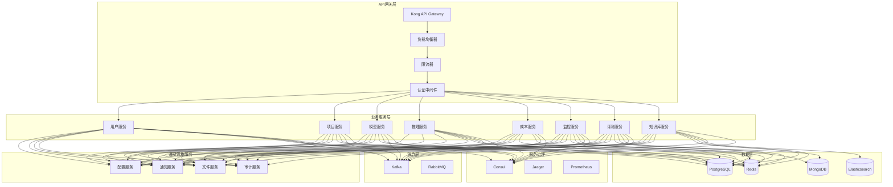

# LLMOps平台微服务架构设计

> **架构类型**: 微服务架构设计  
> **技术栈**: Golang + 微服务 + 云原生  
> **更新日期**: 2025-10-17

## 一、微服务架构概述

### 1.1 设计目标

构建高可用、可扩展、易维护的微服务架构，支持LLMOps平台的大规模部署和业务增长需求。

### 1.2 核心原则

- **单一职责**: 每个服务专注于特定业务领域
- **松耦合**: 服务间通过API和消息队列通信
- **高内聚**: 相关功能聚合在同一服务内
- **可扩展**: 支持独立扩展和部署
- **容错性**: 服务故障不影响整体系统

### 1.3 服务划分策略

#### 按业务领域划分
- **用户域**: 用户管理、认证授权
- **项目域**: 项目管理、资源配置
- **模型域**: 模型管理、版本控制
- **推理域**: 模型推理、服务管理
- **成本域**: 成本计算、预算管理
- **监控域**: 指标收集、告警管理
- **评测域**: 评测任务、结果分析
- **知识域**: 知识库管理、检索服务

## 二、服务架构设计

### 2.1 服务拓扑图



### 2.2 服务详细设计

#### 2.2.1 用户服务 (User Service)

```go
// 服务职责
type UserService struct {
    // 用户管理
    CreateUser(ctx context.Context, req CreateUserRequest) (*User, error)
    GetUser(ctx context.Context, id uint) (*User, error)
    UpdateUser(ctx context.Context, id uint, req UpdateUserRequest) (*User, error)
    DeleteUser(ctx context.Context, id uint) error
    ListUsers(ctx context.Context, req ListUsersRequest) (*ListUsersResponse, error)
    
    // 认证授权
    Authenticate(ctx context.Context, req AuthRequest) (*AuthResponse, error)
    RefreshToken(ctx context.Context, refreshToken string) (*TokenResponse, error)
    ValidateToken(ctx context.Context, token string) (*TokenClaims, error)
    
    // 角色权限
    AssignRole(ctx context.Context, userID uint, roleID uint) error
    RemoveRole(ctx context.Context, userID uint, roleID uint) error
    GetUserRoles(ctx context.Context, userID uint) ([]*Role, error)
    CheckPermission(ctx context.Context, userID uint, permission string) (bool, error)
}

// 服务配置
type UserServiceConfig struct {
    Port         int           `yaml:"port"`
    Database     DatabaseConfig `yaml:"database"`
    Redis        RedisConfig   `yaml:"redis"`
    JWT          JWTConfig     `yaml:"jwt"`
    MessageQueue MessageConfig `yaml:"message_queue"`
    Consul       ConsulConfig  `yaml:"consul"`
}
```

#### 2.2.2 项目服务 (Project Service)

```go
// 服务职责
type ProjectService struct {
    // 项目管理
    CreateProject(ctx context.Context, req CreateProjectRequest) (*Project, error)
    GetProject(ctx context.Context, id uint) (*Project, error)
    UpdateProject(ctx context.Context, id uint, req UpdateProjectRequest) (*Project, error)
    DeleteProject(ctx context.Context, id uint) error
    ListProjects(ctx context.Context, req ListProjectsRequest) (*ListProjectsResponse, error)
    
    // 成员管理
    AddMember(ctx context.Context, projectID uint, req AddMemberRequest) error
    RemoveMember(ctx context.Context, projectID uint, userID uint) error
    ListMembers(ctx context.Context, projectID uint) ([]*ProjectMember, error)
    UpdateMemberRole(ctx context.Context, projectID uint, userID uint, role string) error
    
    // 资源配置
    AllocateResource(ctx context.Context, projectID uint, req ResourceRequest) error
    ReleaseResource(ctx context.Context, projectID uint, resourceID uint) error
    GetResourceUsage(ctx context.Context, projectID uint) (*ResourceUsage, error)
}

// 服务配置
type ProjectServiceConfig struct {
    Port         int           `yaml:"port"`
    Database     DatabaseConfig `yaml:"database"`
    Redis        RedisConfig   `yaml:"redis"`
    MessageQueue MessageConfig `yaml:"message_queue"`
    Consul       ConsulConfig  `yaml:"consul"`
    UserService  ServiceConfig `yaml:"user_service"`
}
```

#### 2.2.3 模型服务 (Model Service)

```go
// 服务职责
type ModelService struct {
    // 模型管理
    CreateModel(ctx context.Context, req CreateModelRequest) (*Model, error)
    GetModel(ctx context.Context, id uint) (*Model, error)
    UpdateModel(ctx context.Context, id uint, req UpdateModelRequest) (*Model, error)
    DeleteModel(ctx context.Context, id uint) error
    ListModels(ctx context.Context, req ListModelsRequest) (*ListModelsResponse, error)
    
    // 版本管理
    CreateVersion(ctx context.Context, modelID uint, req CreateVersionRequest) (*ModelVersion, error)
    GetVersion(ctx context.Context, modelID uint, version string) (*ModelVersion, error)
    ListVersions(ctx context.Context, modelID uint) ([]*ModelVersion, error)
    SetDefaultVersion(ctx context.Context, modelID uint, version string) error
    
    // 文件管理
    UploadFile(ctx context.Context, modelID uint, version string, file File) error
    DownloadFile(ctx context.Context, modelID uint, version string, filename string) (*File, error)
    DeleteFile(ctx context.Context, modelID uint, version string, filename string) error
    ListFiles(ctx context.Context, modelID uint, version string) ([]*File, error)
    
    // 部署管理
    DeployModel(ctx context.Context, modelID uint, req DeployRequest) (*Deployment, error)
    GetDeployment(ctx context.Context, deploymentID uint) (*Deployment, error)
    ListDeployments(ctx context.Context, modelID uint) ([]*Deployment, error)
    UpdateDeployment(ctx context.Context, deploymentID uint, req UpdateDeploymentRequest) (*Deployment, error)
    DeleteDeployment(ctx context.Context, deploymentID uint) error
}

// 服务配置
type ModelServiceConfig struct {
    Port         int           `yaml:"port"`
    Database     DatabaseConfig `yaml:"database"`
    Redis        RedisConfig   `yaml:"redis"`
    MessageQueue MessageConfig `yaml:"message_queue"`
    Consul       ConsulConfig  `yaml:"consul"`
    FileStorage  FileConfig    `yaml:"file_storage"`
    InferenceService ServiceConfig `yaml:"inference_service"`
}
```

#### 2.2.4 推理服务 (Inference Service)

```go
// 服务职责
type InferenceService struct {
    // 推理请求
    ChatCompletion(ctx context.Context, req ChatRequest) (*ChatResponse, error)
    BatchCompletion(ctx context.Context, req BatchRequest) (*BatchResponse, error)
    StreamCompletion(ctx context.Context, req StreamRequest) (<-chan *StreamChunk, error)
    
    // 服务配置
    GetConfig(ctx context.Context, modelID uint) (*InferenceConfig, error)
    UpdateConfig(ctx context.Context, modelID uint, config *InferenceConfig) error
    
    // 缓存管理
    GetCache(ctx context.Context, key string) (*CacheEntry, error)
    SetCache(ctx context.Context, key string, value interface{}, ttl time.Duration) error
    DeleteCache(ctx context.Context, key string) error
    ClearCache(ctx context.Context, pattern string) error
    
    // 负载均衡
    GetInstance(ctx context.Context, modelID uint) (*Instance, error)
    HealthCheck(ctx context.Context, instanceID string) (*HealthStatus, error)
    ScaleInstance(ctx context.Context, modelID uint, replicas int) error
}

// 服务配置
type InferenceServiceConfig struct {
    Port         int           `yaml:"port"`
    Database     DatabaseConfig `yaml:"database"`
    Redis        RedisConfig   `yaml:"redis"`
    MessageQueue MessageConfig `yaml:"message_queue"`
    Consul       ConsulConfig  `yaml:"consul"`
    ModelService ServiceConfig `yaml:"model_service"`
    LoadBalancer LoadBalancerConfig `yaml:"load_balancer"`
    Cache        CacheConfig   `yaml:"cache"`
}
```

## 三、服务间通信

### 3.1 同步通信 (gRPC)

```protobuf
// 服务间通信协议
syntax = "proto3";

package llmops.v1;

option go_package = "github.com/llmops/api/proto/v1";

// 用户服务
service UserService {
    rpc GetUser(GetUserRequest) returns (GetUserResponse);
    rpc ValidateToken(ValidateTokenRequest) returns (ValidateTokenResponse);
    rpc CheckPermission(CheckPermissionRequest) returns (CheckPermissionResponse);
}

// 项目服务
service ProjectService {
    rpc GetProject(GetProjectRequest) returns (GetProjectResponse);
    rpc CheckProjectAccess(CheckProjectAccessRequest) returns (CheckProjectAccessResponse);
    rpc GetProjectResources(GetProjectResourcesRequest) returns (GetProjectResourcesResponse);
}

// 模型服务
service ModelService {
    rpc GetModel(GetModelRequest) returns (GetModelResponse);
    rpc GetModelVersion(GetModelVersionRequest) returns (GetModelVersionResponse);
    rpc GetModelFiles(GetModelFilesRequest) returns (GetModelFilesResponse);
}

// 推理服务
service InferenceService {
    rpc ChatCompletion(ChatCompletionRequest) returns (ChatCompletionResponse);
    rpc BatchCompletion(BatchCompletionRequest) returns (BatchCompletionResponse);
    rpc StreamCompletion(StreamCompletionRequest) returns (stream StreamCompletionResponse);
}
```

### 3.2 异步通信 (Kafka)

```go
// 事件定义
type Event struct {
    ID        string                 `json:"id"`
    Type      string                 `json:"type"`
    Source    string                 `json:"source"`
    Data      map[string]interface{} `json:"data"`
    Timestamp time.Time              `json:"timestamp"`
    Version   string                 `json:"version"`
}

// 事件类型
const (
    EventTypeUserCreated     = "user.created"
    EventTypeUserUpdated     = "user.updated"
    EventTypeUserDeleted     = "user.deleted"
    EventTypeProjectCreated  = "project.created"
    EventTypeProjectUpdated  = "project.updated"
    EventTypeProjectDeleted  = "project.deleted"
    EventTypeModelCreated    = "model.created"
    EventTypeModelUpdated    = "model.updated"
    EventTypeModelDeleted    = "model.deleted"
    EventTypeModelDeployed   = "model.deployed"
    EventTypeInferenceRequest = "inference.request"
    EventTypeInferenceResponse = "inference.response"
    EventTypeCostCalculated  = "cost.calculated"
    EventTypeAlertTriggered  = "alert.triggered"
)

// 事件发布器
type EventPublisher struct {
    producer sarama.AsyncProducer
    logger   *logrus.Logger
}

func (p *EventPublisher) PublishEvent(ctx context.Context, event *Event) error {
    data, err := json.Marshal(event)
    if err != nil {
        return err
    }
    
    message := &sarama.ProducerMessage{
        Topic: event.Type,
        Key:   sarama.StringEncoder(event.ID),
        Value: sarama.ByteEncoder(data),
        Headers: []sarama.RecordHeader{
            {Key: []byte("event-type"), Value: []byte(event.Type)},
            {Key: []byte("event-source"), Value: []byte(event.Source)},
            {Key: []byte("event-version"), Value: []byte(event.Version)},
        },
    }
    
    select {
    case p.producer.Input() <- message:
        return nil
    case <-ctx.Done():
        return ctx.Err()
    }
}

// 事件订阅器
type EventSubscriber struct {
    consumer sarama.ConsumerGroup
    logger   *logrus.Logger
    handlers map[string]EventHandler
}

type EventHandler func(ctx context.Context, event *Event) error

func (s *EventSubscriber) RegisterHandler(eventType string, handler EventHandler) {
    s.handlers[eventType] = handler
}

func (s *EventSubscriber) ConsumeEvents(ctx context.Context, topics []string) error {
    handler := &ConsumerGroupHandler{
        handlers: s.handlers,
        logger:   s.logger,
    }
    
    return s.consumer.Consume(ctx, topics, handler)
}
```

### 3.3 服务发现

```go
// Consul服务发现
type ServiceRegistry struct {
    client *consul.Client
    logger *logrus.Logger
}

func (r *ServiceRegistry) RegisterService(service *consul.AgentServiceRegistration) error {
    return r.client.Agent().ServiceRegister(service)
}

func (r *ServiceRegistry) DeregisterService(serviceID string) error {
    return r.client.Agent().ServiceDeregister(serviceID)
}

func (r *ServiceRegistry) DiscoverService(serviceName string) ([]*consul.ServiceEntry, error) {
    entries, _, err := r.client.Health().Service(serviceName, "", true, nil)
    return entries, err
}

// 服务客户端
type ServiceClient struct {
    registry *ServiceRegistry
    logger   *logrus.Logger
}

func (c *ServiceClient) GetServiceEndpoint(serviceName string) (string, error) {
    entries, err := c.registry.DiscoverService(serviceName)
    if err != nil {
        return "", err
    }
    
    if len(entries) == 0 {
        return "", fmt.Errorf("no healthy instances found for service %s", serviceName)
    }
    
    // 负载均衡策略：轮询
    entry := entries[0]
    endpoint := fmt.Sprintf("http://%s:%d", entry.Service.Address, entry.Service.Port)
    
    return endpoint, nil
}
```

## 四、数据一致性

### 4.1 分布式事务

```go
// Saga模式实现
type SagaManager struct {
    steps []SagaStep
    logger *logrus.Logger
}

type SagaStep struct {
    Name        string
    Execute     func(ctx context.Context) error
    Compensate  func(ctx context.Context) error
}

func (s *SagaManager) Execute(ctx context.Context) error {
    var executedSteps []SagaStep
    
    for _, step := range s.steps {
        if err := step.Execute(ctx); err != nil {
            s.logger.Error("Saga step failed", "step", step.Name, "error", err)
            
            // 执行补偿操作
            for i := len(executedSteps) - 1; i >= 0; i-- {
                if err := executedSteps[i].Compensate(ctx); err != nil {
                    s.logger.Error("Saga compensation failed", "step", executedSteps[i].Name, "error", err)
                }
            }
            
            return err
        }
        
        executedSteps = append(executedSteps, step)
    }
    
    return nil
}

// 使用示例：创建项目
func (s *ProjectService) CreateProject(ctx context.Context, req CreateProjectRequest) (*Project, error) {
    saga := &SagaManager{
        steps: []SagaStep{
            {
                Name: "create_project",
                Execute: func(ctx context.Context) error {
                    return s.createProject(ctx, req)
                },
                Compensate: func(ctx context.Context) error {
                    return s.deleteProject(ctx, req.ID)
                },
            },
            {
                Name: "allocate_resources",
                Execute: func(ctx context.Context) error {
                    return s.allocateResources(ctx, req.ID, req.Resources)
                },
                Compensate: func(ctx context.Context) error {
                    return s.releaseResources(ctx, req.ID, req.Resources)
                },
            },
            {
                Name: "send_notification",
                Execute: func(ctx context.Context) error {
                    return s.sendNotification(ctx, req.ID, "project_created")
                },
                Compensate: func(ctx context.Context) error {
                    return s.sendNotification(ctx, req.ID, "project_creation_failed")
                },
            },
        },
    }
    
    return saga.Execute(ctx)
}
```

### 4.2 最终一致性

```go
// 事件溯源
type EventStore struct {
    db     *gorm.DB
    logger *logrus.Logger
}

type EventRecord struct {
    ID        uint      `gorm:"primaryKey"`
    AggregateID string  `gorm:"index"`
    EventType string    `gorm:"index"`
    EventData []byte    `gorm:"type:jsonb"`
    Version   int       `gorm:"index"`
    Timestamp time.Time `gorm:"index"`
}

func (s *EventStore) AppendEvent(ctx context.Context, aggregateID string, event *Event) error {
    data, err := json.Marshal(event)
    if err != nil {
        return err
    }
    
    record := &EventRecord{
        AggregateID: aggregateID,
        EventType:   event.Type,
        EventData:   data,
        Version:     event.Version,
        Timestamp:   event.Timestamp,
    }
    
    return s.db.WithContext(ctx).Create(record).Error
}

func (s *EventStore) GetEvents(ctx context.Context, aggregateID string) ([]*Event, error) {
    var records []EventRecord
    if err := s.db.WithContext(ctx).Where("aggregate_id = ?", aggregateID).
        Order("version ASC").Find(&records).Error; err != nil {
        return nil, err
    }
    
    var events []*Event
    for _, record := range records {
        var event Event
        if err := json.Unmarshal(record.EventData, &event); err != nil {
            return nil, err
        }
        events = append(events, &event)
    }
    
    return events, nil
}

// 投影更新
type ProjectionUpdater struct {
    eventStore *EventStore
    logger     *logrus.Logger
}

func (u *ProjectionUpdater) UpdateProjection(ctx context.Context, event *Event) error {
    switch event.Type {
    case EventTypeUserCreated:
        return u.updateUserProjection(ctx, event)
    case EventTypeProjectCreated:
        return u.updateProjectProjection(ctx, event)
    case EventTypeModelCreated:
        return u.updateModelProjection(ctx, event)
    default:
        u.logger.Warn("Unknown event type", "type", event.Type)
        return nil
    }
}
```

## 五、容错与恢复

### 5.1 断路器模式

```go
// 断路器实现
type CircuitBreaker struct {
    name          string
    maxRequests   uint32
    interval      time.Duration
    timeout       time.Duration
    readyToTrip   func(counts Counts) bool
    onStateChange func(name string, from State, to State)
    
    mutex      sync.Mutex
    state      State
    generation uint64
    counts     Counts
    expiry     time.Time
}

type State int

const (
    StateClosed State = iota
    StateHalfOpen
    StateOpen
)

type Counts struct {
    Requests             uint32
    TotalSuccesses       uint32
    TotalFailures        uint32
    ConsecutiveSuccesses uint32
    ConsecutiveFailures  uint32
}

func (cb *CircuitBreaker) Execute(req func() (interface{}, error)) (interface{}, error) {
    generation, err := cb.beforeRequest()
    if err != nil {
        return nil, err
    }
    
    defer func() {
        e := recover()
        if e != nil {
            cb.afterRequest(generation, false)
            panic(e)
        }
    }()
    
    result, err := req()
    cb.afterRequest(generation, err == nil)
    return result, err
}

// 使用示例
func (c *ServiceClient) CallUserService(ctx context.Context, req interface{}) (interface{}, error) {
    cb := c.getCircuitBreaker("user-service")
    
    return cb.Execute(func() (interface{}, error) {
        return c.userServiceClient.GetUser(ctx, req)
    })
}
```

### 5.2 重试机制

```go
// 重试配置
type RetryConfig struct {
    MaxAttempts int
    InitialDelay time.Duration
    MaxDelay     time.Duration
    Multiplier   float64
    Jitter       bool
}

// 重试器
type Retrier struct {
    config RetryConfig
    logger *logrus.Logger
}

func (r *Retrier) Execute(ctx context.Context, fn func() error) error {
    var lastErr error
    
    for attempt := 0; attempt < r.config.MaxAttempts; attempt++ {
        if attempt > 0 {
            delay := r.calculateDelay(attempt)
            select {
            case <-time.After(delay):
            case <-ctx.Done():
                return ctx.Err()
            }
        }
        
        if err := fn(); err != nil {
            lastErr = err
            r.logger.Warn("Retry attempt failed", "attempt", attempt+1, "error", err)
            continue
        }
        
        return nil
    }
    
    return fmt.Errorf("max retry attempts exceeded: %w", lastErr)
}

func (r *Retrier) calculateDelay(attempt int) time.Duration {
    delay := float64(r.config.InitialDelay) * math.Pow(r.config.Multiplier, float64(attempt))
    
    if delay > float64(r.config.MaxDelay) {
        delay = float64(r.config.MaxDelay)
    }
    
    if r.config.Jitter {
        jitter := delay * 0.1 * (rand.Float64() - 0.5)
        delay += jitter
    }
    
    return time.Duration(delay)
}
```

### 5.3 健康检查

```go
// 健康检查接口
type HealthChecker interface {
    CheckHealth(ctx context.Context) error
}

// 健康检查服务
type HealthService struct {
    checkers map[string]HealthChecker
    logger   *logrus.Logger
}

func (s *HealthService) RegisterChecker(name string, checker HealthChecker) {
    s.checkers[name] = checker
}

func (s *HealthService) CheckHealth(ctx context.Context) map[string]error {
    results := make(map[string]error)
    
    for name, checker := range s.checkers {
        if err := checker.CheckHealth(ctx); err != nil {
            results[name] = err
            s.logger.Error("Health check failed", "checker", name, "error", err)
        } else {
            results[name] = nil
        }
    }
    
    return results
}

// 数据库健康检查
type DatabaseHealthChecker struct {
    db *gorm.DB
}

func (c *DatabaseHealthChecker) CheckHealth(ctx context.Context) error {
    sqlDB, err := c.db.DB()
    if err != nil {
        return err
    }
    
    return sqlDB.PingContext(ctx)
}

// Redis健康检查
type RedisHealthChecker struct {
    client *redis.Client
}

func (c *RedisHealthChecker) CheckHealth(ctx context.Context) error {
    return c.client.Ping(ctx).Err()
}
```

## 六、监控与观测

### 6.1 分布式追踪

```go
// Jaeger追踪
func InitTracer(serviceName string) (opentracing.Tracer, io.Closer, error) {
    cfg := jaegerconfig.Configuration{
        ServiceName: serviceName,
        Sampler: &jaegerconfig.SamplerConfig{
            Type:  jaeger.SamplerTypeConst,
            Param: 1,
        },
        Reporter: &jaegerconfig.ReporterConfig{
            LogSpans: true,
        },
    }
    
    tracer, closer, err := cfg.NewTracer()
    if err != nil {
        return nil, nil, err
    }
    
    opentracing.SetGlobalTracer(tracer)
    return tracer, closer, nil
}

// 追踪中间件
func TracingMiddleware() gin.HandlerFunc {
    return func(c *gin.Context) {
        span := opentracing.StartSpan(c.Request.URL.Path)
        defer span.Finish()
        
        span.SetTag("http.method", c.Request.Method)
        span.SetTag("http.url", c.Request.URL.String())
        span.SetTag("http.user_agent", c.Request.UserAgent())
        
        ctx := opentracing.ContextWithSpan(c.Request.Context(), span)
        c.Request = c.Request.WithContext(ctx)
        
        c.Next()
        
        span.SetTag("http.status_code", c.Writer.Status())
    }
}

// 服务间追踪
func (c *ServiceClient) CallWithTracing(ctx context.Context, serviceName string, req interface{}) (interface{}, error) {
    span, ctx := opentracing.StartSpanFromContext(ctx, fmt.Sprintf("call_%s", serviceName))
    defer span.Finish()
    
    span.SetTag("service.name", serviceName)
    span.SetTag("request", req)
    
    result, err := c.callService(ctx, serviceName, req)
    
    if err != nil {
        span.SetTag("error", true)
        span.SetTag("error.message", err.Error())
    }
    
    return result, err
}
```

### 6.2 指标收集

```go
// Prometheus指标
var (
    // HTTP指标
    httpRequestsTotal = prometheus.NewCounterVec(
        prometheus.CounterOpts{
            Name: "http_requests_total",
            Help: "Total number of HTTP requests",
        },
        []string{"method", "endpoint", "status", "service"},
    )
    
    httpRequestDuration = prometheus.NewHistogramVec(
        prometheus.HistogramOpts{
            Name: "http_request_duration_seconds",
            Help: "HTTP request duration in seconds",
        },
        []string{"method", "endpoint", "service"},
    )
    
    // 业务指标
    userRegistrations = prometheus.NewCounterVec(
        prometheus.CounterOpts{
            Name: "user_registrations_total",
            Help: "Total number of user registrations",
        },
        []string{"service"},
    )
    
    projectCreations = prometheus.NewCounterVec(
        prometheus.CounterOpts{
            Name: "project_creations_total",
            Help: "Total number of project creations",
        },
        []string{"service"},
    )
    
    modelDeployments = prometheus.NewCounterVec(
        prometheus.CounterOpts{
            Name: "model_deployments_total",
            Help: "Total number of model deployments",
        },
        []string{"service", "model_type"},
    )
    
    inferenceRequests = prometheus.NewCounterVec(
        prometheus.CounterOpts{
            Name: "inference_requests_total",
            Help: "Total number of inference requests",
        },
        []string{"service", "model", "status"},
    )
    
    inferenceLatency = prometheus.NewHistogramVec(
        prometheus.HistogramOpts{
            Name: "inference_latency_seconds",
            Help: "Inference request latency in seconds",
        },
        []string{"service", "model"},
    )
)

// 指标中间件
func PrometheusMiddleware(serviceName string) gin.HandlerFunc {
    return func(c *gin.Context) {
        start := time.Now()
        
        c.Next()
        
        duration := time.Since(start).Seconds()
        status := strconv.Itoa(c.Writer.Status())
        
        httpRequestsTotal.WithLabelValues(c.Request.Method, c.FullPath(), status, serviceName).Inc()
        httpRequestDuration.WithLabelValues(c.Request.Method, c.FullPath(), serviceName).Observe(duration)
    }
}
```

## 七、部署与运维

### 7.1 容器化部署

```dockerfile
# 多阶段构建
FROM golang:1.21-alpine AS builder

WORKDIR /app
COPY go.mod go.sum ./
RUN go mod download

COPY . .
RUN CGO_ENABLED=0 GOOS=linux go build -a -installsuffix cgo -o main ./cmd/user-service

FROM alpine:latest
RUN apk --no-cache add ca-certificates tzdata
WORKDIR /root/

COPY --from=builder /app/main .
COPY --from=builder /app/configs ./configs

# 健康检查
HEALTHCHECK --interval=30s --timeout=3s --start-period=5s --retries=3 \
    CMD wget --no-verbose --tries=1 --spider http://localhost:8080/health || exit 1

EXPOSE 8080
CMD ["./main"]
```

### 7.2 Kubernetes部署

```yaml
# 用户服务部署
apiVersion: apps/v1
kind: Deployment
metadata:
  name: user-service
  labels:
    app: user-service
    version: v1.0.0
spec:
  replicas: 3
  selector:
    matchLabels:
      app: user-service
  template:
    metadata:
      labels:
        app: user-service
        version: v1.0.0
    spec:
      containers:
      - name: user-service
        image: llmops/user-service:v1.0.0
        ports:
        - containerPort: 8080
          name: http
        - containerPort: 9090
          name: metrics
        env:
        - name: SERVICE_NAME
          value: "user-service"
        - name: DATABASE_URL
          valueFrom:
            secretKeyRef:
              name: database-secret
              key: url
        - name: REDIS_URL
          valueFrom:
            secretKeyRef:
              name: redis-secret
              key: url
        - name: CONSUL_URL
          value: "consul:8500"
        resources:
          requests:
            memory: "256Mi"
            cpu: "250m"
          limits:
            memory: "512Mi"
            cpu: "500m"
        livenessProbe:
          httpGet:
            path: /health
            port: 8080
          initialDelaySeconds: 30
          periodSeconds: 10
        readinessProbe:
          httpGet:
            path: /ready
            port: 8080
          initialDelaySeconds: 5
          periodSeconds: 5
        volumeMounts:
        - name: config
          mountPath: /app/configs
      volumes:
      - name: config
        configMap:
          name: user-service-config

---
apiVersion: v1
kind: Service
metadata:
  name: user-service
  labels:
    app: user-service
spec:
  selector:
    app: user-service
  ports:
  - name: http
    port: 80
    targetPort: 8080
  - name: metrics
    port: 9090
    targetPort: 9090
  type: ClusterIP

---
apiVersion: v1
kind: ConfigMap
metadata:
  name: user-service-config
data:
  config.yaml: |
    server:
      port: 8080
      read_timeout: 30s
      write_timeout: 30s
    database:
      max_conns: 100
      min_conns: 10
    redis:
      pool_size: 10
      min_idle_conns: 5
    consul:
      address: "consul:8500"
      service_name: "user-service"
      service_port: 8080
```

### 7.3 服务网格

```yaml
# Istio配置
apiVersion: networking.istio.io/v1alpha3
kind: VirtualService
metadata:
  name: user-service
spec:
  http:
  - match:
    - uri:
        prefix: /api/v1/users
    route:
    - destination:
        host: user-service
        port:
          number: 80
    timeout: 30s
    retries:
      attempts: 3
      perTryTimeout: 10s
    fault:
      delay:
        percentage:
          value: 0.1
        fixedDelay: 5s

---
apiVersion: networking.istio.io/v1alpha3
kind: DestinationRule
metadata:
  name: user-service
spec:
  host: user-service
  trafficPolicy:
    connectionPool:
      tcp:
        maxConnections: 100
      http:
        http1MaxPendingRequests: 50
        maxRequestsPerConnection: 10
    circuitBreaker:
      consecutiveErrors: 5
      interval: 30s
      baseEjectionTime: 30s
    loadBalancer:
      simple: ROUND_ROBIN
```

## 八、总结

### 8.1 架构优势

1. **高可用性**: 服务故障隔离，不影响整体系统
2. **可扩展性**: 独立扩展和部署各个服务
3. **可维护性**: 清晰的服务边界和职责分离
4. **技术多样性**: 不同服务可以使用不同技术栈
5. **团队协作**: 不同团队可以独立开发不同服务

### 8.2 技术特色

- **服务治理**: Consul服务发现和健康检查
- **通信机制**: gRPC同步通信 + Kafka异步通信
- **数据一致性**: Saga模式 + 事件溯源
- **容错机制**: 断路器 + 重试 + 超时
- **监控观测**: Jaeger追踪 + Prometheus指标

### 8.3 部署优势

- **容器化**: Docker容器化部署
- **编排**: Kubernetes自动编排
- **服务网格**: Istio流量管理
- **监控**: 全链路监控和告警
- **扩展**: 自动扩缩容和负载均衡

这个微服务架构设计为LLMOps平台提供了高可用、可扩展、易维护的技术基础，支持大规模LLM运营平台的业务需求。

---

**文档维护**: 本文档应随架构设计变化持续更新，保持与技术实现的一致性。

**版本历史**:
- v1.0 (2025-10-17): 初始版本，微服务架构设计

