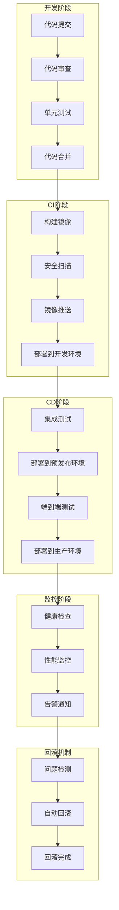
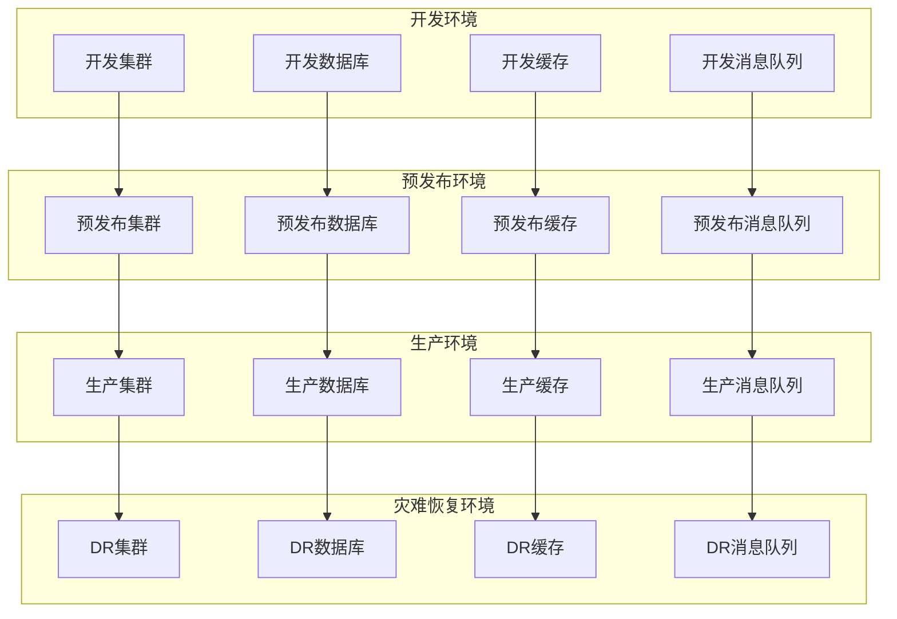

# LLMOps平台部署架构设计

> **架构类型**: 部署架构设计  
> **技术栈**: CI/CD + GitOps + 云原生  
> **更新日期**: 2025-10-17

## 一、部署架构概述

### 1.1 设计目标

构建自动化、可重复、可回滚的部署架构，支持LLMOps平台的持续集成、持续部署和GitOps工作流。

### 1.2 核心原则

- **自动化**: 全自动化部署流程
- **可重复**: 一致的部署环境
- **可回滚**: 快速回滚机制
- **可观测**: 部署过程监控
- **安全性**: 安全的部署流程

### 1.3 技术选型

#### CI/CD工具
- **GitHub Actions**: CI/CD流水线
- **ArgoCD**: GitOps部署
- **Helm**: 包管理
- **Docker**: 容器化

#### 部署策略
- **蓝绿部署**: 零停机部署
- **金丝雀部署**: 渐进式发布
- **滚动更新**: 逐步替换
- **A/B测试**: 流量分割

#### 环境管理
- **开发环境**: 开发测试
- **预发布环境**: 集成测试
- **生产环境**: 正式运行
- **灾难恢复环境**: 备份恢复

## 二、整体部署架构

### 2.1 部署流程图



### 2.2 环境架构



## 三、CI/CD流水线设计

### 3.1 GitHub Actions配置

```yaml
# .github/workflows/ci-cd.yml
name: CI/CD Pipeline

on:
  push:
    branches: [main, develop]
  pull_request:
    branches: [main, develop]

env:
  REGISTRY: ghcr.io
  IMAGE_NAME: llmops

jobs:
  # 代码质量检查
  code-quality:
    runs-on: ubuntu-latest
    steps:
    - uses: actions/checkout@v3
    
    - name: Setup Go
      uses: actions/setup-go@v3
      with:
        go-version: '1.21'
    
    - name: Run tests
      run: |
        go test ./...
        go test -race ./...
        go test -coverprofile=coverage.out ./...
    
    - name: Run linting
      run: |
        go vet ./...
        golangci-lint run
    
    - name: Upload coverage
      uses: codecov/codecov-action@v3
      with:
        file: ./coverage.out

  # 构建镜像
  build:
    needs: code-quality
    runs-on: ubuntu-latest
    strategy:
      matrix:
        service: [user-service, project-service, model-service, inference-service, cost-service, monitoring-service, evaluation-service, knowledge-service]
    
    steps:
    - uses: actions/checkout@v3
    
    - name: Set up Docker Buildx
      uses: docker/setup-buildx-action@v2
    
    - name: Login to Container Registry
      uses: docker/login-action@v2
      with:
        registry: ${{ env.REGISTRY }}
        username: ${{ github.actor }}
        password: ${{ secrets.GITHUB_TOKEN }}
    
    - name: Extract metadata
      id: meta
      uses: docker/metadata-action@v4
      with:
        images: ${{ env.REGISTRY }}/${{ env.IMAGE_NAME }}/${{ matrix.service }}
        tags: |
          type=ref,event=branch
          type=ref,event=pr
          type=sha,prefix={{branch}}-
          type=raw,value=latest,enable={{is_default_branch}}
    
    - name: Build and push Docker image
      uses: docker/build-push-action@v4
      with:
        context: .
        file: ./cmd/${{ matrix.service }}/Dockerfile
        push: true
        tags: ${{ steps.meta.outputs.tags }}
        labels: ${{ steps.meta.outputs.labels }}
        cache-from: type=gha
        cache-to: type=gha,mode=max

  # 安全扫描
  security-scan:
    needs: build
    runs-on: ubuntu-latest
    strategy:
      matrix:
        service: [user-service, project-service, model-service, inference-service, cost-service, monitoring-service, evaluation-service, knowledge-service]
    
    steps:
    - name: Run Trivy vulnerability scanner
      uses: aquasecurity/trivy-action@master
      with:
        image-ref: ${{ env.REGISTRY }}/${{ env.IMAGE_NAME }}/${{ matrix.service }}:${{ github.sha }}
        format: 'sarif'
        output: 'trivy-results.sarif'
    
    - name: Upload Trivy scan results
      uses: github/codeql-action/upload-sarif@v2
      with:
        sarif_file: 'trivy-results.sarif'

  # 部署到开发环境
  deploy-dev:
    needs: [build, security-scan]
    runs-on: ubuntu-latest
    if: github.ref == 'refs/heads/develop'
    
    steps:
    - uses: actions/checkout@v3
    
    - name: Configure AWS credentials
      uses: aws-actions/configure-aws-credentials@v2
      with:
        aws-access-key-id: ${{ secrets.AWS_ACCESS_KEY_ID }}
        aws-secret-access-key: ${{ secrets.AWS_SECRET_ACCESS_KEY }}
        aws-region: us-east-1
    
    - name: Update kubeconfig
      run: |
        aws eks update-kubeconfig --region us-east-1 --name llmops-dev-cluster
    
    - name: Deploy to development
      run: |
        helm upgrade --install llmops-dev ./helm/llmops \
          --namespace llmops-dev \
          --create-namespace \
          --set image.tag=${{ github.sha }} \
          --set environment=development \
          --set ingress.host=dev-api.llmops.com

  # 部署到预发布环境
  deploy-staging:
    needs: deploy-dev
    runs-on: ubuntu-latest
    if: github.ref == 'refs/heads/develop'
    
    steps:
    - uses: actions/checkout@v3
    
    - name: Configure AWS credentials
      uses: aws-actions/configure-aws-credentials@v2
      with:
        aws-access-key-id: ${{ secrets.AWS_ACCESS_KEY_ID }}
        aws-secret-access-key: ${{ secrets.AWS_SECRET_ACCESS_KEY }}
        aws-region: us-east-1
    
    - name: Update kubeconfig
      run: |
        aws eks update-kubeconfig --region us-east-1 --name llmops-staging-cluster
    
    - name: Deploy to staging
      run: |
        helm upgrade --install llmops-staging ./helm/llmops \
          --namespace llmops-staging \
          --create-namespace \
          --set image.tag=${{ github.sha }} \
          --set environment=staging \
          --set ingress.host=staging-api.llmops.com

  # 部署到生产环境
  deploy-prod:
    needs: deploy-staging
    runs-on: ubuntu-latest
    if: github.ref == 'refs/heads/main'
    environment: production
    
    steps:
    - uses: actions/checkout@v3
    
    - name: Configure AWS credentials
      uses: aws-actions/configure-aws-credentials@v2
      with:
        aws-access-key-id: ${{ secrets.AWS_ACCESS_KEY_ID }}
        aws-secret-access-key: ${{ secrets.AWS_SECRET_ACCESS_KEY }}
        aws-region: us-east-1
    
    - name: Update kubeconfig
      run: |
        aws eks update-kubeconfig --region us-east-1 --name llmops-prod-cluster
    
    - name: Deploy to production
      run: |
        helm upgrade --install llmops-prod ./helm/llmops \
          --namespace llmops-prod \
          --create-namespace \
          --set image.tag=${{ github.sha }} \
          --set environment=production \
          --set ingress.host=api.llmops.com \
          --set replicaCount=3
```

### 3.2 多环境配置

```yaml
# helm/llmops/values.yaml
global:
  imageRegistry: ghcr.io/llmops
  imagePullSecrets: []
  storageClass: gp3-ssd

# 开发环境配置
development:
  replicaCount: 1
  image:
    tag: latest
  resources:
    requests:
      cpu: 100m
      memory: 256Mi
    limits:
      cpu: 500m
      memory: 1Gi
  database:
    host: postgresql-dev
    port: 5432
    database: llmops_dev
  redis:
    host: redis-dev
    port: 6379
  ingress:
    enabled: true
    host: dev-api.llmops.com
    tls:
      enabled: false

# 预发布环境配置
staging:
  replicaCount: 2
  image:
    tag: latest
  resources:
    requests:
      cpu: 250m
      memory: 512Mi
    limits:
      cpu: 1000m
      memory: 2Gi
  database:
    host: postgresql-staging
    port: 5432
    database: llmops_staging
  redis:
    host: redis-staging
    port: 6379
  ingress:
    enabled: true
    host: staging-api.llmops.com
    tls:
      enabled: true
      secretName: staging-tls

# 生产环境配置
production:
  replicaCount: 3
  image:
    tag: latest
  resources:
    requests:
      cpu: 500m
      memory: 1Gi
    limits:
      cpu: 2000m
      memory: 4Gi
  database:
    host: postgresql-prod
    port: 5432
    database: llmops_prod
  redis:
    host: redis-prod
    port: 6379
  ingress:
    enabled: true
    host: api.llmops.com
    tls:
      enabled: true
      secretName: prod-tls
  monitoring:
    enabled: true
  backup:
    enabled: true
```

## 四、GitOps部署

### 4.1 ArgoCD配置

```yaml
# argocd-applications.yaml
apiVersion: argoproj.io/v1alpha1
kind: Application
metadata:
  name: llmops-dev
  namespace: argocd
spec:
  project: default
  source:
    repoURL: https://github.com/llmops/llmops-helm
    targetRevision: HEAD
    path: helm/llmops
    helm:
      valueFiles:
      - values-dev.yaml
  destination:
    server: https://kubernetes.default.svc
    namespace: llmops-dev
  syncPolicy:
    automated:
      prune: true
      selfHeal: true
    syncOptions:
    - CreateNamespace=true
    - PrunePropagationPolicy=foreground
    - PruneLast=true
  revisionHistoryLimit: 10

---
apiVersion: argoproj.io/v1alpha1
kind: Application
metadata:
  name: llmops-staging
  namespace: argocd
spec:
  project: default
  source:
    repoURL: https://github.com/llmops/llmops-helm
    targetRevision: HEAD
    path: helm/llmops
    helm:
      valueFiles:
      - values-staging.yaml
  destination:
    server: https://kubernetes.default.svc
    namespace: llmops-staging
  syncPolicy:
    automated:
      prune: true
      selfHeal: true
    syncOptions:
    - CreateNamespace=true
    - PrunePropagationPolicy=foreground
    - PruneLast=true
  revisionHistoryLimit: 10

---
apiVersion: argoproj.io/v1alpha1
kind: Application
metadata:
  name: llmops-prod
  namespace: argocd
spec:
  project: default
  source:
    repoURL: https://github.com/llmops/llmops-helm
    targetRevision: HEAD
    path: helm/llmops
    helm:
      valueFiles:
      - values-prod.yaml
  destination:
    server: https://kubernetes.default.svc
    namespace: llmops-prod
  syncPolicy:
    automated:
      prune: false
      selfHeal: false
    syncOptions:
    - CreateNamespace=true
    - PrunePropagationPolicy=foreground
    - PruneLast=true
  revisionHistoryLimit: 10
```

### 4.2 Helm Chart结构

```
helm/llmops/
├── Chart.yaml
├── values.yaml
├── values-dev.yaml
├── values-staging.yaml
├── values-prod.yaml
├── templates/
│   ├── deployment.yaml
│   ├── service.yaml
│   ├── ingress.yaml
│   ├── configmap.yaml
│   ├── secret.yaml
│   ├── hpa.yaml
│   ├── pdb.yaml
│   └── tests/
│       └── test-connection.yaml
└── charts/
```

### 4.3 Helm模板示例

```yaml
# templates/deployment.yaml
apiVersion: apps/v1
kind: Deployment
metadata:
  name: {{ include "llmops.fullname" . }}-{{ .Values.service.name }}
  labels:
    {{- include "llmops.labels" . | nindent 4 }}
    app.kubernetes.io/component: {{ .Values.service.name }}
spec:
  replicas: {{ .Values.replicaCount }}
  selector:
    matchLabels:
      {{- include "llmops.selectorLabels" . | nindent 6 }}
      app.kubernetes.io/component: {{ .Values.service.name }}
  template:
    metadata:
      labels:
        {{- include "llmops.selectorLabels" . | nindent 8 }}
        app.kubernetes.io/component: {{ .Values.service.name }}
      annotations:
        checksum/config: {{ include (print $.Template.BasePath "/configmap.yaml") . | sha256sum }}
        checksum/secret: {{ include (print $.Template.BasePath "/secret.yaml") . | sha256sum }}
    spec:
      containers:
      - name: {{ .Values.service.name }}
        image: "{{ .Values.global.imageRegistry }}/{{ .Values.service.name }}:{{ .Values.image.tag }}"
        imagePullPolicy: {{ .Values.image.pullPolicy }}
        ports:
        - name: http
          containerPort: {{ .Values.service.port }}
          protocol: TCP
        - name: metrics
          containerPort: 9090
          protocol: TCP
        env:
        - name: SERVICE_NAME
          value: {{ .Values.service.name }}
        - name: ENVIRONMENT
          value: {{ .Values.environment }}
        - name: DATABASE_URL
          valueFrom:
            secretKeyRef:
              name: {{ include "llmops.fullname" . }}-secret
              key: database-url
        - name: REDIS_URL
          valueFrom:
            secretKeyRef:
              name: {{ include "llmops.fullname" . }}-secret
              key: redis-url
        livenessProbe:
          httpGet:
            path: /health
            port: http
          initialDelaySeconds: 30
          periodSeconds: 10
        readinessProbe:
          httpGet:
            path: /ready
            port: http
          initialDelaySeconds: 5
          periodSeconds: 5
        resources:
          {{- toYaml .Values.resources | nindent 10 }}
        volumeMounts:
        - name: config
          mountPath: /app/configs
      volumes:
      - name: config
        configMap:
          name: {{ include "llmops.fullname" . }}-config
      imagePullSecrets:
        {{- toYaml .Values.global.imagePullSecrets | nindent 8 }}
```

## 五、部署策略

### 5.1 蓝绿部署

```yaml
# 蓝绿部署配置
apiVersion: argoproj.io/v1alpha1
kind: Rollout
metadata:
  name: llmops-rollout
  namespace: llmops-prod
spec:
  replicas: 3
  strategy:
    blueGreen:
      activeService: llmops-active
      previewService: llmops-preview
      autoPromotionEnabled: false
      scaleDownDelaySeconds: 30
      prePromotionAnalysis:
        templates:
        - templateName: success-rate
        args:
        - name: service-name
          value: llmops-preview
      postPromotionAnalysis:
        templates:
        - templateName: success-rate
        args:
        - name: service-name
          value: llmops-active
  selector:
    matchLabels:
      app: llmops
  template:
    metadata:
      labels:
        app: llmops
    spec:
      containers:
      - name: llmops
        image: llmops:latest
        ports:
        - containerPort: 8080
        resources:
          requests:
            memory: "1Gi"
            cpu: "500m"
          limits:
            memory: "2Gi"
            cpu: "1000m"

---
# 分析模板
apiVersion: argoproj.io/v1alpha1
kind: AnalysisTemplate
metadata:
  name: success-rate
spec:
  args:
  - name: service-name
  metrics:
  - name: success-rate
    successCondition: result[0] >= 0.95
    provider:
      prometheus:
        address: http://prometheus:9090
        query: |
          sum(rate(http_requests_total{service="{{args.service-name}}",status!~"5.."}[5m])) /
          sum(rate(http_requests_total{service="{{args.service-name}}"}[5m]))
```

### 5.2 金丝雀部署

```yaml
# 金丝雀部署配置
apiVersion: argoproj.io/v1alpha1
kind: Rollout
metadata:
  name: llmops-canary
  namespace: llmops-prod
spec:
  replicas: 5
  strategy:
    canary:
      steps:
      - setWeight: 20
      - pause: {duration: 10m}
      - setWeight: 40
      - pause: {duration: 10m}
      - setWeight: 60
      - pause: {duration: 10m}
      - setWeight: 80
      - pause: {duration: 10m}
      canaryService: llmops-canary
      stableService: llmops-stable
      trafficRouting:
        istio:
          virtualService:
            name: llmops-vs
            routes:
            - primary
      analysis:
        templates:
        - templateName: success-rate
        args:
        - name: service-name
          value: llmops-canary
        startingStep: 2
        successfulHistoryLimit: 1
        unsuccessfulHistoryLimit: 1
  selector:
    matchLabels:
      app: llmops
  template:
    metadata:
      labels:
        app: llmops
    spec:
      containers:
      - name: llmops
        image: llmops:latest
        ports:
        - containerPort: 8080
        resources:
          requests:
            memory: "1Gi"
            cpu: "500m"
          limits:
            memory: "2Gi"
            cpu: "1000m"
```

### 5.3 滚动更新

```yaml
# 滚动更新配置
apiVersion: apps/v1
kind: Deployment
metadata:
  name: llmops-rolling
  namespace: llmops-prod
spec:
  replicas: 5
  strategy:
    type: RollingUpdate
    rollingUpdate:
      maxUnavailable: 1
      maxSurge: 1
  selector:
    matchLabels:
      app: llmops
  template:
    metadata:
      labels:
        app: llmops
    spec:
      containers:
      - name: llmops
        image: llmops:latest
        ports:
        - containerPort: 8080
        resources:
          requests:
            memory: "1Gi"
            cpu: "500m"
          limits:
            memory: "2Gi"
            cpu: "1000m"
        livenessProbe:
          httpGet:
            path: /health
            port: 8080
          initialDelaySeconds: 30
          periodSeconds: 10
        readinessProbe:
          httpGet:
            path: /ready
            port: 8080
          initialDelaySeconds: 5
          periodSeconds: 5
```

## 六、监控与告警

### 6.1 部署监控

```yaml
# 部署监控配置
apiVersion: v1
kind: ConfigMap
metadata:
  name: deployment-monitoring
  namespace: llmops-monitoring
data:
  deployment-rules.yml: |
    groups:
    - name: deployment.rules
      rules:
      - alert: DeploymentFailed
        expr: kube_deployment_status_replicas_unavailable > 0
        for: 5m
        labels:
          severity: critical
        annotations:
          summary: "Deployment has failed replicas"
          description: "Deployment {{ $labels.deployment }} has {{ $value }} unavailable replicas"
      
      - alert: DeploymentStuck
        expr: kube_deployment_status_replicas_updated < kube_deployment_spec_replicas
        for: 10m
        labels:
          severity: warning
        annotations:
          summary: "Deployment is stuck"
          description: "Deployment {{ $labels.deployment }} is stuck updating"
      
      - alert: PodCrashLooping
        expr: rate(kube_pod_container_status_restarts_total[15m]) > 0
        for: 5m
        labels:
          severity: warning
        annotations:
          summary: "Pod is crash looping"
          description: "Pod {{ $labels.pod }} is crash looping"
      
      - alert: HighMemoryUsage
        expr: (container_memory_usage_bytes / container_spec_memory_limit_bytes) > 0.8
        for: 5m
        labels:
          severity: warning
        annotations:
          summary: "High memory usage"
          description: "Container {{ $labels.container }} is using {{ $value | humanizePercentage }} of memory"
      
      - alert: HighCPUUsage
        expr: (rate(container_cpu_usage_seconds_total[5m]) / container_spec_cpu_quota) > 0.8
        for: 5m
        labels:
          severity: warning
        annotations:
          summary: "High CPU usage"
          description: "Container {{ $labels.container }} is using {{ $value | humanizePercentage }} of CPU"
```

### 6.2 部署通知

```yaml
# 部署通知配置
apiVersion: v1
kind: ConfigMap
metadata:
  name: deployment-notifications
  namespace: llmops-monitoring
data:
  notification-rules.yml: |
    groups:
    - name: deployment.notifications
      rules:
      - alert: DeploymentSuccess
        expr: kube_deployment_status_replicas_available == kube_deployment_spec_replicas
        for: 1m
        labels:
          severity: info
        annotations:
          summary: "Deployment successful"
          description: "Deployment {{ $labels.deployment }} is now available"
      
      - alert: DeploymentRollback
        expr: kube_deployment_status_replicas_updated < kube_deployment_spec_replicas
        for: 2m
        labels:
          severity: warning
        annotations:
          summary: "Deployment rollback detected"
          description: "Deployment {{ $labels.deployment }} has been rolled back"
```

## 七、回滚机制

### 7.1 自动回滚

```yaml
# 自动回滚配置
apiVersion: v1
kind: ConfigMap
metadata:
  name: auto-rollback
  namespace: llmops-system
data:
  rollback-rules.yml: |
    groups:
    - name: auto.rollback
      rules:
      - alert: AutoRollbackTrigger
        expr: rate(http_requests_total{status=~"5.."}[5m]) / rate(http_requests_total[5m]) > 0.1
        for: 2m
        labels:
          severity: critical
          action: rollback
        annotations:
          summary: "Auto rollback triggered"
          description: "High error rate detected, triggering automatic rollback"
      
      - alert: AutoRollbackComplete
        expr: rate(http_requests_total{status=~"5.."}[5m]) / rate(http_requests_total[5m]) < 0.05
        for: 1m
        labels:
          severity: info
          action: rollback-complete
        annotations:
          summary: "Auto rollback complete"
          description: "Error rate has returned to normal after rollback"
```

### 7.2 手动回滚

```bash
#!/bin/bash
# rollback.sh - 手动回滚脚本

set -e

NAMESPACE=${1:-llmops-prod}
SERVICE=${2:-user-service}
REVISION=${3:-previous}

echo "Rolling back $SERVICE in namespace $NAMESPACE to revision $REVISION"

# 获取当前部署状态
kubectl get deployment $SERVICE -n $NAMESPACE -o jsonpath='{.metadata.annotations.deployment\.kubernetes\.io/revision}'

# 执行回滚
kubectl rollout undo deployment/$SERVICE -n $NAMESPACE --to-revision=$REVISION

# 等待回滚完成
kubectl rollout status deployment/$SERVICE -n $NAMESPACE --timeout=300s

# 验证回滚结果
kubectl get pods -n $NAMESPACE -l app=$SERVICE

echo "Rollback completed successfully"
```

## 八、灾难恢复

### 8.1 备份策略

```yaml
# 备份策略配置
apiVersion: batch/v1
kind: CronJob
metadata:
  name: disaster-recovery-backup
  namespace: llmops-system
spec:
  schedule: "0 2 * * *"
  jobTemplate:
    spec:
      template:
        spec:
          containers:
          - name: backup
            image: bitnami/kubectl:latest
            command:
            - /bin/bash
            - -c
            - |
              # 备份Kubernetes资源
              kubectl get all -o yaml > /backup/k8s-resources-$(date +%Y%m%d_%H%M%S).yaml
              kubectl get configmaps -o yaml > /backup/configmaps-$(date +%Y%m%d_%H%M%S).yaml
              kubectl get secrets -o yaml > /backup/secrets-$(date +%Y%m%d_%H%M%S).yaml
              
              # 备份数据库
              kubectl exec -n llmops-data postgresql-0 -- pg_dump -U postgres llmops > /backup/postgresql-$(date +%Y%m%d_%H%M%S).sql
              
              # 备份Redis
              kubectl exec -n llmops-data redis-0 -- redis-cli --rdb /backup/redis-$(date +%Y%m%d_%H%M%S).rdb
              
              # 上传到S3
              aws s3 cp /backup/ s3://llmops-dr-backups/$(date +%Y%m%d)/ --recursive
              
              # 清理本地备份
              rm -rf /backup/*
            volumeMounts:
            - name: backup
              mountPath: /backup
            - name: kubeconfig
              mountPath: /root/.kube
          volumes:
          - name: backup
            persistentVolumeClaim:
              claimName: backup-pvc
          - name: kubeconfig
            secret:
              secretName: kubeconfig
          restartPolicy: OnFailure
```

### 8.2 恢复流程

```bash
#!/bin/bash
# disaster-recovery.sh - 灾难恢复脚本

set -e

BACKUP_DATE=${1:-$(date -d "yesterday" +%Y%m%d)}
NAMESPACE=${2:-llmops-prod}

echo "Starting disaster recovery for date $BACKUP_DATE in namespace $NAMESPACE"

# 下载备份文件
aws s3 cp s3://llmops-dr-backups/$BACKUP_DATE/ /backup/ --recursive

# 恢复Kubernetes资源
kubectl apply -f /backup/k8s-resources-*.yaml -n $NAMESPACE
kubectl apply -f /backup/configmaps-*.yaml -n $NAMESPACE
kubectl apply -f /backup/secrets-*.yaml -n $NAMESPACE

# 恢复数据库
kubectl exec -n $NAMESPACE postgresql-0 -- psql -U postgres -d llmops < /backup/postgresql-*.sql

# 恢复Redis
kubectl cp /backup/redis-*.rdb $NAMESPACE/redis-0:/data/dump.rdb
kubectl exec -n $NAMESPACE redis-0 -- redis-cli --rdb /data/dump.rdb

# 重启服务
kubectl rollout restart deployment -n $NAMESPACE

# 等待服务恢复
kubectl rollout status deployment -n $NAMESPACE --timeout=600s

echo "Disaster recovery completed successfully"
```

## 九、总结

### 9.1 架构优势

1. **自动化**: 全自动化CI/CD流水线
2. **可重复**: 一致的部署环境
3. **可回滚**: 快速回滚机制
4. **可观测**: 部署过程监控
5. **安全性**: 安全的部署流程

### 9.2 技术特色

- **CI/CD**: GitHub Actions自动化流水线
- **GitOps**: ArgoCD声明式部署
- **容器化**: Docker容器化部署
- **编排**: Kubernetes容器编排
- **监控**: 全链路部署监控

### 9.3 部署优势

- **多环境**: 开发、预发布、生产环境
- **多策略**: 蓝绿、金丝雀、滚动更新
- **自动化**: 自动化部署和回滚
- **监控**: 部署过程监控和告警
- **恢复**: 灾难恢复和备份

这个部署架构设计为LLMOps平台提供了自动化、可重复、可回滚的部署能力，支持大规模LLM运营平台的持续集成和持续部署需求。

---

**文档维护**: 本文档应随架构设计变化持续更新，保持与技术实现的一致性。

**版本历史**:
- v1.0 (2025-10-17): 初始版本，部署架构设计

