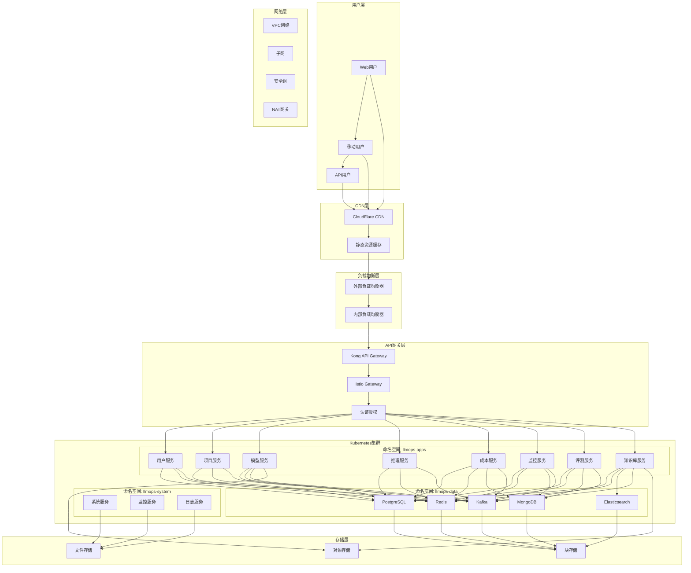

# LLMOps平台基础设施架构设计

> **架构类型**: 基础设施架构设计  
> **技术栈**: 云原生 + Kubernetes + 微服务  
> **更新日期**: 2025-10-17

## 一、基础设施概述

### 1.1 设计目标

构建高可用、可扩展、安全可靠的云原生基础设施，支持LLMOps平台的大规模部署和运维需求。

### 1.2 核心原则

- **云原生**: 基于Kubernetes的容器化部署
- **高可用**: 多可用区部署和故障转移
- **可扩展**: 弹性扩缩容和负载均衡
- **安全性**: 多层次安全防护
- **可观测**: 全链路监控和日志收集

### 1.3 技术选型

#### 容器编排
- **Kubernetes**: 容器编排平台
- **Docker**: 容器运行时
- **Helm**: 包管理工具

#### 服务网格
- **Istio**: 服务网格
- **Envoy**: 代理服务

#### 存储
- **PostgreSQL**: 关系型数据库
- **Redis**: 缓存数据库
- **MongoDB**: 文档数据库
- **Elasticsearch**: 搜索引擎
- **MinIO**: 对象存储

#### 消息队列
- **Apache Kafka**: 分布式消息队列
- **RabbitMQ**: 消息代理

#### 监控告警
- **Prometheus**: 指标收集
- **Grafana**: 可视化监控
- **Jaeger**: 分布式追踪
- **Golang日志分析**: 基于Logrus + Zap的结构化日志 (Elasticsearch + Logstash + Kibana)
- **Filebeat**: Golang应用日志收集器

#### 安全
- **Vault**: 密钥管理
- **Cert-Manager**: 证书管理
- **Falco**: 运行时安全

## 二、整体架构

### 2.1 架构图



### 2.2 网络架构

#### 2.2.1 VPC设计

```yaml
# VPC配置
VPC:
  CIDR: 10.0.0.0/16
  Subnets:
    - Name: public-subnet-1
      CIDR: 10.0.1.0/24
      AZ: us-east-1a
      Type: public
    - Name: public-subnet-2
      CIDR: 10.0.2.0/24
      AZ: us-east-1b
      Type: public
    - Name: private-subnet-1
      CIDR: 10.0.11.0/24
      AZ: us-east-1a
      Type: private
    - Name: private-subnet-2
      CIDR: 10.0.12.0/24
      AZ: us-east-1b
      Type: private
    - Name: database-subnet-1
      CIDR: 10.0.21.0/24
      AZ: us-east-1a
      Type: database
    - Name: database-subnet-2
      CIDR: 10.0.22.0/24
      AZ: us-east-1b
      Type: database
```

#### 2.2.2 安全组配置

```yaml
# 安全组配置
SecurityGroups:
  - Name: llmops-alb-sg
    Rules:
      Inbound:
        - Port: 80
          Protocol: TCP
          Source: 0.0.0.0/0
        - Port: 443
          Protocol: TCP
          Source: 0.0.0.0/0
      Outbound:
        - Port: 0-65535
          Protocol: TCP
          Destination: 0.0.0.0/0
  
  - Name: llmops-eks-sg
    Rules:
      Inbound:
        - Port: 443
          Protocol: TCP
          Source: llmops-alb-sg
        - Port: 8080-8090
          Protocol: TCP
          Source: llmops-alb-sg
      Outbound:
        - Port: 0-65535
          Protocol: TCP
          Destination: 0.0.0.0/0
  
  - Name: llmops-database-sg
    Rules:
      Inbound:
        - Port: 5432
          Protocol: TCP
          Source: llmops-eks-sg
        - Port: 6379
          Protocol: TCP
          Source: llmops-eks-sg
        - Port: 27017
          Protocol: TCP
          Source: llmops-eks-sg
      Outbound:
        - Port: 0-65535
          Protocol: TCP
          Destination: 0.0.0.0/0
```

## 三、Kubernetes集群设计

### 3.1 集群配置

```yaml
# EKS集群配置
EKSCluster:
  Name: llmops-cluster
  Version: "1.28"
  Region: us-east-1
  
  NodeGroups:
    - Name: system-nodes
      InstanceType: t3.medium
      MinSize: 2
      MaxSize: 4
      DesiredSize: 2
      AMIType: AL2_x86_64
      Labels:
        node-type: system
      Taints:
        - Key: system
          Value: "true"
          Effect: NoSchedule
    
    - Name: app-nodes
      InstanceType: t3.large
      MinSize: 3
      MaxSize: 10
      DesiredSize: 5
      AMIType: AL2_x86_64
      Labels:
        node-type: app
      Taints: []
    
    - Name: gpu-nodes
      InstanceType: g4dn.xlarge
      MinSize: 0
      MaxSize: 5
      DesiredSize: 1
      AMIType: AL2_x86_64
      Labels:
        node-type: gpu
        accelerator: nvidia-tesla-t4
      Taints:
        - Key: nvidia.com/gpu
          Value: "true"
          Effect: NoSchedule

  Addons:
    - Name: vpc-cni
      Version: latest
    - Name: coredns
      Version: latest
    - Name: kube-proxy
      Version: latest
    - Name: aws-ebs-csi-driver
      Version: latest
```

### 3.2 命名空间设计

```yaml
# 命名空间配置
Namespaces:
  - Name: llmops-system
    Labels:
      purpose: system
      monitoring: enabled
    Resources:
      Limits:
        cpu: "2"
        memory: "4Gi"
      Requests:
        cpu: "1"
        memory: "2Gi"
  
  - Name: llmops-apps
    Labels:
      purpose: application
      monitoring: enabled
    Resources:
      Limits:
        cpu: "8"
        memory: "16Gi"
      Requests:
        cpu: "4"
        memory: "8Gi"
  
  - Name: llmops-data
    Labels:
      purpose: data
      monitoring: enabled
    Resources:
      Limits:
        cpu: "4"
        memory: "8Gi"
      Requests:
        cpu: "2"
        memory: "4Gi"
  
  - Name: llmops-monitoring
    Labels:
      purpose: monitoring
      monitoring: enabled
    Resources:
      Limits:
        cpu: "2"
        memory: "4Gi"
      Requests:
        cpu: "1"
        memory: "2Gi"
```

### 3.3 资源配额

```yaml
# 资源配额配置
ResourceQuotas:
  - Namespace: llmops-apps
    Quota:
      requests.cpu: "20"
      requests.memory: "40Gi"
      limits.cpu: "40"
      limits.memory: "80Gi"
      persistentvolumeclaims: "10"
      services: "20"
      secrets: "50"
      configmaps: "50"
  
  - Namespace: llmops-data
    Quota:
      requests.cpu: "10"
      requests.memory: "20Gi"
      limits.cpu: "20"
      limits.memory: "40Gi"
      persistentvolumeclaims: "20"
      services: "10"
      secrets: "20"
      configmaps: "20"

# 限制范围
LimitRanges:
  - Namespace: llmops-apps
    Limits:
      - Type: Container
        Default:
          cpu: "500m"
          memory: "1Gi"
        DefaultRequest:
          cpu: "100m"
          memory: "256Mi"
        Max:
          cpu: "2"
          memory: "4Gi"
        Min:
          cpu: "50m"
          memory: "128Mi"
```

## 四、存储架构

### 4.1 存储类配置

```yaml
# 存储类配置
StorageClasses:
  - Name: gp3-ssd
    Provisioner: ebs.csi.aws.com
    Parameters:
      type: gp3
      iops: "3000"
      throughput: "125"
      encrypted: "true"
    ReclaimPolicy: Delete
    VolumeBindingMode: WaitForFirstConsumer
  
  - Name: gp2-ssd
    Provisioner: ebs.csi.aws.com
    Parameters:
      type: gp2
      encrypted: "true"
    ReclaimPolicy: Delete
    VolumeBindingMode: WaitForFirstConsumer
  
  - Name: st1-hdd
    Provisioner: ebs.csi.aws.com
    Parameters:
      type: st1
      encrypted: "true"
    ReclaimPolicy: Delete
    VolumeBindingMode: WaitForFirstConsumer
```

### 4.2 持久化存储

```yaml
# PostgreSQL存储
apiVersion: v1
kind: PersistentVolumeClaim
metadata:
  name: postgresql-pvc
  namespace: llmops-data
spec:
  accessModes:
    - ReadWriteOnce
  resources:
    requests:
      storage: 100Gi
  storageClassName: gp3-ssd

---
# Redis存储
apiVersion: v1
kind: PersistentVolumeClaim
metadata:
  name: redis-pvc
  namespace: llmops-data
spec:
  accessModes:
    - ReadWriteOnce
  resources:
    requests:
      storage: 50Gi
  storageClassName: gp3-ssd

---
# MongoDB存储
apiVersion: v1
kind: PersistentVolumeClaim
metadata:
  name: mongodb-pvc
  namespace: llmops-data
spec:
  accessModes:
    - ReadWriteOnce
  resources:
    requests:
      storage: 200Gi
  storageClassName: gp3-ssd

---
# Elasticsearch存储
apiVersion: v1
kind: PersistentVolumeClaim
metadata:
  name: elasticsearch-pvc
  namespace: llmops-data
spec:
  accessModes:
    - ReadWriteOnce
  resources:
    requests:
      storage: 500Gi
  storageClassName: st1-hdd
```

### 4.3 对象存储

```yaml
# MinIO配置
apiVersion: apps/v1
kind: Deployment
metadata:
  name: minio
  namespace: llmops-data
spec:
  replicas: 2
  selector:
    matchLabels:
      app: minio
  template:
    metadata:
      labels:
        app: minio
    spec:
      containers:
      - name: minio
        image: minio/minio:latest
        args:
        - server
        - /data
        - --console-address
        - ":9001"
        env:
        - name: MINIO_ROOT_USER
          valueFrom:
            secretKeyRef:
              name: minio-secret
              key: username
        - name: MINIO_ROOT_PASSWORD
          valueFrom:
            secretKeyRef:
              name: minio-secret
              key: password
        ports:
        - containerPort: 9000
          name: api
        - containerPort: 9001
          name: console
        volumeMounts:
        - name: data
          mountPath: /data
        resources:
          requests:
            memory: "1Gi"
            cpu: "500m"
          limits:
            memory: "2Gi"
            cpu: "1"
      volumes:
      - name: data
        persistentVolumeClaim:
          claimName: minio-pvc
```

## 五、网络架构

### 5.1 Istio服务网格

```yaml
# Istio安装配置
apiVersion: install.istio.io/v1alpha1
kind: IstioOperator
metadata:
  namespace: istio-system
  name: control-plane
spec:
  profile: production
  components:
    pilot:
      k8s:
        resources:
          requests:
            cpu: 500m
            memory: 2048Mi
          limits:
            cpu: 1000m
            memory: 4096Mi
    ingressGateways:
    - name: istio-ingressgateway
      enabled: true
      k8s:
        resources:
          requests:
            cpu: 1000m
            memory: 1024Mi
          limits:
            cpu: 2000m
            memory: 2048Mi
        service:
          type: LoadBalancer
          ports:
          - port: 80
            targetPort: 8080
            name: http2
          - port: 443
            targetPort: 8443
            name: https
    egressGateways:
    - name: istio-egressgateway
      enabled: true
      k8s:
        resources:
          requests:
            cpu: 100m
            memory: 128Mi
          limits:
            cpu: 200m
            memory: 256Mi
  values:
    global:
      proxy:
        resources:
          requests:
            cpu: 100m
            memory: 128Mi
          limits:
            cpu: 200m
            memory: 256Mi
      defaultResources:
        requests:
          cpu: 500m
          memory: 512Mi
        limits:
          cpu: 1000m
          memory: 1024Mi
```

### 5.2 网关配置

```yaml
# Istio网关
apiVersion: networking.istio.io/v1alpha3
kind: Gateway
metadata:
  name: llmops-gateway
  namespace: llmops-apps
spec:
  selector:
    istio: ingressgateway
  servers:
  - port:
      number: 80
      name: http
      protocol: HTTP
    hosts:
    - "api.llmops.com"
    tls:
      httpsRedirect: true
  - port:
      number: 443
      name: https
      protocol: HTTPS
    hosts:
    - "api.llmops.com"
    tls:
      mode: SIMPLE
      credentialName: llmops-tls

---
# 虚拟服务
apiVersion: networking.istio.io/v1alpha3
kind: VirtualService
metadata:
  name: llmops-vs
  namespace: llmops-apps
spec:
  hosts:
  - "api.llmops.com"
  gateways:
  - llmops-gateway
  http:
  - match:
    - uri:
        prefix: /api/v1/users
    route:
    - destination:
        host: user-service
        port:
          number: 80
    timeout: 30s
    retries:
      attempts: 3
      perTryTimeout: 10s
  - match:
    - uri:
        prefix: /api/v1/projects
    route:
    - destination:
        host: project-service
        port:
          number: 80
    timeout: 30s
    retries:
      attempts: 3
      perTryTimeout: 10s
  - match:
    - uri:
        prefix: /api/v1/models
    route:
    - destination:
        host: model-service
        port:
          number: 80
    timeout: 30s
    retries:
      attempts: 3
      perTryTimeout: 10s
  - match:
    - uri:
        prefix: /api/v1/inference
    route:
    - destination:
        host: inference-service
        port:
          number: 80
    timeout: 60s
    retries:
      attempts: 2
      perTryTimeout: 30s
```

### 5.3 安全策略

```yaml
# 认证策略
apiVersion: security.istio.io/v1beta1
kind: PeerAuthentication
metadata:
  name: default
  namespace: llmops-apps
spec:
  mtls:
    mode: STRICT

---
# 授权策略
apiVersion: security.istio.io/v1beta1
kind: AuthorizationPolicy
metadata:
  name: llmops-authz
  namespace: llmops-apps
spec:
  rules:
  - from:
    - source:
        principals: ["cluster.local/ns/llmops-apps/sa/user-service"]
    to:
    - operation:
        methods: ["GET", "POST", "PUT", "DELETE"]
        paths: ["/api/v1/users/*"]
  - from:
    - source:
        principals: ["cluster.local/ns/llmops-apps/sa/project-service"]
    to:
    - operation:
        methods: ["GET", "POST", "PUT", "DELETE"]
        paths: ["/api/v1/projects/*"]
  - from:
    - source:
        principals: ["cluster.local/ns/llmops-apps/sa/model-service"]
    to:
    - operation:
        methods: ["GET", "POST", "PUT", "DELETE"]
        paths: ["/api/v1/models/*"]
```

## 六、监控架构

### 6.1 Prometheus配置

```yaml
# Prometheus部署
apiVersion: apps/v1
kind: Deployment
metadata:
  name: prometheus
  namespace: llmops-monitoring
spec:
  replicas: 2
  selector:
    matchLabels:
      app: prometheus
  template:
    metadata:
      labels:
        app: prometheus
    spec:
      containers:
      - name: prometheus
        image: prom/prometheus:latest
        args:
        - --config.file=/etc/prometheus/prometheus.yml
        - --storage.tsdb.path=/prometheus/
        - --web.console.libraries=/etc/prometheus/console_libraries
        - --web.console.templates=/etc/prometheus/consoles
        - --storage.tsdb.retention.time=30d
        - --web.enable-lifecycle
        - --web.enable-admin-api
        ports:
        - containerPort: 9090
          name: web
        volumeMounts:
        - name: config
          mountPath: /etc/prometheus
        - name: storage
          mountPath: /prometheus
        resources:
          requests:
            memory: "2Gi"
            cpu: "1000m"
          limits:
            memory: "4Gi"
            cpu: "2000m"
      volumes:
      - name: config
        configMap:
          name: prometheus-config
      - name: storage
        persistentVolumeClaim:
          claimName: prometheus-pvc

---
# Prometheus配置
apiVersion: v1
kind: ConfigMap
metadata:
  name: prometheus-config
  namespace: llmops-monitoring
data:
  prometheus.yml: |
    global:
      scrape_interval: 15s
      evaluation_interval: 15s
    
    rule_files:
      - "rules/*.yml"
    
    alerting:
      alertmanagers:
        - static_configs:
            - targets:
              - alertmanager:9093
    
    scrape_configs:
      - job_name: 'prometheus'
        static_configs:
          - targets: ['localhost:9090']
      
      - job_name: 'kubernetes-apiservers'
        kubernetes_sd_configs:
          - role: endpoints
        scheme: https
        tls_config:
          ca_file: /var/run/secrets/kubernetes.io/serviceaccount/ca.crt
        bearer_token_file: /var/run/secrets/kubernetes.io/serviceaccount/token
        relabel_configs:
          - source_labels: [__meta_kubernetes_namespace, __meta_kubernetes_service_name, __meta_kubernetes_endpoint_port_name]
            action: keep
            regex: default;kubernetes;https
      
      - job_name: 'kubernetes-nodes'
        kubernetes_sd_configs:
          - role: node
        scheme: https
        tls_config:
          ca_file: /var/run/secrets/kubernetes.io/serviceaccount/ca.crt
        bearer_token_file: /var/run/secrets/kubernetes.io/serviceaccount/token
        relabel_configs:
          - action: labelmap
            regex: __meta_kubernetes_node_label_(.+)
          - target_label: __address__
            replacement: kubernetes.default.svc:443
          - source_labels: [__meta_kubernetes_node_name]
            regex: (.+)
            target_label: __metrics_path__
            replacement: /api/v1/nodes/${1}/proxy/metrics
      
      - job_name: 'kubernetes-pods'
        kubernetes_sd_configs:
          - role: pod
        relabel_configs:
          - source_labels: [__meta_kubernetes_pod_annotation_prometheus_io_scrape]
            action: keep
            regex: true
          - source_labels: [__meta_kubernetes_pod_annotation_prometheus_io_path]
            action: replace
            target_label: __metrics_path__
            regex: (.+)
          - source_labels: [__address__, __meta_kubernetes_pod_annotation_prometheus_io_port]
            action: replace
            regex: ([^:]+)(?::\d+)?;(\d+)
            replacement: $1:$2
            target_label: __address__
          - action: labelmap
            regex: __meta_kubernetes_pod_label_(.+)
          - source_labels: [__meta_kubernetes_namespace]
            action: replace
            target_label: kubernetes_namespace
          - source_labels: [__meta_kubernetes_pod_name]
            action: replace
            target_label: kubernetes_pod_name
```

### 6.2 Grafana配置

```yaml
# Grafana部署
apiVersion: apps/v1
kind: Deployment
metadata:
  name: grafana
  namespace: llmops-monitoring
spec:
  replicas: 1
  selector:
    matchLabels:
      app: grafana
  template:
    metadata:
      labels:
        app: grafana
    spec:
      containers:
      - name: grafana
        image: grafana/grafana:latest
        ports:
        - containerPort: 3000
          name: http
        env:
        - name: GF_SECURITY_ADMIN_PASSWORD
          valueFrom:
            secretKeyRef:
              name: grafana-secret
              key: admin-password
        - name: GF_INSTALL_PLUGINS
          value: "grafana-piechart-panel,grafana-worldmap-panel"
        volumeMounts:
        - name: config
          mountPath: /etc/grafana/provisioning
        - name: storage
          mountPath: /var/lib/grafana
        resources:
          requests:
            memory: "512Mi"
            cpu: "250m"
          limits:
            memory: "1Gi"
            cpu: "500m"
      volumes:
      - name: config
        configMap:
          name: grafana-config
      - name: storage
        persistentVolumeClaim:
          claimName: grafana-pvc
```

### 6.3 告警规则

```yaml
# 告警规则
apiVersion: v1
kind: ConfigMap
metadata:
  name: prometheus-rules
  namespace: llmops-monitoring
data:
  llmops-rules.yml: |
    groups:
    - name: llmops.rules
      rules:
      - alert: HighErrorRate
        expr: rate(http_requests_total{status=~"5.."}[5m]) / rate(http_requests_total[5m]) > 0.05
        for: 5m
        labels:
          severity: warning
        annotations:
          summary: "High error rate detected"
          description: "Error rate is {{ $value | humanizePercentage }} for {{ $labels.service }}"
      
      - alert: HighResponseTime
        expr: histogram_quantile(0.95, rate(http_request_duration_seconds_bucket[5m])) > 1
        for: 5m
        labels:
          severity: warning
        annotations:
          summary: "High response time detected"
          description: "95th percentile response time is {{ $value }}s for {{ $labels.service }}"
      
      - alert: ServiceDown
        expr: up == 0
        for: 1m
        labels:
          severity: critical
        annotations:
          summary: "Service is down"
          description: "{{ $labels.job }} service is down"
      
      - alert: HighCPUUsage
        expr: 100 - (avg by(instance) (rate(node_cpu_seconds_total{mode="idle"}[5m])) * 100) > 80
        for: 5m
        labels:
          severity: warning
        annotations:
          summary: "High CPU usage detected"
          description: "CPU usage is {{ $value }}% on {{ $labels.instance }}"
      
      - alert: HighMemoryUsage
        expr: (1 - (node_memory_MemAvailable_bytes / node_memory_MemTotal_bytes)) * 100 > 80
        for: 5m
        labels:
          severity: warning
        annotations:
          summary: "High memory usage detected"
          description: "Memory usage is {{ $value }}% on {{ $labels.instance }}"
```

## 七、日志架构

### 7.1 Golang应用日志架构

基于Logrus + Zap的结构化日志系统，配合ELK Stack进行日志收集、处理和分析。

#### 7.1.1 Golang日志配置

### 7.2 Fluentd配置

```yaml
# Fluentd DaemonSet
apiVersion: apps/v1
kind: DaemonSet
metadata:
  name: fluentd
  namespace: llmops-monitoring
spec:
  selector:
    matchLabels:
      app: fluentd
  template:
    metadata:
      labels:
        app: fluentd
    spec:
      containers:
      - name: fluentd
        image: fluent/fluentd-kubernetes-daemonset:v1-debian-elasticsearch
        env:
        - name: FLUENT_ELASTICSEARCH_HOST
          value: "elasticsearch.llmops-monitoring.svc.cluster.local"
        - name: FLUENT_ELASTICSEARCH_PORT
          value: "9200"
        - name: FLUENT_ELASTICSEARCH_SCHEME
          value: "http"
        - name: FLUENT_ELASTICSEARCH_INDEX_NAME
          value: "llmops-logs"
        volumeMounts:
        - name: varlog
          mountPath: /var/log
        - name: varlibdockercontainers
          mountPath: /var/lib/docker/containers
          readOnly: true
        - name: config
          mountPath: /fluentd/etc
        resources:
          requests:
            memory: "256Mi"
            cpu: "100m"
          limits:
            memory: "512Mi"
            cpu: "200m"
      volumes:
      - name: varlog
        hostPath:
          path: /var/log
      - name: varlibdockercontainers
        hostPath:
          path: /var/lib/docker/containers
      - name: config
        configMap:
          name: fluentd-config
```

## 八、安全架构

### 8.1 Vault配置

```yaml
# Vault部署
apiVersion: apps/v1
kind: Deployment
metadata:
  name: vault
  namespace: llmops-system
spec:
  replicas: 1
  selector:
    matchLabels:
      app: vault
  template:
    metadata:
      labels:
        app: vault
    spec:
      containers:
      - name: vault
        image: vault:latest
        args:
        - server
        - -dev
        - -dev-root-token-id=root
        - -dev-listen-address=0.0.0.0:8200
        ports:
        - containerPort: 8200
          name: http
        env:
        - name: VAULT_DEV_ROOT_TOKEN_ID
          value: "root"
        - name: VAULT_DEV_LISTEN_ADDRESS
          value: "0.0.0.0:8200"
        resources:
          requests:
            memory: "256Mi"
            cpu: "100m"
          limits:
            memory: "512Mi"
            cpu: "200m"

---
# Vault Agent配置
apiVersion: v1
kind: ConfigMap
metadata:
  name: vault-agent-config
  namespace: llmops-apps
data:
  vault-agent.hcl: |
    vault {
      address = "http://vault.llmops-system.svc.cluster.local:8200"
    }
    
    auto_auth {
      method "kubernetes" {
        mount_path = "auth/kubernetes"
        config = {
          role = "llmops-apps"
        }
      }
      
      sink "file" {
        config = {
          path = "/vault/secrets/token"
        }
      }
    }
    
    template {
      source      = "/vault/configs/database.tpl"
      destination = "/vault/secrets/database"
      perms       = 0644
    }
    
    template {
      source      = "/vault/configs/redis.tpl"
      destination = "/vault/secrets/redis"
      perms       = 0644
    }
```

### 8.2 证书管理

```yaml
# Cert-Manager配置
apiVersion: cert-manager.io/v1
kind: ClusterIssuer
metadata:
  name: letsencrypt-prod
spec:
  acme:
    server: https://acme-v02.api.letsencrypt.org/directory
    email: admin@llmops.com
    privateKeySecretRef:
      name: letsencrypt-prod
    solvers:
    - http01:
        ingress:
          class: istio

---
# 证书申请
apiVersion: cert-manager.io/v1
kind: Certificate
metadata:
  name: llmops-tls
  namespace: llmops-apps
spec:
  secretName: llmops-tls
  issuerRef:
    name: letsencrypt-prod
    kind: ClusterIssuer
  dnsNames:
  - api.llmops.com
  - admin.llmops.com
```

### 8.3 网络策略

```yaml
# 网络策略
apiVersion: networking.k8s.io/v1
kind: NetworkPolicy
metadata:
  name: llmops-network-policy
  namespace: llmops-apps
spec:
  podSelector: {}
  policyTypes:
  - Ingress
  - Egress
  ingress:
  - from:
    - namespaceSelector:
        matchLabels:
          name: istio-system
    - namespaceSelector:
        matchLabels:
          name: llmops-apps
    ports:
    - protocol: TCP
      port: 8080
    - protocol: TCP
      port: 9090
  egress:
  - to:
    - namespaceSelector:
        matchLabels:
          name: llmops-data
    ports:
    - protocol: TCP
      port: 5432
    - protocol: TCP
      port: 6379
    - protocol: TCP
      port: 27017
    - protocol: TCP
      port: 9200
  - to:
    - namespaceSelector:
        matchLabels:
          name: llmops-monitoring
    ports:
    - protocol: TCP
      port: 9090
    - protocol: TCP
      port: 9200
```

## 九、备份与恢复

### 9.1 数据库备份

```yaml
# PostgreSQL备份
apiVersion: batch/v1
kind: CronJob
metadata:
  name: postgresql-backup
  namespace: llmops-data
spec:
  schedule: "0 2 * * *"
  jobTemplate:
    spec:
      template:
        spec:
          containers:
          - name: postgresql-backup
            image: postgres:13
            env:
            - name: PGPASSWORD
              valueFrom:
                secretKeyRef:
                  name: postgresql-secret
                  key: password
            command:
            - /bin/bash
            - -c
            - |
              pg_dump -h postgresql -U postgres -d llmops > /backup/llmops-$(date +%Y%m%d_%H%M%S).sql
              aws s3 cp /backup/llmops-$(date +%Y%m%d_%H%M%S).sql s3://llmops-backups/postgresql/
            volumeMounts:
            - name: backup
              mountPath: /backup
          volumes:
          - name: backup
            persistentVolumeClaim:
              claimName: backup-pvc
          restartPolicy: OnFailure

---
# Redis备份
apiVersion: batch/v1
kind: CronJob
metadata:
  name: redis-backup
  namespace: llmops-data
spec:
  schedule: "0 3 * * *"
  jobTemplate:
    spec:
      template:
        spec:
          containers:
          - name: redis-backup
            image: redis:6
            command:
            - /bin/bash
            - -c
            - |
              redis-cli -h redis --rdb /backup/redis-$(date +%Y%m%d_%H%M%S).rdb
              aws s3 cp /backup/redis-$(date +%Y%m%d_%H%M%S).rdb s3://llmops-backups/redis/
            volumeMounts:
            - name: backup
              mountPath: /backup
          volumes:
          - name: backup
            persistentVolumeClaim:
              claimName: backup-pvc
          restartPolicy: OnFailure
```

### 9.2 配置备份

```yaml
# 配置备份
apiVersion: batch/v1
kind: CronJob
metadata:
  name: config-backup
  namespace: llmops-system
spec:
  schedule: "0 4 * * *"
  jobTemplate:
    spec:
      template:
        spec:
          containers:
          - name: config-backup
            image: bitnami/kubectl:latest
            command:
            - /bin/bash
            - -c
            - |
              kubectl get all -o yaml > /backup/k8s-resources-$(date +%Y%m%d_%H%M%S).yaml
              kubectl get configmaps -o yaml > /backup/configmaps-$(date +%Y%m%d_%H%M%S).yaml
              kubectl get secrets -o yaml > /backup/secrets-$(date +%Y%m%d_%H%M%S).yaml
              aws s3 cp /backup/ s3://llmops-backups/k8s/ --recursive
            volumeMounts:
            - name: backup
              mountPath: /backup
            - name: kubeconfig
              mountPath: /root/.kube
          volumes:
          - name: backup
            persistentVolumeClaim:
              claimName: backup-pvc
          - name: kubeconfig
            secret:
              secretName: kubeconfig
          restartPolicy: OnFailure
```

## 十、总结

### 10.1 架构优势

1. **高可用性**: 多可用区部署和故障转移
2. **可扩展性**: 弹性扩缩容和负载均衡
3. **安全性**: 多层次安全防护和网络隔离
4. **可观测性**: 全链路监控和日志收集
5. **可维护性**: 自动化部署和配置管理

### 10.2 技术特色

- **云原生**: 基于Kubernetes的容器化部署
- **服务网格**: Istio流量管理和安全策略
- **监控体系**: Prometheus + Grafana + Jaeger
- **日志分析**: ELK Stack + Fluentd
- **安全防护**: Vault + Cert-Manager + 网络策略

### 10.3 运维优势

- **自动化**: 自动化部署、扩缩容、备份
- **监控**: 全链路监控和告警
- **日志**: 集中化日志收集和分析
- **安全**: 密钥管理和证书自动更新
- **备份**: 自动化备份和恢复

这个基础设施架构设计为LLMOps平台提供了高可用、可扩展、安全可靠的云原生基础设施，支持大规模LLM运营平台的部署和运维需求。

---

**文档维护**: 本文档应随架构设计变化持续更新，保持与技术实现的一致性。

**版本历史**:
- v1.0 (2025-10-17): 初始版本，基础设施架构设计

