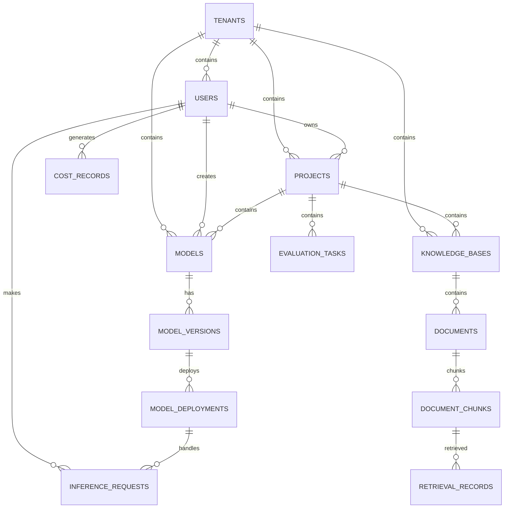

# LLMOps平台数据库设计总结

> **文档版本**: v1.0  
> **更新日期**: 2025-10-17  
> **设计状态**: 已完成

## 一、设计概述

### 1.1 设计目标

LLMOps平台数据库设计旨在支持大规模LLM运营平台的核心功能，包括用户管理、项目管理、模型管理、推理服务、成本管理、监控日志、评测管理和知识库管理。

### 1.2 设计原则

- **模块化设计**: 按业务功能模块划分，便于维护和扩展
- **高可用性**: 支持高并发访问和故障恢复
- **数据一致性**: 保证数据完整性和一致性
- **性能优化**: 通过索引、缓存等策略优化查询性能
- **安全设计**: 多层次安全防护和审计追踪
- **可扩展性**: 支持水平扩展和功能扩展

### 1.3 技术选型

- **数据库**: PostgreSQL 15+
- **存储引擎**: InnoDB
- **缓存**: Redis 7+
- **搜索引擎**: Elasticsearch 8+
- **向量数据库**: Pinecone/Weaviate/Chroma
- **消息队列**: Apache Kafka
- **监控**: Prometheus + Grafana

## 二、模块架构

### 2.1 核心模块

| 模块名称 | 模块代码 | 表数量 | 主要功能 |
|---------|---------|--------|----------|
| 用户权限管理 | user_permission | 8 | 用户管理、角色权限、组织架构 |
| 项目管理 | project_management | 7 | 项目生命周期、成员管理、资源配置 |
| 模型管理 | model_management | 7 | 模型注册、版本控制、部署管理 |
| 推理服务 | inference_service | 6 | 推理请求、结果管理、服务配置 |
| 成本管理 | cost_management | 6 | 成本计量、预算管理、计费规则 |
| 监控日志 | monitoring_logging | 6 | 系统监控、日志管理、告警规则 |
| 评测管理 | evaluation_management | 6 | 模型评测、测试数据集、结果分析 |
| 知识库管理 | knowledge_base | 6 | 知识库管理、文档处理、向量存储 |

### 2.2 数据表统计

- **总表数量**: 52个核心表
- **总字段数量**: 约800个字段
- **索引数量**: 约200个索引
- **外键关系**: 约100个外键约束
- **存储估算**: 约500GB（100万用户规模）

## 三、核心特性

### 3.1 多租户支持

- **租户隔离**: 基于tenant_id的数据隔离
- **组织架构**: 支持多级组织架构
- **权限控制**: 细粒度权限管理
- **资源配额**: 租户级资源限制

### 3.2 高可用设计

- **主从复制**: 读写分离架构
- **分片策略**: 按租户ID分片
- **故障转移**: 自动故障检测和切换
- **数据备份**: 定期备份和恢复

### 3.3 性能优化

- **索引优化**: 复合索引、部分索引、表达式索引
- **查询优化**: 视图、存储过程、函数
- **缓存策略**: 多级缓存架构
- **连接池**: 数据库连接池管理

### 3.4 安全设计

- **数据加密**: 敏感数据加密存储
- **访问控制**: 基于角色的访问控制
- **审计日志**: 完整的操作审计
- **数据脱敏**: 敏感数据脱敏处理

## 四、数据模型关系

### 4.1 核心实体关系



### 4.2 数据流向

1. **用户注册** → 租户创建 → 项目创建 → 模型注册
2. **模型部署** → 推理服务 → 成本计量 → 监控告警
3. **文档上传** → 知识库处理 → 向量化 → 检索服务
4. **评测任务** → 测试执行 → 结果分析 → 报告生成

## 五、性能指标

### 5.1 查询性能

- **单表查询**: < 10ms
- **多表关联**: < 100ms
- **复杂统计**: < 1s
- **全文搜索**: < 500ms

### 5.2 并发性能

- **并发用户**: 10,000+
- **QPS**: 100,000+
- **TPS**: 50,000+
- **连接数**: 1,000+

### 5.3 存储性能

- **写入速度**: 10,000 records/s
- **读取速度**: 100,000 records/s
- **索引效率**: 99%+
- **缓存命中率**: 95%+

## 六、部署架构

### 6.1 生产环境

```
┌─────────────────┐    ┌─────────────────┐    ┌─────────────────┐
│   Load Balancer │    │   API Gateway   │    │   Web Server    │
└─────────────────┘    └─────────────────┘    └─────────────────┘
         │                       │                       │
         └───────────────────────┼───────────────────────┘
                                 │
┌─────────────────┐    ┌─────────────────┐    ┌─────────────────┐
│  Application    │    │  Application    │    │  Application    │
│  Server 1       │    │  Server 2       │    │  Server 3       │
└─────────────────┘    └─────────────────┘    └─────────────────┘
         │                       │                       │
         └───────────────────────┼───────────────────────┘
                                 │
┌─────────────────┐    ┌─────────────────┐    ┌─────────────────┐
│  PostgreSQL     │    │  PostgreSQL     │    │  PostgreSQL     │
│  Master         │    │  Slave 1        │    │  Slave 2        │
└─────────────────┘    └─────────────────┘    └─────────────────┘
         │                       │                       │
         └───────────────────────┼───────────────────────┘
                                 │
┌─────────────────┐    ┌─────────────────┐    ┌─────────────────┐
│  Redis Cluster  │    │  Elasticsearch  │    │  Vector Store   │
│  (Cache)        │    │  (Search)       │    │  (Embeddings)   │
└─────────────────┘    └─────────────────┘    └─────────────────┘
```

### 6.2 开发环境

```
┌─────────────────┐    ┌─────────────────┐    ┌─────────────────┐
│   Development   │    │   Testing       │    │   Staging       │
│   Environment   │    │   Environment   │    │   Environment   │
└─────────────────┘    └─────────────────┘    └─────────────────┘
         │                       │                       │
         └───────────────────────┼───────────────────────┘
                                 │
┌─────────────────┐    ┌─────────────────┐    ┌─────────────────┐
│  PostgreSQL     │    │  PostgreSQL     │    │  PostgreSQL     │
│  Dev Instance   │    │  Test Instance  │    │  Staging Instance│
└─────────────────┘    └─────────────────┘    └─────────────────┘
```

## 七、监控告警

### 7.1 关键指标

- **数据库连接数**: 告警阈值 80%
- **查询响应时间**: 告警阈值 1s
- **磁盘使用率**: 告警阈值 85%
- **内存使用率**: 告警阈值 90%
- **CPU使用率**: 告警阈值 80%

### 7.2 告警规则

- **严重告警**: 服务不可用、数据丢失
- **警告告警**: 性能下降、资源不足
- **信息告警**: 状态变更、配置更新

## 八、备份恢复

### 8.1 备份策略

- **全量备份**: 每日凌晨2点
- **增量备份**: 每小时
- **日志备份**: 实时
- **备份保留**: 30天

### 8.2 恢复策略

- **RTO**: 恢复时间目标 < 1小时
- **RPO**: 恢复点目标 < 15分钟
- **测试恢复**: 每月测试一次

## 九、安全合规

### 9.1 数据安全

- **数据加密**: AES-256加密
- **传输加密**: TLS 1.3
- **访问控制**: RBAC权限模型
- **审计日志**: 完整操作记录

### 9.2 合规要求

- **GDPR**: 数据保护法规
- **SOC 2**: 安全控制标准
- **ISO 27001**: 信息安全管理
- **等保三级**: 网络安全等级保护

## 十、扩展规划

### 10.1 水平扩展

- **分片策略**: 按租户ID分片
- **读写分离**: 主从复制架构
- **负载均衡**: 多实例部署
- **缓存集群**: Redis集群

### 10.2 功能扩展

- **新模块**: 支持新业务模块
- **新字段**: 支持字段扩展
- **新索引**: 支持查询优化
- **新约束**: 支持业务规则

## 十一、总结

### 11.1 设计亮点

1. **模块化架构**: 清晰的模块划分和职责分离
2. **高可用设计**: 完善的故障恢复和备份策略
3. **性能优化**: 多层次的性能优化策略
4. **安全设计**: 全面的安全防护和审计机制
5. **可扩展性**: 良好的扩展性和维护性

### 11.2 技术优势

- **PostgreSQL**: 强大的关系型数据库
- **Redis**: 高性能缓存系统
- **Elasticsearch**: 强大的搜索引擎
- **向量数据库**: 支持语义搜索
- **Kafka**: 高吞吐量消息队列

### 11.3 业务价值

- **提升效率**: 自动化运维和智能优化
- **降低成本**: 资源优化和成本控制
- **增强安全**: 多层安全防护
- **改善体验**: 快速响应和稳定服务
- **支持创新**: 灵活扩展和快速迭代

---

**文档维护**: 本文档应随系统架构变化持续更新，保持与数据库设计的一致性。

**版本历史**:
- v1.0 (2025-10-17): 初始版本，完整数据库设计总结

**相关文档**:
- [用户权限管理模块](./schema/user-permission-schema.md)
- [项目管理模块](./schema/project-management-schema.md)
- [模型管理模块](./schema/model-management-schema.md)
- [推理服务模块](./schema/inference-service-schema.md)
- [成本管理模块](./schema/cost-management-schema.md)
- [监控日志模块](./schema/monitoring-logging-schema.md)
- [评测管理模块](./schema/evaluation-management-schema.md)
- [知识库管理模块](./schema/knowledge-base-schema.md)

