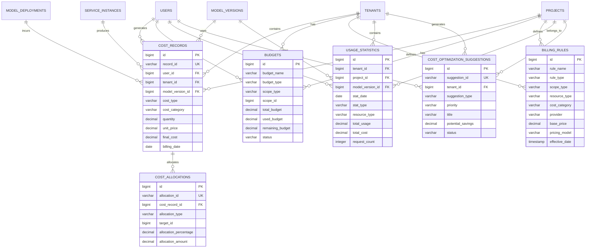

# 成本管理模块数据模型设计

> **模块名称**: cost_management  
> **文档版本**: v1.0  
> **更新日期**: 2025-10-17

## 一、模块概述

### 1.1 功能描述

成本管理模块负责LLMOps平台的成本计量、预算管理、计费规则和成本分析。支持Token级细粒度计量、多维度成本归因、智能降本策略和成本预测。

### 1.2 核心功能

- **成本计量**: Token级细粒度计量、实时成本计算
- **预算管理**: 预算设置、预警机制、自动限流
- **计费规则**: 灵活计费规则、多维度定价
- **成本分析**: 成本归因、趋势分析、优化建议
- **智能降本**: 语义缓存、模型降级、资源优化

## 二、数据表设计

### 2.1 成本记录表 (cost_records)

```sql
CREATE TABLE cost_records (
    id BIGSERIAL PRIMARY KEY,
    uuid UUID NOT NULL DEFAULT gen_random_uuid(),
    record_id VARCHAR(100) NOT NULL UNIQUE,
    user_id BIGINT NOT NULL,
    tenant_id BIGINT NOT NULL,
    project_id BIGINT,
    model_version_id BIGINT NOT NULL,
    deployment_id BIGINT,
    instance_id BIGINT,
    request_id VARCHAR(100),
    cost_type VARCHAR(50) NOT NULL CHECK (cost_type IN ('inference', 'training', 'storage', 'network', 'compute', 'api', 'custom')),
    cost_category VARCHAR(50) NOT NULL CHECK (cost_category IN ('input_tokens', 'output_tokens', 'compute_time', 'storage_space', 'bandwidth', 'api_calls', 'gpu_hours', 'cpu_hours')),
    resource_type VARCHAR(50) NOT NULL CHECK (resource_type IN ('model', 'dataset', 'service', 'storage', 'compute', 'network', 'api')),
    resource_id VARCHAR(100) NOT NULL,
    resource_name VARCHAR(200),
    quantity DECIMAL(15,6) NOT NULL,
    unit VARCHAR(20) NOT NULL CHECK (unit IN ('tokens', 'seconds', 'bytes', 'requests', 'gb_hours', 'api_calls', 'storage_gb', 'bandwidth_gb')),
    unit_price DECIMAL(12,6) NOT NULL,
    total_cost DECIMAL(15,4) NOT NULL,
    currency VARCHAR(10) NOT NULL DEFAULT 'USD',
    pricing_tier VARCHAR(50),
    discount_rate DECIMAL(5,4) DEFAULT 0.0000,
    discount_amount DECIMAL(15,4) DEFAULT 0.0000,
    final_cost DECIMAL(15,4) NOT NULL,
    billing_period VARCHAR(20) NOT NULL CHECK (billing_period IN ('hourly', 'daily', 'monthly', 'yearly', 'on_demand')),
    billing_date DATE NOT NULL,
    billing_hour INTEGER CHECK (billing_hour >= 0 AND billing_hour <= 23),
    region VARCHAR(50),
    zone VARCHAR(50),
    provider VARCHAR(50) NOT NULL CHECK (provider IN ('openai', 'anthropic', 'google', 'azure', 'aws', 'self_hosted', 'custom')),
    metadata JSONB DEFAULT '{}',
    tags TEXT[],
    created_at TIMESTAMP WITH TIME ZONE NOT NULL DEFAULT NOW(),
    updated_at TIMESTAMP WITH TIME ZONE NOT NULL DEFAULT NOW()
);

-- 索引
CREATE INDEX idx_cost_records_record_id ON cost_records(record_id);
CREATE INDEX idx_cost_records_user_id ON cost_records(user_id);
CREATE INDEX idx_cost_records_tenant_id ON cost_records(tenant_id);
CREATE INDEX idx_cost_records_project_id ON cost_records(project_id);
CREATE INDEX idx_cost_records_model_version_id ON cost_records(model_version_id);
CREATE INDEX idx_cost_records_deployment_id ON cost_records(deployment_id);
CREATE INDEX idx_cost_records_instance_id ON cost_records(instance_id);
CREATE INDEX idx_cost_records_request_id ON cost_records(request_id);
CREATE INDEX idx_cost_records_cost_type ON cost_records(cost_type);
CREATE INDEX idx_cost_records_cost_category ON cost_records(cost_category);
CREATE INDEX idx_cost_records_resource_type ON cost_records(resource_type);
CREATE INDEX idx_cost_records_billing_date ON cost_records(billing_date);
CREATE INDEX idx_cost_records_billing_hour ON cost_records(billing_hour);
CREATE INDEX idx_cost_records_provider ON cost_records(provider);
CREATE INDEX idx_cost_records_created_at ON cost_records(created_at);
CREATE INDEX idx_cost_records_final_cost ON cost_records(final_cost);
CREATE INDEX idx_cost_records_tags ON cost_records USING GIN(tags);

-- 外键
ALTER TABLE cost_records ADD CONSTRAINT fk_cost_records_user 
    FOREIGN KEY (user_id) REFERENCES users(id) ON DELETE CASCADE;
ALTER TABLE cost_records ADD CONSTRAINT fk_cost_records_tenant 
    FOREIGN KEY (tenant_id) REFERENCES tenants(id) ON DELETE CASCADE;
ALTER TABLE cost_records ADD CONSTRAINT fk_cost_records_project 
    FOREIGN KEY (project_id) REFERENCES projects(id) ON DELETE SET NULL;
ALTER TABLE cost_records ADD CONSTRAINT fk_cost_records_model_version 
    FOREIGN KEY (model_version_id) REFERENCES model_versions(id) ON DELETE RESTRICT;
ALTER TABLE cost_records ADD CONSTRAINT fk_cost_records_deployment 
    FOREIGN KEY (deployment_id) REFERENCES model_deployments(id) ON DELETE SET NULL;
ALTER TABLE cost_records ADD CONSTRAINT fk_cost_records_instance 
    FOREIGN KEY (instance_id) REFERENCES service_instances(id) ON DELETE SET NULL;

-- 注释
COMMENT ON TABLE cost_records IS '成本记录表';
COMMENT ON COLUMN cost_records.record_id IS '成本记录唯一标识符';
COMMENT ON COLUMN cost_records.cost_type IS '成本类型：inference-推理，training-训练，storage-存储，network-网络，compute-计算，api-API，custom-自定义';
COMMENT ON COLUMN cost_records.cost_category IS '成本分类：input_tokens-输入Token，output_tokens-输出Token，compute_time-计算时间，storage_space-存储空间，bandwidth-带宽，api_calls-API调用，gpu_hours-GPU小时，cpu_hours-CPU小时';
COMMENT ON COLUMN cost_records.resource_type IS '资源类型：model-模型，dataset-数据集，service-服务，storage-存储，compute-计算，network-网络，api-API';
COMMENT ON COLUMN cost_records.resource_id IS '资源ID';
COMMENT ON COLUMN cost_records.resource_name IS '资源名称';
COMMENT ON COLUMN cost_records.quantity IS '使用数量';
COMMENT ON COLUMN cost_records.unit IS '计量单位：tokens-Token，seconds-秒，bytes-字节，requests-请求，gb_hours-GB小时，api_calls-API调用，storage_gb-存储GB，bandwidth_gb-带宽GB';
COMMENT ON COLUMN cost_records.unit_price IS '单价';
COMMENT ON COLUMN cost_records.total_cost IS '总成本';
COMMENT ON COLUMN cost_records.currency IS '货币单位';
COMMENT ON COLUMN cost_records.pricing_tier IS '定价层级';
COMMENT ON COLUMN cost_records.discount_rate IS '折扣率';
COMMENT ON COLUMN cost_records.discount_amount IS '折扣金额';
COMMENT ON COLUMN cost_records.final_cost IS '最终成本';
COMMENT ON COLUMN cost_records.billing_period IS '计费周期：hourly-小时，daily-日，monthly-月，yearly-年，on_demand-按需';
COMMENT ON COLUMN cost_records.billing_date IS '计费日期';
COMMENT ON COLUMN cost_records.billing_hour IS '计费小时，0-23，NULL表示全天';
COMMENT ON COLUMN cost_records.region IS '部署区域';
COMMENT ON COLUMN cost_records.zone IS '部署可用区';
COMMENT ON COLUMN cost_records.provider IS '服务提供商：openai-OpenAI，anthropic-Anthropic，google-Google，azure-Azure，aws-AWS，self_hosted-自托管，custom-自定义';
```

### 2.2 预算表 (budgets)

```sql
CREATE TABLE budgets (
    id BIGSERIAL PRIMARY KEY,
    uuid UUID NOT NULL DEFAULT gen_random_uuid(),
    budget_name VARCHAR(200) NOT NULL,
    budget_type VARCHAR(20) NOT NULL DEFAULT 'monthly' CHECK (budget_type IN ('daily', 'weekly', 'monthly', 'quarterly', 'yearly', 'custom')),
    scope_type VARCHAR(20) NOT NULL CHECK (scope_type IN ('global', 'tenant', 'project', 'user', 'model', 'deployment')),
    scope_id BIGINT,
    total_budget DECIMAL(15,4) NOT NULL,
    used_budget DECIMAL(15,4) NOT NULL DEFAULT 0.0000,
    remaining_budget DECIMAL(15,4) NOT NULL,
    currency VARCHAR(10) NOT NULL DEFAULT 'USD',
    start_date DATE NOT NULL,
    end_date DATE NOT NULL,
    warning_threshold DECIMAL(5,2) NOT NULL DEFAULT 80.00,
    critical_threshold DECIMAL(5,2) NOT NULL DEFAULT 95.00,
    is_hard_limit BOOLEAN NOT NULL DEFAULT TRUE,
    auto_limit BOOLEAN NOT NULL DEFAULT FALSE,
    limit_action VARCHAR(20) NOT NULL DEFAULT 'alert' CHECK (limit_action IN ('alert', 'limit', 'stop', 'redirect')),
    alert_emails TEXT[],
    alert_webhooks TEXT[],
    cost_breakdown JSONB DEFAULT '{}',
    cost_allocations JSONB DEFAULT '{}',
    optimization_suggestions JSONB DEFAULT '{}',
    status VARCHAR(20) NOT NULL DEFAULT 'active' CHECK (status IN ('active', 'inactive', 'exceeded', 'expired', 'cancelled')),
    created_at TIMESTAMP WITH TIME ZONE NOT NULL DEFAULT NOW(),
    updated_at TIMESTAMP WITH TIME ZONE NOT NULL DEFAULT NOW(),
    created_by BIGINT,
    updated_by BIGINT
);

-- 索引
CREATE INDEX idx_budgets_budget_name ON budgets(budget_name);
CREATE INDEX idx_budgets_budget_type ON budgets(budget_type);
CREATE INDEX idx_budgets_scope_type ON budgets(scope_type);
CREATE INDEX idx_budgets_scope_id ON budgets(scope_id);
CREATE INDEX idx_budgets_start_date ON budgets(start_date);
CREATE INDEX idx_budgets_end_date ON budgets(end_date);
CREATE INDEX idx_budgets_status ON budgets(status);
CREATE INDEX idx_budgets_total_budget ON budgets(total_budget);
CREATE INDEX idx_budgets_used_budget ON budgets(used_budget);
CREATE INDEX idx_budgets_remaining_budget ON budgets(remaining_budget);

-- 注释
COMMENT ON TABLE budgets IS '预算表';
COMMENT ON COLUMN budgets.budget_type IS '预算类型：daily-日预算，weekly-周预算，monthly-月预算，quarterly-季度预算，yearly-年预算，custom-自定义';
COMMENT ON COLUMN budgets.scope_type IS '预算范围类型：global-全局，tenant-租户，project-项目，user-用户，model-模型，deployment-部署';
COMMENT ON COLUMN budgets.scope_id IS '预算范围ID，对应具体的作用域对象ID';
COMMENT ON COLUMN budgets.total_budget IS '总预算';
COMMENT ON COLUMN budgets.used_budget IS '已使用预算';
COMMENT ON COLUMN budgets.remaining_budget IS '剩余预算';
COMMENT ON COLUMN budgets.warning_threshold IS '警告阈值，百分比';
COMMENT ON COLUMN budgets.critical_threshold IS '严重阈值，百分比';
COMMENT ON COLUMN budgets.is_hard_limit IS '是否为硬限制';
COMMENT ON COLUMN budgets.auto_limit IS '是否自动限流';
COMMENT ON COLUMN budgets.limit_action IS '超限动作：alert-告警，limit-限流，stop-停止，redirect-重定向';
COMMENT ON COLUMN budgets.alert_emails IS '告警邮箱列表';
COMMENT ON COLUMN budgets.alert_webhooks IS '告警Webhook列表';
COMMENT ON COLUMN budgets.cost_breakdown IS '成本分解，JSON格式';
COMMENT ON COLUMN budgets.cost_allocations IS '成本分配，JSON格式';
COMMENT ON COLUMN budgets.optimization_suggestions IS '优化建议，JSON格式';
```

### 2.3 计费规则表 (billing_rules)

```sql
CREATE TABLE billing_rules (
    id BIGSERIAL PRIMARY KEY,
    uuid UUID NOT NULL DEFAULT gen_random_uuid(),
    rule_name VARCHAR(200) NOT NULL,
    rule_type VARCHAR(50) NOT NULL CHECK (rule_type IN ('pricing', 'discount', 'tier', 'promotion', 'penalty', 'custom')),
    scope_type VARCHAR(20) NOT NULL CHECK (scope_type IN ('global', 'tenant', 'project', 'user', 'model', 'provider')),
    scope_id BIGINT,
    resource_type VARCHAR(50) NOT NULL CHECK (resource_type IN ('model', 'dataset', 'service', 'storage', 'compute', 'network', 'api')),
    cost_category VARCHAR(50) NOT NULL CHECK (cost_category IN ('input_tokens', 'output_tokens', 'compute_time', 'storage_space', 'bandwidth', 'api_calls', 'gpu_hours', 'cpu_hours')),
    provider VARCHAR(50) NOT NULL CHECK (provider IN ('openai', 'anthropic', 'google', 'azure', 'aws', 'self_hosted', 'custom')),
    model_family VARCHAR(100),
    model_size VARCHAR(50),
    pricing_model VARCHAR(20) NOT NULL CHECK (pricing_model IN ('per_token', 'per_request', 'per_hour', 'per_gb', 'per_api_call', 'tiered', 'volume')),
    base_price DECIMAL(12,6) NOT NULL,
    currency VARCHAR(10) NOT NULL DEFAULT 'USD',
    unit VARCHAR(20) NOT NULL CHECK (unit IN ('tokens', 'seconds', 'bytes', 'requests', 'gb_hours', 'api_calls', 'storage_gb', 'bandwidth_gb')),
    tier_rules JSONB,
    volume_discounts JSONB,
    time_based_pricing JSONB,
    region_pricing JSONB,
    conditions JSONB,
    effective_date TIMESTAMP WITH TIME ZONE NOT NULL,
    expiry_date TIMESTAMP WITH TIME ZONE,
    priority INTEGER NOT NULL DEFAULT 0,
    is_active BOOLEAN NOT NULL DEFAULT TRUE,
    metadata JSONB DEFAULT '{}',
    created_at TIMESTAMP WITH TIME ZONE NOT NULL DEFAULT NOW(),
    updated_at TIMESTAMP WITH TIME ZONE NOT NULL DEFAULT NOW(),
    created_by BIGINT,
    updated_by BIGINT
);

-- 索引
CREATE INDEX idx_billing_rules_rule_name ON billing_rules(rule_name);
CREATE INDEX idx_billing_rules_rule_type ON billing_rules(rule_type);
CREATE INDEX idx_billing_rules_scope_type ON billing_rules(scope_type);
CREATE INDEX idx_billing_rules_scope_id ON billing_rules(scope_id);
CREATE INDEX idx_billing_rules_resource_type ON billing_rules(resource_type);
CREATE INDEX idx_billing_rules_cost_category ON billing_rules(cost_category);
CREATE INDEX idx_billing_rules_provider ON billing_rules(provider);
CREATE INDEX idx_billing_rules_model_family ON billing_rules(model_family);
CREATE INDEX idx_billing_rules_pricing_model ON billing_rules(pricing_model);
CREATE INDEX idx_billing_rules_effective_date ON billing_rules(effective_date);
CREATE INDEX idx_billing_rules_expiry_date ON billing_rules(expiry_date);
CREATE INDEX idx_billing_rules_priority ON billing_rules(priority);
CREATE INDEX idx_billing_rules_is_active ON billing_rules(is_active);

-- 注释
COMMENT ON TABLE billing_rules IS '计费规则表';
COMMENT ON COLUMN billing_rules.rule_type IS '规则类型：pricing-定价，discount-折扣，tier-分层，promotion-促销，penalty-惩罚，custom-自定义';
COMMENT ON COLUMN billing_rules.scope_type IS '规则范围类型：global-全局，tenant-租户，project-项目，user-用户，model-模型，provider-提供商';
COMMENT ON COLUMN billing_rules.scope_id IS '规则范围ID';
COMMENT ON COLUMN billing_rules.resource_type IS '资源类型：model-模型，dataset-数据集，service-服务，storage-存储，compute-计算，network-网络，api-API';
COMMENT ON COLUMN billing_rules.cost_category IS '成本分类：input_tokens-输入Token，output_tokens-输出Token，compute_time-计算时间，storage_space-存储空间，bandwidth-带宽，api_calls-API调用，gpu_hours-GPU小时，cpu_hours-CPU小时';
COMMENT ON COLUMN billing_rules.provider IS '服务提供商：openai-OpenAI，anthropic-Anthropic，google-Google，azure-Azure，aws-AWS，self_hosted-自托管，custom-自定义';
COMMENT ON COLUMN billing_rules.model_family IS '模型系列，如GPT-4, Claude-3等';
COMMENT ON COLUMN billing_rules.model_size IS '模型大小，如small, medium, large, xlarge';
COMMENT ON COLUMN billing_rules.pricing_model IS '定价模型：per_token-按Token，per_request-按请求，per_hour-按小时，per_gb-按GB，per_api_call-按API调用，tiered-分层，volume-批量';
COMMENT ON COLUMN billing_rules.base_price IS '基础价格';
COMMENT ON COLUMN billing_rules.unit IS '计量单位：tokens-Token，seconds-秒，bytes-字节，requests-请求，gb_hours-GB小时，api_calls-API调用，storage_gb-存储GB，bandwidth_gb-带宽GB';
COMMENT ON COLUMN billing_rules.tier_rules IS '分层规则，JSON格式';
COMMENT ON COLUMN billing_rules.volume_discounts IS '批量折扣，JSON格式';
COMMENT ON COLUMN billing_rules.time_based_pricing IS '基于时间的定价，JSON格式';
COMMENT ON COLUMN billing_rules.region_pricing IS '区域定价，JSON格式';
COMMENT ON COLUMN billing_rules.conditions IS '应用条件，JSON格式';
COMMENT ON COLUMN billing_rules.effective_date IS '生效日期';
COMMENT ON COLUMN billing_rules.expiry_date IS '过期日期';
COMMENT ON COLUMN billing_rules.priority IS '规则优先级，数字越大优先级越高';
```

### 2.4 成本分摊表 (cost_allocations)

```sql
CREATE TABLE cost_allocations (
    id BIGSERIAL PRIMARY KEY,
    uuid UUID NOT NULL DEFAULT gen_random_uuid(),
    allocation_id VARCHAR(100) NOT NULL UNIQUE,
    cost_record_id BIGINT NOT NULL,
    allocation_type VARCHAR(20) NOT NULL CHECK (allocation_type IN ('user', 'project', 'department', 'cost_center', 'business_unit', 'custom')),
    allocation_target VARCHAR(50) NOT NULL CHECK (allocation_target IN ('user_id', 'project_id', 'department_id', 'cost_center_id', 'business_unit_id', 'custom_id')),
    target_id BIGINT NOT NULL,
    target_name VARCHAR(200),
    allocation_percentage DECIMAL(5,2) NOT NULL CHECK (allocation_percentage >= 0 AND allocation_percentage <= 100),
    allocation_amount DECIMAL(15,4) NOT NULL,
    allocation_method VARCHAR(20) NOT NULL CHECK (allocation_method IN ('equal', 'proportional', 'usage_based', 'fixed', 'custom')),
    allocation_rules JSONB,
    allocation_metadata JSONB DEFAULT '{}',
    created_at TIMESTAMP WITH TIME ZONE NOT NULL DEFAULT NOW(),
    updated_at TIMESTAMP WITH TIME ZONE NOT NULL DEFAULT NOW(),
    created_by BIGINT,
    updated_by BIGINT
);

-- 索引
CREATE INDEX idx_cost_allocations_allocation_id ON cost_allocations(allocation_id);
CREATE INDEX idx_cost_allocations_cost_record_id ON cost_allocations(cost_record_id);
CREATE INDEX idx_cost_allocations_allocation_type ON cost_allocations(allocation_type);
CREATE INDEX idx_cost_allocations_allocation_target ON cost_allocations(allocation_target);
CREATE INDEX idx_cost_allocations_target_id ON cost_allocations(target_id);
CREATE INDEX idx_cost_allocations_allocation_percentage ON cost_allocations(allocation_percentage);
CREATE INDEX idx_cost_allocations_allocation_amount ON cost_allocations(allocation_amount);
CREATE INDEX idx_cost_allocations_allocation_method ON cost_allocations(allocation_method);

-- 外键
ALTER TABLE cost_allocations ADD CONSTRAINT fk_cost_allocations_cost_record 
    FOREIGN KEY (cost_record_id) REFERENCES cost_records(id) ON DELETE CASCADE;

-- 注释
COMMENT ON TABLE cost_allocations IS '成本分摊表';
COMMENT ON COLUMN cost_allocations.allocation_id IS '分摊记录唯一标识符';
COMMENT ON COLUMN cost_allocations.allocation_type IS '分摊类型：user-用户，project-项目，department-部门，cost_center-成本中心，business_unit-业务单元，custom-自定义';
COMMENT ON COLUMN cost_allocations.allocation_target IS '分摊目标：user_id-用户ID，project_id-项目ID，department_id-部门ID，cost_center_id-成本中心ID，business_unit_id-业务单元ID，custom_id-自定义ID';
COMMENT ON COLUMN cost_allocations.target_id IS '目标ID';
COMMENT ON COLUMN cost_allocations.target_name IS '目标名称';
COMMENT ON COLUMN cost_allocations.allocation_percentage IS '分摊百分比';
COMMENT ON COLUMN cost_allocations.allocation_amount IS '分摊金额';
COMMENT ON COLUMN cost_allocations.allocation_method IS '分摊方法：equal-平均分摊，proportional-按比例，usage_based-按使用量，fixed-固定金额，custom-自定义';
COMMENT ON COLUMN cost_allocations.allocation_rules IS '分摊规则，JSON格式';
COMMENT ON COLUMN cost_allocations.allocation_metadata IS '分摊元数据，JSON格式';
```

### 2.5 使用统计表 (usage_statistics)

```sql
CREATE TABLE usage_statistics (
    id BIGSERIAL PRIMARY KEY,
    uuid UUID NOT NULL DEFAULT gen_random_uuid(),
    user_id BIGINT,
    tenant_id BIGINT NOT NULL,
    project_id BIGINT,
    model_version_id BIGINT,
    deployment_id BIGINT,
    instance_id BIGINT,
    stat_date DATE NOT NULL,
    stat_hour INTEGER CHECK (stat_hour >= 0 AND stat_hour <= 23),
    stat_type VARCHAR(50) NOT NULL CHECK (stat_type IN ('hourly', 'daily', 'weekly', 'monthly', 'yearly')),
    resource_type VARCHAR(50) NOT NULL CHECK (resource_type IN ('model', 'dataset', 'service', 'storage', 'compute', 'network', 'api')),
    cost_category VARCHAR(50) NOT NULL CHECK (cost_category IN ('input_tokens', 'output_tokens', 'compute_time', 'storage_space', 'bandwidth', 'api_calls', 'gpu_hours', 'cpu_hours')),
    total_usage DECIMAL(15,6) NOT NULL DEFAULT 0.000000,
    total_cost DECIMAL(15,4) NOT NULL DEFAULT 0.0000,
    request_count INTEGER NOT NULL DEFAULT 0,
    success_count INTEGER NOT NULL DEFAULT 0,
    error_count INTEGER NOT NULL DEFAULT 0,
    avg_latency_ms DECIMAL(10,2),
    p50_latency_ms DECIMAL(10,2),
    p90_latency_ms DECIMAL(10,2),
    p95_latency_ms DECIMAL(10,2),
    p99_latency_ms DECIMAL(10,2),
    unique_users INTEGER NOT NULL DEFAULT 0,
    unique_sessions INTEGER NOT NULL DEFAULT 0,
    peak_usage DECIMAL(15,6),
    peak_cost DECIMAL(15,4),
    cost_efficiency DECIMAL(8,4),
    usage_trend JSONB,
    cost_trend JSONB,
    metadata JSONB DEFAULT '{}',
    created_at TIMESTAMP WITH TIME ZONE NOT NULL DEFAULT NOW(),
    updated_at TIMESTAMP WITH TIME ZONE NOT NULL DEFAULT NOW(),
    UNIQUE(tenant_id, project_id, model_version_id, deployment_id, instance_id, stat_date, stat_hour, stat_type, resource_type, cost_category)
);

-- 索引
CREATE INDEX idx_usage_statistics_user_id ON usage_statistics(user_id);
CREATE INDEX idx_usage_statistics_tenant_id ON usage_statistics(tenant_id);
CREATE INDEX idx_usage_statistics_project_id ON usage_statistics(project_id);
CREATE INDEX idx_usage_statistics_model_version_id ON usage_statistics(model_version_id);
CREATE INDEX idx_usage_statistics_deployment_id ON usage_statistics(deployment_id);
CREATE INDEX idx_usage_statistics_instance_id ON usage_statistics(instance_id);
CREATE INDEX idx_usage_statistics_stat_date ON usage_statistics(stat_date);
CREATE INDEX idx_usage_statistics_stat_hour ON usage_statistics(stat_hour);
CREATE INDEX idx_usage_statistics_stat_type ON usage_statistics(stat_type);
CREATE INDEX idx_usage_statistics_resource_type ON usage_statistics(resource_type);
CREATE INDEX idx_usage_statistics_cost_category ON usage_statistics(cost_category);
CREATE INDEX idx_usage_statistics_total_usage ON usage_statistics(total_usage);
CREATE INDEX idx_usage_statistics_total_cost ON usage_statistics(total_cost);
CREATE INDEX idx_usage_statistics_request_count ON usage_statistics(request_count);

-- 外键
ALTER TABLE usage_statistics ADD CONSTRAINT fk_usage_statistics_user 
    FOREIGN KEY (user_id) REFERENCES users(id) ON DELETE SET NULL;
ALTER TABLE usage_statistics ADD CONSTRAINT fk_usage_statistics_tenant 
    FOREIGN KEY (tenant_id) REFERENCES tenants(id) ON DELETE CASCADE;
ALTER TABLE usage_statistics ADD CONSTRAINT fk_usage_statistics_project 
    FOREIGN KEY (project_id) REFERENCES projects(id) ON DELETE SET NULL;
ALTER TABLE usage_statistics ADD CONSTRAINT fk_usage_statistics_model_version 
    FOREIGN KEY (model_version_id) REFERENCES model_versions(id) ON DELETE SET NULL;
ALTER TABLE usage_statistics ADD CONSTRAINT fk_usage_statistics_deployment 
    FOREIGN KEY (deployment_id) REFERENCES model_deployments(id) ON DELETE SET NULL;
ALTER TABLE usage_statistics ADD CONSTRAINT fk_usage_statistics_instance 
    FOREIGN KEY (instance_id) REFERENCES service_instances(id) ON DELETE SET NULL;

-- 注释
COMMENT ON TABLE usage_statistics IS '使用统计表';
COMMENT ON COLUMN usage_statistics.stat_date IS '统计日期';
COMMENT ON COLUMN usage_statistics.stat_hour IS '统计小时，0-23，NULL表示全天统计';
COMMENT ON COLUMN usage_statistics.stat_type IS '统计类型：hourly-小时，daily-日，weekly-周，monthly-月，yearly-年';
COMMENT ON COLUMN usage_statistics.resource_type IS '资源类型：model-模型，dataset-数据集，service-服务，storage-存储，compute-计算，network-网络，api-API';
COMMENT ON COLUMN usage_statistics.cost_category IS '成本分类：input_tokens-输入Token，output_tokens-输出Token，compute_time-计算时间，storage_space-存储空间，bandwidth-带宽，api_calls-API调用，gpu_hours-GPU小时，cpu_hours-CPU小时';
COMMENT ON COLUMN usage_statistics.total_usage IS '总使用量';
COMMENT ON COLUMN usage_statistics.total_cost IS '总成本';
COMMENT ON COLUMN usage_statistics.request_count IS '请求总数';
COMMENT ON COLUMN usage_statistics.success_count IS '成功请求数';
COMMENT ON COLUMN usage_statistics.error_count IS '错误请求数';
COMMENT ON COLUMN usage_statistics.avg_latency_ms IS '平均延迟时间，单位毫秒';
COMMENT ON COLUMN usage_statistics.p50_latency_ms IS 'P50延迟时间，单位毫秒';
COMMENT ON COLUMN usage_statistics.p90_latency_ms IS 'P90延迟时间，单位毫秒';
COMMENT ON COLUMN usage_statistics.p95_latency_ms IS 'P95延迟时间，单位毫秒';
COMMENT ON COLUMN usage_statistics.p99_latency_ms IS 'P99延迟时间，单位毫秒';
COMMENT ON COLUMN usage_statistics.unique_users IS '唯一用户数';
COMMENT ON COLUMN usage_statistics.unique_sessions IS '唯一会话数';
COMMENT ON COLUMN usage_statistics.peak_usage IS '峰值使用量';
COMMENT ON COLUMN usage_statistics.peak_cost IS '峰值成本';
COMMENT ON COLUMN usage_statistics.cost_efficiency IS '成本效率';
COMMENT ON COLUMN usage_statistics.usage_trend IS '使用趋势，JSON格式';
COMMENT ON COLUMN usage_statistics.cost_trend IS '成本趋势，JSON格式';
```

### 2.6 成本优化建议表 (cost_optimization_suggestions)

```sql
CREATE TABLE cost_optimization_suggestions (
    id BIGSERIAL PRIMARY KEY,
    uuid UUID NOT NULL DEFAULT gen_random_uuid(),
    suggestion_id VARCHAR(100) NOT NULL UNIQUE,
    user_id BIGINT,
    tenant_id BIGINT NOT NULL,
    project_id BIGINT,
    suggestion_type VARCHAR(50) NOT NULL CHECK (suggestion_type IN ('cache_optimization', 'model_downgrade', 'resource_scaling', 'usage_pattern', 'pricing_optimization', 'architecture_optimization')),
    priority VARCHAR(20) NOT NULL DEFAULT 'medium' CHECK (priority IN ('low', 'medium', 'high', 'critical')),
    title VARCHAR(200) NOT NULL,
    description TEXT NOT NULL,
    current_cost DECIMAL(15,4),
    potential_savings DECIMAL(15,4),
    savings_percentage DECIMAL(5,2),
    implementation_effort VARCHAR(20) CHECK (implementation_effort IN ('low', 'medium', 'high')),
    implementation_time VARCHAR(50),
    risk_level VARCHAR(20) CHECK (risk_level IN ('low', 'medium', 'high')),
    affected_resources JSONB,
    recommended_actions JSONB,
    prerequisites JSONB,
    expected_impact JSONB,
    metrics_to_monitor JSONB,
    status VARCHAR(20) NOT NULL DEFAULT 'pending' CHECK (status IN ('pending', 'approved', 'implemented', 'rejected', 'expired')),
    implementation_notes TEXT,
    implemented_by BIGINT,
    implemented_at TIMESTAMP WITH TIME ZONE,
    actual_savings DECIMAL(15,4),
    actual_impact JSONB,
    feedback TEXT,
    created_at TIMESTAMP WITH TIME ZONE NOT NULL DEFAULT NOW(),
    updated_at TIMESTAMP WITH TIME ZONE NOT NULL DEFAULT NOW(),
    created_by BIGINT,
    updated_by BIGINT
);

-- 索引
CREATE INDEX idx_cost_optimization_suggestions_suggestion_id ON cost_optimization_suggestions(suggestion_id);
CREATE INDEX idx_cost_optimization_suggestions_user_id ON cost_optimization_suggestions(user_id);
CREATE INDEX idx_cost_optimization_suggestions_tenant_id ON cost_optimization_suggestions(tenant_id);
CREATE INDEX idx_cost_optimization_suggestions_project_id ON cost_optimization_suggestions(project_id);
CREATE INDEX idx_cost_optimization_suggestions_suggestion_type ON cost_optimization_suggestions(suggestion_type);
CREATE INDEX idx_cost_optimization_suggestions_priority ON cost_optimization_suggestions(priority);
CREATE INDEX idx_cost_optimization_suggestions_status ON cost_optimization_suggestions(status);
CREATE INDEX idx_cost_optimization_suggestions_potential_savings ON cost_optimization_suggestions(potential_savings);
CREATE INDEX idx_cost_optimization_suggestions_created_at ON cost_optimization_suggestions(created_at);

-- 外键
ALTER TABLE cost_optimization_suggestions ADD CONSTRAINT fk_cost_optimization_suggestions_user 
    FOREIGN KEY (user_id) REFERENCES users(id) ON DELETE SET NULL;
ALTER TABLE cost_optimization_suggestions ADD CONSTRAINT fk_cost_optimization_suggestions_tenant 
    FOREIGN KEY (tenant_id) REFERENCES tenants(id) ON DELETE CASCADE;
ALTER TABLE cost_optimization_suggestions ADD CONSTRAINT fk_cost_optimization_suggestions_project 
    FOREIGN KEY (project_id) REFERENCES projects(id) ON DELETE SET NULL;
ALTER TABLE cost_optimization_suggestions ADD CONSTRAINT fk_cost_optimization_suggestions_implemented_by 
    FOREIGN KEY (implemented_by) REFERENCES users(id) ON DELETE SET NULL;

-- 注释
COMMENT ON TABLE cost_optimization_suggestions IS '成本优化建议表';
COMMENT ON COLUMN cost_optimization_suggestions.suggestion_id IS '建议唯一标识符';
COMMENT ON COLUMN cost_optimization_suggestions.suggestion_type IS '建议类型：cache_optimization-缓存优化，model_downgrade-模型降级，resource_scaling-资源扩缩容，usage_pattern-使用模式，pricing_optimization-定价优化，architecture_optimization-架构优化';
COMMENT ON COLUMN cost_optimization_suggestions.priority IS '优先级：low-低，medium-中，high-高，critical-严重';
COMMENT ON COLUMN cost_optimization_suggestions.title IS '建议标题';
COMMENT ON COLUMN cost_optimization_suggestions.description IS '建议描述';
COMMENT ON COLUMN cost_optimization_suggestions.current_cost IS '当前成本';
COMMENT ON COLUMN cost_optimization_suggestions.potential_savings IS '潜在节省';
COMMENT ON COLUMN cost_optimization_suggestions.savings_percentage IS '节省百分比';
COMMENT ON COLUMN cost_optimization_suggestions.implementation_effort IS '实施难度：low-低，medium-中，high-高';
COMMENT ON COLUMN cost_optimization_suggestions.implementation_time IS '实施时间';
COMMENT ON COLUMN cost_optimization_suggestions.risk_level IS '风险级别：low-低，medium-中，high-高';
COMMENT ON COLUMN cost_optimization_suggestions.affected_resources IS '受影响的资源，JSON格式';
COMMENT ON COLUMN cost_optimization_suggestions.recommended_actions IS '推荐操作，JSON格式';
COMMENT ON COLUMN cost_optimization_suggestions.prerequisites IS '前置条件，JSON格式';
COMMENT ON COLUMN cost_optimization_suggestions.expected_impact IS '预期影响，JSON格式';
COMMENT ON COLUMN cost_optimization_suggestions.metrics_to_monitor IS '需要监控的指标，JSON格式';
COMMENT ON COLUMN cost_optimization_suggestions.status IS '建议状态：pending-待处理，approved-已批准，implemented-已实施，rejected-已拒绝，expired-已过期';
COMMENT ON COLUMN cost_optimization_suggestions.implementation_notes IS '实施说明';
COMMENT ON COLUMN cost_optimization_suggestions.implemented_by IS '实施人ID';
COMMENT ON COLUMN cost_optimization_suggestions.implemented_at IS '实施时间';
COMMENT ON COLUMN cost_optimization_suggestions.actual_savings IS '实际节省';
COMMENT ON COLUMN cost_optimization_suggestions.actual_impact IS '实际影响，JSON格式';
COMMENT ON COLUMN cost_optimization_suggestions.feedback IS '反馈信息';
```

## 三、数据关系图



## 四、业务规则

### 4.1 成本计量规则

```yaml
计量粒度:
  - Token级计量：输入Token和输出Token分别计费
  - 时间级计量：计算时间、存储时间
  - 资源级计量：存储空间、网络带宽
  - 请求级计量：API调用次数

计量单位:
  - tokens: Token数量
  - seconds: 秒数
  - bytes: 字节数
  - requests: 请求数
  - gb_hours: GB小时
  - api_calls: API调用数
  - storage_gb: 存储GB
  - bandwidth_gb: 带宽GB

成本类型:
  - inference: 推理成本
  - training: 训练成本
  - storage: 存储成本
  - network: 网络成本
  - compute: 计算成本
  - api: API成本
  - custom: 自定义成本

成本分类:
  - input_tokens: 输入Token成本
  - output_tokens: 输出Token成本
  - compute_time: 计算时间成本
  - storage_space: 存储空间成本
  - bandwidth: 带宽成本
  - api_calls: API调用成本
  - gpu_hours: GPU小时成本
  - cpu_hours: CPU小时成本
```

### 4.2 预算管理规则

```yaml
预算类型:
  - daily: 日预算
  - weekly: 周预算
  - monthly: 月预算
  - quarterly: 季度预算
  - yearly: 年预算
  - custom: 自定义预算

预算范围:
  - global: 全局预算
  - tenant: 租户预算
  - project: 项目预算
  - user: 用户预算
  - model: 模型预算
  - deployment: 部署预算

预算控制:
  - 硬限制：达到预算后拒绝服务
  - 软限制：达到预算后发送告警
  - 警告阈值：默认80%
  - 严重阈值：默认95%

超限动作:
  - alert: 发送告警
  - limit: 限制请求
  - stop: 停止服务
  - redirect: 重定向到其他服务
```

### 4.3 计费规则规则

```yaml
规则类型:
  - pricing: 定价规则
  - discount: 折扣规则
  - tier: 分层规则
  - promotion: 促销规则
  - penalty: 惩罚规则
  - custom: 自定义规则

定价模型:
  - per_token: 按Token计费
  - per_request: 按请求计费
  - per_hour: 按小时计费
  - per_gb: 按GB计费
  - per_api_call: 按API调用计费
  - tiered: 分层计费
  - volume: 批量计费

规则优先级:
  - 数字越大优先级越高
  - 相同优先级时后创建的覆盖先创建的
  - 用户规则 > 项目规则 > 租户规则 > 全局规则

规则生效:
  - 生效日期：规则开始生效的时间
  - 过期日期：规则失效的时间
  - 条件匹配：满足条件时应用规则
  - 自动应用：符合条件的请求自动应用规则
```

### 4.4 成本分摊规则

```yaml
分摊类型:
  - user: 按用户分摊
  - project: 按项目分摊
  - department: 按部门分摊
  - cost_center: 按成本中心分摊
  - business_unit: 按业务单元分摊
  - custom: 自定义分摊

分摊方法:
  - equal: 平均分摊
  - proportional: 按比例分摊
  - usage_based: 按使用量分摊
  - fixed: 固定金额分摊
  - custom: 自定义分摊

分摊规则:
  - 分摊百分比总和必须等于100%
  - 分摊金额总和必须等于原始成本
  - 支持多维度分摊
  - 支持分摊规则配置
```

## 五、性能优化

### 5.1 索引优化

```sql
-- 复合索引
CREATE INDEX idx_cost_records_tenant_date ON cost_records(tenant_id, billing_date);
CREATE INDEX idx_cost_records_user_date ON cost_records(user_id, billing_date);
CREATE INDEX idx_cost_records_project_date ON cost_records(project_id, billing_date);
CREATE INDEX idx_cost_records_model_date ON cost_records(model_version_id, billing_date);
CREATE INDEX idx_cost_records_type_category ON cost_records(cost_type, cost_category);
CREATE INDEX idx_cost_records_provider_date ON cost_records(provider, billing_date);
CREATE INDEX idx_budgets_scope_date ON budgets(scope_type, scope_id, start_date, end_date);
CREATE INDEX idx_billing_rules_scope_resource ON billing_rules(scope_type, scope_id, resource_type, cost_category);
CREATE INDEX idx_usage_statistics_tenant_date ON usage_statistics(tenant_id, stat_date);
CREATE INDEX idx_usage_statistics_project_date ON usage_statistics(project_id, stat_date);

-- 部分索引
CREATE INDEX idx_cost_records_recent ON cost_records(id) WHERE billing_date >= CURRENT_DATE - INTERVAL '30 days';
CREATE INDEX idx_budgets_active ON budgets(id) WHERE status = 'active';
CREATE INDEX idx_billing_rules_active ON billing_rules(id) WHERE is_active = TRUE;
CREATE INDEX idx_usage_statistics_recent ON usage_statistics(id) WHERE stat_date >= CURRENT_DATE - INTERVAL '90 days';
CREATE INDEX idx_cost_optimization_suggestions_pending ON cost_optimization_suggestions(id) WHERE status = 'pending';

-- 表达式索引
CREATE INDEX idx_cost_records_lower_record_id ON cost_records(lower(record_id));
CREATE INDEX idx_budgets_lower_budget_name ON budgets(lower(budget_name));
CREATE INDEX idx_billing_rules_lower_rule_name ON billing_rules(lower(rule_name));
```

### 5.2 查询优化

```sql
-- 成本统计查询优化
CREATE VIEW cost_summary AS
SELECT 
    DATE_TRUNC('day', billing_date) as stat_date,
    tenant_id,
    project_id,
    model_version_id,
    cost_type,
    cost_category,
    provider,
    COUNT(*) as record_count,
    SUM(quantity) as total_quantity,
    SUM(total_cost) as total_cost,
    SUM(final_cost) as final_cost,
    AVG(unit_price) as avg_unit_price,
    MIN(unit_price) as min_unit_price,
    MAX(unit_price) as max_unit_price
FROM cost_records
WHERE billing_date >= CURRENT_DATE - INTERVAL '30 days'
GROUP BY DATE_TRUNC('day', billing_date), tenant_id, project_id, model_version_id, cost_type, cost_category, provider;

-- 预算使用情况查询优化
CREATE VIEW budget_usage AS
SELECT 
    b.id as budget_id,
    b.budget_name,
    b.budget_type,
    b.scope_type,
    b.scope_id,
    b.total_budget,
    b.used_budget,
    b.remaining_budget,
    ROUND((b.used_budget / b.total_budget * 100), 2) as usage_percentage,
    CASE 
        WHEN b.used_budget >= b.total_budget THEN 'exceeded'
        WHEN b.used_budget >= (b.total_budget * b.critical_threshold / 100) THEN 'critical'
        WHEN b.used_budget >= (b.total_budget * b.warning_threshold / 100) THEN 'warning'
        ELSE 'normal'
    END as budget_status,
    b.warning_threshold,
    b.critical_threshold,
    b.is_hard_limit,
    b.auto_limit
FROM budgets b
WHERE b.status = 'active';

-- 计费规则匹配查询优化
CREATE VIEW billing_rule_matches AS
SELECT 
    br.id as rule_id,
    br.rule_name,
    br.rule_type,
    br.scope_type,
    br.scope_id,
    br.resource_type,
    br.cost_category,
    br.provider,
    br.model_family,
    br.pricing_model,
    br.base_price,
    br.unit,
    br.priority,
    br.effective_date,
    br.expiry_date,
    br.is_active
FROM billing_rules br
WHERE br.is_active = TRUE
  AND br.effective_date <= NOW()
  AND (br.expiry_date IS NULL OR br.expiry_date > NOW())
ORDER BY br.priority DESC, br.created_at DESC;
```

### 5.3 缓存策略

```yaml
成本记录缓存:
  - 缓存键: cost_records:{record_id}
  - 缓存时间: 1小时
  - 更新策略: 成本记录创建时主动缓存

预算信息缓存:
  - 缓存键: budget:{budget_id}
  - 缓存时间: 30分钟
  - 更新策略: 预算使用量更新时主动失效

计费规则缓存:
  - 缓存键: billing_rules:{scope_type}:{scope_id}:{resource_type}:{cost_category}
  - 缓存时间: 2小时
  - 更新策略: 计费规则变更时主动失效

使用统计缓存:
  - 缓存键: usage_stats:{tenant_id}:{stat_date}:{stat_type}
  - 缓存时间: 1小时
  - 更新策略: 统计数据更新时主动失效

成本优化建议缓存:
  - 缓存键: cost_suggestions:{tenant_id}:{project_id}
  - 缓存时间: 4小时
  - 更新策略: 新建议生成时主动失效
```

## 六、安全设计

### 6.1 成本数据安全

```sql
-- 成本数据访问权限检查函数
CREATE OR REPLACE FUNCTION check_cost_access_permission(
    p_user_id BIGINT,
    p_tenant_id BIGINT,
    p_project_id BIGINT,
    p_cost_record_id BIGINT
) RETURNS BOOLEAN AS $$
DECLARE
    cost_info RECORD;
    user_role VARCHAR;
BEGIN
    -- 获取成本记录信息
    SELECT cr.*, p.owner_id, p.tenant_id as project_tenant_id
    INTO cost_info
    FROM cost_records cr
    LEFT JOIN projects p ON cr.project_id = p.id
    WHERE cr.id = p_cost_record_id;
    
    IF cost_info IS NULL THEN
        RETURN FALSE;
    END IF;
    
    -- 检查租户权限
    IF cost_info.tenant_id != p_tenant_id THEN
        RETURN FALSE;
    END IF;
    
    -- 检查用户权限
    IF cost_info.user_id = p_user_id THEN
        RETURN TRUE; -- 用户自己的成本记录
    END IF;
    
    -- 检查项目权限
    IF cost_info.project_id IS NOT NULL THEN
        SELECT pm.role INTO user_role
        FROM project_members pm
        WHERE pm.project_id = cost_info.project_id 
          AND pm.user_id = p_user_id 
          AND pm.status = 'active';
        
        IF user_role IS NOT NULL THEN
            RETURN user_role IN ('owner', 'admin', 'developer', 'tester', 'viewer');
        END IF;
    END IF;
    
    RETURN FALSE;
END;
$$ LANGUAGE plpgsql;
```

### 6.2 预算安全控制

```sql
-- 预算操作权限检查函数
CREATE OR REPLACE FUNCTION check_budget_permission(
    p_user_id BIGINT,
    p_budget_id BIGINT,
    p_action VARCHAR
) RETURNS BOOLEAN AS $$
DECLARE
    budget_info RECORD;
    user_role VARCHAR;
    required_role VARCHAR;
BEGIN
    -- 获取预算信息
    SELECT b.*, p.owner_id, p.tenant_id as project_tenant_id
    INTO budget_info
    FROM budgets b
    LEFT JOIN projects p ON b.scope_type = 'project' AND b.scope_id = p.id
    WHERE b.id = p_budget_id;
    
    IF budget_info IS NULL THEN
        RETURN FALSE;
    END IF;
    
    -- 根据作用域类型检查权限
    IF budget_info.scope_type = 'global' THEN
        -- 全局预算需要超级管理员权限
        SELECT ur.role INTO user_role
        FROM user_roles ur
        JOIN roles r ON ur.role_id = r.id
        WHERE ur.user_id = p_user_id 
          AND r.code = 'super_admin'
          AND ur.status = 'active';
        
        RETURN user_role IS NOT NULL;
        
    ELSIF budget_info.scope_type = 'tenant' THEN
        -- 租户预算需要租户管理员权限
        SELECT ur.role INTO user_role
        FROM user_roles ur
        JOIN roles r ON ur.role_id = r.id
        WHERE ur.user_id = p_user_id 
          AND r.code IN ('super_admin', 'platform_admin')
          AND ur.status = 'active';
        
        RETURN user_role IS NOT NULL;
        
    ELSIF budget_info.scope_type = 'project' THEN
        -- 项目预算需要项目管理员权限
        SELECT pm.role INTO user_role
        FROM project_members pm
        WHERE pm.project_id = budget_info.scope_id 
          AND pm.user_id = p_user_id 
          AND pm.status = 'active';
        
        -- 根据操作确定所需角色
        required_role := CASE p_action
            WHEN 'view' THEN 'viewer'
            WHEN 'update' THEN 'admin'
            WHEN 'delete' THEN 'owner'
            ELSE 'admin'
        END;
        
        RETURN CASE user_role
            WHEN 'owner' THEN TRUE
            WHEN 'admin' THEN required_role IN ('admin', 'developer', 'tester', 'viewer')
            WHEN 'developer' THEN required_role IN ('developer', 'tester', 'viewer')
            WHEN 'tester' THEN required_role IN ('tester', 'viewer')
            WHEN 'viewer' THEN required_role = 'viewer'
            ELSE FALSE
        END;
    END IF;
    
    RETURN FALSE;
END;
$$ LANGUAGE plpgsql;
```

### 6.3 审计日志

```sql
-- 成本操作审计触发器
CREATE OR REPLACE FUNCTION cost_audit_trigger()
RETURNS TRIGGER AS $$
BEGIN
    IF TG_OP = 'INSERT' THEN
        INSERT INTO request_logs (
            user_id, tenant_id, project_id, log_level, log_type, message, details
        ) VALUES (
            NEW.user_id, NEW.tenant_id, NEW.project_id, 'INFO', 'audit', 'Cost record created', 
            jsonb_build_object(
                'record_id', NEW.record_id,
                'cost_type', NEW.cost_type,
                'cost_category', NEW.cost_category,
                'quantity', NEW.quantity,
                'unit_price', NEW.unit_price,
                'final_cost', NEW.final_cost,
                'provider', NEW.provider
            )
        );
        RETURN NEW;
    ELSIF TG_OP = 'UPDATE' THEN
        IF OLD.final_cost != NEW.final_cost THEN
            INSERT INTO request_logs (
                user_id, tenant_id, project_id, log_level, log_type, message, details
            ) VALUES (
                NEW.user_id, NEW.tenant_id, NEW.project_id, 'INFO', 'audit', 'Cost record updated', 
                jsonb_build_object(
                    'record_id', NEW.record_id,
                    'old_final_cost', OLD.final_cost,
                    'new_final_cost', NEW.final_cost,
                    'cost_difference', NEW.final_cost - OLD.final_cost
                )
            );
        END IF;
        RETURN NEW;
    END IF;
    RETURN NULL;
END;
$$ LANGUAGE plpgsql;

-- 为成本记录表创建审计触发器
CREATE TRIGGER cost_records_audit_trigger
    AFTER INSERT OR UPDATE ON cost_records
    FOR EACH ROW EXECUTE FUNCTION cost_audit_trigger();
```

## 七、初始化数据

### 7.1 默认计费规则

```sql
-- 插入默认计费规则
INSERT INTO billing_rules (rule_name, rule_type, scope_type, resource_type, cost_category, provider, model_family, pricing_model, base_price, unit, effective_date, priority) VALUES
-- OpenAI GPT-4 定价规则
('OpenAI GPT-4 Input Tokens', 'pricing', 'global', 'model', 'input_tokens', 'openai', 'GPT-4', 'per_token', 0.00003, 'tokens', NOW(), 100),
('OpenAI GPT-4 Output Tokens', 'pricing', 'global', 'model', 'output_tokens', 'openai', 'GPT-4', 'per_token', 0.00006, 'tokens', NOW(), 100),

-- OpenAI GPT-3.5 定价规则
('OpenAI GPT-3.5 Input Tokens', 'pricing', 'global', 'model', 'input_tokens', 'openai', 'GPT-3.5', 'per_token', 0.0000015, 'tokens', NOW(), 100),
('OpenAI GPT-3.5 Output Tokens', 'pricing', 'global', 'model', 'output_tokens', 'openai', 'GPT-3.5', 'per_token', 0.000002, 'tokens', NOW(), 100),

-- Anthropic Claude-3 定价规则
('Anthropic Claude-3 Input Tokens', 'pricing', 'global', 'model', 'input_tokens', 'anthropic', 'Claude-3', 'per_token', 0.000015, 'tokens', NOW(), 100),
('Anthropic Claude-3 Output Tokens', 'pricing', 'global', 'model', 'output_tokens', 'anthropic', 'Claude-3', 'per_token', 0.000075, 'tokens', NOW(), 100),

-- 自托管模型定价规则
('Self-hosted Model Compute', 'pricing', 'global', 'model', 'compute_time', 'self_hosted', 'Custom', 'per_hour', 0.50, 'gb_hours', NOW(), 100),
('Self-hosted Model Storage', 'pricing', 'global', 'model', 'storage_space', 'self_hosted', 'Custom', 'per_gb', 0.10, 'storage_gb', NOW(), 100),

-- 存储和网络定价规则
('Storage Pricing', 'pricing', 'global', 'storage', 'storage_space', 'self_hosted', 'Storage', 'per_gb', 0.05, 'storage_gb', NOW(), 100),
('Network Bandwidth', 'pricing', 'global', 'network', 'bandwidth', 'self_hosted', 'Network', 'per_gb', 0.01, 'bandwidth_gb', NOW(), 100);
```

### 7.2 默认预算模板

```sql
-- 插入默认预算模板
INSERT INTO budgets (budget_name, budget_type, scope_type, scope_id, total_budget, currency, start_date, end_date, warning_threshold, critical_threshold, is_hard_limit, auto_limit, limit_action) VALUES
-- 全局预算模板
('Global Monthly Budget', 'monthly', 'global', NULL, 10000.00, 'USD', DATE_TRUNC('month', CURRENT_DATE), DATE_TRUNC('month', CURRENT_DATE) + INTERVAL '1 month' - INTERVAL '1 day', 80.00, 95.00, TRUE, TRUE, 'limit'),

-- 租户预算模板
('Tenant Monthly Budget', 'monthly', 'tenant', 1, 5000.00, 'USD', DATE_TRUNC('month', CURRENT_DATE), DATE_TRUNC('month', CURRENT_DATE) + INTERVAL '1 month' - INTERVAL '1 day', 80.00, 95.00, TRUE, TRUE, 'limit'),

-- 项目预算模板
('Project Monthly Budget', 'monthly', 'project', 1, 1000.00, 'USD', DATE_TRUNC('month', CURRENT_DATE), DATE_TRUNC('month', CURRENT_DATE) + INTERVAL '1 month' - INTERVAL '1 day', 80.00, 95.00, TRUE, TRUE, 'limit'),

-- 用户预算模板
('User Daily Budget', 'daily', 'user', 1, 100.00, 'USD', CURRENT_DATE, CURRENT_DATE, 80.00, 95.00, TRUE, TRUE, 'limit');
```

## 八、总结

成本管理模块是LLMOps平台的重要模块，提供了完整的成本计量、预算管理、计费规则和成本分析功能。

### 核心特性

1. **细粒度计量**: Token级、时间级、资源级多维度计量
2. **灵活预算管理**: 多层级预算设置和预警机制
3. **智能计费规则**: 支持多种定价模型和折扣策略
4. **成本分摊**: 多维度成本归因和分摊
5. **使用统计**: 详细的使用量统计和趋势分析
6. **优化建议**: 智能成本优化建议和效果跟踪

### 扩展性

- 支持自定义计费规则
- 支持多种定价模型
- 支持灵活的成本分摊
- 支持自定义预算类型
- 支持多种优化策略

---

**文档维护**: 本文档应随业务需求变化持续更新，保持与系统架构的一致性。

**版本历史**:
- v1.0 (2025-10-17): 初始版本，完整成本管理模块设计

