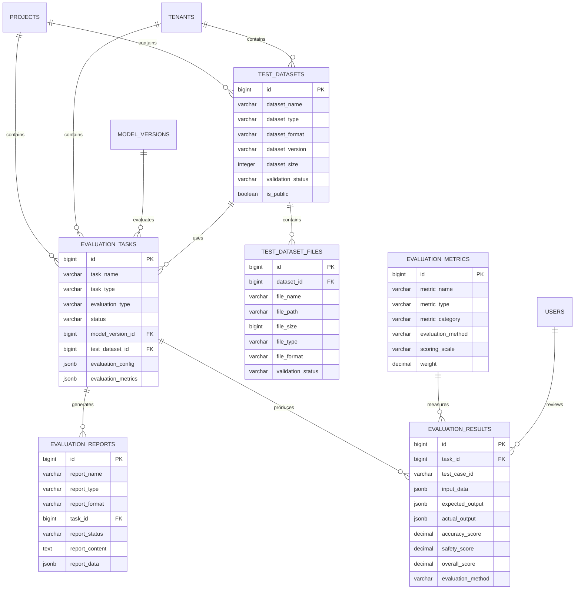

# 评测管理模块数据模型设计

> **模块名称**: evaluation_management  
> **文档版本**: v1.0  
> **更新日期**: 2025-10-17

## 一、模块概述

### 1.1 功能描述

评测管理模块负责LLMOps平台的模型评测、测试数据集管理、评测结果分析和评测报告生成。支持自动化评测、多维度指标评估、人机协同评测和持续优化。

### 1.2 核心功能

- **评测任务管理**: 评测任务创建、调度、执行、监控
- **测试数据集管理**: 数据集版本控制、质量评估、标签管理
- **评测结果分析**: 多维度指标计算、结果对比、趋势分析
- **评测报告生成**: 自动化报告生成、可视化展示、结果导出
- **人机协同评测**: LLM-as-Judge、人工抽检、反馈闭环

## 二、数据表设计

### 2.1 评测任务表 (evaluation_tasks)

```sql
CREATE TABLE evaluation_tasks (
    id BIGSERIAL PRIMARY KEY,
    uuid UUID NOT NULL DEFAULT gen_random_uuid(),
    task_name VARCHAR(200) NOT NULL,
    task_description TEXT,
    task_type VARCHAR(50) NOT NULL CHECK (task_type IN ('automated', 'manual', 'hybrid', 'benchmark', 'custom')),
    evaluation_type VARCHAR(50) NOT NULL CHECK (evaluation_type IN ('accuracy', 'safety', 'robustness', 'fairness', 'efficiency', 'cost', 'comprehensive')),
    status VARCHAR(20) NOT NULL DEFAULT 'pending' CHECK (status IN ('pending', 'running', 'completed', 'failed', 'cancelled', 'paused')),
    priority VARCHAR(20) NOT NULL DEFAULT 'medium' CHECK (priority IN ('low', 'medium', 'high', 'critical')),
    model_version_id BIGINT NOT NULL,
    baseline_model_version_id BIGINT,
    test_dataset_id BIGINT NOT NULL,
    evaluation_config JSONB NOT NULL DEFAULT '{}',
    evaluation_metrics JSONB NOT NULL DEFAULT '{}',
    evaluation_criteria JSONB DEFAULT '{}',
    timeout_seconds INTEGER NOT NULL DEFAULT 3600,
    max_retries INTEGER NOT NULL DEFAULT 3,
    retry_count INTEGER NOT NULL DEFAULT 0,
    started_at TIMESTAMP WITH TIME ZONE,
    completed_at TIMESTAMP WITH TIME ZONE,
    estimated_duration INTEGER,
    actual_duration INTEGER,
    progress_percentage DECIMAL(5,2) NOT NULL DEFAULT 0.00,
    total_test_cases INTEGER,
    completed_test_cases INTEGER NOT NULL DEFAULT 0,
    failed_test_cases INTEGER NOT NULL DEFAULT 0,
    error_message TEXT,
    result_summary JSONB,
    performance_metrics JSONB,
    cost_metrics JSONB,
    quality_metrics JSONB,
    safety_metrics JSONB,
    robustness_metrics JSONB,
    fairness_metrics JSONB,
    efficiency_metrics JSONB,
    metadata JSONB DEFAULT '{}',
    tags TEXT[],
    project_id BIGINT NOT NULL,
    tenant_id BIGINT NOT NULL,
    created_at TIMESTAMP WITH TIME ZONE NOT NULL DEFAULT NOW(),
    updated_at TIMESTAMP WITH TIME ZONE NOT NULL DEFAULT NOW(),
    created_by BIGINT,
    updated_by BIGINT
);

-- 索引
CREATE INDEX idx_evaluation_tasks_task_name ON evaluation_tasks(task_name);
CREATE INDEX idx_evaluation_tasks_task_type ON evaluation_tasks(task_type);
CREATE INDEX idx_evaluation_tasks_evaluation_type ON evaluation_tasks(evaluation_type);
CREATE INDEX idx_evaluation_tasks_status ON evaluation_tasks(status);
CREATE INDEX idx_evaluation_tasks_priority ON evaluation_tasks(priority);
CREATE INDEX idx_evaluation_tasks_model_version_id ON evaluation_tasks(model_version_id);
CREATE INDEX idx_evaluation_tasks_baseline_model_version_id ON evaluation_tasks(baseline_model_version_id);
CREATE INDEX idx_evaluation_tasks_test_dataset_id ON evaluation_tasks(test_dataset_id);
CREATE INDEX idx_evaluation_tasks_project_id ON evaluation_tasks(project_id);
CREATE INDEX idx_evaluation_tasks_tenant_id ON evaluation_tasks(tenant_id);
CREATE INDEX idx_evaluation_tasks_started_at ON evaluation_tasks(started_at);
CREATE INDEX idx_evaluation_tasks_completed_at ON evaluation_tasks(completed_at);
CREATE INDEX idx_evaluation_tasks_created_at ON evaluation_tasks(created_at);
CREATE INDEX idx_evaluation_tasks_tags ON evaluation_tasks USING GIN(tags);

-- 外键
ALTER TABLE evaluation_tasks ADD CONSTRAINT fk_evaluation_tasks_model_version 
    FOREIGN KEY (model_version_id) REFERENCES model_versions(id) ON DELETE CASCADE;
ALTER TABLE evaluation_tasks ADD CONSTRAINT fk_evaluation_tasks_baseline_model_version 
    FOREIGN KEY (baseline_model_version_id) REFERENCES model_versions(id) ON DELETE SET NULL;
ALTER TABLE evaluation_tasks ADD CONSTRAINT fk_evaluation_tasks_test_dataset 
    FOREIGN KEY (test_dataset_id) REFERENCES test_datasets(id) ON DELETE CASCADE;
ALTER TABLE evaluation_tasks ADD CONSTRAINT fk_evaluation_tasks_project 
    FOREIGN KEY (project_id) REFERENCES projects(id) ON DELETE CASCADE;
ALTER TABLE evaluation_tasks ADD CONSTRAINT fk_evaluation_tasks_tenant 
    FOREIGN KEY (tenant_id) REFERENCES tenants(id) ON DELETE CASCADE;

-- 注释
COMMENT ON TABLE evaluation_tasks IS '评测任务表';
COMMENT ON COLUMN evaluation_tasks.task_name IS '任务名称';
COMMENT ON COLUMN evaluation_tasks.task_type IS '任务类型：automated-自动化，manual-人工，hybrid-混合，benchmark-基准，custom-自定义';
COMMENT ON COLUMN evaluation_tasks.evaluation_type IS '评测类型：accuracy-准确性，safety-安全性，robustness-鲁棒性，fairness-公平性，efficiency-效率，cost-成本，comprehensive-综合';
COMMENT ON COLUMN evaluation_tasks.status IS '任务状态：pending-等待中，running-运行中，completed-已完成，failed-失败，cancelled-已取消，paused-已暂停';
COMMENT ON COLUMN evaluation_tasks.priority IS '任务优先级：low-低，medium-中，high-高，critical-严重';
COMMENT ON COLUMN evaluation_tasks.model_version_id IS '被评测模型版本ID';
COMMENT ON COLUMN evaluation_tasks.baseline_model_version_id IS '基准模型版本ID';
COMMENT ON COLUMN evaluation_tasks.test_dataset_id IS '测试数据集ID';
COMMENT ON COLUMN evaluation_tasks.evaluation_config IS '评测配置，JSON格式';
COMMENT ON COLUMN evaluation_tasks.evaluation_metrics IS '评测指标，JSON格式';
COMMENT ON COLUMN evaluation_tasks.evaluation_criteria IS '评测标准，JSON格式';
COMMENT ON COLUMN evaluation_tasks.timeout_seconds IS '超时时间，单位秒';
COMMENT ON COLUMN evaluation_tasks.max_retries IS '最大重试次数';
COMMENT ON COLUMN evaluation_tasks.retry_count IS '当前重试次数';
COMMENT ON COLUMN evaluation_tasks.started_at IS '开始时间';
COMMENT ON COLUMN evaluation_tasks.completed_at IS '完成时间';
COMMENT ON COLUMN evaluation_tasks.estimated_duration IS '预估持续时间，单位秒';
COMMENT ON COLUMN evaluation_tasks.actual_duration IS '实际持续时间，单位秒';
COMMENT ON COLUMN evaluation_tasks.progress_percentage IS '进度百分比';
COMMENT ON COLUMN evaluation_tasks.total_test_cases IS '总测试用例数';
COMMENT ON COLUMN evaluation_tasks.completed_test_cases IS '已完成测试用例数';
COMMENT ON COLUMN evaluation_tasks.failed_test_cases IS '失败测试用例数';
COMMENT ON COLUMN evaluation_tasks.error_message IS '错误消息';
COMMENT ON COLUMN evaluation_tasks.result_summary IS '结果摘要，JSON格式';
COMMENT ON COLUMN evaluation_tasks.performance_metrics IS '性能指标，JSON格式';
COMMENT ON COLUMN evaluation_tasks.cost_metrics IS '成本指标，JSON格式';
COMMENT ON COLUMN evaluation_tasks.quality_metrics IS '质量指标，JSON格式';
COMMENT ON COLUMN evaluation_tasks.safety_metrics IS '安全指标，JSON格式';
COMMENT ON COLUMN evaluation_tasks.robustness_metrics IS '鲁棒性指标，JSON格式';
COMMENT ON COLUMN evaluation_tasks.fairness_metrics IS '公平性指标，JSON格式';
COMMENT ON COLUMN evaluation_tasks.efficiency_metrics IS '效率指标，JSON格式';
COMMENT ON COLUMN evaluation_tasks.metadata IS '元数据，JSON格式';
COMMENT ON COLUMN evaluation_tasks.tags IS '标签';
```

### 2.2 测试数据集表 (test_datasets)

```sql
CREATE TABLE test_datasets (
    id BIGSERIAL PRIMARY KEY,
    uuid UUID NOT NULL DEFAULT gen_random_uuid(),
    dataset_name VARCHAR(200) NOT NULL,
    dataset_description TEXT,
    dataset_type VARCHAR(50) NOT NULL CHECK (dataset_type IN ('question_answer', 'text_classification', 'text_generation', 'summarization', 'translation', 'code_generation', 'reasoning', 'safety', 'custom')),
    dataset_format VARCHAR(20) NOT NULL CHECK (dataset_format IN ('json', 'jsonl', 'csv', 'tsv', 'txt', 'parquet', 'custom')),
    dataset_version VARCHAR(50) NOT NULL DEFAULT '1.0.0',
    dataset_size INTEGER NOT NULL DEFAULT 0,
    dataset_size_bytes BIGINT NOT NULL DEFAULT 0,
    file_count INTEGER NOT NULL DEFAULT 0,
    language VARCHAR(10) DEFAULT 'en',
    domain VARCHAR(100),
    difficulty_level VARCHAR(20) CHECK (difficulty_level IN ('easy', 'medium', 'hard', 'expert')),
    quality_score DECIMAL(3,2) CHECK (quality_score >= 0 AND quality_score <= 1),
    completeness_score DECIMAL(3,2) CHECK (completeness_score >= 0 AND completeness_score <= 1),
    consistency_score DECIMAL(3,2) CHECK (consistency_score >= 0 AND consistency_score <= 1),
    bias_score DECIMAL(3,2) CHECK (bias_score >= 0 AND bias_score <= 1),
    data_source VARCHAR(200),
    data_license VARCHAR(100),
    data_creator VARCHAR(200),
    data_created_date DATE,
    data_updated_date DATE,
    validation_status VARCHAR(20) NOT NULL DEFAULT 'pending' CHECK (validation_status IN ('pending', 'validating', 'validated', 'invalid', 'deprecated')),
    validation_results JSONB,
    schema_definition JSONB,
    sample_data JSONB,
    statistics JSONB,
    metadata JSONB DEFAULT '{}',
    tags TEXT[],
    is_public BOOLEAN NOT NULL DEFAULT FALSE,
    is_featured BOOLEAN NOT NULL DEFAULT FALSE,
    download_count INTEGER NOT NULL DEFAULT 0,
    usage_count INTEGER NOT NULL DEFAULT 0,
    project_id BIGINT NOT NULL,
    tenant_id BIGINT NOT NULL,
    created_at TIMESTAMP WITH TIME ZONE NOT NULL DEFAULT NOW(),
    updated_at TIMESTAMP WITH TIME ZONE NOT NULL DEFAULT NOW(),
    created_by BIGINT,
    updated_by BIGINT
);

-- 索引
CREATE INDEX idx_test_datasets_dataset_name ON test_datasets(dataset_name);
CREATE INDEX idx_test_datasets_dataset_type ON test_datasets(dataset_type);
CREATE INDEX idx_test_datasets_dataset_format ON test_datasets(dataset_format);
CREATE INDEX idx_test_datasets_dataset_version ON test_datasets(dataset_version);
CREATE INDEX idx_test_datasets_language ON test_datasets(language);
CREATE INDEX idx_test_datasets_domain ON test_datasets(domain);
CREATE INDEX idx_test_datasets_difficulty_level ON test_datasets(difficulty_level);
CREATE INDEX idx_test_datasets_validation_status ON test_datasets(validation_status);
CREATE INDEX idx_test_datasets_is_public ON test_datasets(is_public);
CREATE INDEX idx_test_datasets_is_featured ON test_datasets(is_featured);
CREATE INDEX idx_test_datasets_project_id ON test_datasets(project_id);
CREATE INDEX idx_test_datasets_tenant_id ON test_datasets(tenant_id);
CREATE INDEX idx_test_datasets_created_at ON test_datasets(created_at);
CREATE INDEX idx_test_datasets_tags ON test_datasets USING GIN(tags);

-- 外键
ALTER TABLE test_datasets ADD CONSTRAINT fk_test_datasets_project 
    FOREIGN KEY (project_id) REFERENCES projects(id) ON DELETE CASCADE;
ALTER TABLE test_datasets ADD CONSTRAINT fk_test_datasets_tenant 
    FOREIGN KEY (tenant_id) REFERENCES tenants(id) ON DELETE CASCADE;

-- 注释
COMMENT ON TABLE test_datasets IS '测试数据集表';
COMMENT ON COLUMN test_datasets.dataset_name IS '数据集名称';
COMMENT ON COLUMN test_datasets.dataset_type IS '数据集类型：question_answer-问答，text_classification-文本分类，text_generation-文本生成，summarization-摘要，translation-翻译，code_generation-代码生成，reasoning-推理，safety-安全，custom-自定义';
COMMENT ON COLUMN test_datasets.dataset_format IS '数据集格式：json-JSON，jsonl-JSONL，csv-CSV，tsv-TSV，txt-文本，parquet-Parquet，custom-自定义';
COMMENT ON COLUMN test_datasets.dataset_version IS '数据集版本';
COMMENT ON COLUMN test_datasets.dataset_size IS '数据集大小（记录数）';
COMMENT ON COLUMN test_datasets.dataset_size_bytes IS '数据集大小（字节数）';
COMMENT ON COLUMN test_datasets.file_count IS '文件数量';
COMMENT ON COLUMN test_datasets.language IS '数据集语言';
COMMENT ON COLUMN test_datasets.domain IS '数据集领域';
COMMENT ON COLUMN test_datasets.difficulty_level IS '难度级别：easy-简单，medium-中等，hard-困难，expert-专家';
COMMENT ON COLUMN test_datasets.quality_score IS '质量评分，0-1';
COMMENT ON COLUMN test_datasets.completeness_score IS '完整性评分，0-1';
COMMENT ON COLUMN test_datasets.consistency_score IS '一致性评分，0-1';
COMMENT ON COLUMN test_datasets.bias_score IS '偏见评分，0-1';
COMMENT ON COLUMN test_datasets.data_source IS '数据源';
COMMENT ON COLUMN test_datasets.data_license IS '数据许可证';
COMMENT ON COLUMN test_datasets.data_creator IS '数据创建者';
COMMENT ON COLUMN test_datasets.data_created_date IS '数据创建日期';
COMMENT ON COLUMN test_datasets.data_updated_date IS '数据更新日期';
COMMENT ON COLUMN test_datasets.validation_status IS '验证状态：pending-等待中，validating-验证中，validated-已验证，invalid-无效，deprecated-已弃用';
COMMENT ON COLUMN test_datasets.validation_results IS '验证结果，JSON格式';
COMMENT ON COLUMN test_datasets.schema_definition IS '模式定义，JSON格式';
COMMENT ON COLUMN test_datasets.sample_data IS '样本数据，JSON格式';
COMMENT ON COLUMN test_datasets.statistics IS '统计信息，JSON格式';
COMMENT ON COLUMN test_datasets.metadata IS '元数据，JSON格式';
COMMENT ON COLUMN test_datasets.tags IS '标签';
COMMENT ON COLUMN test_datasets.is_public IS '是否公开';
COMMENT ON COLUMN test_datasets.is_featured IS '是否推荐';
COMMENT ON COLUMN test_datasets.download_count IS '下载次数';
COMMENT ON COLUMN test_datasets.usage_count IS '使用次数';
```

### 2.3 评测结果表 (evaluation_results)

```sql
CREATE TABLE evaluation_results (
    id BIGSERIAL PRIMARY KEY,
    uuid UUID NOT NULL DEFAULT gen_random_uuid(),
    task_id BIGINT NOT NULL,
    test_case_id VARCHAR(100) NOT NULL,
    test_case_index INTEGER NOT NULL,
    input_data JSONB NOT NULL,
    expected_output JSONB,
    actual_output JSONB NOT NULL,
    output_quality JSONB,
    evaluation_scores JSONB NOT NULL DEFAULT '{}',
    metric_scores JSONB NOT NULL DEFAULT '{}',
    accuracy_score DECIMAL(5,4),
    safety_score DECIMAL(5,4),
    robustness_score DECIMAL(5,4),
    fairness_score DECIMAL(5,4),
    efficiency_score DECIMAL(5,4),
    cost_score DECIMAL(5,4),
    overall_score DECIMAL(5,4),
    confidence_score DECIMAL(5,4),
    error_type VARCHAR(50),
    error_message TEXT,
    error_details JSONB,
    execution_time_ms INTEGER,
    token_count INTEGER,
    cost_amount DECIMAL(12,4),
    evaluation_method VARCHAR(50) CHECK (evaluation_method IN ('automatic', 'llm_judge', 'human', 'hybrid')),
    evaluator_id VARCHAR(100),
    evaluator_type VARCHAR(20) CHECK (evaluator_type IN ('human', 'llm', 'rule_based', 'hybrid')),
    evaluation_notes TEXT,
    evaluation_metadata JSONB DEFAULT '{}',
    is_valid BOOLEAN NOT NULL DEFAULT TRUE,
    is_flagged BOOLEAN NOT NULL DEFAULT FALSE,
    flag_reason TEXT,
    review_status VARCHAR(20) NOT NULL DEFAULT 'pending' CHECK (review_status IN ('pending', 'reviewed', 'approved', 'rejected', 'needs_review')),
    reviewed_by BIGINT,
    reviewed_at TIMESTAMP WITH TIME ZONE,
    review_notes TEXT,
    created_at TIMESTAMP WITH TIME ZONE NOT NULL DEFAULT NOW(),
    updated_at TIMESTAMP WITH TIME ZONE NOT NULL DEFAULT NOW()
);

-- 索引
CREATE INDEX idx_evaluation_results_task_id ON evaluation_results(task_id);
CREATE INDEX idx_evaluation_results_test_case_id ON evaluation_results(test_case_id);
CREATE INDEX idx_evaluation_results_test_case_index ON evaluation_results(test_case_index);
CREATE INDEX idx_evaluation_results_accuracy_score ON evaluation_results(accuracy_score);
CREATE INDEX idx_evaluation_results_safety_score ON evaluation_results(safety_score);
CREATE INDEX idx_evaluation_results_robustness_score ON evaluation_results(robustness_score);
CREATE INDEX idx_evaluation_results_fairness_score ON evaluation_results(fairness_score);
CREATE INDEX idx_evaluation_results_efficiency_score ON evaluation_results(efficiency_score);
CREATE INDEX idx_evaluation_results_cost_score ON evaluation_results(cost_score);
CREATE INDEX idx_evaluation_results_overall_score ON evaluation_results(overall_score);
CREATE INDEX idx_evaluation_results_confidence_score ON evaluation_results(confidence_score);
CREATE INDEX idx_evaluation_results_error_type ON evaluation_results(error_type);
CREATE INDEX idx_evaluation_results_evaluation_method ON evaluation_results(evaluation_method);
CREATE INDEX idx_evaluation_results_evaluator_type ON evaluation_results(evaluator_type);
CREATE INDEX idx_evaluation_results_is_valid ON evaluation_results(is_valid);
CREATE INDEX idx_evaluation_results_is_flagged ON evaluation_results(is_flagged);
CREATE INDEX idx_evaluation_results_review_status ON evaluation_results(review_status);
CREATE INDEX idx_evaluation_results_reviewed_by ON evaluation_results(reviewed_by);
CREATE INDEX idx_evaluation_results_created_at ON evaluation_results(created_at);

-- 外键
ALTER TABLE evaluation_results ADD CONSTRAINT fk_evaluation_results_task 
    FOREIGN KEY (task_id) REFERENCES evaluation_tasks(id) ON DELETE CASCADE;
ALTER TABLE evaluation_results ADD CONSTRAINT fk_evaluation_results_reviewed_by 
    FOREIGN KEY (reviewed_by) REFERENCES users(id) ON DELETE SET NULL;

-- 注释
COMMENT ON TABLE evaluation_results IS '评测结果表';
COMMENT ON COLUMN evaluation_results.task_id IS '评测任务ID';
COMMENT ON COLUMN evaluation_results.test_case_id IS '测试用例ID';
COMMENT ON COLUMN evaluation_results.test_case_index IS '测试用例索引';
COMMENT ON COLUMN evaluation_results.input_data IS '输入数据，JSON格式';
COMMENT ON COLUMN evaluation_results.expected_output IS '期望输出，JSON格式';
COMMENT ON COLUMN evaluation_results.actual_output IS '实际输出，JSON格式';
COMMENT ON COLUMN evaluation_results.output_quality IS '输出质量，JSON格式';
COMMENT ON COLUMN evaluation_results.evaluation_scores IS '评测分数，JSON格式';
COMMENT ON COLUMN evaluation_results.metric_scores IS '指标分数，JSON格式';
COMMENT ON COLUMN evaluation_results.accuracy_score IS '准确性分数，0-1';
COMMENT ON COLUMN evaluation_results.safety_score IS '安全性分数，0-1';
COMMENT ON COLUMN evaluation_results.robustness_score IS '鲁棒性分数，0-1';
COMMENT ON COLUMN evaluation_results.fairness_score IS '公平性分数，0-1';
COMMENT ON COLUMN evaluation_results.efficiency_score IS '效率分数，0-1';
COMMENT ON COLUMN evaluation_results.cost_score IS '成本分数，0-1';
COMMENT ON COLUMN evaluation_results.overall_score IS '总体分数，0-1';
COMMENT ON COLUMN evaluation_results.confidence_score IS '置信度分数，0-1';
COMMENT ON COLUMN evaluation_results.error_type IS '错误类型';
COMMENT ON COLUMN evaluation_results.error_message IS '错误消息';
COMMENT ON COLUMN evaluation_results.error_details IS '错误详情，JSON格式';
COMMENT ON COLUMN evaluation_results.execution_time_ms IS '执行时间，单位毫秒';
COMMENT ON COLUMN evaluation_results.token_count IS 'Token数量';
COMMENT ON COLUMN evaluation_results.cost_amount IS '成本金额';
COMMENT ON COLUMN evaluation_results.evaluation_method IS '评测方法：automatic-自动，llm_judge-LLM评判，human-人工，hybrid-混合';
COMMENT ON COLUMN evaluation_results.evaluator_id IS '评测者ID';
COMMENT ON COLUMN evaluation_results.evaluator_type IS '评测者类型：human-人工，llm-LLM，rule_based-基于规则，hybrid-混合';
COMMENT ON COLUMN evaluation_results.evaluation_notes IS '评测备注';
COMMENT ON COLUMN evaluation_results.evaluation_metadata IS '评测元数据，JSON格式';
COMMENT ON COLUMN evaluation_results.is_valid IS '是否有效';
COMMENT ON COLUMN evaluation_results.is_flagged IS '是否标记';
COMMENT ON COLUMN evaluation_results.flag_reason IS '标记原因';
COMMENT ON COLUMN evaluation_results.review_status IS '审查状态：pending-等待中，reviewed-已审查，approved-已批准，rejected-已拒绝，needs_review-需要审查';
COMMENT ON COLUMN evaluation_results.reviewed_by IS '审查人ID';
COMMENT ON COLUMN evaluation_results.reviewed_at IS '审查时间';
COMMENT ON COLUMN evaluation_results.review_notes IS '审查备注';
```

### 2.4 评测指标表 (evaluation_metrics)

```sql
CREATE TABLE evaluation_metrics (
    id BIGSERIAL PRIMARY KEY,
    uuid UUID NOT NULL DEFAULT gen_random_uuid(),
    metric_name VARCHAR(200) NOT NULL,
    metric_description TEXT,
    metric_type VARCHAR(50) NOT NULL CHECK (metric_type IN ('accuracy', 'safety', 'robustness', 'fairness', 'efficiency', 'cost', 'quality', 'custom')),
    metric_category VARCHAR(50) NOT NULL CHECK (metric_category IN ('automatic', 'llm_judge', 'human', 'hybrid')),
    metric_formula TEXT,
    metric_implementation JSONB,
    evaluation_method VARCHAR(50) NOT NULL CHECK (evaluation_method IN ('exact_match', 'fuzzy_match', 'semantic_similarity', 'llm_judge', 'human_judge', 'rule_based', 'statistical', 'custom')),
    scoring_scale VARCHAR(20) NOT NULL DEFAULT '0-1' CHECK (scoring_scale IN ('0-1', '0-100', '0-10', 'binary', 'custom')),
    weight DECIMAL(5,4) NOT NULL DEFAULT 1.0000,
    threshold_value DECIMAL(10,6),
    threshold_operator VARCHAR(10) CHECK (threshold_operator IN ('>', '>=', '<', '<=', '=', '!=')),
    is_higher_better BOOLEAN NOT NULL DEFAULT TRUE,
    is_required BOOLEAN NOT NULL DEFAULT FALSE,
    is_public BOOLEAN NOT NULL DEFAULT FALSE,
    validation_rules JSONB,
    metadata JSONB DEFAULT '{}',
    tags TEXT[],
    created_at TIMESTAMP WITH TIME ZONE NOT NULL DEFAULT NOW(),
    updated_at TIMESTAMP WITH TIME ZONE NOT NULL DEFAULT NOW(),
    created_by BIGINT,
    updated_by BIGINT
);

-- 索引
CREATE INDEX idx_evaluation_metrics_metric_name ON evaluation_metrics(metric_name);
CREATE INDEX idx_evaluation_metrics_metric_type ON evaluation_metrics(metric_type);
CREATE INDEX idx_evaluation_metrics_metric_category ON evaluation_metrics(metric_category);
CREATE INDEX idx_evaluation_metrics_evaluation_method ON evaluation_metrics(evaluation_method);
CREATE INDEX idx_evaluation_metrics_scoring_scale ON evaluation_metrics(scoring_scale);
CREATE INDEX idx_evaluation_metrics_is_required ON evaluation_metrics(is_required);
CREATE INDEX idx_evaluation_metrics_is_public ON evaluation_metrics(is_public);
CREATE INDEX idx_evaluation_metrics_created_at ON evaluation_metrics(created_at);
CREATE INDEX idx_evaluation_metrics_tags ON evaluation_metrics USING GIN(tags);

-- 注释
COMMENT ON TABLE evaluation_metrics IS '评测指标表';
COMMENT ON COLUMN evaluation_metrics.metric_name IS '指标名称';
COMMENT ON COLUMN evaluation_metrics.metric_type IS '指标类型：accuracy-准确性，safety-安全性，robustness-鲁棒性，fairness-公平性，efficiency-效率，cost-成本，quality-质量，custom-自定义';
COMMENT ON COLUMN evaluation_metrics.metric_category IS '指标分类：automatic-自动，llm_judge-LLM评判，human-人工，hybrid-混合';
COMMENT ON COLUMN evaluation_metrics.metric_formula IS '指标公式';
COMMENT ON COLUMN evaluation_metrics.metric_implementation IS '指标实现，JSON格式';
COMMENT ON COLUMN evaluation_metrics.evaluation_method IS '评测方法：exact_match-精确匹配，fuzzy_match-模糊匹配，semantic_similarity-语义相似度，llm_judge-LLM评判，human_judge-人工评判，rule_based-基于规则，statistical-统计，custom-自定义';
COMMENT ON COLUMN evaluation_metrics.scoring_scale IS '评分尺度：0-1-0到1，0-100-0到100，0-10-0到10，binary-二进制，custom-自定义';
COMMENT ON COLUMN evaluation_metrics.weight IS '权重';
COMMENT ON COLUMN evaluation_metrics.threshold_value IS '阈值';
COMMENT ON COLUMN evaluation_metrics.threshold_operator IS '阈值操作符：>-大于，>=-大于等于，<-小于，<=-小于等于，=-等于，!=-不等于';
COMMENT ON COLUMN evaluation_metrics.is_higher_better IS '是否越高越好';
COMMENT ON COLUMN evaluation_metrics.is_required IS '是否必需';
COMMENT ON COLUMN evaluation_metrics.is_public IS '是否公开';
COMMENT ON COLUMN evaluation_metrics.validation_rules IS '验证规则，JSON格式';
COMMENT ON COLUMN evaluation_metrics.metadata IS '元数据，JSON格式';
COMMENT ON COLUMN evaluation_metrics.tags IS '标签';
```

### 2.5 评测报告表 (evaluation_reports)

```sql
CREATE TABLE evaluation_reports (
    id BIGSERIAL PRIMARY KEY,
    uuid UUID NOT NULL DEFAULT gen_random_uuid(),
    report_name VARCHAR(200) NOT NULL,
    report_description TEXT,
    report_type VARCHAR(50) NOT NULL CHECK (report_type IN ('summary', 'detailed', 'comparative', 'trend', 'custom')),
    report_format VARCHAR(20) NOT NULL DEFAULT 'html' CHECK (report_format IN ('html', 'pdf', 'json', 'csv', 'excel', 'markdown')),
    task_id BIGINT NOT NULL,
    report_status VARCHAR(20) NOT NULL DEFAULT 'generating' CHECK (report_status IN ('generating', 'completed', 'failed', 'cancelled')),
    generation_progress DECIMAL(5,2) NOT NULL DEFAULT 0.00,
    report_content TEXT,
    report_data JSONB,
    report_metadata JSONB DEFAULT '{}',
    summary_statistics JSONB,
    performance_analysis JSONB,
    cost_analysis JSONB,
    quality_analysis JSONB,
    safety_analysis JSONB,
    robustness_analysis JSONB,
    fairness_analysis JSONB,
    efficiency_analysis JSONB,
    comparative_analysis JSONB,
    trend_analysis JSONB,
    recommendations JSONB,
    visualizations JSONB,
    charts JSONB,
    tables JSONB,
    file_path VARCHAR(500),
    file_size BIGINT,
    file_hash VARCHAR(64),
    download_count INTEGER NOT NULL DEFAULT 0,
    is_public BOOLEAN NOT NULL DEFAULT FALSE,
    is_featured BOOLEAN NOT NULL DEFAULT FALSE,
    generated_at TIMESTAMP WITH TIME ZONE,
    expires_at TIMESTAMP WITH TIME ZONE,
    created_at TIMESTAMP WITH TIME ZONE NOT NULL DEFAULT NOW(),
    updated_at TIMESTAMP WITH TIME ZONE NOT NULL DEFAULT NOW(),
    created_by BIGINT,
    updated_by BIGINT
);

-- 索引
CREATE INDEX idx_evaluation_reports_report_name ON evaluation_reports(report_name);
CREATE INDEX idx_evaluation_reports_report_type ON evaluation_reports(report_type);
CREATE INDEX idx_evaluation_reports_report_format ON evaluation_reports(report_format);
CREATE INDEX idx_evaluation_reports_task_id ON evaluation_reports(task_id);
CREATE INDEX idx_evaluation_reports_report_status ON evaluation_reports(report_status);
CREATE INDEX idx_evaluation_reports_is_public ON evaluation_reports(is_public);
CREATE INDEX idx_evaluation_reports_is_featured ON evaluation_reports(is_featured);
CREATE INDEX idx_evaluation_reports_generated_at ON evaluation_reports(generated_at);
CREATE INDEX idx_evaluation_reports_expires_at ON evaluation_reports(expires_at);
CREATE INDEX idx_evaluation_reports_created_at ON evaluation_reports(created_at);

-- 外键
ALTER TABLE evaluation_reports ADD CONSTRAINT fk_evaluation_reports_task 
    FOREIGN KEY (task_id) REFERENCES evaluation_tasks(id) ON DELETE CASCADE;

-- 注释
COMMENT ON TABLE evaluation_reports IS '评测报告表';
COMMENT ON COLUMN evaluation_reports.report_name IS '报告名称';
COMMENT ON COLUMN evaluation_reports.report_type IS '报告类型：summary-摘要，detailed-详细，comparative-对比，trend-趋势，custom-自定义';
COMMENT ON COLUMN evaluation_reports.report_format IS '报告格式：html-HTML，pdf-PDF，json-JSON，csv-CSV，excel-Excel，markdown-Markdown';
COMMENT ON COLUMN evaluation_reports.task_id IS '关联评测任务ID';
COMMENT ON COLUMN evaluation_reports.report_status IS '报告状态：generating-生成中，completed-已完成，failed-失败，cancelled-已取消';
COMMENT ON COLUMN evaluation_reports.generation_progress IS '生成进度，百分比';
COMMENT ON COLUMN evaluation_reports.report_content IS '报告内容';
COMMENT ON COLUMN evaluation_reports.report_data IS '报告数据，JSON格式';
COMMENT ON COLUMN evaluation_reports.report_metadata IS '报告元数据，JSON格式';
COMMENT ON COLUMN evaluation_reports.summary_statistics IS '摘要统计，JSON格式';
COMMENT ON COLUMN evaluation_reports.performance_analysis IS '性能分析，JSON格式';
COMMENT ON COLUMN evaluation_reports.cost_analysis IS '成本分析，JSON格式';
COMMENT ON COLUMN evaluation_reports.quality_analysis IS '质量分析，JSON格式';
COMMENT ON COLUMN evaluation_reports.safety_analysis IS '安全分析，JSON格式';
COMMENT ON COLUMN evaluation_reports.robustness_analysis IS '鲁棒性分析，JSON格式';
COMMENT ON COLUMN evaluation_reports.fairness_analysis IS '公平性分析，JSON格式';
COMMENT ON COLUMN evaluation_reports.efficiency_analysis IS '效率分析，JSON格式';
COMMENT ON COLUMN evaluation_reports.comparative_analysis IS '对比分析，JSON格式';
COMMENT ON COLUMN evaluation_reports.trend_analysis IS '趋势分析，JSON格式';
COMMENT ON COLUMN evaluation_reports.recommendations IS '建议，JSON格式';
COMMENT ON COLUMN evaluation_reports.visualizations IS '可视化，JSON格式';
COMMENT ON COLUMN evaluation_reports.charts IS '图表，JSON格式';
COMMENT ON COLUMN evaluation_reports.tables IS '表格，JSON格式';
COMMENT ON COLUMN evaluation_reports.file_path IS '文件路径';
COMMENT ON COLUMN evaluation_reports.file_size IS '文件大小，单位字节';
COMMENT ON COLUMN evaluation_reports.file_hash IS '文件哈希值';
COMMENT ON COLUMN evaluation_reports.download_count IS '下载次数';
COMMENT ON COLUMN evaluation_reports.is_public IS '是否公开';
COMMENT ON COLUMN evaluation_reports.is_featured IS '是否推荐';
COMMENT ON COLUMN evaluation_reports.generated_at IS '生成时间';
COMMENT ON COLUMN evaluation_reports.expires_at IS '过期时间';
```

### 2.6 评测数据集文件表 (test_dataset_files)

```sql
CREATE TABLE test_dataset_files (
    id BIGSERIAL PRIMARY KEY,
    uuid UUID NOT NULL DEFAULT gen_random_uuid(),
    dataset_id BIGINT NOT NULL,
    file_name VARCHAR(255) NOT NULL,
    file_path VARCHAR(500) NOT NULL,
    file_size BIGINT NOT NULL,
    file_hash VARCHAR(64) NOT NULL,
    file_type VARCHAR(50) NOT NULL CHECK (file_type IN ('data', 'schema', 'metadata', 'sample', 'validation', 'other')),
    file_format VARCHAR(20) NOT NULL CHECK (file_format IN ('json', 'jsonl', 'csv', 'tsv', 'txt', 'parquet', 'xml', 'yaml', 'custom')),
    compression VARCHAR(20) CHECK (compression IN ('none', 'gzip', 'zip', 'tar', 'tar.gz', 'tar.bz2')),
    encoding VARCHAR(20) NOT NULL DEFAULT 'utf-8',
    line_count INTEGER,
    record_count INTEGER,
    is_required BOOLEAN NOT NULL DEFAULT TRUE,
    is_public BOOLEAN NOT NULL DEFAULT FALSE,
    download_url VARCHAR(500),
    storage_provider VARCHAR(50) NOT NULL DEFAULT 'minio' CHECK (storage_provider IN ('minio', 's3', 'gcs', 'azure', 'local')),
    storage_bucket VARCHAR(100),
    storage_key VARCHAR(500),
    storage_region VARCHAR(50),
    checksum_algorithm VARCHAR(20) NOT NULL DEFAULT 'sha256',
    checksum_value VARCHAR(128) NOT NULL,
    validation_status VARCHAR(20) NOT NULL DEFAULT 'pending' CHECK (validation_status IN ('pending', 'validating', 'validated', 'invalid', 'error')),
    validation_results JSONB,
    metadata JSONB DEFAULT '{}',
    created_at TIMESTAMP WITH TIME ZONE NOT NULL DEFAULT NOW(),
    updated_at TIMESTAMP WITH TIME ZONE NOT NULL DEFAULT NOW(),
    created_by BIGINT,
    updated_by BIGINT
);

-- 索引
CREATE INDEX idx_test_dataset_files_dataset_id ON test_dataset_files(dataset_id);
CREATE INDEX idx_test_dataset_files_file_name ON test_dataset_files(file_name);
CREATE INDEX idx_test_dataset_files_file_type ON test_dataset_files(file_type);
CREATE INDEX idx_test_dataset_files_file_format ON test_dataset_files(file_format);
CREATE INDEX idx_test_dataset_files_file_hash ON test_dataset_files(file_hash);
CREATE INDEX idx_test_dataset_files_storage_provider ON test_dataset_files(storage_provider);
CREATE INDEX idx_test_dataset_files_storage_bucket ON test_dataset_files(storage_bucket);
CREATE INDEX idx_test_dataset_files_is_required ON test_dataset_files(is_required);
CREATE INDEX idx_test_dataset_files_is_public ON test_dataset_files(is_public);
CREATE INDEX idx_test_dataset_files_validation_status ON test_dataset_files(validation_status);
CREATE INDEX idx_test_dataset_files_created_at ON test_dataset_files(created_at);

-- 外键
ALTER TABLE test_dataset_files ADD CONSTRAINT fk_test_dataset_files_dataset 
    FOREIGN KEY (dataset_id) REFERENCES test_datasets(id) ON DELETE CASCADE;

-- 注释
COMMENT ON TABLE test_dataset_files IS '测试数据集文件表';
COMMENT ON COLUMN test_dataset_files.dataset_id IS '数据集ID';
COMMENT ON COLUMN test_dataset_files.file_name IS '文件名';
COMMENT ON COLUMN test_dataset_files.file_path IS '文件路径';
COMMENT ON COLUMN test_dataset_files.file_size IS '文件大小，单位字节';
COMMENT ON COLUMN test_dataset_files.file_hash IS '文件哈希值';
COMMENT ON COLUMN test_dataset_files.file_type IS '文件类型：data-数据，schema-模式，metadata-元数据，sample-样本，validation-验证，other-其他';
COMMENT ON COLUMN test_dataset_files.file_format IS '文件格式：json-JSON，jsonl-JSONL，csv-CSV，tsv-TSV，txt-文本，parquet-Parquet，xml-XML，yaml-YAML，custom-自定义';
COMMENT ON COLUMN test_dataset_files.compression IS '压缩格式：none-无，gzip-Gzip，zip-Zip，tar-Tar，tar.gz-Tar.gz，tar.bz2-Tar.bz2';
COMMENT ON COLUMN test_dataset_files.encoding IS '文件编码';
COMMENT ON COLUMN test_dataset_files.line_count IS '行数';
COMMENT ON COLUMN test_dataset_files.record_count IS '记录数';
COMMENT ON COLUMN test_dataset_files.is_required IS '是否必需';
COMMENT ON COLUMN test_dataset_files.is_public IS '是否公开';
COMMENT ON COLUMN test_dataset_files.download_url IS '下载URL';
COMMENT ON COLUMN test_dataset_files.storage_provider IS '存储提供商：minio-MinIO，s3-AWS S3，gcs-Google Cloud Storage，azure-Azure Blob，local-本地存储';
COMMENT ON COLUMN test_dataset_files.storage_bucket IS '存储桶名称';
COMMENT ON COLUMN test_dataset_files.storage_key IS '存储对象键';
COMMENT ON COLUMN test_dataset_files.storage_region IS '存储区域';
COMMENT ON COLUMN test_dataset_files.checksum_algorithm IS '校验和算法：sha256-SHA256，md5-MD5，sha1-SHA1';
COMMENT ON COLUMN test_dataset_files.checksum_value IS '校验和值';
COMMENT ON COLUMN test_dataset_files.validation_status IS '验证状态：pending-等待中，validating-验证中，validated-已验证，invalid-无效，error-错误';
COMMENT ON COLUMN test_dataset_files.validation_results IS '验证结果，JSON格式';
COMMENT ON COLUMN test_dataset_files.metadata IS '元数据，JSON格式';
```

## 三、数据关系图



## 四、业务规则

### 4.1 评测任务规则

```yaml
任务类型:
  - automated: 自动化评测
  - manual: 人工评测
  - hybrid: 混合评测
  - benchmark: 基准评测
  - custom: 自定义评测

评测类型:
  - accuracy: 准确性评测
  - safety: 安全性评测
  - robustness: 鲁棒性评测
  - fairness: 公平性评测
  - efficiency: 效率评测
  - cost: 成本评测
  - comprehensive: 综合评测

任务状态:
  - pending: 等待中
  - running: 运行中
  - completed: 已完成
  - failed: 失败
  - cancelled: 已取消
  - paused: 已暂停

任务优先级:
  - low: 低优先级
  - medium: 中优先级
  - high: 高优先级
  - critical: 严重优先级

执行策略:
  - 超时控制：默认1小时
  - 重试机制：最多3次
  - 进度跟踪：实时更新
  - 错误处理：详细记录
```

### 4.2 测试数据集规则

```yaml
数据集类型:
  - question_answer: 问答数据集
  - text_classification: 文本分类数据集
  - text_generation: 文本生成数据集
  - summarization: 摘要数据集
  - translation: 翻译数据集
  - code_generation: 代码生成数据集
  - reasoning: 推理数据集
  - safety: 安全数据集
  - custom: 自定义数据集

数据集格式:
  - json: JSON格式
  - jsonl: JSONL格式
  - csv: CSV格式
  - tsv: TSV格式
  - txt: 文本格式
  - parquet: Parquet格式
  - custom: 自定义格式

质量评估:
  - 质量评分：0-1
  - 完整性评分：0-1
  - 一致性评分：0-1
  - 偏见评分：0-1

验证状态:
  - pending: 等待验证
  - validating: 验证中
  - validated: 已验证
  - invalid: 无效
  - deprecated: 已弃用
```

### 4.3 评测结果规则

```yaml
评测方法:
  - automatic: 自动评测
  - llm_judge: LLM评判
  - human: 人工评测
  - hybrid: 混合评测

评测者类型:
  - human: 人工评测者
  - llm: LLM评测者
  - rule_based: 基于规则
  - hybrid: 混合评测者

评分标准:
  - 准确性分数：0-1
  - 安全性分数：0-1
  - 鲁棒性分数：0-1
  - 公平性分数：0-1
  - 效率分数：0-1
  - 成本分数：0-1
  - 总体分数：0-1
  - 置信度分数：0-1

审查状态:
  - pending: 等待审查
  - reviewed: 已审查
  - approved: 已批准
  - rejected: 已拒绝
  - needs_review: 需要审查
```

### 4.4 评测指标规则

```yaml
指标类型:
  - accuracy: 准确性指标
  - safety: 安全性指标
  - robustness: 鲁棒性指标
  - fairness: 公平性指标
  - efficiency: 效率指标
  - cost: 成本指标
  - quality: 质量指标
  - custom: 自定义指标

指标分类:
  - automatic: 自动指标
  - llm_judge: LLM评判指标
  - human: 人工指标
  - hybrid: 混合指标

评测方法:
  - exact_match: 精确匹配
  - fuzzy_match: 模糊匹配
  - semantic_similarity: 语义相似度
  - llm_judge: LLM评判
  - human_judge: 人工评判
  - rule_based: 基于规则
  - statistical: 统计方法
  - custom: 自定义方法

评分尺度:
  - 0-1: 0到1
  - 0-100: 0到100
  - 0-10: 0到10
  - binary: 二进制
  - custom: 自定义
```

## 五、性能优化

### 5.1 索引优化

```sql
-- 复合索引
CREATE INDEX idx_evaluation_tasks_model_status ON evaluation_tasks(model_version_id, status);
CREATE INDEX idx_evaluation_tasks_project_status ON evaluation_tasks(project_id, status);
CREATE INDEX idx_evaluation_tasks_tenant_status ON evaluation_tasks(tenant_id, status);
CREATE INDEX idx_evaluation_tasks_type_status ON evaluation_tasks(task_type, status);
CREATE INDEX idx_evaluation_tasks_priority_status ON evaluation_tasks(priority, status);
CREATE INDEX idx_evaluation_tasks_created_status ON evaluation_tasks(created_at, status);
CREATE INDEX idx_test_datasets_type_status ON test_datasets(dataset_type, validation_status);
CREATE INDEX idx_test_datasets_project_status ON test_datasets(project_id, validation_status);
CREATE INDEX idx_test_datasets_tenant_status ON test_datasets(tenant_id, validation_status);
CREATE INDEX idx_evaluation_results_task_score ON evaluation_results(task_id, overall_score);
CREATE INDEX idx_evaluation_results_task_method ON evaluation_results(task_id, evaluation_method);
CREATE INDEX idx_evaluation_results_task_status ON evaluation_results(task_id, review_status);
CREATE INDEX idx_evaluation_metrics_type_category ON evaluation_metrics(metric_type, metric_category);
CREATE INDEX idx_evaluation_metrics_method_scale ON evaluation_metrics(evaluation_method, scoring_scale);
CREATE INDEX idx_evaluation_reports_task_status ON evaluation_reports(task_id, report_status);
CREATE INDEX idx_evaluation_reports_type_format ON evaluation_reports(report_type, report_format);

-- 部分索引
CREATE INDEX idx_evaluation_tasks_active ON evaluation_tasks(id) WHERE status IN ('pending', 'running');
CREATE INDEX idx_evaluation_tasks_completed ON evaluation_tasks(id) WHERE status = 'completed';
CREATE INDEX idx_evaluation_tasks_failed ON evaluation_tasks(id) WHERE status = 'failed';
CREATE INDEX idx_test_datasets_public ON test_datasets(id) WHERE is_public = TRUE;
CREATE INDEX idx_test_datasets_featured ON test_datasets(id) WHERE is_featured = TRUE;
CREATE INDEX idx_evaluation_results_valid ON evaluation_results(id) WHERE is_valid = TRUE;
CREATE INDEX idx_evaluation_results_flagged ON evaluation_results(id) WHERE is_flagged = TRUE;
CREATE INDEX idx_evaluation_reports_completed ON evaluation_reports(id) WHERE report_status = 'completed';
CREATE INDEX idx_evaluation_reports_public ON evaluation_reports(id) WHERE is_public = TRUE;

-- 表达式索引
CREATE INDEX idx_evaluation_tasks_lower_name ON evaluation_tasks(lower(task_name));
CREATE INDEX idx_test_datasets_lower_name ON test_datasets(lower(dataset_name));
CREATE INDEX idx_evaluation_metrics_lower_name ON evaluation_metrics(lower(metric_name));
CREATE INDEX idx_evaluation_reports_lower_name ON evaluation_reports(lower(report_name));
```

### 5.2 查询优化

```sql
-- 评测任务统计查询优化
CREATE VIEW evaluation_task_statistics AS
SELECT 
    DATE_TRUNC('day', created_at) as stat_date,
    tenant_id,
    project_id,
    task_type,
    evaluation_type,
    status,
    priority,
    COUNT(*) as task_count,
    COUNT(CASE WHEN status = 'completed' THEN 1 END) as completed_count,
    COUNT(CASE WHEN status = 'failed' THEN 1 END) as failed_count,
    COUNT(CASE WHEN status = 'running' THEN 1 END) as running_count,
    AVG(actual_duration) as avg_duration,
    AVG(progress_percentage) as avg_progress,
    SUM(total_test_cases) as total_test_cases,
    SUM(completed_test_cases) as total_completed_test_cases,
    SUM(failed_test_cases) as total_failed_test_cases
FROM evaluation_tasks
WHERE created_at >= NOW() - INTERVAL '30 days'
GROUP BY DATE_TRUNC('day', created_at), tenant_id, project_id, task_type, evaluation_type, status, priority;

-- 评测结果统计查询优化
CREATE VIEW evaluation_result_statistics AS
SELECT 
    et.id as task_id,
    et.task_name,
    et.task_type,
    et.evaluation_type,
    et.status as task_status,
    COUNT(er.id) as total_results,
    COUNT(CASE WHEN er.is_valid = TRUE THEN 1 END) as valid_results,
    COUNT(CASE WHEN er.is_flagged = TRUE THEN 1 END) as flagged_results,
    AVG(er.accuracy_score) as avg_accuracy,
    AVG(er.safety_score) as avg_safety,
    AVG(er.robustness_score) as avg_robustness,
    AVG(er.fairness_score) as avg_fairness,
    AVG(er.efficiency_score) as avg_efficiency,
    AVG(er.cost_score) as avg_cost,
    AVG(er.overall_score) as avg_overall,
    AVG(er.confidence_score) as avg_confidence,
    AVG(er.execution_time_ms) as avg_execution_time,
    SUM(er.token_count) as total_tokens,
    SUM(er.cost_amount) as total_cost
FROM evaluation_tasks et
LEFT JOIN evaluation_results er ON et.id = er.task_id
WHERE et.created_at >= NOW() - INTERVAL '30 days'
GROUP BY et.id, et.task_name, et.task_type, et.evaluation_type, et.status;

-- 测试数据集统计查询优化
CREATE VIEW test_dataset_statistics AS
SELECT 
    td.id as dataset_id,
    td.dataset_name,
    td.dataset_type,
    td.dataset_format,
    td.dataset_version,
    td.dataset_size,
    td.dataset_size_bytes,
    td.file_count,
    td.language,
    td.domain,
    td.difficulty_level,
    td.quality_score,
    td.completeness_score,
    td.consistency_score,
    td.bias_score,
    td.validation_status,
    td.is_public,
    td.is_featured,
    td.download_count,
    td.usage_count,
    COUNT(tdf.id) as file_count_actual,
    SUM(tdf.file_size) as total_file_size,
    COUNT(CASE WHEN tdf.validation_status = 'validated' THEN 1 END) as validated_files
FROM test_datasets td
LEFT JOIN test_dataset_files tdf ON td.id = tdf.dataset_id
GROUP BY td.id, td.dataset_name, td.dataset_type, td.dataset_format, td.dataset_version, 
         td.dataset_size, td.dataset_size_bytes, td.file_count, td.language, td.domain, 
         td.difficulty_level, td.quality_score, td.completeness_score, td.consistency_score, 
         td.bias_score, td.validation_status, td.is_public, td.is_featured, 
         td.download_count, td.usage_count;
```

### 5.3 缓存策略

```yaml
评测任务缓存:
  - 缓存键: evaluation_task:{task_id}
  - 缓存时间: 1小时
  - 更新策略: 任务状态变更时主动失效

测试数据集缓存:
  - 缓存键: test_dataset:{dataset_id}
  - 缓存时间: 2小时
  - 更新策略: 数据集信息变更时主动失效

评测结果缓存:
  - 缓存键: evaluation_results:{task_id}
  - 缓存时间: 30分钟
  - 更新策略: 新结果添加时主动失效

评测指标缓存:
  - 缓存键: evaluation_metrics:{metric_id}
  - 缓存时间: 4小时
  - 更新策略: 指标定义变更时主动失效

评测报告缓存:
  - 缓存键: evaluation_report:{report_id}
  - 缓存时间: 1小时
  - 更新策略: 报告生成完成时主动失效
```

## 六、安全设计

### 6.1 数据安全

```sql
-- 评测数据访问权限检查函数
CREATE OR REPLACE FUNCTION check_evaluation_access_permission(
    p_user_id BIGINT,
    p_tenant_id BIGINT,
    p_project_id BIGINT,
    p_task_id BIGINT
) RETURNS BOOLEAN AS $$
DECLARE
    task_info RECORD;
    user_role VARCHAR;
BEGIN
    -- 获取评测任务信息
    SELECT et.*, p.owner_id, p.tenant_id as project_tenant_id
    INTO task_info
    FROM evaluation_tasks et
    JOIN projects p ON et.project_id = p.id
    WHERE et.id = p_task_id;
    
    IF task_info IS NULL THEN
        RETURN FALSE;
    END IF;
    
    -- 检查租户权限
    IF task_info.tenant_id != p_tenant_id THEN
        RETURN FALSE;
    END IF;
    
    -- 检查项目权限
    SELECT pm.role INTO user_role
    FROM project_members pm
    WHERE pm.project_id = task_info.project_id 
      AND pm.user_id = p_user_id 
      AND pm.status = 'active';
    
    IF user_role IS NULL THEN
        RETURN FALSE;
    END IF;
    
    -- 检查角色权限
    RETURN user_role IN ('owner', 'admin', 'developer', 'tester', 'viewer');
END;
$$ LANGUAGE plpgsql;
```

### 6.2 结果验证

```sql
-- 评测结果验证函数
CREATE OR REPLACE FUNCTION validate_evaluation_result(
    p_result_data JSONB,
    p_metric_definitions JSONB
) RETURNS JSONB AS $$
DECLARE
    validation_result JSONB;
    metric_name TEXT;
    metric_value DECIMAL;
    metric_def JSONB;
    is_valid BOOLEAN := TRUE;
    errors TEXT[] := '{}';
BEGIN
    validation_result := jsonb_build_object(
        'is_valid', TRUE,
        'errors', '[]'::jsonb,
        'warnings', '[]'::jsonb
    );
    
    -- 验证每个指标
    FOR metric_name IN SELECT jsonb_object_keys(p_result_data) LOOP
        metric_value := (p_result_data ->> metric_name)::DECIMAL;
        metric_def := p_metric_definitions -> metric_name;
        
        IF metric_def IS NOT NULL THEN
            -- 检查数值范围
            IF metric_value < 0 OR metric_value > 1 THEN
                is_valid := FALSE;
                errors := array_append(errors, format('Metric %s value %s is out of range [0,1]', metric_name, metric_value));
            END IF;
            
            -- 检查是否必需
            IF (metric_def ->> 'is_required')::BOOLEAN AND metric_value IS NULL THEN
                is_valid := FALSE;
                errors := array_append(errors, format('Required metric %s is missing', metric_name));
            END IF;
        END IF;
    END LOOP;
    
    validation_result := jsonb_set(validation_result, '{is_valid}', to_jsonb(is_valid));
    validation_result := jsonb_set(validation_result, '{errors}', to_jsonb(errors));
    
    RETURN validation_result;
END;
$$ LANGUAGE plpgsql;
```

### 6.3 审计日志

```sql
-- 评测操作审计触发器
CREATE OR REPLACE FUNCTION evaluation_audit_trigger()
RETURNS TRIGGER AS $$
BEGIN
    IF TG_OP = 'INSERT' THEN
        INSERT INTO audit_logs (
            user_id, tenant_id, project_id, action, resource_type, 
            resource_id, operation, result, new_values
        ) VALUES (
            NEW.created_by, NEW.tenant_id, NEW.project_id, 'evaluation_task_created', 'evaluation_task', 
            NEW.id::TEXT, 'create', 'success', to_jsonb(NEW)
        );
        RETURN NEW;
    ELSIF TG_OP = 'UPDATE' THEN
        INSERT INTO audit_logs (
            user_id, tenant_id, project_id, action, resource_type, 
            resource_id, operation, result, old_values, new_values
        ) VALUES (
            NEW.updated_by, NEW.tenant_id, NEW.project_id, 'evaluation_task_updated', 'evaluation_task', 
            NEW.id::TEXT, 'update', 'success', to_jsonb(OLD), to_jsonb(NEW)
        );
        RETURN NEW;
    ELSIF TG_OP = 'DELETE' THEN
        INSERT INTO audit_logs (
            user_id, tenant_id, project_id, action, resource_type, 
            resource_id, operation, result, old_values
        ) VALUES (
            OLD.updated_by, OLD.tenant_id, OLD.project_id, 'evaluation_task_deleted', 'evaluation_task', 
            OLD.id::TEXT, 'delete', 'success', to_jsonb(OLD)
        );
        RETURN OLD;
    END IF;
    RETURN NULL;
END;
$$ LANGUAGE plpgsql;

-- 为评测任务表创建审计触发器
CREATE TRIGGER evaluation_tasks_audit_trigger
    AFTER INSERT OR UPDATE OR DELETE ON evaluation_tasks
    FOR EACH ROW EXECUTE FUNCTION evaluation_audit_trigger();
```

## 七、初始化数据

### 7.1 默认评测指标

```sql
-- 插入默认评测指标
INSERT INTO evaluation_metrics (metric_name, metric_description, metric_type, metric_category, evaluation_method, scoring_scale, weight, is_required, is_public) VALUES
-- 准确性指标
('Exact Match', '精确匹配准确率', 'accuracy', 'automatic', 'exact_match', '0-1', 0.3, TRUE, TRUE),
('F1 Score', 'F1分数', 'accuracy', 'automatic', 'statistical', '0-1', 0.3, TRUE, TRUE),
('BLEU Score', 'BLEU分数', 'accuracy', 'automatic', 'statistical', '0-1', 0.2, FALSE, TRUE),
('ROUGE Score', 'ROUGE分数', 'accuracy', 'automatic', 'statistical', '0-1', 0.2, FALSE, TRUE),

-- 安全性指标
('Toxicity Score', '毒性评分', 'safety', 'llm_judge', 'llm_judge', '0-1', 0.4, TRUE, TRUE),
('Bias Score', '偏见评分', 'safety', 'llm_judge', 'llm_judge', '0-1', 0.3, TRUE, TRUE),
('Harmful Content Score', '有害内容评分', 'safety', 'llm_judge', 'llm_judge', '0-1', 0.3, TRUE, TRUE),

-- 鲁棒性指标
('Adversarial Robustness', '对抗鲁棒性', 'robustness', 'automatic', 'rule_based', '0-1', 0.5, TRUE, TRUE),
('Input Perturbation Score', '输入扰动评分', 'robustness', 'automatic', 'rule_based', '0-1', 0.5, TRUE, TRUE),

-- 公平性指标
('Demographic Parity', '人口统计平等', 'fairness', 'statistical', 'statistical', '0-1', 0.4, TRUE, TRUE),
('Equalized Odds', '均等机会', 'fairness', 'statistical', 'statistical', '0-1', 0.3, TRUE, TRUE),
('Individual Fairness', '个体公平性', 'fairness', 'llm_judge', 'llm_judge', '0-1', 0.3, TRUE, TRUE),

-- 效率指标
('Response Time', '响应时间', 'efficiency', 'automatic', 'statistical', '0-1', 0.5, TRUE, TRUE),
('Throughput', '吞吐量', 'efficiency', 'automatic', 'statistical', '0-1', 0.5, TRUE, TRUE),

-- 成本指标
('Token Efficiency', 'Token效率', 'cost', 'automatic', 'statistical', '0-1', 0.6, TRUE, TRUE),
('Cost per Request', '每请求成本', 'cost', 'automatic', 'statistical', '0-1', 0.4, TRUE, TRUE);
```

### 7.2 默认测试数据集模板

```sql
-- 插入默认测试数据集模板
INSERT INTO test_datasets (dataset_name, dataset_description, dataset_type, dataset_format, dataset_version, language, domain, difficulty_level, quality_score, completeness_score, consistency_score, bias_score, validation_status, is_public, is_featured, project_id, tenant_id) VALUES
-- 问答数据集
('General QA Dataset', '通用问答数据集', 'question_answer', 'jsonl', '1.0.0', 'en', 'general', 'medium', 0.85, 0.90, 0.88, 0.15, 'validated', TRUE, TRUE, 1, 1),
('Chinese QA Dataset', '中文问答数据集', 'question_answer', 'jsonl', '1.0.0', 'zh', 'general', 'medium', 0.82, 0.88, 0.85, 0.12, 'validated', TRUE, TRUE, 1, 1),

-- 文本分类数据集
('Sentiment Analysis Dataset', '情感分析数据集', 'text_classification', 'jsonl', '1.0.0', 'en', 'nlp', 'easy', 0.90, 0.95, 0.92, 0.08, 'validated', TRUE, TRUE, 1, 1),
('Topic Classification Dataset', '主题分类数据集', 'text_classification', 'jsonl', '1.0.0', 'en', 'nlp', 'medium', 0.88, 0.92, 0.89, 0.10, 'validated', TRUE, TRUE, 1, 1),

-- 文本生成数据集
('Creative Writing Dataset', '创意写作数据集', 'text_generation', 'jsonl', '1.0.0', 'en', 'creative', 'hard', 0.80, 0.85, 0.82, 0.18, 'validated', TRUE, TRUE, 1, 1),
('Code Generation Dataset', '代码生成数据集', 'code_generation', 'jsonl', '1.0.0', 'en', 'programming', 'expert', 0.85, 0.88, 0.86, 0.12, 'validated', TRUE, TRUE, 1, 1),

-- 摘要数据集
('News Summarization Dataset', '新闻摘要数据集', 'summarization', 'jsonl', '1.0.0', 'en', 'news', 'medium', 0.87, 0.90, 0.88, 0.14, 'validated', TRUE, TRUE, 1, 1),
('Academic Paper Dataset', '学术论文数据集', 'summarization', 'jsonl', '1.0.0', 'en', 'academic', 'hard', 0.83, 0.86, 0.84, 0.16, 'validated', TRUE, TRUE, 1, 1),

-- 翻译数据集
('English-Chinese Translation', '英中翻译数据集', 'translation', 'jsonl', '1.0.0', 'en', 'translation', 'medium', 0.89, 0.93, 0.91, 0.11, 'validated', TRUE, TRUE, 1, 1),
('Multi-language Translation', '多语言翻译数据集', 'translation', 'jsonl', '1.0.0', 'en', 'translation', 'hard', 0.86, 0.89, 0.87, 0.13, 'validated', TRUE, TRUE, 1, 1),

-- 推理数据集
('Mathematical Reasoning', '数学推理数据集', 'reasoning', 'jsonl', '1.0.0', 'en', 'mathematics', 'expert', 0.84, 0.87, 0.85, 0.17, 'validated', TRUE, TRUE, 1, 1),
('Logical Reasoning', '逻辑推理数据集', 'reasoning', 'jsonl', '1.0.0', 'en', 'logic', 'hard', 0.81, 0.84, 0.82, 0.19, 'validated', TRUE, TRUE, 1, 1),

-- 安全数据集
('Safety Evaluation Dataset', '安全评测数据集', 'safety', 'jsonl', '1.0.0', 'en', 'safety', 'medium', 0.88, 0.91, 0.89, 0.09, 'validated', TRUE, TRUE, 1, 1),
('Bias Detection Dataset', '偏见检测数据集', 'safety', 'jsonl', '1.0.0', 'en', 'bias', 'medium', 0.85, 0.88, 0.86, 0.12, 'validated', TRUE, TRUE, 1, 1);
```

## 八、总结

评测管理模块是LLMOps平台的重要模块，提供了完整的模型评测、测试数据集管理、评测结果分析和评测报告生成功能。

### 核心特性

1. **完整评测流程**: 从任务创建到报告生成的完整评测流程
2. **多维度评测**: 准确性、安全性、鲁棒性、公平性等多维度评估
3. **灵活数据集管理**: 支持多种数据集类型和格式
4. **智能评测方法**: 自动评测、LLM评判、人工评测、混合评测
5. **详细结果分析**: 多维度指标计算、结果对比、趋势分析
6. **自动化报告**: 报告生成、可视化展示、结果导出

### 扩展性

- 支持自定义评测指标
- 支持灵活的数据集格式
- 支持多种评测方法
- 支持自定义报告模板
- 支持人机协同评测

---

**文档维护**: 本文档应随业务需求变化持续更新，保持与系统架构的一致性。

**版本历史**:
- v1.0 (2025-10-17): 初始版本，完整评测管理模块设计

