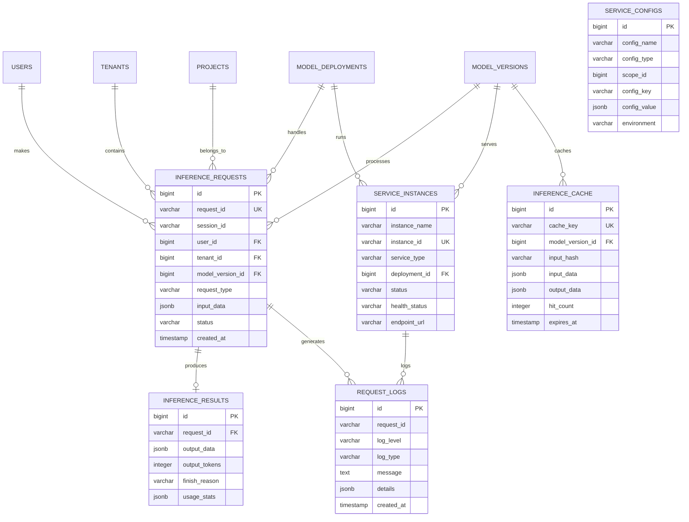

# 推理服务模块数据模型设计

> **模块名称**: inference_service  
> **文档版本**: v1.0  
> **更新日期**: 2025-10-17

## 一、模块概述

### 1.1 功能描述

推理服务模块负责LLMOps平台的推理请求处理、结果管理、服务配置和性能监控。支持多种推理模式、负载均衡、缓存机制和实时监控。

### 1.2 核心功能

- **推理请求管理**: 请求接收、队列管理、优先级调度
- **推理结果管理**: 结果存储、缓存、检索
- **服务配置管理**: 推理参数、超时设置、重试策略
- **性能监控**: 延迟统计、吞吐量监控、错误率跟踪
- **智能路由**: 模型选择、负载均衡、故障转移

## 二、数据表设计

### 2.1 推理请求表 (inference_requests)

```sql
CREATE TABLE inference_requests (
    id BIGSERIAL PRIMARY KEY,
    uuid UUID NOT NULL DEFAULT gen_random_uuid(),
    request_id VARCHAR(100) NOT NULL UNIQUE,
    session_id VARCHAR(100),
    user_id BIGINT NOT NULL,
    tenant_id BIGINT NOT NULL,
    project_id BIGINT,
    model_version_id BIGINT NOT NULL,
    deployment_id BIGINT,
    request_type VARCHAR(20) NOT NULL DEFAULT 'chat' CHECK (request_type IN ('chat', 'completion', 'embedding', 'classification', 'generation', 'custom')),
    input_data JSONB NOT NULL,
    input_tokens INTEGER,
    parameters JSONB DEFAULT '{}',
    priority INTEGER NOT NULL DEFAULT 5 CHECK (priority >= 1 AND priority <= 10),
    timeout_seconds INTEGER NOT NULL DEFAULT 30,
    max_tokens INTEGER,
    temperature DECIMAL(3,2),
    top_p DECIMAL(3,2),
    frequency_penalty DECIMAL(3,2),
    presence_penalty DECIMAL(3,2),
    stop_sequences TEXT[],
    stream BOOLEAN NOT NULL DEFAULT FALSE,
    status VARCHAR(20) NOT NULL DEFAULT 'pending' CHECK (status IN ('pending', 'processing', 'completed', 'failed', 'cancelled', 'timeout')),
    error_code VARCHAR(50),
    error_message TEXT,
    started_at TIMESTAMP WITH TIME ZONE,
    completed_at TIMESTAMP WITH TIME ZONE,
    processing_time_ms INTEGER,
    queue_time_ms INTEGER,
    total_time_ms INTEGER,
    cost_tokens INTEGER,
    cost_amount DECIMAL(12,4),
    ip_address INET,
    user_agent TEXT,
    metadata JSONB DEFAULT '{}',
    created_at TIMESTAMP WITH TIME ZONE NOT NULL DEFAULT NOW(),
    updated_at TIMESTAMP WITH TIME ZONE NOT NULL DEFAULT NOW()
);

-- 索引
CREATE INDEX idx_inference_requests_request_id ON inference_requests(request_id);
CREATE INDEX idx_inference_requests_session_id ON inference_requests(session_id);
CREATE INDEX idx_inference_requests_user_id ON inference_requests(user_id);
CREATE INDEX idx_inference_requests_tenant_id ON inference_requests(tenant_id);
CREATE INDEX idx_inference_requests_project_id ON inference_requests(project_id);
CREATE INDEX idx_inference_requests_model_version_id ON inference_requests(model_version_id);
CREATE INDEX idx_inference_requests_deployment_id ON inference_requests(deployment_id);
CREATE INDEX idx_inference_requests_request_type ON inference_requests(request_type);
CREATE INDEX idx_inference_requests_status ON inference_requests(status);
CREATE INDEX idx_inference_requests_priority ON inference_requests(priority);
CREATE INDEX idx_inference_requests_created_at ON inference_requests(created_at);
CREATE INDEX idx_inference_requests_started_at ON inference_requests(started_at);
CREATE INDEX idx_inference_requests_completed_at ON inference_requests(completed_at);

-- 外键
ALTER TABLE inference_requests ADD CONSTRAINT fk_inference_requests_user 
    FOREIGN KEY (user_id) REFERENCES users(id) ON DELETE CASCADE;
ALTER TABLE inference_requests ADD CONSTRAINT fk_inference_requests_tenant 
    FOREIGN KEY (tenant_id) REFERENCES tenants(id) ON DELETE CASCADE;
ALTER TABLE inference_requests ADD CONSTRAINT fk_inference_requests_project 
    FOREIGN KEY (project_id) REFERENCES projects(id) ON DELETE SET NULL;
ALTER TABLE inference_requests ADD CONSTRAINT fk_inference_requests_model_version 
    FOREIGN KEY (model_version_id) REFERENCES model_versions(id) ON DELETE RESTRICT;
ALTER TABLE inference_requests ADD CONSTRAINT fk_inference_requests_deployment 
    FOREIGN KEY (deployment_id) REFERENCES model_deployments(id) ON DELETE SET NULL;

-- 注释
COMMENT ON TABLE inference_requests IS '推理请求表';
COMMENT ON COLUMN inference_requests.request_id IS '请求唯一标识符';
COMMENT ON COLUMN inference_requests.session_id IS '会话ID，用于关联同一会话的多个请求';
COMMENT ON COLUMN inference_requests.request_type IS '请求类型：chat-对话，completion-补全，embedding-嵌入，classification-分类，generation-生成，custom-自定义';
COMMENT ON COLUMN inference_requests.input_data IS '输入数据，JSON格式';
COMMENT ON COLUMN inference_requests.input_tokens IS '输入Token数量';
COMMENT ON COLUMN inference_requests.parameters IS '推理参数，JSON格式';
COMMENT ON COLUMN inference_requests.priority IS '请求优先级，1-10，数字越大优先级越高';
COMMENT ON COLUMN inference_requests.timeout_seconds IS '请求超时时间，单位秒';
COMMENT ON COLUMN inference_requests.stream IS '是否流式输出';
COMMENT ON COLUMN inference_requests.status IS '请求状态：pending-等待中，processing-处理中，completed-已完成，failed-失败，cancelled-已取消，timeout-超时';
COMMENT ON COLUMN inference_requests.processing_time_ms IS '处理时间，单位毫秒';
COMMENT ON COLUMN inference_requests.queue_time_ms IS '队列等待时间，单位毫秒';
COMMENT ON COLUMN inference_requests.total_time_ms IS '总时间，单位毫秒';
COMMENT ON COLUMN inference_requests.cost_tokens IS '消耗的Token数量';
COMMENT ON COLUMN inference_requests.cost_amount IS '请求成本';
```

### 2.2 推理结果表 (inference_results)

```sql
CREATE TABLE inference_results (
    id BIGSERIAL PRIMARY KEY,
    uuid UUID NOT NULL DEFAULT gen_random_uuid(),
    request_id VARCHAR(100) NOT NULL,
    output_data JSONB NOT NULL,
    output_tokens INTEGER,
    finish_reason VARCHAR(50) CHECK (finish_reason IN ('stop', 'length', 'content_filter', 'function_call', 'tool_calls', 'error')),
    usage_stats JSONB,
    model_metadata JSONB,
    performance_metrics JSONB,
    quality_metrics JSONB,
    safety_scores JSONB,
    content_filters JSONB,
    tool_calls JSONB,
    function_calls JSONB,
    citations JSONB,
    confidence_scores JSONB,
    alternatives JSONB,
    debug_info JSONB,
    created_at TIMESTAMP WITH TIME ZONE NOT NULL DEFAULT NOW(),
    updated_at TIMESTAMP WITH TIME ZONE NOT NULL DEFAULT NOW(),
    UNIQUE(request_id)
);

-- 索引
CREATE INDEX idx_inference_results_request_id ON inference_results(request_id);
CREATE INDEX idx_inference_results_finish_reason ON inference_results(finish_reason);
CREATE INDEX idx_inference_results_output_tokens ON inference_results(output_tokens);
CREATE INDEX idx_inference_results_created_at ON inference_results(created_at);

-- 外键
ALTER TABLE inference_results ADD CONSTRAINT fk_inference_results_request 
    FOREIGN KEY (request_id) REFERENCES inference_requests(request_id) ON DELETE CASCADE;

-- 注释
COMMENT ON TABLE inference_results IS '推理结果表';
COMMENT ON COLUMN inference_results.output_data IS '输出数据，JSON格式';
COMMENT ON COLUMN inference_results.output_tokens IS '输出Token数量';
COMMENT ON COLUMN inference_results.finish_reason IS '完成原因：stop-正常结束，length-达到长度限制，content_filter-内容过滤，function_call-函数调用，tool_calls-工具调用，error-错误';
COMMENT ON COLUMN inference_results.usage_stats IS '使用统计，JSON格式';
COMMENT ON COLUMN inference_results.model_metadata IS '模型元数据，JSON格式';
COMMENT ON COLUMN inference_results.performance_metrics IS '性能指标，JSON格式';
COMMENT ON COLUMN inference_results.quality_metrics IS '质量指标，JSON格式';
COMMENT ON COLUMN inference_results.safety_scores IS '安全评分，JSON格式';
COMMENT ON COLUMN inference_results.content_filters IS '内容过滤结果，JSON格式';
COMMENT ON COLUMN inference_results.tool_calls IS '工具调用，JSON格式';
COMMENT ON COLUMN inference_results.function_calls IS '函数调用，JSON格式';
COMMENT ON COLUMN inference_results.citations IS '引用信息，JSON格式';
COMMENT ON COLUMN inference_results.confidence_scores IS '置信度分数，JSON格式';
COMMENT ON COLUMN inference_results.alternatives IS '备选结果，JSON格式';
COMMENT ON COLUMN inference_results.debug_info IS '调试信息，JSON格式';
```

### 2.3 服务配置表 (service_configs)

```sql
CREATE TABLE service_configs (
    id BIGSERIAL PRIMARY KEY,
    uuid UUID NOT NULL DEFAULT gen_random_uuid(),
    config_name VARCHAR(200) NOT NULL,
    config_type VARCHAR(50) NOT NULL CHECK (config_type IN ('global', 'tenant', 'project', 'model', 'deployment', 'user')),
    scope_id BIGINT,
    config_key VARCHAR(100) NOT NULL,
    config_value JSONB NOT NULL,
    description TEXT,
    is_encrypted BOOLEAN NOT NULL DEFAULT FALSE,
    is_required BOOLEAN NOT NULL DEFAULT FALSE,
    default_value JSONB,
    validation_rule VARCHAR(200),
    environment VARCHAR(20) NOT NULL DEFAULT 'default' CHECK (environment IN ('default', 'development', 'testing', 'staging', 'production')),
    priority INTEGER NOT NULL DEFAULT 0,
    status VARCHAR(20) NOT NULL DEFAULT 'active' CHECK (status IN ('active', 'inactive', 'deprecated', 'deleted')),
    created_at TIMESTAMP WITH TIME ZONE NOT NULL DEFAULT NOW(),
    updated_at TIMESTAMP WITH TIME ZONE NOT NULL DEFAULT NOW(),
    created_by BIGINT,
    updated_by BIGINT,
    UNIQUE(config_type, scope_id, config_key, environment)
);

-- 索引
CREATE INDEX idx_service_configs_config_name ON service_configs(config_name);
CREATE INDEX idx_service_configs_config_type ON service_configs(config_type);
CREATE INDEX idx_service_configs_scope_id ON service_configs(scope_id);
CREATE INDEX idx_service_configs_config_key ON service_configs(config_key);
CREATE INDEX idx_service_configs_environment ON service_configs(environment);
CREATE INDEX idx_service_configs_status ON service_configs(status);
CREATE INDEX idx_service_configs_priority ON service_configs(priority);

-- 注释
COMMENT ON TABLE service_configs IS '服务配置表';
COMMENT ON COLUMN service_configs.config_type IS '配置类型：global-全局，tenant-租户，project-项目，model-模型，deployment-部署，user-用户';
COMMENT ON COLUMN service_configs.scope_id IS '作用域ID，对应具体的作用域对象ID';
COMMENT ON COLUMN service_configs.config_key IS '配置键';
COMMENT ON COLUMN service_configs.config_value IS '配置值，JSON格式';
COMMENT ON COLUMN service_configs.is_encrypted IS '是否加密存储';
COMMENT ON COLUMN service_configs.is_required IS '是否必需配置';
COMMENT ON COLUMN service_configs.environment IS '环境：default-默认，development-开发，testing-测试，staging-预发布，production-生产';
COMMENT ON COLUMN service_configs.priority IS '配置优先级，数字越大优先级越高';
```

### 2.4 服务实例表 (service_instances)

```sql
CREATE TABLE service_instances (
    id BIGSERIAL PRIMARY KEY,
    uuid UUID NOT NULL DEFAULT gen_random_uuid(),
    instance_name VARCHAR(200) NOT NULL,
    instance_id VARCHAR(100) NOT NULL UNIQUE,
    service_type VARCHAR(50) NOT NULL CHECK (service_type IN ('inference', 'embedding', 'classification', 'generation', 'custom')),
    deployment_id BIGINT,
    model_version_id BIGINT,
    status VARCHAR(20) NOT NULL DEFAULT 'pending' CHECK (status IN ('pending', 'starting', 'running', 'stopping', 'stopped', 'failed', 'unhealthy')),
    health_status VARCHAR(20) CHECK (health_status IN ('healthy', 'unhealthy', 'unknown')),
    endpoint_url VARCHAR(500),
    health_check_url VARCHAR(500),
    version VARCHAR(50),
    region VARCHAR(50),
    zone VARCHAR(50),
    node_name VARCHAR(200),
    pod_name VARCHAR(200),
    namespace VARCHAR(100),
    cpu_requests DECIMAL(8,2),
    cpu_limits DECIMAL(8,2),
    memory_requests BIGINT,
    memory_limits BIGINT,
    gpu_requests INTEGER DEFAULT 0,
    gpu_limits INTEGER DEFAULT 0,
    gpu_type VARCHAR(50),
    current_cpu_usage DECIMAL(8,2),
    current_memory_usage BIGINT,
    current_gpu_usage DECIMAL(5,2),
    current_load DECIMAL(5,2),
    active_connections INTEGER DEFAULT 0,
    max_connections INTEGER DEFAULT 1000,
    request_count INTEGER DEFAULT 0,
    success_count INTEGER DEFAULT 0,
    error_count INTEGER DEFAULT 0,
    avg_response_time_ms DECIMAL(10,2),
    last_heartbeat TIMESTAMP WITH TIME ZONE,
    start_time TIMESTAMP WITH TIME ZONE,
    stop_time TIMESTAMP WITH TIME ZONE,
    restart_count INTEGER DEFAULT 0,
    error_message TEXT,
    metadata JSONB DEFAULT '{}',
    created_at TIMESTAMP WITH TIME ZONE NOT NULL DEFAULT NOW(),
    updated_at TIMESTAMP WITH TIME ZONE NOT NULL DEFAULT NOW()
);

-- 索引
CREATE INDEX idx_service_instances_instance_name ON service_instances(instance_name);
CREATE INDEX idx_service_instances_instance_id ON service_instances(instance_id);
CREATE INDEX idx_service_instances_service_type ON service_instances(service_type);
CREATE INDEX idx_service_instances_deployment_id ON service_instances(deployment_id);
CREATE INDEX idx_service_instances_model_version_id ON service_instances(model_version_id);
CREATE INDEX idx_service_instances_status ON service_instances(status);
CREATE INDEX idx_service_instances_health_status ON service_instances(health_status);
CREATE INDEX idx_service_instances_region ON service_instances(region);
CREATE INDEX idx_service_instances_zone ON service_instances(zone);
CREATE INDEX idx_service_instances_node_name ON service_instances(node_name);
CREATE INDEX idx_service_instances_last_heartbeat ON service_instances(last_heartbeat);

-- 外键
ALTER TABLE service_instances ADD CONSTRAINT fk_service_instances_deployment 
    FOREIGN KEY (deployment_id) REFERENCES model_deployments(id) ON DELETE SET NULL;
ALTER TABLE service_instances ADD CONSTRAINT fk_service_instances_model_version 
    FOREIGN KEY (model_version_id) REFERENCES model_versions(id) ON DELETE SET NULL;

-- 注释
COMMENT ON TABLE service_instances IS '服务实例表';
COMMENT ON COLUMN service_instances.service_type IS '服务类型：inference-推理，embedding-嵌入，classification-分类，generation-生成，custom-自定义';
COMMENT ON COLUMN service_instances.status IS '实例状态：pending-等待中，starting-启动中，running-运行中，stopping-停止中，stopped-已停止，failed-失败，unhealthy-不健康';
COMMENT ON COLUMN service_instances.health_status IS '健康状态：healthy-健康，unhealthy-不健康，unknown-未知';
COMMENT ON COLUMN service_instances.endpoint_url IS '服务端点URL';
COMMENT ON COLUMN service_instances.health_check_url IS '健康检查URL';
COMMENT ON COLUMN service_instances.region IS '部署区域';
COMMENT ON COLUMN service_instances.zone IS '部署可用区';
COMMENT ON COLUMN service_instances.node_name IS '节点名称';
COMMENT ON COLUMN service_instances.pod_name IS 'Pod名称';
COMMENT ON COLUMN service_instances.namespace IS 'Kubernetes命名空间';
COMMENT ON COLUMN service_instances.current_cpu_usage IS '当前CPU使用率，单位核';
COMMENT ON COLUMN service_instances.current_memory_usage IS '当前内存使用量，单位字节';
COMMENT ON COLUMN service_instances.current_gpu_usage IS '当前GPU使用率，百分比';
COMMENT ON COLUMN service_instances.current_load IS '当前负载';
COMMENT ON COLUMN service_instances.active_connections IS '活跃连接数';
COMMENT ON COLUMN service_instances.max_connections IS '最大连接数';
COMMENT ON COLUMN service_instances.request_count IS '请求总数';
COMMENT ON COLUMN service_instances.success_count IS '成功请求数';
COMMENT ON COLUMN service_instances.error_count IS '错误请求数';
COMMENT ON COLUMN service_instances.avg_response_time_ms IS '平均响应时间，单位毫秒';
COMMENT ON COLUMN service_instances.last_heartbeat IS '最后心跳时间';
COMMENT ON COLUMN service_instances.restart_count IS '重启次数';
```

### 2.5 请求日志表 (request_logs)

```sql
CREATE TABLE request_logs (
    id BIGSERIAL PRIMARY KEY,
    uuid UUID NOT NULL DEFAULT gen_random_uuid(),
    request_id VARCHAR(100) NOT NULL,
    session_id VARCHAR(100),
    user_id BIGINT,
    tenant_id BIGINT,
    project_id BIGINT,
    model_version_id BIGINT,
    deployment_id BIGINT,
    instance_id BIGINT,
    log_level VARCHAR(10) NOT NULL DEFAULT 'INFO' CHECK (log_level IN ('DEBUG', 'INFO', 'WARN', 'ERROR', 'FATAL')),
    log_type VARCHAR(50) NOT NULL CHECK (log_type IN ('request', 'response', 'error', 'performance', 'security', 'audit', 'debug')),
    message TEXT NOT NULL,
    details JSONB,
    stack_trace TEXT,
    duration_ms INTEGER,
    memory_usage BIGINT,
    cpu_usage DECIMAL(8,2),
    gpu_usage DECIMAL(5,2),
    network_bytes BIGINT,
    error_code VARCHAR(50),
    error_category VARCHAR(50),
    severity VARCHAR(20) CHECK (severity IN ('low', 'medium', 'high', 'critical')),
    tags TEXT[],
    created_at TIMESTAMP WITH TIME ZONE NOT NULL DEFAULT NOW()
);

-- 索引
CREATE INDEX idx_request_logs_request_id ON request_logs(request_id);
CREATE INDEX idx_request_logs_session_id ON request_logs(session_id);
CREATE INDEX idx_request_logs_user_id ON request_logs(user_id);
CREATE INDEX idx_request_logs_tenant_id ON request_logs(tenant_id);
CREATE INDEX idx_request_logs_project_id ON request_logs(project_id);
CREATE INDEX idx_request_logs_model_version_id ON request_logs(model_version_id);
CREATE INDEX idx_request_logs_deployment_id ON request_logs(deployment_id);
CREATE INDEX idx_request_logs_instance_id ON request_logs(instance_id);
CREATE INDEX idx_request_logs_log_level ON request_logs(log_level);
CREATE INDEX idx_request_logs_log_type ON request_logs(log_type);
CREATE INDEX idx_request_logs_created_at ON request_logs(created_at);
CREATE INDEX idx_request_logs_error_code ON request_logs(error_code);
CREATE INDEX idx_request_logs_severity ON request_logs(severity);
CREATE INDEX idx_request_logs_tags ON request_logs USING GIN(tags);

-- 外键
ALTER TABLE request_logs ADD CONSTRAINT fk_request_logs_user 
    FOREIGN KEY (user_id) REFERENCES users(id) ON DELETE SET NULL;
ALTER TABLE request_logs ADD CONSTRAINT fk_request_logs_tenant 
    FOREIGN KEY (tenant_id) REFERENCES tenants(id) ON DELETE SET NULL;
ALTER TABLE request_logs ADD CONSTRAINT fk_request_logs_project 
    FOREIGN KEY (project_id) REFERENCES projects(id) ON DELETE SET NULL;
ALTER TABLE request_logs ADD CONSTRAINT fk_request_logs_model_version 
    FOREIGN KEY (model_version_id) REFERENCES model_versions(id) ON DELETE SET NULL;
ALTER TABLE request_logs ADD CONSTRAINT fk_request_logs_deployment 
    FOREIGN KEY (deployment_id) REFERENCES model_deployments(id) ON DELETE SET NULL;
ALTER TABLE request_logs ADD CONSTRAINT fk_request_logs_instance 
    FOREIGN KEY (instance_id) REFERENCES service_instances(id) ON DELETE SET NULL;

-- 注释
COMMENT ON TABLE request_logs IS '请求日志表';
COMMENT ON COLUMN request_logs.log_level IS '日志级别：DEBUG-调试，INFO-信息，WARN-警告，ERROR-错误，FATAL-致命';
COMMENT ON COLUMN request_logs.log_type IS '日志类型：request-请求，response-响应，error-错误，performance-性能，security-安全，audit-审计，debug-调试';
COMMENT ON COLUMN request_logs.message IS '日志消息';
COMMENT ON COLUMN request_logs.details IS '日志详情，JSON格式';
COMMENT ON COLUMN request_logs.stack_trace IS '堆栈跟踪';
COMMENT ON COLUMN request_logs.duration_ms IS '持续时间，单位毫秒';
COMMENT ON COLUMN request_logs.memory_usage IS '内存使用量，单位字节';
COMMENT ON COLUMN request_logs.cpu_usage IS 'CPU使用率，单位核';
COMMENT ON COLUMN request_logs.gpu_usage IS 'GPU使用率，百分比';
COMMENT ON COLUMN request_logs.network_bytes IS '网络字节数';
COMMENT ON COLUMN request_logs.error_code IS '错误代码';
COMMENT ON COLUMN request_logs.error_category IS '错误分类';
COMMENT ON COLUMN request_logs.severity IS '严重程度：low-低，medium-中，high-高，critical-严重';
COMMENT ON COLUMN request_logs.tags IS '日志标签';
```

### 2.6 缓存表 (inference_cache)

```sql
CREATE TABLE inference_cache (
    id BIGSERIAL PRIMARY KEY,
    uuid UUID NOT NULL DEFAULT gen_random_uuid(),
    cache_key VARCHAR(255) NOT NULL UNIQUE,
    model_version_id BIGINT NOT NULL,
    input_hash VARCHAR(64) NOT NULL,
    input_data JSONB NOT NULL,
    output_data JSONB NOT NULL,
    output_tokens INTEGER,
    parameters_hash VARCHAR(64),
    parameters JSONB,
    hit_count INTEGER NOT NULL DEFAULT 0,
    last_hit_at TIMESTAMP WITH TIME ZONE,
    expires_at TIMESTAMP WITH TIME ZONE NOT NULL,
    size_bytes BIGINT,
    compression_ratio DECIMAL(5,2),
    is_compressed BOOLEAN NOT NULL DEFAULT FALSE,
    cache_type VARCHAR(20) NOT NULL DEFAULT 'exact' CHECK (cache_type IN ('exact', 'semantic', 'partial')),
    similarity_threshold DECIMAL(3,2),
    created_at TIMESTAMP WITH TIME ZONE NOT NULL DEFAULT NOW(),
    updated_at TIMESTAMP WITH TIME ZONE NOT NULL DEFAULT NOW()
);

-- 索引
CREATE INDEX idx_inference_cache_cache_key ON inference_cache(cache_key);
CREATE INDEX idx_inference_cache_model_version_id ON inference_cache(model_version_id);
CREATE INDEX idx_inference_cache_input_hash ON inference_cache(input_hash);
CREATE INDEX idx_inference_cache_parameters_hash ON inference_cache(parameters_hash);
CREATE INDEX idx_inference_cache_expires_at ON inference_cache(expires_at);
CREATE INDEX idx_inference_cache_cache_type ON inference_cache(cache_type);
CREATE INDEX idx_inference_cache_hit_count ON inference_cache(hit_count);
CREATE INDEX idx_inference_cache_last_hit_at ON inference_cache(last_hit_at);

-- 外键
ALTER TABLE inference_cache ADD CONSTRAINT fk_inference_cache_model_version 
    FOREIGN KEY (model_version_id) REFERENCES model_versions(id) ON DELETE CASCADE;

-- 注释
COMMENT ON TABLE inference_cache IS '推理缓存表';
COMMENT ON COLUMN inference_cache.cache_key IS '缓存键，全局唯一';
COMMENT ON COLUMN inference_cache.input_hash IS '输入数据哈希值';
COMMENT ON COLUMN inference_cache.input_data IS '输入数据，JSON格式';
COMMENT ON COLUMN inference_cache.output_data IS '输出数据，JSON格式';
COMMENT ON COLUMN inference_cache.output_tokens IS '输出Token数量';
COMMENT ON COLUMN inference_cache.parameters_hash IS '参数哈希值';
COMMENT ON COLUMN inference_cache.parameters IS '推理参数，JSON格式';
COMMENT ON COLUMN inference_cache.hit_count IS '命中次数';
COMMENT ON COLUMN inference_cache.last_hit_at IS '最后命中时间';
COMMENT ON COLUMN inference_cache.expires_at IS '过期时间';
COMMENT ON COLUMN inference_cache.size_bytes IS '缓存大小，单位字节';
COMMENT ON COLUMN inference_cache.compression_ratio IS '压缩比';
COMMENT ON COLUMN inference_cache.is_compressed IS '是否压缩';
COMMENT ON COLUMN inference_cache.cache_type IS '缓存类型：exact-精确匹配，semantic-语义匹配，partial-部分匹配';
COMMENT ON COLUMN inference_cache.similarity_threshold IS '相似度阈值';
```

## 三、数据关系图



## 四、业务规则

### 4.1 推理请求规则

```yaml
请求处理:
  - 请求ID全局唯一
  - 支持会话关联
  - 优先级调度（1-10）
  - 超时控制
  - 重试机制

请求类型:
  - chat: 对话请求
  - completion: 文本补全
  - embedding: 向量嵌入
  - classification: 文本分类
  - generation: 内容生成
  - custom: 自定义请求

请求状态:
  - pending: 等待处理
  - processing: 处理中
  - completed: 已完成
  - failed: 处理失败
  - cancelled: 已取消
  - timeout: 请求超时

参数控制:
  - 最大Token数限制
  - 温度参数范围：0.0-2.0
  - top_p参数范围：0.0-1.0
  - 频率惩罚范围：-2.0-2.0
  - 存在惩罚范围：-2.0-2.0
```

### 4.2 结果管理规则

```yaml
结果存储:
  - 结果与请求一一对应
  - 支持流式结果
  - 结果完整性校验
  - 结果压缩存储

完成原因:
  - stop: 正常结束
  - length: 达到长度限制
  - content_filter: 内容过滤
  - function_call: 函数调用
  - tool_calls: 工具调用
  - error: 处理错误

质量指标:
  - 置信度分数
  - 安全评分
  - 内容过滤结果
  - 引用信息
  - 备选结果
```

### 4.3 服务配置规则

```yaml
配置层级:
  - global: 全局配置
  - tenant: 租户配置
  - project: 项目配置
  - model: 模型配置
  - deployment: 部署配置
  - user: 用户配置

配置优先级:
  - 用户配置 > 部署配置 > 模型配置 > 项目配置 > 租户配置 > 全局配置
  - 数字越大优先级越高
  - 相同优先级时后创建的覆盖先创建的

配置类型:
  - 字符串配置
  - 数值配置
  - 布尔配置
  - JSON对象配置
  - 加密配置
```

### 4.4 缓存管理规则

```yaml
缓存类型:
  - exact: 精确匹配缓存
  - semantic: 语义相似缓存
  - partial: 部分匹配缓存

缓存策略:
  - LRU淘汰策略
  - TTL过期策略
  - 大小限制策略
  - 命中率监控

缓存优化:
  - 结果压缩
  - 相似度计算
  - 批量预加载
  - 智能预热
```

## 五、性能优化

### 5.1 索引优化

```sql
-- 复合索引
CREATE INDEX idx_inference_requests_user_status ON inference_requests(user_id, status);
CREATE INDEX idx_inference_requests_tenant_created ON inference_requests(tenant_id, created_at);
CREATE INDEX idx_inference_requests_model_status ON inference_requests(model_version_id, status);
CREATE INDEX idx_inference_requests_deployment_status ON inference_requests(deployment_id, status);
CREATE INDEX idx_inference_requests_priority_status ON inference_requests(priority, status);
CREATE INDEX idx_request_logs_request_type ON request_logs(request_id, log_type);
CREATE INDEX idx_request_logs_created_level ON request_logs(created_at, log_level);
CREATE INDEX idx_inference_cache_model_expires ON inference_cache(model_version_id, expires_at);

-- 部分索引
CREATE INDEX idx_inference_requests_pending ON inference_requests(id) WHERE status = 'pending';
CREATE INDEX idx_inference_requests_processing ON inference_requests(id) WHERE status = 'processing';
CREATE INDEX idx_inference_requests_completed ON inference_requests(id) WHERE status = 'completed';
CREATE INDEX idx_inference_requests_failed ON inference_requests(id) WHERE status = 'failed';
CREATE INDEX idx_service_instances_running ON service_instances(id) WHERE status = 'running';
CREATE INDEX idx_service_instances_healthy ON service_instances(id) WHERE health_status = 'healthy';
CREATE INDEX idx_request_logs_error ON request_logs(id) WHERE log_level IN ('ERROR', 'FATAL');
CREATE INDEX idx_inference_cache_active ON inference_cache(id) WHERE expires_at > NOW();

-- 表达式索引
CREATE INDEX idx_inference_requests_lower_request_id ON inference_requests(lower(request_id));
CREATE INDEX idx_inference_cache_lower_cache_key ON inference_cache(lower(cache_key));
```

### 5.2 查询优化

```sql
-- 推理请求统计查询优化
CREATE VIEW inference_request_stats AS
SELECT 
    DATE_TRUNC('hour', created_at) as stat_hour,
    tenant_id,
    model_version_id,
    deployment_id,
    request_type,
    status,
    COUNT(*) as request_count,
    COUNT(CASE WHEN status = 'completed' THEN 1 END) as success_count,
    COUNT(CASE WHEN status = 'failed' THEN 1 END) as error_count,
    AVG(processing_time_ms) as avg_processing_time,
    AVG(queue_time_ms) as avg_queue_time,
    AVG(total_time_ms) as avg_total_time,
    SUM(cost_tokens) as total_tokens,
    SUM(cost_amount) as total_cost
FROM inference_requests
WHERE created_at >= NOW() - INTERVAL '7 days'
GROUP BY DATE_TRUNC('hour', created_at), tenant_id, model_version_id, deployment_id, request_type, status;

-- 服务实例性能查询优化
CREATE VIEW service_instance_performance AS
SELECT 
    si.id as instance_id,
    si.instance_name,
    si.service_type,
    si.status,
    si.health_status,
    si.current_cpu_usage,
    si.current_memory_usage,
    si.current_gpu_usage,
    si.current_load,
    si.active_connections,
    si.request_count,
    si.success_count,
    si.error_count,
    si.avg_response_time_ms,
    CASE 
        WHEN si.request_count > 0 THEN (si.success_count::DECIMAL / si.request_count * 100)
        ELSE 0
    END as success_rate,
    CASE 
        WHEN si.request_count > 0 THEN (si.error_count::DECIMAL / si.request_count * 100)
        ELSE 0
    END as error_rate
FROM service_instances si
WHERE si.status = 'running';

-- 缓存命中率查询优化
CREATE VIEW cache_hit_rates AS
SELECT 
    model_version_id,
    cache_type,
    COUNT(*) as total_entries,
    SUM(hit_count) as total_hits,
    AVG(hit_count) as avg_hits_per_entry,
    MAX(hit_count) as max_hits,
    COUNT(CASE WHEN hit_count > 0 THEN 1 END) as entries_with_hits,
    COUNT(CASE WHEN hit_count = 0 THEN 1 END) as entries_without_hits
FROM inference_cache
WHERE expires_at > NOW()
GROUP BY model_version_id, cache_type;
```

### 5.3 缓存策略

```yaml
请求缓存:
  - 缓存键: request:{request_id}
  - 缓存时间: 1小时
  - 更新策略: 请求状态变更时主动失效

结果缓存:
  - 缓存键: result:{request_id}
  - 缓存时间: 24小时
  - 更新策略: 结果生成时主动缓存

服务配置缓存:
  - 缓存键: config:{config_type}:{scope_id}:{environment}
  - 缓存时间: 1小时
  - 更新策略: 配置变更时主动失效

实例状态缓存:
  - 缓存键: instance_status:{instance_id}
  - 缓存时间: 30秒
  - 更新策略: 状态变更时主动失效

推理缓存:
  - 缓存键: inference:{cache_key}
  - 缓存时间: 根据TTL设置
  - 更新策略: LRU淘汰 + TTL过期
```

## 六、安全设计

### 6.1 请求安全

```sql
-- 请求权限检查函数
CREATE OR REPLACE FUNCTION check_inference_permission(
    p_user_id BIGINT,
    p_model_version_id BIGINT,
    p_project_id BIGINT
) RETURNS BOOLEAN AS $$
DECLARE
    model_info RECORD;
    user_role VARCHAR;
BEGIN
    -- 获取模型信息
    SELECT m.*, mv.status as version_status
    INTO model_info
    FROM models m
    JOIN model_versions mv ON m.id = mv.id
    WHERE mv.id = p_model_version_id;
    
    IF model_info IS NULL THEN
        RETURN FALSE;
    END IF;
    
    -- 检查模型状态
    IF model_info.status != 'active' OR model_info.version_status NOT IN ('ready', 'stable') THEN
        RETURN FALSE;
    END IF;
    
    -- 检查用户项目权限
    SELECT pm.role INTO user_role
    FROM project_members pm
    WHERE pm.project_id = model_info.project_id 
      AND pm.user_id = p_user_id 
      AND pm.status = 'active';
    
    IF user_role IS NULL THEN
        RETURN FALSE;
    END IF;
    
    -- 检查角色权限
    RETURN user_role IN ('owner', 'admin', 'developer', 'tester', 'viewer');
END;
$$ LANGUAGE plpgsql;
```

### 6.2 数据脱敏

```sql
-- 敏感数据脱敏函数
CREATE OR REPLACE FUNCTION mask_sensitive_data(data JSONB, mask_level VARCHAR DEFAULT 'medium')
RETURNS JSONB AS $$
DECLARE
    result JSONB;
    key TEXT;
    value TEXT;
BEGIN
    result := data;
    
    -- 根据脱敏级别处理敏感字段
    IF mask_level = 'high' THEN
        -- 高级脱敏：完全隐藏敏感信息
        result := result - 'password' - 'token' - 'secret' - 'key';
    ELSIF mask_level = 'medium' THEN
        -- 中级脱敏：部分隐藏敏感信息
        FOR key IN SELECT jsonb_object_keys(result) LOOP
            IF key IN ('password', 'token', 'secret', 'key') THEN
                result := jsonb_set(result, ARRAY[key], '"***"');
            END IF;
        END LOOP;
    ELSIF mask_level = 'low' THEN
        -- 低级脱敏：仅隐藏关键信息
        IF result ? 'password' THEN
            result := jsonb_set(result, ARRAY['password'], '"***"');
        END IF;
    END IF;
    
    RETURN result;
END;
$$ LANGUAGE plpgsql;
```

### 6.3 审计日志

```sql
-- 推理请求审计触发器
CREATE OR REPLACE FUNCTION inference_audit_trigger()
RETURNS TRIGGER AS $$
BEGIN
    IF TG_OP = 'INSERT' THEN
        INSERT INTO request_logs (
            request_id, user_id, tenant_id, project_id, model_version_id,
            log_level, log_type, message, details
        ) VALUES (
            NEW.request_id, NEW.user_id, NEW.tenant_id, NEW.project_id, NEW.model_version_id,
            'INFO', 'audit', 'Inference request created', 
            jsonb_build_object(
                'request_type', NEW.request_type,
                'priority', NEW.priority,
                'timeout_seconds', NEW.timeout_seconds,
                'stream', NEW.stream
            )
        );
        RETURN NEW;
    ELSIF TG_OP = 'UPDATE' THEN
        IF OLD.status != NEW.status THEN
            INSERT INTO request_logs (
                request_id, user_id, tenant_id, project_id, model_version_id,
                log_level, log_type, message, details
            ) VALUES (
                NEW.request_id, NEW.user_id, NEW.tenant_id, NEW.project_id, NEW.model_version_id,
                'INFO', 'audit', 'Inference request status changed', 
                jsonb_build_object(
                    'old_status', OLD.status,
                    'new_status', NEW.status,
                    'processing_time_ms', NEW.processing_time_ms,
                    'total_time_ms', NEW.total_time_ms
                )
            );
        END IF;
        RETURN NEW;
    END IF;
    RETURN NULL;
END;
$$ LANGUAGE plpgsql;

-- 为推理请求表创建审计触发器
CREATE TRIGGER inference_requests_audit_trigger
    AFTER INSERT OR UPDATE ON inference_requests
    FOR EACH ROW EXECUTE FUNCTION inference_audit_trigger();
```

## 七、初始化数据

### 7.1 默认服务配置

```sql
-- 插入默认服务配置
INSERT INTO service_configs (config_name, config_type, scope_id, config_key, config_value, description, is_required, environment) VALUES
-- 全局配置
('全局推理配置', 'global', NULL, 'inference.default_timeout', '30', '默认推理超时时间(秒)', TRUE, 'default'),
('全局推理配置', 'global', NULL, 'inference.max_tokens', '4096', '默认最大Token数', TRUE, 'default'),
('全局推理配置', 'global', NULL, 'inference.default_temperature', '0.7', '默认温度参数', TRUE, 'default'),
('全局推理配置', 'global', NULL, 'inference.default_top_p', '0.9', '默认top_p参数', TRUE, 'default'),
('全局推理配置', 'global', NULL, 'inference.max_concurrent_requests', '1000', '最大并发请求数', TRUE, 'default'),
('全局推理配置', 'global', NULL, 'inference.rate_limit_per_minute', '60', '每分钟请求限制', TRUE, 'default'),

-- 缓存配置
('全局缓存配置', 'global', NULL, 'cache.default_ttl', '3600', '默认缓存TTL(秒)', TRUE, 'default'),
('全局缓存配置', 'global', NULL, 'cache.max_size', '1073741824', '最大缓存大小(字节)', TRUE, 'default'),
('全局缓存配置', 'global', NULL, 'cache.compression_enabled', 'true', '是否启用压缩', TRUE, 'default'),
('全局缓存配置', 'global', NULL, 'cache.similarity_threshold', '0.95', '语义缓存相似度阈值', TRUE, 'default'),

-- 监控配置
('全局监控配置', 'global', NULL, 'monitoring.metrics_retention', '30d', '指标保留时间', TRUE, 'default'),
('全局监控配置', 'global', NULL, 'monitoring.log_level', 'INFO', '日志级别', TRUE, 'default'),
('全局监控配置', 'global', NULL, 'monitoring.alert_threshold', '0.05', '告警阈值', TRUE, 'default'),
('全局监控配置', 'global', NULL, 'monitoring.health_check_interval', '30', '健康检查间隔(秒)', TRUE, 'default');
```

### 7.2 默认缓存策略

```sql
-- 创建缓存清理函数
CREATE OR REPLACE FUNCTION cleanup_expired_cache()
RETURNS INTEGER AS $$
DECLARE
    deleted_count INTEGER;
BEGIN
    DELETE FROM inference_cache 
    WHERE expires_at < NOW() - INTERVAL '1 day';
    
    GET DIAGNOSTICS deleted_count = ROW_COUNT;
    
    -- 记录清理日志
    INSERT INTO request_logs (
        log_level, log_type, message, details
    ) VALUES (
        'INFO', 'audit', 'Cache cleanup completed', 
        jsonb_build_object('deleted_count', deleted_count, 'cleanup_time', NOW())
    );
    
    RETURN deleted_count;
END;
$$ LANGUAGE plpgsql;

-- 创建缓存统计函数
CREATE OR REPLACE FUNCTION get_cache_statistics()
RETURNS JSONB AS $$
DECLARE
    stats JSONB;
BEGIN
    SELECT jsonb_build_object(
        'total_entries', COUNT(*),
        'total_hits', SUM(hit_count),
        'avg_hits_per_entry', AVG(hit_count),
        'total_size_bytes', SUM(size_bytes),
        'compressed_entries', COUNT(CASE WHEN is_compressed THEN 1 END),
        'expired_entries', COUNT(CASE WHEN expires_at < NOW() THEN 1 END)
    ) INTO stats
    FROM inference_cache;
    
    RETURN stats;
END;
$$ LANGUAGE plpgsql;
```

## 八、总结

推理服务模块是LLMOps平台的核心模块，提供了完整的推理请求处理、结果管理、服务配置和性能监控功能。

### 核心特性

1. **完整请求生命周期**: 从请求接收到结果返回的完整流程
2. **多种推理模式**: 支持对话、补全、嵌入、分类等多种推理类型
3. **智能缓存机制**: 支持精确匹配、语义匹配和部分匹配缓存
4. **实时监控**: 详细的性能指标和错误跟踪
5. **灵活配置**: 多层级配置管理和环境隔离
6. **高可用设计**: 服务实例管理和健康检查

### 扩展性

- 支持自定义推理类型
- 支持灵活的缓存策略
- 支持多种监控指标
- 支持自定义配置项
- 支持多种部署模式

---

**文档维护**: 本文档应随业务需求变化持续更新，保持与系统架构的一致性。

**版本历史**:
- v1.0 (2025-10-17): 初始版本，完整推理服务模块设计

