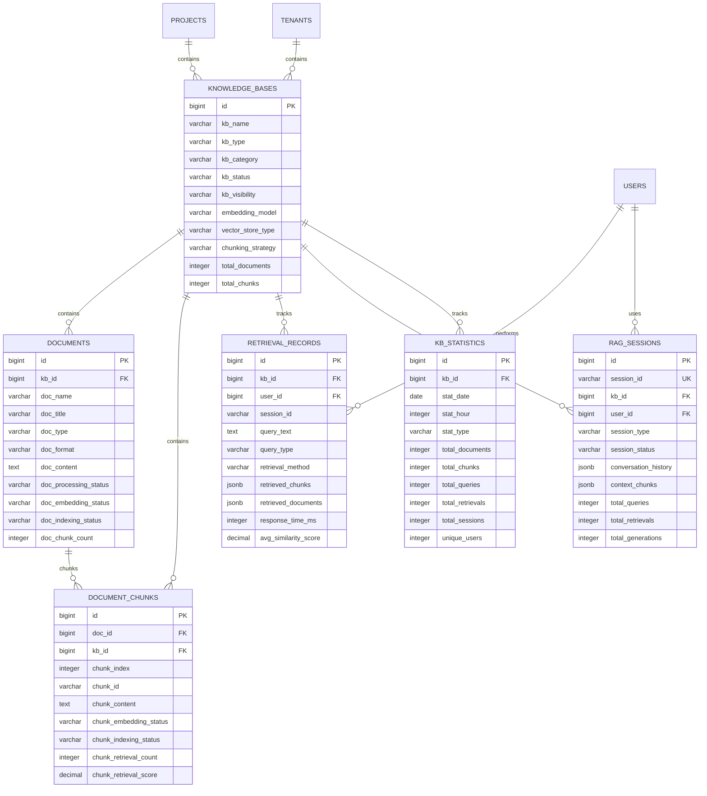

# 知识库管理模块数据模型设计

> **模块名称**: knowledge_base  
> **文档版本**: v1.0  
> **更新日期**: 2025-10-17

## 一、模块概述

### 1.1 功能描述

知识库管理模块负责LLMOps平台的知识库管理、文档处理、向量存储和检索服务。支持多种文档格式、智能分块、向量化处理、语义检索和RAG应用。

### 1.2 核心功能

- **知识库管理**: 知识库创建、配置、版本控制、权限管理
- **文档处理**: 文档上传、解析、分块、预处理
- **向量存储**: 向量化处理、向量存储、索引管理
- **检索服务**: 语义检索、混合检索、结果排序
- **RAG应用**: 检索增强生成、上下文管理、答案生成

## 二、数据表设计

### 2.1 知识库表 (knowledge_bases)

```sql
CREATE TABLE knowledge_bases (
    id BIGSERIAL PRIMARY KEY,
    uuid UUID NOT NULL DEFAULT gen_random_uuid(),
    kb_name VARCHAR(200) NOT NULL,
    kb_description TEXT,
    kb_type VARCHAR(50) NOT NULL CHECK (kb_type IN ('general', 'domain_specific', 'technical', 'legal', 'medical', 'financial', 'custom')),
    kb_category VARCHAR(100),
    kb_language VARCHAR(10) DEFAULT 'en',
    kb_domain VARCHAR(100),
    kb_version VARCHAR(50) NOT NULL DEFAULT '1.0.0',
    kb_status VARCHAR(20) NOT NULL DEFAULT 'active' CHECK (kb_status IN ('active', 'inactive', 'archived', 'deleted')),
    kb_visibility VARCHAR(20) NOT NULL DEFAULT 'private' CHECK (kb_visibility IN ('private', 'internal', 'public')),
    kb_config JSONB NOT NULL DEFAULT '{}',
    embedding_model VARCHAR(100) NOT NULL DEFAULT 'text-embedding-ada-002',
    embedding_dimension INTEGER NOT NULL DEFAULT 1536,
    chunking_strategy VARCHAR(50) NOT NULL DEFAULT 'semantic' CHECK (chunking_strategy IN ('fixed_size', 'semantic', 'paragraph', 'sentence', 'custom')),
    chunk_size INTEGER NOT NULL DEFAULT 1000,
    chunk_overlap INTEGER NOT NULL DEFAULT 200,
    max_chunks INTEGER NOT NULL DEFAULT 10000,
    vector_store_type VARCHAR(50) NOT NULL DEFAULT 'pinecone' CHECK (vector_store_type IN ('pinecone', 'weaviate', 'chroma', 'qdrant', 'milvus', 'elasticsearch', 'custom')),
    vector_store_config JSONB DEFAULT '{}',
    retrieval_config JSONB DEFAULT '{}',
    indexing_config JSONB DEFAULT '{}',
    quality_metrics JSONB DEFAULT '{}',
    usage_statistics JSONB DEFAULT '{}',
    total_documents INTEGER NOT NULL DEFAULT 0,
    total_chunks INTEGER NOT NULL DEFAULT 0,
    total_size_bytes BIGINT NOT NULL DEFAULT 0,
    last_indexed_at TIMESTAMP WITH TIME ZONE,
    last_updated_at TIMESTAMP WITH TIME ZONE,
    metadata JSONB DEFAULT '{}',
    tags TEXT[],
    is_featured BOOLEAN NOT NULL DEFAULT FALSE,
    is_official BOOLEAN NOT NULL DEFAULT FALSE,
    download_count INTEGER NOT NULL DEFAULT 0,
    usage_count INTEGER NOT NULL DEFAULT 0,
    project_id BIGINT NOT NULL,
    tenant_id BIGINT NOT NULL,
    created_at TIMESTAMP WITH TIME ZONE NOT NULL DEFAULT NOW(),
    updated_at TIMESTAMP WITH TIME ZONE NOT NULL DEFAULT NOW(),
    created_by BIGINT,
    updated_by BIGINT
);

-- 索引
CREATE INDEX idx_knowledge_bases_kb_name ON knowledge_bases(kb_name);
CREATE INDEX idx_knowledge_bases_kb_type ON knowledge_bases(kb_type);
CREATE INDEX idx_knowledge_bases_kb_category ON knowledge_bases(kb_category);
CREATE INDEX idx_knowledge_bases_kb_language ON knowledge_bases(kb_language);
CREATE INDEX idx_knowledge_bases_kb_domain ON knowledge_bases(kb_domain);
CREATE INDEX idx_knowledge_bases_kb_status ON knowledge_bases(kb_status);
CREATE INDEX idx_knowledge_bases_kb_visibility ON knowledge_bases(kb_visibility);
CREATE INDEX idx_knowledge_bases_embedding_model ON knowledge_bases(embedding_model);
CREATE INDEX idx_knowledge_bases_vector_store_type ON knowledge_bases(vector_store_type);
CREATE INDEX idx_knowledge_bases_chunking_strategy ON knowledge_bases(chunking_strategy);
CREATE INDEX idx_knowledge_bases_project_id ON knowledge_bases(project_id);
CREATE INDEX idx_knowledge_bases_tenant_id ON knowledge_bases(tenant_id);
CREATE INDEX idx_knowledge_bases_is_featured ON knowledge_bases(is_featured);
CREATE INDEX idx_knowledge_bases_is_official ON knowledge_bases(is_official);
CREATE INDEX idx_knowledge_bases_created_at ON knowledge_bases(created_at);
CREATE INDEX idx_knowledge_bases_tags ON knowledge_bases USING GIN(tags);

-- 外键
ALTER TABLE knowledge_bases ADD CONSTRAINT fk_knowledge_bases_project 
    FOREIGN KEY (project_id) REFERENCES projects(id) ON DELETE CASCADE;
ALTER TABLE knowledge_bases ADD CONSTRAINT fk_knowledge_bases_tenant 
    FOREIGN KEY (tenant_id) REFERENCES tenants(id) ON DELETE CASCADE;

-- 注释
COMMENT ON TABLE knowledge_bases IS '知识库表';
COMMENT ON COLUMN knowledge_bases.kb_name IS '知识库名称';
COMMENT ON COLUMN knowledge_bases.kb_type IS '知识库类型：general-通用，domain_specific-领域特定，technical-技术，legal-法律，medical-医疗，financial-金融，custom-自定义';
COMMENT ON COLUMN knowledge_bases.kb_category IS '知识库分类';
COMMENT ON COLUMN knowledge_bases.kb_language IS '知识库语言';
COMMENT ON COLUMN knowledge_bases.kb_domain IS '知识库领域';
COMMENT ON COLUMN knowledge_bases.kb_version IS '知识库版本';
COMMENT ON COLUMN knowledge_bases.kb_status IS '知识库状态：active-活跃，inactive-非活跃，archived-已归档，deleted-已删除';
COMMENT ON COLUMN knowledge_bases.kb_visibility IS '知识库可见性：private-私有，internal-内部，public-公开';
COMMENT ON COLUMN knowledge_bases.kb_config IS '知识库配置，JSON格式';
COMMENT ON COLUMN knowledge_bases.embedding_model IS '嵌入模型';
COMMENT ON COLUMN knowledge_bases.embedding_dimension IS '嵌入维度';
COMMENT ON COLUMN knowledge_bases.chunking_strategy IS '分块策略：fixed_size-固定大小，semantic-语义，paragraph-段落，sentence-句子，custom-自定义';
COMMENT ON COLUMN knowledge_bases.chunk_size IS '分块大小';
COMMENT ON COLUMN knowledge_bases.chunk_overlap IS '分块重叠';
COMMENT ON COLUMN knowledge_bases.max_chunks IS '最大分块数';
COMMENT ON COLUMN knowledge_bases.vector_store_type IS '向量存储类型：pinecone-Pinecone，weaviate-Weaviate，chroma-Chroma，qdrant-Qdrant，milvus-Milvus，elasticsearch-Elasticsearch，custom-自定义';
COMMENT ON COLUMN knowledge_bases.vector_store_config IS '向量存储配置，JSON格式';
COMMENT ON COLUMN knowledge_bases.retrieval_config IS '检索配置，JSON格式';
COMMENT ON COLUMN knowledge_bases.indexing_config IS '索引配置，JSON格式';
COMMENT ON COLUMN knowledge_bases.quality_metrics IS '质量指标，JSON格式';
COMMENT ON COLUMN knowledge_bases.usage_statistics IS '使用统计，JSON格式';
COMMENT ON COLUMN knowledge_bases.total_documents IS '总文档数';
COMMENT ON COLUMN knowledge_bases.total_chunks IS '总分块数';
COMMENT ON COLUMN knowledge_bases.total_size_bytes IS '总大小，单位字节';
COMMENT ON COLUMN knowledge_bases.last_indexed_at IS '最后索引时间';
COMMENT ON COLUMN knowledge_bases.last_updated_at IS '最后更新时间';
COMMENT ON COLUMN knowledge_bases.metadata IS '元数据，JSON格式';
COMMENT ON COLUMN knowledge_bases.tags IS '标签';
COMMENT ON COLUMN knowledge_bases.is_featured IS '是否推荐';
COMMENT ON COLUMN knowledge_bases.is_official IS '是否官方';
COMMENT ON COLUMN knowledge_bases.download_count IS '下载次数';
COMMENT ON COLUMN knowledge_bases.usage_count IS '使用次数';
```

### 2.2 文档表 (documents)

```sql
CREATE TABLE documents (
    id BIGSERIAL PRIMARY KEY,
    uuid UUID NOT NULL DEFAULT gen_random_uuid(),
    kb_id BIGINT NOT NULL,
    doc_name VARCHAR(255) NOT NULL,
    doc_title VARCHAR(500),
    doc_description TEXT,
    doc_type VARCHAR(50) NOT NULL CHECK (doc_type IN ('text', 'pdf', 'docx', 'html', 'markdown', 'json', 'csv', 'xml', 'yaml', 'custom')),
    doc_format VARCHAR(20) NOT NULL CHECK (doc_format IN ('plain', 'structured', 'semi_structured', 'unstructured')),
    doc_language VARCHAR(10) DEFAULT 'en',
    doc_category VARCHAR(100),
    doc_tags TEXT[],
    doc_content TEXT,
    doc_content_hash VARCHAR(64),
    doc_size_bytes BIGINT NOT NULL DEFAULT 0,
    doc_encoding VARCHAR(20) DEFAULT 'utf-8',
    doc_metadata JSONB DEFAULT '{}',
    doc_schema JSONB,
    doc_quality_score DECIMAL(3,2) CHECK (doc_quality_score >= 0 AND doc_quality_score <= 1),
    doc_completeness_score DECIMAL(3,2) CHECK (doc_completeness_score >= 0 AND doc_completeness_score <= 1),
    doc_relevance_score DECIMAL(3,2) CHECK (doc_relevance_score >= 0 AND doc_relevance_score <= 1),
    doc_processing_status VARCHAR(20) NOT NULL DEFAULT 'pending' CHECK (doc_processing_status IN ('pending', 'processing', 'completed', 'failed', 'skipped')),
    doc_processing_error TEXT,
    doc_processing_config JSONB DEFAULT '{}',
    doc_processing_metadata JSONB DEFAULT '{}',
    doc_chunk_count INTEGER NOT NULL DEFAULT 0,
    doc_embedding_status VARCHAR(20) NOT NULL DEFAULT 'pending' CHECK (doc_embedding_status IN ('pending', 'processing', 'completed', 'failed', 'skipped')),
    doc_embedding_error TEXT,
    doc_embedding_metadata JSONB DEFAULT '{}',
    doc_indexing_status VARCHAR(20) NOT NULL DEFAULT 'pending' CHECK (doc_indexing_status IN ('pending', 'processing', 'completed', 'failed', 'skipped')),
    doc_indexing_error TEXT,
    doc_indexing_metadata JSONB DEFAULT '{}',
    doc_file_path VARCHAR(500),
    doc_file_url VARCHAR(500),
    doc_file_hash VARCHAR(64),
    doc_file_size BIGINT,
    doc_file_mime_type VARCHAR(100),
    doc_source VARCHAR(200),
    doc_author VARCHAR(200),
    doc_created_date DATE,
    doc_updated_date DATE,
    doc_version VARCHAR(50) DEFAULT '1.0.0',
    doc_license VARCHAR(100),
    doc_copyright VARCHAR(200),
    doc_access_level VARCHAR(20) NOT NULL DEFAULT 'private' CHECK (doc_access_level IN ('private', 'internal', 'public', 'restricted')),
    doc_retention_days INTEGER,
    doc_expires_at TIMESTAMP WITH TIME ZONE,
    is_featured BOOLEAN NOT NULL DEFAULT FALSE,
    is_archived BOOLEAN NOT NULL DEFAULT FALSE,
    download_count INTEGER NOT NULL DEFAULT 0,
    view_count INTEGER NOT NULL DEFAULT 0,
    created_at TIMESTAMP WITH TIME ZONE NOT NULL DEFAULT NOW(),
    updated_at TIMESTAMP WITH TIME ZONE NOT NULL DEFAULT NOW(),
    created_by BIGINT,
    updated_by BIGINT
);

-- 索引
CREATE INDEX idx_documents_kb_id ON documents(kb_id);
CREATE INDEX idx_documents_doc_name ON documents(doc_name);
CREATE INDEX idx_documents_doc_title ON documents(doc_title);
CREATE INDEX idx_documents_doc_type ON documents(doc_type);
CREATE INDEX idx_documents_doc_format ON documents(doc_format);
CREATE INDEX idx_documents_doc_language ON documents(doc_language);
CREATE INDEX idx_documents_doc_category ON documents(doc_category);
CREATE INDEX idx_documents_doc_processing_status ON documents(doc_processing_status);
CREATE INDEX idx_documents_doc_embedding_status ON documents(doc_embedding_status);
CREATE INDEX idx_documents_doc_indexing_status ON documents(doc_indexing_status);
CREATE INDEX idx_documents_doc_access_level ON documents(doc_access_level);
CREATE INDEX idx_documents_doc_created_date ON documents(doc_created_date);
CREATE INDEX idx_documents_doc_updated_date ON documents(doc_updated_date);
CREATE INDEX idx_documents_doc_expires_at ON documents(doc_expires_at);
CREATE INDEX idx_documents_is_featured ON documents(is_featured);
CREATE INDEX idx_documents_is_archived ON documents(is_archived);
CREATE INDEX idx_documents_created_at ON documents(created_at);
CREATE INDEX idx_documents_tags ON documents USING GIN(doc_tags);

-- 外键
ALTER TABLE documents ADD CONSTRAINT fk_documents_kb 
    FOREIGN KEY (kb_id) REFERENCES knowledge_bases(id) ON DELETE CASCADE;

-- 注释
COMMENT ON TABLE documents IS '文档表';
COMMENT ON COLUMN documents.kb_id IS '知识库ID';
COMMENT ON COLUMN documents.doc_name IS '文档名称';
COMMENT ON COLUMN documents.doc_title IS '文档标题';
COMMENT ON COLUMN documents.doc_description IS '文档描述';
COMMENT ON COLUMN documents.doc_type IS '文档类型：text-文本，pdf-PDF，docx-DOCX，html-HTML，markdown-Markdown，json-JSON，csv-CSV，xml-XML，yaml-YAML，custom-自定义';
COMMENT ON COLUMN documents.doc_format IS '文档格式：plain-纯文本，structured-结构化，semi_structured-半结构化，unstructured-非结构化';
COMMENT ON COLUMN documents.doc_language IS '文档语言';
COMMENT ON COLUMN documents.doc_category IS '文档分类';
COMMENT ON COLUMN documents.doc_tags IS '文档标签';
COMMENT ON COLUMN documents.doc_content IS '文档内容';
COMMENT ON COLUMN documents.doc_content_hash IS '文档内容哈希值';
COMMENT ON COLUMN documents.doc_size_bytes IS '文档大小，单位字节';
COMMENT ON COLUMN documents.doc_encoding IS '文档编码';
COMMENT ON COLUMN documents.doc_metadata IS '文档元数据，JSON格式';
COMMENT ON COLUMN documents.doc_schema IS '文档模式，JSON格式';
COMMENT ON COLUMN documents.doc_quality_score IS '文档质量评分，0-1';
COMMENT ON COLUMN documents.doc_completeness_score IS '文档完整性评分，0-1';
COMMENT ON COLUMN documents.doc_relevance_score IS '文档相关性评分，0-1';
COMMENT ON COLUMN documents.doc_processing_status IS '文档处理状态：pending-等待中，processing-处理中，completed-已完成，failed-失败，skipped-已跳过';
COMMENT ON COLUMN documents.doc_processing_error IS '文档处理错误';
COMMENT ON COLUMN documents.doc_processing_config IS '文档处理配置，JSON格式';
COMMENT ON COLUMN documents.doc_processing_metadata IS '文档处理元数据，JSON格式';
COMMENT ON COLUMN documents.doc_chunk_count IS '文档分块数';
COMMENT ON COLUMN documents.doc_embedding_status IS '文档嵌入状态：pending-等待中，processing-处理中，completed-已完成，failed-失败，skipped-已跳过';
COMMENT ON COLUMN documents.doc_embedding_error IS '文档嵌入错误';
COMMENT ON COLUMN documents.doc_embedding_metadata IS '文档嵌入元数据，JSON格式';
COMMENT ON COLUMN documents.doc_indexing_status IS '文档索引状态：pending-等待中，processing-处理中，completed-已完成，failed-失败，skipped-已跳过';
COMMENT ON COLUMN documents.doc_indexing_error IS '文档索引错误';
COMMENT ON COLUMN documents.doc_indexing_metadata IS '文档索引元数据，JSON格式';
COMMENT ON COLUMN documents.doc_file_path IS '文档文件路径';
COMMENT ON COLUMN documents.doc_file_url IS '文档文件URL';
COMMENT ON COLUMN documents.doc_file_hash IS '文档文件哈希值';
COMMENT ON COLUMN documents.doc_file_size IS '文档文件大小';
COMMENT ON COLUMN documents.doc_file_mime_type IS '文档文件MIME类型';
COMMENT ON COLUMN documents.doc_source IS '文档来源';
COMMENT ON COLUMN documents.doc_author IS '文档作者';
COMMENT ON COLUMN documents.doc_created_date IS '文档创建日期';
COMMENT ON COLUMN documents.doc_updated_date IS '文档更新日期';
COMMENT ON COLUMN documents.doc_version IS '文档版本';
COMMENT ON COLUMN documents.doc_license IS '文档许可证';
COMMENT ON COLUMN documents.doc_copyright IS '文档版权';
COMMENT ON COLUMN documents.doc_access_level IS '文档访问级别：private-私有，internal-内部，public-公开，restricted-受限';
COMMENT ON COLUMN documents.doc_retention_days IS '文档保留天数';
COMMENT ON COLUMN documents.doc_expires_at IS '文档过期时间';
COMMENT ON COLUMN documents.is_featured IS '是否推荐';
COMMENT ON COLUMN documents.is_archived IS '是否归档';
COMMENT ON COLUMN documents.download_count IS '下载次数';
COMMENT ON COLUMN documents.view_count IS '查看次数';
```

### 2.3 文档分块表 (document_chunks)

```sql
CREATE TABLE document_chunks (
    id BIGSERIAL PRIMARY KEY,
    uuid UUID NOT NULL DEFAULT gen_random_uuid(),
    doc_id BIGINT NOT NULL,
    kb_id BIGINT NOT NULL,
    chunk_index INTEGER NOT NULL,
    chunk_id VARCHAR(100) NOT NULL,
    chunk_title VARCHAR(500),
    chunk_content TEXT NOT NULL,
    chunk_content_hash VARCHAR(64) NOT NULL,
    chunk_size_bytes INTEGER NOT NULL,
    chunk_token_count INTEGER,
    chunk_type VARCHAR(50) CHECK (chunk_type IN ('paragraph', 'section', 'page', 'sentence', 'custom')),
    chunk_level INTEGER NOT NULL DEFAULT 1,
    chunk_parent_id VARCHAR(100),
    chunk_children_ids TEXT[],
    chunk_metadata JSONB DEFAULT '{}',
    chunk_quality_score DECIMAL(3,2) CHECK (chunk_quality_score >= 0 AND chunk_quality_score <= 1),
    chunk_relevance_score DECIMAL(3,2) CHECK (chunk_relevance_score >= 0 AND chunk_relevance_score <= 1),
    chunk_embedding_status VARCHAR(20) NOT NULL DEFAULT 'pending' CHECK (chunk_embedding_status IN ('pending', 'processing', 'completed', 'failed', 'skipped')),
    chunk_embedding_error TEXT,
    chunk_embedding_model VARCHAR(100),
    chunk_embedding_dimension INTEGER,
    chunk_embedding_vector BYTEA,
    chunk_embedding_metadata JSONB DEFAULT '{}',
    chunk_indexing_status VARCHAR(20) NOT NULL DEFAULT 'pending' CHECK (chunk_indexing_status IN ('pending', 'processing', 'completed', 'failed', 'skipped')),
    chunk_indexing_error TEXT,
    chunk_indexing_metadata JSONB DEFAULT '{}',
    chunk_retrieval_count INTEGER NOT NULL DEFAULT 0,
    chunk_retrieval_score DECIMAL(5,4),
    chunk_retrieval_metadata JSONB DEFAULT '{}',
    chunk_created_at TIMESTAMP WITH TIME ZONE NOT NULL DEFAULT NOW(),
    chunk_updated_at TIMESTAMP WITH TIME ZONE NOT NULL DEFAULT NOW(),
    created_at TIMESTAMP WITH TIME ZONE NOT NULL DEFAULT NOW(),
    updated_at TIMESTAMP WITH TIME ZONE NOT NULL DEFAULT NOW()
);

-- 索引
CREATE INDEX idx_document_chunks_doc_id ON document_chunks(doc_id);
CREATE INDEX idx_document_chunks_kb_id ON document_chunks(kb_id);
CREATE INDEX idx_document_chunks_chunk_index ON document_chunks(chunk_index);
CREATE INDEX idx_document_chunks_chunk_id ON document_chunks(chunk_id);
CREATE INDEX idx_document_chunks_chunk_type ON document_chunks(chunk_type);
CREATE INDEX idx_document_chunks_chunk_level ON document_chunks(chunk_level);
CREATE INDEX idx_document_chunks_chunk_parent_id ON document_chunks(chunk_parent_id);
CREATE INDEX idx_document_chunks_chunk_embedding_status ON document_chunks(chunk_embedding_status);
CREATE INDEX idx_document_chunks_chunk_indexing_status ON document_chunks(chunk_indexing_status);
CREATE INDEX idx_document_chunks_chunk_retrieval_count ON document_chunks(chunk_retrieval_count);
CREATE INDEX idx_document_chunks_chunk_retrieval_score ON document_chunks(chunk_retrieval_score);
CREATE INDEX idx_document_chunks_chunk_created_at ON document_chunks(chunk_created_at);
CREATE INDEX idx_document_chunks_created_at ON document_chunks(created_at);

-- 外键
ALTER TABLE document_chunks ADD CONSTRAINT fk_document_chunks_doc 
    FOREIGN KEY (doc_id) REFERENCES documents(id) ON DELETE CASCADE;
ALTER TABLE document_chunks ADD CONSTRAINT fk_document_chunks_kb 
    FOREIGN KEY (kb_id) REFERENCES knowledge_bases(id) ON DELETE CASCADE;

-- 注释
COMMENT ON TABLE document_chunks IS '文档分块表';
COMMENT ON COLUMN document_chunks.doc_id IS '文档ID';
COMMENT ON COLUMN document_chunks.kb_id IS '知识库ID';
COMMENT ON COLUMN document_chunks.chunk_index IS '分块索引';
COMMENT ON COLUMN document_chunks.chunk_id IS '分块ID';
COMMENT ON COLUMN document_chunks.chunk_title IS '分块标题';
COMMENT ON COLUMN document_chunks.chunk_content IS '分块内容';
COMMENT ON COLUMN document_chunks.chunk_content_hash IS '分块内容哈希值';
COMMENT ON COLUMN document_chunks.chunk_size_bytes IS '分块大小，单位字节';
COMMENT ON COLUMN document_chunks.chunk_token_count IS '分块Token数量';
COMMENT ON COLUMN document_chunks.chunk_type IS '分块类型：paragraph-段落，section-章节，page-页面，sentence-句子，custom-自定义';
COMMENT ON COLUMN document_chunks.chunk_level IS '分块级别';
COMMENT ON COLUMN document_chunks.chunk_parent_id IS '父分块ID';
COMMENT ON COLUMN document_chunks.chunk_children_ids IS '子分块ID列表';
COMMENT ON COLUMN document_chunks.chunk_metadata IS '分块元数据，JSON格式';
COMMENT ON COLUMN document_chunks.chunk_quality_score IS '分块质量评分，0-1';
COMMENT ON COLUMN document_chunks.chunk_relevance_score IS '分块相关性评分，0-1';
COMMENT ON COLUMN document_chunks.chunk_embedding_status IS '分块嵌入状态：pending-等待中，processing-处理中，completed-已完成，failed-失败，skipped-已跳过';
COMMENT ON COLUMN document_chunks.chunk_embedding_error IS '分块嵌入错误';
COMMENT ON COLUMN document_chunks.chunk_embedding_model IS '分块嵌入模型';
COMMENT ON COLUMN document_chunks.chunk_embedding_dimension IS '分块嵌入维度';
COMMENT ON COLUMN document_chunks.chunk_embedding_vector IS '分块嵌入向量';
COMMENT ON COLUMN document_chunks.chunk_embedding_metadata IS '分块嵌入元数据，JSON格式';
COMMENT ON COLUMN document_chunks.chunk_indexing_status IS '分块索引状态：pending-等待中，processing-处理中，completed-已完成，failed-失败，skipped-已跳过';
COMMENT ON COLUMN document_chunks.chunk_indexing_error IS '分块索引错误';
COMMENT ON COLUMN document_chunks.chunk_indexing_metadata IS '分块索引元数据，JSON格式';
COMMENT ON COLUMN document_chunks.chunk_retrieval_count IS '分块检索次数';
COMMENT ON COLUMN document_chunks.chunk_retrieval_score IS '分块检索分数';
COMMENT ON COLUMN document_chunks.chunk_retrieval_metadata IS '分块检索元数据，JSON格式';
COMMENT ON COLUMN document_chunks.chunk_created_at IS '分块创建时间';
COMMENT ON COLUMN document_chunks.chunk_updated_at IS '分块更新时间';
```

### 2.4 检索记录表 (retrieval_records)

```sql
CREATE TABLE retrieval_records (
    id BIGSERIAL PRIMARY KEY,
    uuid UUID NOT NULL DEFAULT gen_random_uuid(),
    kb_id BIGINT NOT NULL,
    user_id BIGINT,
    tenant_id BIGINT,
    project_id BIGINT,
    session_id VARCHAR(100),
    request_id VARCHAR(100),
    query_text TEXT NOT NULL,
    query_type VARCHAR(50) NOT NULL CHECK (query_type IN ('semantic', 'keyword', 'hybrid', 'faceted', 'custom')),
    query_embedding BYTEA,
    query_metadata JSONB DEFAULT '{}',
    retrieval_method VARCHAR(50) NOT NULL CHECK (retrieval_method IN ('vector_similarity', 'bm25', 'hybrid', 'rerank', 'custom')),
    retrieval_config JSONB DEFAULT '{}',
    top_k INTEGER NOT NULL DEFAULT 10,
    similarity_threshold DECIMAL(5,4),
    filter_conditions JSONB DEFAULT '{}',
    retrieved_chunks JSONB NOT NULL DEFAULT '[]',
    retrieved_documents JSONB NOT NULL DEFAULT '[]',
    retrieval_scores JSONB DEFAULT '{}',
    retrieval_metadata JSONB DEFAULT '{}',
    response_time_ms INTEGER,
    total_chunks INTEGER NOT NULL DEFAULT 0,
    total_documents INTEGER NOT NULL DEFAULT 0,
    avg_similarity_score DECIMAL(5,4),
    max_similarity_score DECIMAL(5,4),
    min_similarity_score DECIMAL(5,4),
    retrieval_quality_score DECIMAL(3,2) CHECK (retrieval_quality_score >= 0 AND retrieval_quality_score <= 1),
    user_feedback VARCHAR(20) CHECK (user_feedback IN ('positive', 'negative', 'neutral', 'not_provided')),
    user_rating INTEGER CHECK (user_rating >= 1 AND user_rating <= 5),
    user_comment TEXT,
    is_successful BOOLEAN NOT NULL DEFAULT TRUE,
    error_message TEXT,
    error_details JSONB,
    ip_address INET,
    user_agent TEXT,
    created_at TIMESTAMP WITH TIME ZONE NOT NULL DEFAULT NOW()
);

-- 索引
CREATE INDEX idx_retrieval_records_kb_id ON retrieval_records(kb_id);
CREATE INDEX idx_retrieval_records_user_id ON retrieval_records(user_id);
CREATE INDEX idx_retrieval_records_tenant_id ON retrieval_records(tenant_id);
CREATE INDEX idx_retrieval_records_project_id ON retrieval_records(project_id);
CREATE INDEX idx_retrieval_records_session_id ON retrieval_records(session_id);
CREATE INDEX idx_retrieval_records_request_id ON retrieval_records(request_id);
CREATE INDEX idx_retrieval_records_query_type ON retrieval_records(query_type);
CREATE INDEX idx_retrieval_records_retrieval_method ON retrieval_records(retrieval_method);
CREATE INDEX idx_retrieval_records_top_k ON retrieval_records(top_k);
CREATE INDEX idx_retrieval_records_similarity_threshold ON retrieval_records(similarity_threshold);
CREATE INDEX idx_retrieval_records_response_time_ms ON retrieval_records(response_time_ms);
CREATE INDEX idx_retrieval_records_avg_similarity_score ON retrieval_records(avg_similarity_score);
CREATE INDEX idx_retrieval_records_retrieval_quality_score ON retrieval_records(retrieval_quality_score);
CREATE INDEX idx_retrieval_records_user_feedback ON retrieval_records(user_feedback);
CREATE INDEX idx_retrieval_records_user_rating ON retrieval_records(user_rating);
CREATE INDEX idx_retrieval_records_is_successful ON retrieval_records(is_successful);
CREATE INDEX idx_retrieval_records_created_at ON retrieval_records(created_at);

-- 外键
ALTER TABLE retrieval_records ADD CONSTRAINT fk_retrieval_records_kb 
    FOREIGN KEY (kb_id) REFERENCES knowledge_bases(id) ON DELETE CASCADE;
ALTER TABLE retrieval_records ADD CONSTRAINT fk_retrieval_records_user 
    FOREIGN KEY (user_id) REFERENCES users(id) ON DELETE SET NULL;
ALTER TABLE retrieval_records ADD CONSTRAINT fk_retrieval_records_tenant 
    FOREIGN KEY (tenant_id) REFERENCES tenants(id) ON DELETE SET NULL;
ALTER TABLE retrieval_records ADD CONSTRAINT fk_retrieval_records_project 
    FOREIGN KEY (project_id) REFERENCES projects(id) ON DELETE SET NULL;

-- 注释
COMMENT ON TABLE retrieval_records IS '检索记录表';
COMMENT ON COLUMN retrieval_records.kb_id IS '知识库ID';
COMMENT ON COLUMN retrieval_records.user_id IS '用户ID';
COMMENT ON COLUMN retrieval_records.tenant_id IS '租户ID';
COMMENT ON COLUMN retrieval_records.project_id IS '项目ID';
COMMENT ON COLUMN retrieval_records.session_id IS '会话ID';
COMMENT ON COLUMN retrieval_records.request_id IS '请求ID';
COMMENT ON COLUMN retrieval_records.query_text IS '查询文本';
COMMENT ON COLUMN retrieval_records.query_type IS '查询类型：semantic-语义，keyword-关键词，hybrid-混合，faceted-分面，custom-自定义';
COMMENT ON COLUMN retrieval_records.query_embedding IS '查询嵌入向量';
COMMENT ON COLUMN retrieval_records.query_metadata IS '查询元数据，JSON格式';
COMMENT ON COLUMN retrieval_records.retrieval_method IS '检索方法：vector_similarity-向量相似度，bm25-BM25，hybrid-混合，rerank-重排序，custom-自定义';
COMMENT ON COLUMN retrieval_records.retrieval_config IS '检索配置，JSON格式';
COMMENT ON COLUMN retrieval_records.top_k IS '返回结果数量';
COMMENT ON COLUMN retrieval_records.similarity_threshold IS '相似度阈值';
COMMENT ON COLUMN retrieval_records.filter_conditions IS '过滤条件，JSON格式';
COMMENT ON COLUMN retrieval_records.retrieved_chunks IS '检索到的分块，JSON格式';
COMMENT ON COLUMN retrieval_records.retrieved_documents IS '检索到的文档，JSON格式';
COMMENT ON COLUMN retrieval_records.retrieval_scores IS '检索分数，JSON格式';
COMMENT ON COLUMN retrieval_records.retrieval_metadata IS '检索元数据，JSON格式';
COMMENT ON COLUMN retrieval_records.response_time_ms IS '响应时间，单位毫秒';
COMMENT ON COLUMN retrieval_records.total_chunks IS '总分块数';
COMMENT ON COLUMN retrieval_records.total_documents IS '总文档数';
COMMENT ON COLUMN retrieval_records.avg_similarity_score IS '平均相似度分数';
COMMENT ON COLUMN retrieval_records.max_similarity_score IS '最大相似度分数';
COMMENT ON COLUMN retrieval_records.min_similarity_score IS '最小相似度分数';
COMMENT ON COLUMN retrieval_records.retrieval_quality_score IS '检索质量分数，0-1';
COMMENT ON COLUMN retrieval_records.user_feedback IS '用户反馈：positive-正面，negative-负面，neutral-中性，not_provided-未提供';
COMMENT ON COLUMN retrieval_records.user_rating IS '用户评分，1-5';
COMMENT ON COLUMN retrieval_records.user_comment IS '用户评论';
COMMENT ON COLUMN retrieval_records.is_successful IS '是否成功';
COMMENT ON COLUMN retrieval_records.error_message IS '错误消息';
COMMENT ON COLUMN retrieval_records.error_details IS '错误详情，JSON格式';
COMMENT ON COLUMN retrieval_records.ip_address IS 'IP地址';
COMMENT ON COLUMN retrieval_records.user_agent IS '用户代理';
```

### 2.5 RAG会话表 (rag_sessions)

```sql
CREATE TABLE rag_sessions (
    id BIGSERIAL PRIMARY KEY,
    uuid UUID NOT NULL DEFAULT gen_random_uuid(),
    session_id VARCHAR(100) NOT NULL UNIQUE,
    kb_id BIGINT NOT NULL,
    user_id BIGINT,
    tenant_id BIGINT,
    project_id BIGINT,
    session_name VARCHAR(200),
    session_description TEXT,
    session_type VARCHAR(50) NOT NULL CHECK (session_type IN ('qa', 'chat', 'research', 'analysis', 'custom')),
    session_status VARCHAR(20) NOT NULL DEFAULT 'active' CHECK (session_status IN ('active', 'paused', 'completed', 'cancelled', 'expired')),
    session_config JSONB DEFAULT '{}',
    context_window INTEGER NOT NULL DEFAULT 10,
    max_context_length INTEGER NOT NULL DEFAULT 4000,
    temperature DECIMAL(3,2) NOT NULL DEFAULT 0.7,
    top_p DECIMAL(3,2) NOT NULL DEFAULT 0.9,
    max_tokens INTEGER NOT NULL DEFAULT 1000,
    retrieval_config JSONB DEFAULT '{}',
    generation_config JSONB DEFAULT '{}',
    session_metadata JSONB DEFAULT '{}',
    conversation_history JSONB DEFAULT '[]',
    context_chunks JSONB DEFAULT '[]',
    context_documents JSONB DEFAULT '[]',
    total_queries INTEGER NOT NULL DEFAULT 0,
    total_retrievals INTEGER NOT NULL DEFAULT 0,
    total_generations INTEGER NOT NULL DEFAULT 0,
    avg_response_time_ms INTEGER,
    avg_retrieval_time_ms INTEGER,
    avg_generation_time_ms INTEGER,
    session_quality_score DECIMAL(3,2) CHECK (session_quality_score >= 0 AND session_quality_score <= 1),
    user_satisfaction_score DECIMAL(3,2) CHECK (user_satisfaction_score >= 0 AND user_satisfaction_score <= 1),
    started_at TIMESTAMP WITH TIME ZONE NOT NULL DEFAULT NOW(),
    last_activity_at TIMESTAMP WITH TIME ZONE NOT NULL DEFAULT NOW(),
    ended_at TIMESTAMP WITH TIME ZONE,
    expires_at TIMESTAMP WITH TIME ZONE,
    created_at TIMESTAMP WITH TIME ZONE NOT NULL DEFAULT NOW(),
    updated_at TIMESTAMP WITH TIME ZONE NOT NULL DEFAULT NOW()
);

-- 索引
CREATE INDEX idx_rag_sessions_session_id ON rag_sessions(session_id);
CREATE INDEX idx_rag_sessions_kb_id ON rag_sessions(kb_id);
CREATE INDEX idx_rag_sessions_user_id ON rag_sessions(user_id);
CREATE INDEX idx_rag_sessions_tenant_id ON rag_sessions(tenant_id);
CREATE INDEX idx_rag_sessions_project_id ON rag_sessions(project_id);
CREATE INDEX idx_rag_sessions_session_type ON rag_sessions(session_type);
CREATE INDEX idx_rag_sessions_session_status ON rag_sessions(session_status);
CREATE INDEX idx_rag_sessions_started_at ON rag_sessions(started_at);
CREATE INDEX idx_rag_sessions_last_activity_at ON rag_sessions(last_activity_at);
CREATE INDEX idx_rag_sessions_ended_at ON rag_sessions(ended_at);
CREATE INDEX idx_rag_sessions_expires_at ON rag_sessions(expires_at);
CREATE INDEX idx_rag_sessions_created_at ON rag_sessions(created_at);

-- 外键
ALTER TABLE rag_sessions ADD CONSTRAINT fk_rag_sessions_kb 
    FOREIGN KEY (kb_id) REFERENCES knowledge_bases(id) ON DELETE CASCADE;
ALTER TABLE rag_sessions ADD CONSTRAINT fk_rag_sessions_user 
    FOREIGN KEY (user_id) REFERENCES users(id) ON DELETE SET NULL;
ALTER TABLE rag_sessions ADD CONSTRAINT fk_rag_sessions_tenant 
    FOREIGN KEY (tenant_id) REFERENCES tenants(id) ON DELETE SET NULL;
ALTER TABLE rag_sessions ADD CONSTRAINT fk_rag_sessions_project 
    FOREIGN KEY (project_id) REFERENCES projects(id) ON DELETE SET NULL;

-- 注释
COMMENT ON TABLE rag_sessions IS 'RAG会话表';
COMMENT ON COLUMN rag_sessions.session_id IS '会话ID';
COMMENT ON COLUMN rag_sessions.kb_id IS '知识库ID';
COMMENT ON COLUMN rag_sessions.user_id IS '用户ID';
COMMENT ON COLUMN rag_sessions.tenant_id IS '租户ID';
COMMENT ON COLUMN rag_sessions.project_id IS '项目ID';
COMMENT ON COLUMN rag_sessions.session_name IS '会话名称';
COMMENT ON COLUMN rag_sessions.session_description IS '会话描述';
COMMENT ON COLUMN rag_sessions.session_type IS '会话类型：qa-问答，chat-聊天，research-研究，analysis-分析，custom-自定义';
COMMENT ON COLUMN rag_sessions.session_status IS '会话状态：active-活跃，paused-暂停，completed-已完成，cancelled-已取消，expired-已过期';
COMMENT ON COLUMN rag_sessions.session_config IS '会话配置，JSON格式';
COMMENT ON COLUMN rag_sessions.context_window IS '上下文窗口大小';
COMMENT ON COLUMN rag_sessions.max_context_length IS '最大上下文长度';
COMMENT ON COLUMN rag_sessions.temperature IS '温度参数';
COMMENT ON COLUMN rag_sessions.top_p IS 'top_p参数';
COMMENT ON COLUMN rag_sessions.max_tokens IS '最大Token数';
COMMENT ON COLUMN rag_sessions.retrieval_config IS '检索配置，JSON格式';
COMMENT ON COLUMN rag_sessions.generation_config IS '生成配置，JSON格式';
COMMENT ON COLUMN rag_sessions.session_metadata IS '会话元数据，JSON格式';
COMMENT ON COLUMN rag_sessions.conversation_history IS '对话历史，JSON格式';
COMMENT ON COLUMN rag_sessions.context_chunks IS '上下文分块，JSON格式';
COMMENT ON COLUMN rag_sessions.context_documents IS '上下文文档，JSON格式';
COMMENT ON COLUMN rag_sessions.total_queries IS '总查询数';
COMMENT ON COLUMN rag_sessions.total_retrievals IS '总检索数';
COMMENT ON COLUMN rag_sessions.total_generations IS '总生成数';
COMMENT ON COLUMN rag_sessions.avg_response_time_ms IS '平均响应时间，单位毫秒';
COMMENT ON COLUMN rag_sessions.avg_retrieval_time_ms IS '平均检索时间，单位毫秒';
COMMENT ON COLUMN rag_sessions.avg_generation_time_ms IS '平均生成时间，单位毫秒';
COMMENT ON COLUMN rag_sessions.session_quality_score IS '会话质量分数，0-1';
COMMENT ON COLUMN rag_sessions.user_satisfaction_score IS '用户满意度分数，0-1';
COMMENT ON COLUMN rag_sessions.started_at IS '开始时间';
COMMENT ON COLUMN rag_sessions.last_activity_at IS '最后活动时间';
COMMENT ON COLUMN rag_sessions.ended_at IS '结束时间';
COMMENT ON COLUMN rag_sessions.expires_at IS '过期时间';
```

### 2.6 知识库统计表 (kb_statistics)

```sql
CREATE TABLE kb_statistics (
    id BIGSERIAL PRIMARY KEY,
    uuid UUID NOT NULL DEFAULT gen_random_uuid(),
    kb_id BIGINT NOT NULL,
    stat_date DATE NOT NULL,
    stat_hour INTEGER CHECK (stat_hour >= 0 AND stat_hour <= 23),
    stat_type VARCHAR(20) NOT NULL CHECK (stat_type IN ('hourly', 'daily', 'weekly', 'monthly', 'yearly')),
    total_documents INTEGER NOT NULL DEFAULT 0,
    total_chunks INTEGER NOT NULL DEFAULT 0,
    total_size_bytes BIGINT NOT NULL DEFAULT 0,
    total_queries INTEGER NOT NULL DEFAULT 0,
    total_retrievals INTEGER NOT NULL DEFAULT 0,
    total_sessions INTEGER NOT NULL DEFAULT 0,
    unique_users INTEGER NOT NULL DEFAULT 0,
    avg_query_length INTEGER,
    avg_response_time_ms INTEGER,
    avg_retrieval_time_ms INTEGER,
    avg_similarity_score DECIMAL(5,4),
    avg_retrieval_quality DECIMAL(3,2),
    avg_user_satisfaction DECIMAL(3,2),
    top_queries JSONB DEFAULT '[]',
    top_documents JSONB DEFAULT '[]',
    top_chunks JSONB DEFAULT '[]',
    query_trends JSONB DEFAULT '{}',
    performance_trends JSONB DEFAULT '{}',
    quality_trends JSONB DEFAULT '{}',
    usage_patterns JSONB DEFAULT '{}',
    error_rates JSONB DEFAULT '{}',
    metadata JSONB DEFAULT '{}',
    created_at TIMESTAMP WITH TIME ZONE NOT NULL DEFAULT NOW(),
    updated_at TIMESTAMP WITH TIME ZONE NOT NULL DEFAULT NOW(),
    UNIQUE(kb_id, stat_date, stat_hour, stat_type)
);

-- 索引
CREATE INDEX idx_kb_statistics_kb_id ON kb_statistics(kb_id);
CREATE INDEX idx_kb_statistics_stat_date ON kb_statistics(stat_date);
CREATE INDEX idx_kb_statistics_stat_hour ON kb_statistics(stat_hour);
CREATE INDEX idx_kb_statistics_stat_type ON kb_statistics(stat_type);
CREATE INDEX idx_kb_statistics_total_documents ON kb_statistics(total_documents);
CREATE INDEX idx_kb_statistics_total_chunks ON kb_statistics(total_chunks);
CREATE INDEX idx_kb_statistics_total_queries ON kb_statistics(total_queries);
CREATE INDEX idx_kb_statistics_total_retrievals ON kb_statistics(total_retrievals);
CREATE INDEX idx_kb_statistics_total_sessions ON kb_statistics(total_sessions);
CREATE INDEX idx_kb_statistics_unique_users ON kb_statistics(unique_users);
CREATE INDEX idx_kb_statistics_avg_response_time_ms ON kb_statistics(avg_response_time_ms);
CREATE INDEX idx_kb_statistics_avg_retrieval_time_ms ON kb_statistics(avg_retrieval_time_ms);
CREATE INDEX idx_kb_statistics_avg_similarity_score ON kb_statistics(avg_similarity_score);
CREATE INDEX idx_kb_statistics_avg_retrieval_quality ON kb_statistics(avg_retrieval_quality);
CREATE INDEX idx_kb_statistics_avg_user_satisfaction ON kb_statistics(avg_user_satisfaction);
CREATE INDEX idx_kb_statistics_created_at ON kb_statistics(created_at);

-- 外键
ALTER TABLE kb_statistics ADD CONSTRAINT fk_kb_statistics_kb 
    FOREIGN KEY (kb_id) REFERENCES knowledge_bases(id) ON DELETE CASCADE;

-- 注释
COMMENT ON TABLE kb_statistics IS '知识库统计表';
COMMENT ON COLUMN kb_statistics.kb_id IS '知识库ID';
COMMENT ON COLUMN kb_statistics.stat_date IS '统计日期';
COMMENT ON COLUMN kb_statistics.stat_hour IS '统计小时，0-23，NULL表示全天统计';
COMMENT ON COLUMN kb_statistics.stat_type IS '统计类型：hourly-小时，daily-日，weekly-周，monthly-月，yearly-年';
COMMENT ON COLUMN kb_statistics.total_documents IS '总文档数';
COMMENT ON COLUMN kb_statistics.total_chunks IS '总分块数';
COMMENT ON COLUMN kb_statistics.total_size_bytes IS '总大小，单位字节';
COMMENT ON COLUMN kb_statistics.total_queries IS '总查询数';
COMMENT ON COLUMN kb_statistics.total_retrievals IS '总检索数';
COMMENT ON COLUMN kb_statistics.total_sessions IS '总会话数';
COMMENT ON COLUMN kb_statistics.unique_users IS '唯一用户数';
COMMENT ON COLUMN kb_statistics.avg_query_length IS '平均查询长度';
COMMENT ON COLUMN kb_statistics.avg_response_time_ms IS '平均响应时间，单位毫秒';
COMMENT ON COLUMN kb_statistics.avg_retrieval_time_ms IS '平均检索时间，单位毫秒';
COMMENT ON COLUMN kb_statistics.avg_similarity_score IS '平均相似度分数';
COMMENT ON COLUMN kb_statistics.avg_retrieval_quality IS '平均检索质量';
COMMENT ON COLUMN kb_statistics.avg_user_satisfaction IS '平均用户满意度';
COMMENT ON COLUMN kb_statistics.top_queries IS '热门查询，JSON格式';
COMMENT ON COLUMN kb_statistics.top_documents IS '热门文档，JSON格式';
COMMENT ON COLUMN kb_statistics.top_chunks IS '热门分块，JSON格式';
COMMENT ON COLUMN kb_statistics.query_trends IS '查询趋势，JSON格式';
COMMENT ON COLUMN kb_statistics.performance_trends IS '性能趋势，JSON格式';
COMMENT ON COLUMN kb_statistics.quality_trends IS '质量趋势，JSON格式';
COMMENT ON COLUMN kb_statistics.usage_patterns IS '使用模式，JSON格式';
COMMENT ON COLUMN kb_statistics.error_rates IS '错误率，JSON格式';
COMMENT ON COLUMN kb_statistics.metadata IS '元数据，JSON格式';
```

## 三、数据关系图



## 四、业务规则

### 4.1 知识库管理规则

```yaml
知识库类型:
  - general: 通用知识库
  - domain_specific: 领域特定知识库
  - technical: 技术知识库
  - legal: 法律知识库
  - medical: 医疗知识库
  - financial: 金融知识库
  - custom: 自定义知识库

知识库状态:
  - active: 活跃状态
  - inactive: 非活跃状态
  - archived: 已归档
  - deleted: 已删除

知识库可见性:
  - private: 私有知识库
  - internal: 内部知识库
  - public: 公开知识库

分块策略:
  - fixed_size: 固定大小分块
  - semantic: 语义分块
  - paragraph: 段落分块
  - sentence: 句子分块
  - custom: 自定义分块

向量存储类型:
  - pinecone: Pinecone
  - weaviate: Weaviate
  - chroma: Chroma
  - qdrant: Qdrant
  - milvus: Milvus
  - elasticsearch: Elasticsearch
  - custom: 自定义
```

### 4.2 文档处理规则

```yaml
文档类型:
  - text: 文本文档
  - pdf: PDF文档
  - docx: DOCX文档
  - html: HTML文档
  - markdown: Markdown文档
  - json: JSON文档
  - csv: CSV文档
  - xml: XML文档
  - yaml: YAML文档
  - custom: 自定义文档

文档格式:
  - plain: 纯文本格式
  - structured: 结构化格式
  - semi_structured: 半结构化格式
  - unstructured: 非结构化格式

处理状态:
  - pending: 等待处理
  - processing: 处理中
  - completed: 已完成
  - failed: 处理失败
  - skipped: 已跳过

嵌入状态:
  - pending: 等待嵌入
  - processing: 嵌入中
  - completed: 嵌入完成
  - failed: 嵌入失败
  - skipped: 已跳过

索引状态:
  - pending: 等待索引
  - processing: 索引中
  - completed: 索引完成
  - failed: 索引失败
  - skipped: 已跳过
```

### 4.3 检索规则

```yaml
查询类型:
  - semantic: 语义查询
  - keyword: 关键词查询
  - hybrid: 混合查询
  - faceted: 分面查询
  - custom: 自定义查询

检索方法:
  - vector_similarity: 向量相似度检索
  - bm25: BM25检索
  - hybrid: 混合检索
  - rerank: 重排序检索
  - custom: 自定义检索

检索配置:
  - top_k: 返回结果数量
  - similarity_threshold: 相似度阈值
  - filter_conditions: 过滤条件
  - rerank_config: 重排序配置

质量评估:
  - 检索质量分数：0-1
  - 用户反馈：正面/负面/中性
  - 用户评分：1-5
  - 响应时间：毫秒
```

### 4.4 RAG会话规则

```yaml
会话类型:
  - qa: 问答会话
  - chat: 聊天会话
  - research: 研究会话
  - analysis: 分析会话
  - custom: 自定义会话

会话状态:
  - active: 活跃状态
  - paused: 暂停状态
  - completed: 已完成
  - cancelled: 已取消
  - expired: 已过期

会话配置:
  - context_window: 上下文窗口大小
  - max_context_length: 最大上下文长度
  - temperature: 温度参数
  - top_p: top_p参数
  - max_tokens: 最大Token数

性能指标:
  - 平均响应时间
  - 平均检索时间
  - 平均生成时间
  - 会话质量分数
  - 用户满意度分数
```

## 五、性能优化

### 5.1 索引优化

```sql
-- 复合索引
CREATE INDEX idx_knowledge_bases_project_status ON knowledge_bases(project_id, kb_status);
CREATE INDEX idx_knowledge_bases_tenant_status ON knowledge_bases(tenant_id, kb_status);
CREATE INDEX idx_knowledge_bases_type_category ON knowledge_bases(kb_type, kb_category);
CREATE INDEX idx_knowledge_bases_embedding_model ON knowledge_bases(embedding_model, vector_store_type);
CREATE INDEX idx_documents_kb_status ON documents(kb_id, doc_processing_status);
CREATE INDEX idx_documents_kb_embedding_status ON documents(kb_id, doc_embedding_status);
CREATE INDEX idx_documents_kb_indexing_status ON documents(kb_id, doc_indexing_status);
CREATE INDEX idx_document_chunks_kb_embedding_status ON document_chunks(kb_id, chunk_embedding_status);
CREATE INDEX idx_document_chunks_kb_indexing_status ON document_chunks(kb_id, chunk_indexing_status);
CREATE INDEX idx_document_chunks_kb_retrieval_count ON document_chunks(kb_id, chunk_retrieval_count);
CREATE INDEX idx_retrieval_records_kb_created ON retrieval_records(kb_id, created_at);
CREATE INDEX idx_retrieval_records_user_created ON retrieval_records(user_id, created_at);
CREATE INDEX idx_retrieval_records_query_type_method ON retrieval_records(query_type, retrieval_method);
CREATE INDEX idx_rag_sessions_kb_status ON rag_sessions(kb_id, session_status);
CREATE INDEX idx_rag_sessions_user_status ON rag_sessions(user_id, session_status);
CREATE INDEX idx_rag_sessions_type_status ON rag_sessions(session_type, session_status);
CREATE INDEX idx_kb_statistics_kb_date_type ON kb_statistics(kb_id, stat_date, stat_type);

-- 部分索引
CREATE INDEX idx_knowledge_bases_active ON knowledge_bases(id) WHERE kb_status = 'active';
CREATE INDEX idx_knowledge_bases_public ON knowledge_bases(id) WHERE kb_visibility = 'public';
CREATE INDEX idx_knowledge_bases_featured ON knowledge_bases(id) WHERE is_featured = TRUE;
CREATE INDEX idx_documents_processed ON documents(id) WHERE doc_processing_status = 'completed';
CREATE INDEX idx_documents_embedded ON documents(id) WHERE doc_embedding_status = 'completed';
CREATE INDEX idx_documents_indexed ON documents(id) WHERE doc_indexing_status = 'completed';
CREATE INDEX idx_document_chunks_embedded ON document_chunks(id) WHERE chunk_embedding_status = 'completed';
CREATE INDEX idx_document_chunks_indexed ON document_chunks(id) WHERE chunk_indexing_status = 'completed';
CREATE INDEX idx_retrieval_records_successful ON retrieval_records(id) WHERE is_successful = TRUE;
CREATE INDEX idx_rag_sessions_active ON rag_sessions(id) WHERE session_status = 'active';
CREATE INDEX idx_kb_statistics_recent ON kb_statistics(id) WHERE stat_date >= CURRENT_DATE - INTERVAL '30 days';

-- 表达式索引
CREATE INDEX idx_knowledge_bases_lower_name ON knowledge_bases(lower(kb_name));
CREATE INDEX idx_documents_lower_name ON documents(lower(doc_name));
CREATE INDEX idx_documents_lower_title ON documents(lower(doc_title));
CREATE INDEX idx_retrieval_records_lower_query ON retrieval_records(lower(query_text));
```

### 5.2 查询优化

```sql
-- 知识库统计查询优化
CREATE VIEW kb_performance_summary AS
SELECT 
    kb.id as kb_id,
    kb.kb_name,
    kb.kb_type,
    kb.kb_category,
    kb.total_documents,
    kb.total_chunks,
    kb.total_size_bytes,
    COUNT(d.id) as actual_documents,
    COUNT(dc.id) as actual_chunks,
    COUNT(rr.id) as total_queries,
    COUNT(rs.id) as total_sessions,
    COUNT(DISTINCT rr.user_id) as unique_users,
    AVG(rr.response_time_ms) as avg_response_time,
    AVG(rr.avg_similarity_score) as avg_similarity,
    AVG(rr.retrieval_quality_score) as avg_retrieval_quality,
    AVG(rs.user_satisfaction_score) as avg_user_satisfaction
FROM knowledge_bases kb
LEFT JOIN documents d ON kb.id = d.kb_id
LEFT JOIN document_chunks dc ON kb.id = dc.kb_id
LEFT JOIN retrieval_records rr ON kb.id = rr.kb_id
LEFT JOIN rag_sessions rs ON kb.id = rs.kb_id
WHERE kb.kb_status = 'active'
GROUP BY kb.id, kb.kb_name, kb.kb_type, kb.kb_category, kb.total_documents, kb.total_chunks, kb.total_size_bytes;

-- 文档处理状态查询优化
CREATE VIEW document_processing_status AS
SELECT 
    kb.id as kb_id,
    kb.kb_name,
    d.doc_processing_status,
    d.doc_embedding_status,
    d.doc_indexing_status,
    COUNT(*) as document_count,
    AVG(d.doc_quality_score) as avg_quality_score,
    AVG(d.doc_completeness_score) as avg_completeness_score,
    AVG(d.doc_relevance_score) as avg_relevance_score
FROM knowledge_bases kb
JOIN documents d ON kb.id = d.kb_id
WHERE kb.kb_status = 'active'
GROUP BY kb.id, kb.kb_name, d.doc_processing_status, d.doc_embedding_status, d.doc_indexing_status;

-- 检索性能查询优化
CREATE VIEW retrieval_performance AS
SELECT 
    kb.id as kb_id,
    kb.kb_name,
    rr.query_type,
    rr.retrieval_method,
    COUNT(*) as query_count,
    AVG(rr.response_time_ms) as avg_response_time,
    AVG(rr.avg_similarity_score) as avg_similarity,
    AVG(rr.retrieval_quality_score) as avg_quality,
    COUNT(CASE WHEN rr.user_feedback = 'positive' THEN 1 END) as positive_feedback,
    COUNT(CASE WHEN rr.user_feedback = 'negative' THEN 1 END) as negative_feedback,
    COUNT(CASE WHEN rr.user_feedback = 'neutral' THEN 1 END) as neutral_feedback,
    AVG(rr.user_rating) as avg_rating
FROM knowledge_bases kb
JOIN retrieval_records rr ON kb.id = rr.kb_id
WHERE kb.kb_status = 'active' AND rr.created_at >= NOW() - INTERVAL '30 days'
GROUP BY kb.id, kb.kb_name, rr.query_type, rr.retrieval_method;
```

### 5.3 缓存策略

```yaml
知识库信息缓存:
  - 缓存键: kb:{kb_id}
  - 缓存时间: 2小时
  - 更新策略: 知识库信息变更时主动失效

文档信息缓存:
  - 缓存键: doc:{doc_id}
  - 缓存时间: 1小时
  - 更新策略: 文档信息变更时主动失效

分块信息缓存:
  - 缓存键: chunk:{chunk_id}
  - 缓存时间: 30分钟
  - 更新策略: 分块信息变更时主动失效

检索结果缓存:
  - 缓存键: retrieval:{query_hash}:{kb_id}
  - 缓存时间: 1小时
  - 更新策略: 知识库更新时主动失效

RAG会话缓存:
  - 缓存键: rag_session:{session_id}
  - 缓存时间: 30分钟
  - 更新策略: 会话状态变更时主动失效

统计信息缓存:
  - 缓存键: kb_stats:{kb_id}:{date}
  - 缓存时间: 4小时
  - 更新策略: 统计数据更新时主动失效
```

## 六、安全设计

### 6.1 访问控制

```sql
-- 知识库访问权限检查函数
CREATE OR REPLACE FUNCTION check_kb_access_permission(
    p_user_id BIGINT,
    p_tenant_id BIGINT,
    p_project_id BIGINT,
    p_kb_id BIGINT,
    p_access_level VARCHAR DEFAULT 'read'
) RETURNS BOOLEAN AS $$
DECLARE
    kb_info RECORD;
    user_role VARCHAR;
    required_role VARCHAR;
BEGIN
    -- 获取知识库信息
    SELECT kb.*, p.owner_id, p.tenant_id as project_tenant_id
    INTO kb_info
    FROM knowledge_bases kb
    JOIN projects p ON kb.project_id = p.id
    WHERE kb.id = p_kb_id;
    
    IF kb_info IS NULL THEN
        RETURN FALSE;
    END IF;
    
    -- 检查租户权限
    IF kb_info.tenant_id != p_tenant_id THEN
        RETURN FALSE;
    END IF;
    
    -- 检查知识库可见性
    IF kb_info.kb_visibility = 'public' AND p_access_level = 'read' THEN
        RETURN TRUE;
    END IF;
    
    -- 检查项目权限
    SELECT pm.role INTO user_role
    FROM project_members pm
    WHERE pm.project_id = kb_info.project_id 
      AND pm.user_id = p_user_id 
      AND pm.status = 'active';
    
    IF user_role IS NULL THEN
        RETURN FALSE;
    END IF;
    
    -- 根据访问级别确定所需角色
    required_role := CASE p_access_level
        WHEN 'read' THEN 'viewer'
        WHEN 'write' THEN 'developer'
        WHEN 'admin' THEN 'admin'
        ELSE 'admin'
    END;
    
    -- 检查角色权限
    RETURN CASE user_role
        WHEN 'owner' THEN TRUE
        WHEN 'admin' THEN required_role IN ('admin', 'developer', 'tester', 'viewer')
        WHEN 'developer' THEN required_role IN ('developer', 'tester', 'viewer')
        WHEN 'tester' THEN required_role IN ('tester', 'viewer')
        WHEN 'viewer' THEN required_role = 'viewer'
        ELSE FALSE
    END;
END;
$$ LANGUAGE plpgsql;
```

### 6.2 数据脱敏

```sql
-- 敏感内容脱敏函数
CREATE OR REPLACE FUNCTION mask_sensitive_content(content TEXT, mask_level VARCHAR DEFAULT 'medium')
RETURNS TEXT AS $$
DECLARE
    result TEXT;
BEGIN
    result := content;
    
    -- 根据脱敏级别处理敏感信息
    IF mask_level = 'high' THEN
        -- 高级脱敏：完全隐藏敏感信息
        result := regexp_replace(result, '\b\d{4}[-\s]?\d{4}[-\s]?\d{4}[-\s]?\d{4}\b', '****-****-****-****', 'g'); -- 信用卡号
        result := regexp_replace(result, '\b\d{3}-\d{2}-\d{4}\b', '***-**-****', 'g'); -- SSN
        result := regexp_replace(result, '\b[A-Za-z0-9._%+-]+@[A-Za-z0-9.-]+\.[A-Z|a-z]{2,}\b', '***@***.***', 'g'); -- 邮箱
        result := regexp_replace(result, '\b\d{3}-\d{3}-\d{4}\b', '***-***-****', 'g'); -- 电话号码
    ELSIF mask_level = 'medium' THEN
        -- 中级脱敏：部分隐藏敏感信息
        result := regexp_replace(result, '\b\d{4}[-\s]?\d{4}[-\s]?\d{4}[-\s]?\d{4}\b', '****-****-****-****', 'g'); -- 信用卡号
        result := regexp_replace(result, '\b\d{3}-\d{2}-\d{4}\b', '***-**-****', 'g'); -- SSN
        result := regexp_replace(result, '\b[A-Za-z0-9._%+-]+@[A-Za-z0-9.-]+\.[A-Z|a-z]{2,}\b', '***@***.***', 'g'); -- 邮箱
    ELSIF mask_level = 'low' THEN
        -- 低级脱敏：仅隐藏关键信息
        result := regexp_replace(result, '\b\d{4}[-\s]?\d{4}[-\s]?\d{4}[-\s]?\d{4}\b', '****-****-****-****', 'g'); -- 信用卡号
    END IF;
    
    RETURN result;
END;
$$ LANGUAGE plpgsql;
```

### 6.3 审计日志

```sql
-- 知识库操作审计触发器
CREATE OR REPLACE FUNCTION kb_audit_trigger()
RETURNS TRIGGER AS $$
BEGIN
    IF TG_OP = 'INSERT' THEN
        INSERT INTO audit_logs (
            user_id, tenant_id, project_id, action, resource_type, 
            resource_id, operation, result, new_values
        ) VALUES (
            NEW.created_by, NEW.tenant_id, NEW.project_id, 'knowledge_base_created', 'knowledge_base', 
            NEW.id::TEXT, 'create', 'success', to_jsonb(NEW)
        );
        RETURN NEW;
    ELSIF TG_OP = 'UPDATE' THEN
        INSERT INTO audit_logs (
            user_id, tenant_id, project_id, action, resource_type, 
            resource_id, operation, result, old_values, new_values
        ) VALUES (
            NEW.updated_by, NEW.tenant_id, NEW.project_id, 'knowledge_base_updated', 'knowledge_base', 
            NEW.id::TEXT, 'update', 'success', to_jsonb(OLD), to_jsonb(NEW)
        );
        RETURN NEW;
    ELSIF TG_OP = 'DELETE' THEN
        INSERT INTO audit_logs (
            user_id, tenant_id, project_id, action, resource_type, 
            resource_id, operation, result, old_values
        ) VALUES (
            OLD.updated_by, OLD.tenant_id, OLD.project_id, 'knowledge_base_deleted', 'knowledge_base', 
            OLD.id::TEXT, 'delete', 'success', to_jsonb(OLD)
        );
        RETURN OLD;
    END IF;
    RETURN NULL;
END;
$$ LANGUAGE plpgsql;

-- 为知识库表创建审计触发器
CREATE TRIGGER knowledge_bases_audit_trigger
    AFTER INSERT OR UPDATE OR DELETE ON knowledge_bases
    FOR EACH ROW EXECUTE FUNCTION kb_audit_trigger();
```

## 七、初始化数据

### 7.1 默认知识库配置

```sql
-- 插入默认知识库配置
INSERT INTO knowledge_bases (kb_name, kb_description, kb_type, kb_category, kb_language, kb_domain, kb_config, embedding_model, embedding_dimension, chunking_strategy, chunk_size, chunk_overlap, max_chunks, vector_store_type, vector_store_config, retrieval_config, indexing_config, is_featured, is_official, project_id, tenant_id) VALUES
-- 通用知识库
('General Knowledge Base', '通用知识库，包含各种通用信息', 'general', 'general', 'en', 'general', 
 '{"description": "General purpose knowledge base", "version": "1.0.0"}',
 'text-embedding-ada-002', 1536, 'semantic', 1000, 200, 10000, 'pinecone',
 '{"environment": "production", "index_name": "general-kb"}',
 '{"top_k": 10, "similarity_threshold": 0.7, "rerank": true}',
 '{"batch_size": 100, "parallel_workers": 4}', TRUE, TRUE, 1, 1),

-- 技术知识库
('Technical Knowledge Base', '技术知识库，包含技术文档和API文档', 'technical', 'technology', 'en', 'technology',
 '{"description": "Technical documentation and API references", "version": "1.0.0"}',
 'text-embedding-ada-002', 1536, 'semantic', 800, 150, 15000, 'pinecone',
 '{"environment": "production", "index_name": "technical-kb"}',
 '{"top_k": 15, "similarity_threshold": 0.75, "rerank": true}',
 '{"batch_size": 100, "parallel_workers": 4}', TRUE, TRUE, 1, 1),

-- 法律知识库
('Legal Knowledge Base', '法律知识库，包含法律法规和案例', 'legal', 'legal', 'zh', 'legal',
 '{"description": "Legal documents and case studies", "version": "1.0.0"}',
 'text-embedding-ada-002', 1536, 'paragraph', 1200, 250, 8000, 'pinecone',
 '{"environment": "production", "index_name": "legal-kb"}',
 '{"top_k": 8, "similarity_threshold": 0.8, "rerank": true}',
 '{"batch_size": 50, "parallel_workers": 2}', TRUE, TRUE, 1, 1),

-- 医疗知识库
('Medical Knowledge Base', '医疗知识库，包含医学知识和临床指南', 'medical', 'healthcare', 'en', 'medical',
 '{"description": "Medical knowledge and clinical guidelines", "version": "1.0.0"}',
 'text-embedding-ada-002', 1536, 'semantic', 1000, 200, 12000, 'pinecone',
 '{"environment": "production", "index_name": "medical-kb"}',
 '{"top_k": 12, "similarity_threshold": 0.75, "rerank": true}',
 '{"batch_size": 100, "parallel_workers": 4}', TRUE, TRUE, 1, 1),

-- 金融知识库
('Financial Knowledge Base', '金融知识库，包含金融知识和市场信息', 'financial', 'finance', 'en', 'finance',
 '{"description": "Financial knowledge and market information", "version": "1.0.0"}',
 'text-embedding-ada-002', 1536, 'semantic', 900, 180, 10000, 'pinecone',
 '{"environment": "production", "index_name": "financial-kb"}',
 '{"top_k": 10, "similarity_threshold": 0.7, "rerank": true}',
 '{"batch_size": 100, "parallel_workers": 4}', TRUE, TRUE, 1, 1);
```

### 7.2 默认文档模板

```sql
-- 插入默认文档模板
INSERT INTO documents (kb_id, doc_name, doc_title, doc_description, doc_type, doc_format, doc_language, doc_category, doc_content, doc_metadata, doc_processing_config, is_featured, project_id, tenant_id) VALUES
-- 通用知识库文档
(1, 'welcome.md', 'Welcome to General Knowledge Base', 'Welcome document for general knowledge base', 'markdown', 'structured', 'en', 'introduction',
 '# Welcome to General Knowledge Base\n\nThis is a general purpose knowledge base that contains various types of information.\n\n## Features\n\n- Comprehensive information coverage\n- Easy to search and retrieve\n- Regular updates and maintenance\n\n## Usage\n\nYou can use this knowledge base to find information on various topics.', 
 '{"author": "System", "version": "1.0.0", "tags": ["welcome", "introduction"]}',
 '{"chunking": {"strategy": "semantic", "size": 1000, "overlap": 200}}', TRUE, 1, 1),

-- 技术知识库文档
(2, 'api-documentation.md', 'API Documentation', 'Comprehensive API documentation', 'markdown', 'structured', 'en', 'api',
 '# API Documentation\n\n## Overview\n\nThis document provides comprehensive API documentation for our services.\n\n## Authentication\n\nAll API requests require authentication using API keys.\n\n## Endpoints\n\n### GET /api/v1/models\n\nRetrieve list of available models.\n\n### POST /api/v1/inference\n\nPerform model inference.\n\n## Error Handling\n\nAll errors are returned in JSON format with appropriate HTTP status codes.', 
 '{"author": "Technical Team", "version": "1.0.0", "tags": ["api", "documentation", "technical"]}',
 '{"chunking": {"strategy": "semantic", "size": 800, "overlap": 150}}', TRUE, 1, 1),

-- 法律知识库文档
(3, 'legal-framework.md', 'Legal Framework', 'Legal framework and regulations', 'markdown', 'structured', 'zh', 'legal',
 '# 法律框架\n\n## 概述\n\n本文档提供了完整的法律框架和法规信息。\n\n## 法律法规\n\n### 数据保护法\n\n数据保护法规定了个人数据的收集、使用和保护要求。\n\n### 知识产权法\n\n知识产权法保护创新成果和知识产权。\n\n## 合规要求\n\n所有组织必须遵守相关法律法规要求。', 
 '{"author": "Legal Team", "version": "1.0.0", "tags": ["legal", "framework", "compliance"]}',
 '{"chunking": {"strategy": "paragraph", "size": 1200, "overlap": 250}}', TRUE, 1, 1);
```

## 八、总结

知识库管理模块是LLMOps平台的重要模块，提供了完整的知识库管理、文档处理、向量存储和检索服务功能。

### 核心特性

1. **完整知识库管理**: 知识库创建、配置、版本控制、权限管理
2. **智能文档处理**: 文档上传、解析、分块、预处理
3. **高效向量存储**: 向量化处理、向量存储、索引管理
4. **强大检索服务**: 语义检索、混合检索、结果排序
5. **RAG应用支持**: 检索增强生成、上下文管理、答案生成
6. **详细统计分析**: 使用统计、性能分析、质量评估

### 扩展性

- 支持多种文档格式和类型
- 支持灵活的分块策略
- 支持多种向量存储后端
- 支持自定义检索方法
- 支持多种RAG应用场景

---

**文档维护**: 本文档应随业务需求变化持续更新，保持与系统架构的一致性。

**版本历史**:
- v1.0 (2025-10-17): 初始版本，完整知识库管理模块设计

