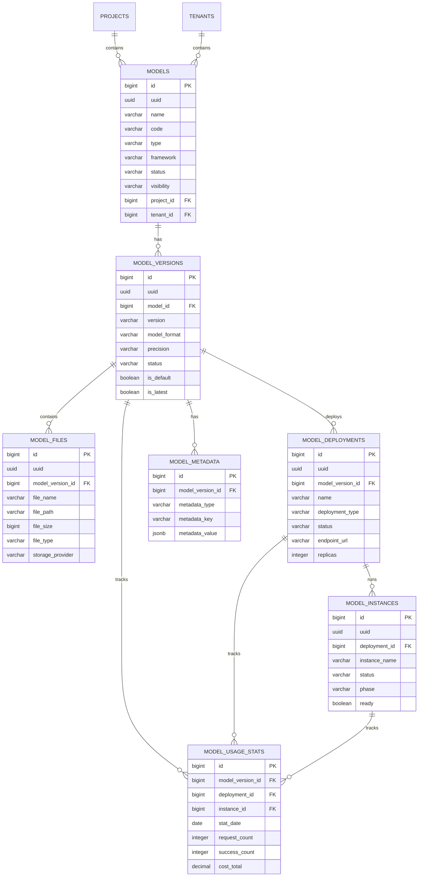

# 模型管理模块数据模型设计

> **模块名称**: model_management  
> **文档版本**: v1.0  
> **更新日期**: 2025-10-17

## 一、模块概述

### 1.1 功能描述

模型管理模块负责LLMOps平台的模型全生命周期管理，包括模型注册、版本控制、部署管理、元数据管理和模型仓库功能。支持多种模型格式、版本管理和模型性能监控。

### 1.2 核心功能

- **模型注册**: 模型信息注册、分类、标签管理
- **版本控制**: 模型版本管理、版本比较、回滚功能
- **部署管理**: 模型部署、实例管理、扩缩容控制
- **元数据管理**: 模型元数据、性能指标、使用统计
- **模型仓库**: 模型存储、下载、分享、权限控制

## 二、数据表设计

### 2.1 模型表 (models)

```sql
CREATE TABLE models (
    id BIGSERIAL PRIMARY KEY,
    uuid UUID NOT NULL DEFAULT gen_random_uuid(),
    name VARCHAR(200) NOT NULL,
    code VARCHAR(100) NOT NULL,
    description TEXT,
    type VARCHAR(50) NOT NULL CHECK (type IN ('llm', 'embedding', 'classification', 'generation', 'summarization', 'translation', 'custom')),
    framework VARCHAR(50) NOT NULL CHECK (framework IN ('pytorch', 'tensorflow', 'onnx', 'huggingface', 'openai', 'anthropic', 'custom')),
    category VARCHAR(100),
    tags TEXT[],
    license VARCHAR(100),
    author VARCHAR(200),
    organization VARCHAR(200),
    homepage_url VARCHAR(500),
    paper_url VARCHAR(500),
    repository_url VARCHAR(500),
    status VARCHAR(20) NOT NULL DEFAULT 'draft' CHECK (status IN ('draft', 'active', 'inactive', 'archived', 'deleted')),
    visibility VARCHAR(20) NOT NULL DEFAULT 'private' CHECK (visibility IN ('private', 'internal', 'public')),
    is_official BOOLEAN NOT NULL DEFAULT FALSE,
    is_featured BOOLEAN NOT NULL DEFAULT FALSE,
    download_count INTEGER NOT NULL DEFAULT 0,
    star_count INTEGER NOT NULL DEFAULT 0,
    fork_count INTEGER NOT NULL DEFAULT 0,
    metadata JSONB DEFAULT '{}',
    settings JSONB DEFAULT '{}',
    project_id BIGINT NOT NULL,
    tenant_id BIGINT NOT NULL,
    created_at TIMESTAMP WITH TIME ZONE NOT NULL DEFAULT NOW(),
    updated_at TIMESTAMP WITH TIME ZONE NOT NULL DEFAULT NOW(),
    created_by BIGINT,
    updated_by BIGINT,
    UNIQUE(tenant_id, code)
);

-- 索引
CREATE INDEX idx_models_tenant_id ON models(tenant_id);
CREATE INDEX idx_models_code ON models(code);
CREATE INDEX idx_models_project_id ON models(project_id);
CREATE INDEX idx_models_type ON models(type);
CREATE INDEX idx_models_framework ON models(framework);
CREATE INDEX idx_models_status ON models(status);
CREATE INDEX idx_models_visibility ON models(visibility);
CREATE INDEX idx_models_is_official ON models(is_official);
CREATE INDEX idx_models_is_featured ON models(is_featured);
CREATE INDEX idx_models_created_at ON models(created_at);
CREATE INDEX idx_models_download_count ON models(download_count);
CREATE INDEX idx_models_tags ON models USING GIN(tags);

-- 外键
ALTER TABLE models ADD CONSTRAINT fk_models_project 
    FOREIGN KEY (project_id) REFERENCES projects(id) ON DELETE CASCADE;
ALTER TABLE models ADD CONSTRAINT fk_models_tenant 
    FOREIGN KEY (tenant_id) REFERENCES tenants(id) ON DELETE CASCADE;

-- 注释
COMMENT ON TABLE models IS '模型基础信息表';
COMMENT ON COLUMN models.code IS '模型代码，租户内唯一';
COMMENT ON COLUMN models.type IS '模型类型：llm-大语言模型，embedding-嵌入模型，classification-分类模型，generation-生成模型，summarization-摘要模型，translation-翻译模型，custom-自定义模型';
COMMENT ON COLUMN models.framework IS '模型框架：pytorch-PyTorch，tensorflow-TensorFlow，onnx-ONNX，huggingface-HuggingFace，openai-OpenAI，anthropic-Anthropic，custom-自定义';
COMMENT ON COLUMN models.status IS '模型状态：draft-草稿，active-活跃，inactive-非活跃，archived-已归档，deleted-已删除';
COMMENT ON COLUMN models.visibility IS '模型可见性：private-私有，internal-内部，public-公开';
COMMENT ON COLUMN models.is_official IS '是否为官方模型';
COMMENT ON COLUMN models.is_featured IS '是否为推荐模型';
COMMENT ON COLUMN models.metadata IS '模型元数据，JSON格式';
COMMENT ON COLUMN models.settings IS '模型设置，JSON格式';
```

### 2.2 模型版本表 (model_versions)

```sql
CREATE TABLE model_versions (
    id BIGSERIAL PRIMARY KEY,
    uuid UUID NOT NULL DEFAULT gen_random_uuid(),
    model_id BIGINT NOT NULL,
    version VARCHAR(50) NOT NULL,
    description TEXT,
    changelog TEXT,
    size_bytes BIGINT,
    file_count INTEGER,
    file_hash VARCHAR(64),
    model_format VARCHAR(20) NOT NULL CHECK (model_format IN ('pytorch', 'tensorflow', 'onnx', 'safetensors', 'ggml', 'gguf', 'huggingface')),
    precision VARCHAR(20) NOT NULL DEFAULT 'fp16' CHECK (precision IN ('fp32', 'fp16', 'bf16', 'int8', 'int4', 'mixed')),
    quantization VARCHAR(50),
    architecture JSONB,
    hyperparameters JSONB,
    training_config JSONB,
    inference_config JSONB,
    performance_metrics JSONB,
    requirements JSONB,
    dependencies JSONB,
    status VARCHAR(20) NOT NULL DEFAULT 'draft' CHECK (status IN ('draft', 'ready', 'testing', 'stable', 'deprecated', 'deleted')),
    is_default BOOLEAN NOT NULL DEFAULT FALSE,
    is_latest BOOLEAN NOT NULL DEFAULT FALSE,
    download_count INTEGER NOT NULL DEFAULT 0,
    created_at TIMESTAMP WITH TIME ZONE NOT NULL DEFAULT NOW(),
    updated_at TIMESTAMP WITH TIME ZONE NOT NULL DEFAULT NOW(),
    created_by BIGINT,
    updated_by BIGINT,
    UNIQUE(model_id, version)
);

-- 索引
CREATE INDEX idx_model_versions_model_id ON model_versions(model_id);
CREATE INDEX idx_model_versions_version ON model_versions(version);
CREATE INDEX idx_model_versions_status ON model_versions(status);
CREATE INDEX idx_model_versions_is_default ON model_versions(is_default);
CREATE INDEX idx_model_versions_is_latest ON model_versions(is_latest);
CREATE INDEX idx_model_versions_created_at ON model_versions(created_at);
CREATE INDEX idx_model_versions_model_format ON model_versions(model_format);
CREATE INDEX idx_model_versions_precision ON model_versions(precision);

-- 外键
ALTER TABLE model_versions ADD CONSTRAINT fk_model_versions_model 
    FOREIGN KEY (model_id) REFERENCES models(id) ON DELETE CASCADE;

-- 注释
COMMENT ON TABLE model_versions IS '模型版本表';
COMMENT ON COLUMN model_versions.version IS '版本号，遵循语义化版本规范';
COMMENT ON COLUMN model_versions.size_bytes IS '模型文件总大小，单位字节';
COMMENT ON COLUMN model_versions.file_count IS '模型文件数量';
COMMENT ON COLUMN model_versions.file_hash IS '模型文件哈希值，用于完整性校验';
COMMENT ON COLUMN model_versions.model_format IS '模型格式：pytorch-PyTorch，tensorflow-TensorFlow，onnx-ONNX，safetensors-SafeTensors，ggml-GGML，gguf-GGUF，huggingface-HuggingFace';
COMMENT ON COLUMN model_versions.precision IS '模型精度：fp32-单精度，fp16-半精度，bf16-脑浮点，int8-8位整数，int4-4位整数，mixed-混合精度';
COMMENT ON COLUMN model_versions.architecture IS '模型架构信息，JSON格式';
COMMENT ON COLUMN model_versions.hyperparameters IS '超参数配置，JSON格式';
COMMENT ON COLUMN model_versions.training_config IS '训练配置，JSON格式';
COMMENT ON COLUMN model_versions.inference_config IS '推理配置，JSON格式';
COMMENT ON COLUMN model_versions.performance_metrics IS '性能指标，JSON格式';
COMMENT ON COLUMN model_versions.status IS '版本状态：draft-草稿，ready-就绪，testing-测试中，stable-稳定，deprecated-已弃用，deleted-已删除';
COMMENT ON COLUMN model_versions.is_default IS '是否为默认版本';
COMMENT ON COLUMN model_versions.is_latest IS '是否为最新版本';
```

### 2.3 模型文件表 (model_files)

```sql
CREATE TABLE model_files (
    id BIGSERIAL PRIMARY KEY,
    uuid UUID NOT NULL DEFAULT gen_random_uuid(),
    model_version_id BIGINT NOT NULL,
    file_name VARCHAR(255) NOT NULL,
    file_path VARCHAR(500) NOT NULL,
    file_size BIGINT NOT NULL,
    file_hash VARCHAR(64) NOT NULL,
    file_type VARCHAR(50) NOT NULL CHECK (file_type IN ('model', 'config', 'tokenizer', 'vocab', 'metadata', 'checkpoint', 'other')),
    mime_type VARCHAR(100),
    compression VARCHAR(20) CHECK (compression IN ('none', 'gzip', 'zip', 'tar', 'tar.gz', 'tar.bz2')),
    is_required BOOLEAN NOT NULL DEFAULT TRUE,
    is_public BOOLEAN NOT NULL DEFAULT FALSE,
    download_url VARCHAR(500),
    storage_provider VARCHAR(50) NOT NULL DEFAULT 'minio' CHECK (storage_provider IN ('minio', 's3', 'gcs', 'azure', 'local')),
    storage_bucket VARCHAR(100),
    storage_key VARCHAR(500),
    storage_region VARCHAR(50),
    checksum_algorithm VARCHAR(20) NOT NULL DEFAULT 'sha256',
    checksum_value VARCHAR(128) NOT NULL,
    created_at TIMESTAMP WITH TIME ZONE NOT NULL DEFAULT NOW(),
    updated_at TIMESTAMP WITH TIME ZONE NOT NULL DEFAULT NOW(),
    created_by BIGINT,
    updated_by BIGINT
);

-- 索引
CREATE INDEX idx_model_files_model_version_id ON model_files(model_version_id);
CREATE INDEX idx_model_files_file_name ON model_files(file_name);
CREATE INDEX idx_model_files_file_type ON model_files(file_type);
CREATE INDEX idx_model_files_file_hash ON model_files(file_hash);
CREATE INDEX idx_model_files_storage_provider ON model_files(storage_provider);
CREATE INDEX idx_model_files_storage_bucket ON model_files(storage_bucket);
CREATE INDEX idx_model_files_is_required ON model_files(is_required);
CREATE INDEX idx_model_files_is_public ON model_files(is_public);

-- 外键
ALTER TABLE model_files ADD CONSTRAINT fk_model_files_model_version 
    FOREIGN KEY (model_version_id) REFERENCES model_versions(id) ON DELETE CASCADE;

-- 注释
COMMENT ON TABLE model_files IS '模型文件表';
COMMENT ON COLUMN model_files.file_type IS '文件类型：model-模型文件，config-配置文件，tokenizer-分词器，vocab-词汇表，metadata-元数据，checkpoint-检查点，other-其他';
COMMENT ON COLUMN model_files.storage_provider IS '存储提供商：minio-MinIO，s3-AWS S3，gcs-Google Cloud Storage，azure-Azure Blob，local-本地存储';
COMMENT ON COLUMN model_files.storage_bucket IS '存储桶名称';
COMMENT ON COLUMN model_files.storage_key IS '存储对象键';
COMMENT ON COLUMN model_files.checksum_algorithm IS '校验和算法：sha256-SHA256，md5-MD5，sha1-SHA1';
COMMENT ON COLUMN model_files.checksum_value IS '校验和值';
```

### 2.4 模型部署表 (model_deployments)

```sql
CREATE TABLE model_deployments (
    id BIGSERIAL PRIMARY KEY,
    uuid UUID NOT NULL DEFAULT gen_random_uuid(),
    model_version_id BIGINT NOT NULL,
    name VARCHAR(200) NOT NULL,
    description TEXT,
    deployment_type VARCHAR(20) NOT NULL DEFAULT 'api' CHECK (deployment_type IN ('api', 'batch', 'streaming', 'edge', 'serverless')),
    status VARCHAR(20) NOT NULL DEFAULT 'pending' CHECK (status IN ('pending', 'deploying', 'running', 'stopped', 'failed', 'updating', 'scaling', 'deleted')),
    endpoint_url VARCHAR(500),
    health_check_url VARCHAR(500),
    replicas INTEGER NOT NULL DEFAULT 1,
    min_replicas INTEGER NOT NULL DEFAULT 1,
    max_replicas INTEGER NOT NULL DEFAULT 10,
    cpu_requests DECIMAL(8,2),
    cpu_limits DECIMAL(8,2),
    memory_requests BIGINT,
    memory_limits BIGINT,
    gpu_requests INTEGER DEFAULT 0,
    gpu_limits INTEGER DEFAULT 0,
    gpu_type VARCHAR(50),
    node_selector JSONB,
    tolerations JSONB,
    affinity JSONB,
    env_vars JSONB,
    config_maps JSONB,
    secrets JSONB,
    volumes JSONB,
    ports JSONB,
    health_check JSONB,
    scaling_config JSONB,
    monitoring_config JSONB,
    security_config JSONB,
    network_config JSONB,
    resource_quota JSONB,
    cost_config JSONB,
    metadata JSONB,
    created_at TIMESTAMP WITH TIME ZONE NOT NULL DEFAULT NOW(),
    updated_at TIMESTAMP WITH TIME ZONE NOT NULL DEFAULT NOW(),
    created_by BIGINT,
    updated_by BIGINT
);

-- 索引
CREATE INDEX idx_model_deployments_model_version_id ON model_deployments(model_version_id);
CREATE INDEX idx_model_deployments_name ON model_deployments(name);
CREATE INDEX idx_model_deployments_deployment_type ON model_deployments(deployment_type);
CREATE INDEX idx_model_deployments_status ON model_deployments(status);
CREATE INDEX idx_model_deployments_endpoint_url ON model_deployments(endpoint_url);
CREATE INDEX idx_model_deployments_created_at ON model_deployments(created_at);

-- 外键
ALTER TABLE model_deployments ADD CONSTRAINT fk_model_deployments_model_version 
    FOREIGN KEY (model_version_id) REFERENCES model_versions(id) ON DELETE CASCADE;

-- 注释
COMMENT ON TABLE model_deployments IS '模型部署表';
COMMENT ON COLUMN model_deployments.deployment_type IS '部署类型：api-API服务，batch-批处理，streaming-流式处理，edge-边缘计算，serverless-无服务器';
COMMENT ON COLUMN model_deployments.status IS '部署状态：pending-等待中，deploying-部署中，running-运行中，stopped-已停止，failed-失败，updating-更新中，scaling-扩缩容中，deleted-已删除';
COMMENT ON COLUMN model_deployments.endpoint_url IS '服务端点URL';
COMMENT ON COLUMN model_deployments.health_check_url IS '健康检查URL';
COMMENT ON COLUMN model_deployments.replicas IS '副本数量';
COMMENT ON COLUMN model_deployments.cpu_requests IS 'CPU请求量，单位核';
COMMENT ON COLUMN model_deployments.cpu_limits IS 'CPU限制量，单位核';
COMMENT ON COLUMN model_deployments.memory_requests IS '内存请求量，单位字节';
COMMENT ON COLUMN model_deployments.memory_limits IS '内存限制量，单位字节';
COMMENT ON COLUMN model_deployments.gpu_requests IS 'GPU请求数量';
COMMENT ON COLUMN model_deployments.gpu_limits IS 'GPU限制数量';
COMMENT ON COLUMN model_deployments.gpu_type IS 'GPU类型：A100, H100, V100, T4等';
COMMENT ON COLUMN model_deployments.env_vars IS '环境变量，JSON格式';
COMMENT ON COLUMN model_deployments.scaling_config IS '扩缩容配置，JSON格式';
COMMENT ON COLUMN model_deployments.monitoring_config IS '监控配置，JSON格式';
COMMENT ON COLUMN model_deployments.security_config IS '安全配置，JSON格式';
COMMENT ON COLUMN model_deployments.cost_config IS '成本配置，JSON格式';
```

### 2.5 模型实例表 (model_instances)

```sql
CREATE TABLE model_instances (
    id BIGSERIAL PRIMARY KEY,
    uuid UUID NOT NULL DEFAULT gen_random_uuid(),
    deployment_id BIGINT NOT NULL,
    instance_name VARCHAR(200) NOT NULL,
    instance_id VARCHAR(100) NOT NULL,
    pod_name VARCHAR(200),
    node_name VARCHAR(200),
    namespace VARCHAR(100),
    status VARCHAR(20) NOT NULL DEFAULT 'pending' CHECK (status IN ('pending', 'running', 'stopped', 'failed', 'terminating')),
    phase VARCHAR(20) CHECK (phase IN ('pending', 'running', 'succeeded', 'failed', 'unknown')),
    ready BOOLEAN NOT NULL DEFAULT FALSE,
    restart_count INTEGER NOT NULL DEFAULT 0,
    cpu_usage DECIMAL(8,2),
    memory_usage BIGINT,
    gpu_usage DECIMAL(5,2),
    disk_usage BIGINT,
    network_rx BIGINT,
    network_tx BIGINT,
    start_time TIMESTAMP WITH TIME ZONE,
    end_time TIMESTAMP WITH TIME ZONE,
    last_heartbeat TIMESTAMP WITH TIME ZONE,
    health_status VARCHAR(20) CHECK (health_status IN ('healthy', 'unhealthy', 'unknown')),
    health_message TEXT,
    error_message TEXT,
    logs_url VARCHAR(500),
    metrics_url VARCHAR(500),
    created_at TIMESTAMP WITH TIME ZONE NOT NULL DEFAULT NOW(),
    updated_at TIMESTAMP WITH TIME ZONE NOT NULL DEFAULT NOW()
);

-- 索引
CREATE INDEX idx_model_instances_deployment_id ON model_instances(deployment_id);
CREATE INDEX idx_model_instances_instance_name ON model_instances(instance_name);
CREATE INDEX idx_model_instances_instance_id ON model_instances(instance_id);
CREATE INDEX idx_model_instances_pod_name ON model_instances(pod_name);
CREATE INDEX idx_model_instances_node_name ON model_instances(node_name);
CREATE INDEX idx_model_instances_status ON model_instances(status);
CREATE INDEX idx_model_instances_phase ON model_instances(phase);
CREATE INDEX idx_model_instances_ready ON model_instances(ready);
CREATE INDEX idx_model_instances_health_status ON model_instances(health_status);
CREATE INDEX idx_model_instances_start_time ON model_instances(start_time);

-- 外键
ALTER TABLE model_instances ADD CONSTRAINT fk_model_instances_deployment 
    FOREIGN KEY (deployment_id) REFERENCES model_deployments(id) ON DELETE CASCADE;

-- 注释
COMMENT ON TABLE model_instances IS '模型实例表';
COMMENT ON COLUMN model_instances.instance_name IS '实例名称';
COMMENT ON COLUMN model_instances.instance_id IS '实例ID，对应Kubernetes Pod ID';
COMMENT ON COLUMN model_instances.pod_name IS 'Pod名称';
COMMENT ON COLUMN model_instances.node_name IS '节点名称';
COMMENT ON COLUMN model_instances.namespace IS 'Kubernetes命名空间';
COMMENT ON COLUMN model_instances.status IS '实例状态：pending-等待中，running-运行中，stopped-已停止，failed-失败，terminating-终止中';
COMMENT ON COLUMN model_instances.phase IS '实例阶段：pending-等待中，running-运行中，succeeded-成功，failed-失败，unknown-未知';
COMMENT ON COLUMN model_instances.ready IS '实例是否就绪';
COMMENT ON COLUMN model_instances.restart_count IS '重启次数';
COMMENT ON COLUMN model_instances.cpu_usage IS 'CPU使用率，单位核';
COMMENT ON COLUMN model_instances.memory_usage IS '内存使用量，单位字节';
COMMENT ON COLUMN model_instances.gpu_usage IS 'GPU使用率，百分比';
COMMENT ON COLUMN model_instances.health_status IS '健康状态：healthy-健康，unhealthy-不健康，unknown-未知';
COMMENT ON COLUMN model_instances.health_message IS '健康检查消息';
COMMENT ON COLUMN model_instances.error_message IS '错误消息';
```

### 2.6 模型元数据表 (model_metadata)

```sql
CREATE TABLE model_metadata (
    id BIGSERIAL PRIMARY KEY,
    model_version_id BIGINT NOT NULL,
    metadata_type VARCHAR(50) NOT NULL CHECK (metadata_type IN ('performance', 'training', 'evaluation', 'usage', 'technical', 'business', 'compliance')),
    metadata_key VARCHAR(100) NOT NULL,
    metadata_value JSONB NOT NULL,
    description TEXT,
    unit VARCHAR(50),
    category VARCHAR(50),
    tags TEXT[],
    is_public BOOLEAN NOT NULL DEFAULT FALSE,
    is_required BOOLEAN NOT NULL DEFAULT FALSE,
    validation_rule VARCHAR(200),
    created_at TIMESTAMP WITH TIME ZONE NOT NULL DEFAULT NOW(),
    updated_at TIMESTAMP WITH TIME ZONE NOT NULL DEFAULT NOW(),
    created_by BIGINT,
    updated_by BIGINT,
    UNIQUE(model_version_id, metadata_type, metadata_key)
);

-- 索引
CREATE INDEX idx_model_metadata_model_version_id ON model_metadata(model_version_id);
CREATE INDEX idx_model_metadata_metadata_type ON model_metadata(metadata_type);
CREATE INDEX idx_model_metadata_metadata_key ON model_metadata(metadata_key);
CREATE INDEX idx_model_metadata_is_public ON model_metadata(is_public);
CREATE INDEX idx_model_metadata_is_required ON model_metadata(is_required);
CREATE INDEX idx_model_metadata_tags ON model_metadata USING GIN(tags);

-- 外键
ALTER TABLE model_metadata ADD CONSTRAINT fk_model_metadata_model_version 
    FOREIGN KEY (model_version_id) REFERENCES model_versions(id) ON DELETE CASCADE;

-- 注释
COMMENT ON TABLE model_metadata IS '模型元数据表';
COMMENT ON COLUMN model_metadata.metadata_type IS '元数据类型：performance-性能，training-训练，evaluation-评估，usage-使用，technical-技术，business-业务，compliance-合规';
COMMENT ON COLUMN model_metadata.metadata_key IS '元数据键';
COMMENT ON COLUMN model_metadata.metadata_value IS '元数据值，JSON格式';
COMMENT ON COLUMN model_metadata.unit IS '数值单位';
COMMENT ON COLUMN model_metadata.category IS '元数据分类';
COMMENT ON COLUMN model_metadata.is_public IS '是否公开';
COMMENT ON COLUMN model_metadata.is_required IS '是否必需';
COMMENT ON COLUMN model_metadata.validation_rule IS '验证规则';
```

### 2.7 模型使用统计表 (model_usage_stats)

```sql
CREATE TABLE model_usage_stats (
    id BIGSERIAL PRIMARY KEY,
    model_version_id BIGINT NOT NULL,
    deployment_id BIGINT,
    instance_id BIGINT,
    stat_date DATE NOT NULL,
    stat_hour INTEGER CHECK (stat_hour >= 0 AND stat_hour <= 23),
    request_count INTEGER NOT NULL DEFAULT 0,
    success_count INTEGER NOT NULL DEFAULT 0,
    error_count INTEGER NOT NULL DEFAULT 0,
    total_tokens INTEGER NOT NULL DEFAULT 0,
    input_tokens INTEGER NOT NULL DEFAULT 0,
    output_tokens INTEGER NOT NULL DEFAULT 0,
    total_latency_ms BIGINT NOT NULL DEFAULT 0,
    avg_latency_ms DECIMAL(10,2),
    p50_latency_ms DECIMAL(10,2),
    p90_latency_ms DECIMAL(10,2),
    p95_latency_ms DECIMAL(10,2),
    p99_latency_ms DECIMAL(10,2),
    cpu_usage_avg DECIMAL(8,2),
    memory_usage_avg BIGINT,
    gpu_usage_avg DECIMAL(5,2),
    cost_total DECIMAL(12,4) NOT NULL DEFAULT 0,
    cost_compute DECIMAL(12,4) NOT NULL DEFAULT 0,
    cost_storage DECIMAL(12,4) NOT NULL DEFAULT 0,
    cost_network DECIMAL(12,4) NOT NULL DEFAULT 0,
    unique_users INTEGER NOT NULL DEFAULT 0,
    unique_sessions INTEGER NOT NULL DEFAULT 0,
    created_at TIMESTAMP WITH TIME ZONE NOT NULL DEFAULT NOW(),
    updated_at TIMESTAMP WITH TIME ZONE NOT NULL DEFAULT NOW(),
    UNIQUE(model_version_id, deployment_id, instance_id, stat_date, stat_hour)
);

-- 索引
CREATE INDEX idx_model_usage_stats_model_version_id ON model_usage_stats(model_version_id);
CREATE INDEX idx_model_usage_stats_deployment_id ON model_usage_stats(deployment_id);
CREATE INDEX idx_model_usage_stats_instance_id ON model_usage_stats(instance_id);
CREATE INDEX idx_model_usage_stats_stat_date ON model_usage_stats(stat_date);
CREATE INDEX idx_model_usage_stats_stat_hour ON model_usage_stats(stat_hour);
CREATE INDEX idx_model_usage_stats_request_count ON model_usage_stats(request_count);
CREATE INDEX idx_model_usage_stats_cost_total ON model_usage_stats(cost_total);

-- 外键
ALTER TABLE model_usage_stats ADD CONSTRAINT fk_model_usage_stats_model_version 
    FOREIGN KEY (model_version_id) REFERENCES model_versions(id) ON DELETE CASCADE;
ALTER TABLE model_usage_stats ADD CONSTRAINT fk_model_usage_stats_deployment 
    FOREIGN KEY (deployment_id) REFERENCES model_deployments(id) ON DELETE SET NULL;
ALTER TABLE model_usage_stats ADD CONSTRAINT fk_model_usage_stats_instance 
    FOREIGN KEY (instance_id) REFERENCES model_instances(id) ON DELETE SET NULL;

-- 注释
COMMENT ON TABLE model_usage_stats IS '模型使用统计表';
COMMENT ON COLUMN model_usage_stats.stat_date IS '统计日期';
COMMENT ON COLUMN model_usage_stats.stat_hour IS '统计小时，0-23，NULL表示全天统计';
COMMENT ON COLUMN model_usage_stats.request_count IS '请求总数';
COMMENT ON COLUMN model_usage_stats.success_count IS '成功请求数';
COMMENT ON COLUMN model_usage_stats.error_count IS '错误请求数';
COMMENT ON COLUMN model_usage_stats.total_tokens IS '总Token数';
COMMENT ON COLUMN model_usage_stats.input_tokens IS '输入Token数';
COMMENT ON COLUMN model_usage_stats.output_tokens IS '输出Token数';
COMMENT ON COLUMN model_usage_stats.total_latency_ms IS '总延迟时间，单位毫秒';
COMMENT ON COLUMN model_usage_stats.avg_latency_ms IS '平均延迟时间，单位毫秒';
COMMENT ON COLUMN model_usage_stats.p50_latency_ms IS 'P50延迟时间，单位毫秒';
COMMENT ON COLUMN model_usage_stats.p90_latency_ms IS 'P90延迟时间，单位毫秒';
COMMENT ON COLUMN model_usage_stats.p95_latency_ms IS 'P95延迟时间，单位毫秒';
COMMENT ON COLUMN model_usage_stats.p99_latency_ms IS 'P99延迟时间，单位毫秒';
COMMENT ON COLUMN model_usage_stats.cost_total IS '总成本';
COMMENT ON COLUMN model_usage_stats.cost_compute IS '计算成本';
COMMENT ON COLUMN model_usage_stats.cost_storage IS '存储成本';
COMMENT ON COLUMN model_usage_stats.cost_network IS '网络成本';
COMMENT ON COLUMN model_usage_stats.unique_users IS '唯一用户数';
COMMENT ON COLUMN model_usage_stats.unique_sessions IS '唯一会话数';
```

## 三、数据关系图



## 四、业务规则

### 4.1 模型管理规则

```yaml
模型注册:
  - 模型代码在租户内唯一
  - 模型名称不能重复
  - 必须指定模型类型和框架
  - 默认状态为draft
  - 默认可见性为private

模型状态:
  - draft: 草稿状态，开发中
  - active: 活跃状态，可使用
  - inactive: 非活跃状态，暂停使用
  - archived: 归档状态，只读访问
  - deleted: 软删除，30天后物理删除

模型可见性:
  - private: 私有模型，仅项目成员可见
  - internal: 内部模型，租户内可见
  - public: 公开模型，所有用户可见

模型版本:
  - 版本号遵循语义化版本规范
  - 每个模型至少有一个版本
  - 只能有一个默认版本
  - 只能有一个最新版本
  - 版本状态独立管理
```

### 4.2 版本管理规则

```yaml
版本创建:
  - 版本号必须唯一
  - 版本描述必须填写
  - 模型文件必须上传
  - 默认状态为draft
  - 自动计算文件哈希

版本状态:
  - draft: 草稿状态，开发中
  - ready: 就绪状态，可部署
  - testing: 测试状态，测试中
  - stable: 稳定状态，生产可用
  - deprecated: 已弃用，不推荐使用
  - deleted: 已删除

版本升级:
  - 新版本自动成为最新版本
  - 旧版本保持原有状态
  - 可以设置默认版本
  - 支持版本回滚
  - 版本变更需要记录日志
```

### 4.3 部署管理规则

```yaml
部署类型:
  - api: API服务，实时推理
  - batch: 批处理，批量推理
  - streaming: 流式处理，流式推理
  - edge: 边缘计算，边缘推理
  - serverless: 无服务器，按需推理

部署状态:
  - pending: 等待部署
  - deploying: 部署中
  - running: 运行中
  - stopped: 已停止
  - failed: 部署失败
  - updating: 更新中
  - scaling: 扩缩容中
  - deleted: 已删除

资源管理:
  - CPU和内存必须设置请求和限制
  - GPU资源可选配置
  - 支持节点选择器
  - 支持容忍度和亲和性
  - 支持环境变量和配置映射
```

### 4.4 实例管理规则

```yaml
实例状态:
  - pending: 等待启动
  - running: 运行中
  - stopped: 已停止
  - failed: 运行失败
  - terminating: 终止中

实例监控:
  - 实时监控CPU、内存、GPU使用率
  - 监控网络流量
  - 健康检查状态
  - 错误日志记录
  - 性能指标收集

实例扩缩容:
  - 基于CPU使用率自动扩缩容
  - 基于内存使用率自动扩缩容
  - 基于请求量自动扩缩容
  - 支持手动扩缩容
  - 扩缩容有最小和最大限制
```

## 五、性能优化

### 5.1 索引优化

```sql
-- 复合索引
CREATE INDEX idx_models_tenant_status ON models(tenant_id, status);
CREATE INDEX idx_models_project_status ON models(project_id, status);
CREATE INDEX idx_models_type_framework ON models(type, framework);
CREATE INDEX idx_model_versions_model_status ON model_versions(model_id, status);
CREATE INDEX idx_model_deployments_model_status ON model_deployments(model_version_id, status);
CREATE INDEX idx_model_instances_deployment_status ON model_instances(deployment_id, status);
CREATE INDEX idx_model_usage_stats_date_hour ON model_usage_stats(stat_date, stat_hour);

-- 部分索引
CREATE INDEX idx_models_active ON models(id) WHERE status = 'active';
CREATE INDEX idx_model_versions_stable ON model_versions(id) WHERE status = 'stable';
CREATE INDEX idx_model_deployments_running ON model_deployments(id) WHERE status = 'running';
CREATE INDEX idx_model_instances_running ON model_instances(id) WHERE status = 'running';

-- 表达式索引
CREATE INDEX idx_models_lower_name ON models(lower(name));
CREATE INDEX idx_models_lower_code ON models(lower(code));
CREATE INDEX idx_model_files_lower_name ON model_files(lower(file_name));
```

### 5.2 查询优化

```sql
-- 模型版本信息查询优化
CREATE VIEW model_version_info AS
SELECT 
    m.id as model_id,
    m.name as model_name,
    m.code as model_code,
    m.type as model_type,
    m.framework as model_framework,
    m.status as model_status,
    mv.id as version_id,
    mv.version,
    mv.model_format,
    mv.precision,
    mv.status as version_status,
    mv.is_default,
    mv.is_latest,
    mv.size_bytes,
    mv.file_count,
    mv.created_at as version_created_at
FROM models m
JOIN model_versions mv ON m.id = mv.model_id
WHERE m.status = 'active' AND mv.status IN ('ready', 'stable');

-- 模型部署状态查询优化
CREATE VIEW model_deployment_status AS
SELECT 
    md.id as deployment_id,
    md.name as deployment_name,
    md.status as deployment_status,
    md.endpoint_url,
    md.replicas,
    md.min_replicas,
    md.max_replicas,
    m.name as model_name,
    mv.version as model_version,
    COUNT(mi.id) as instance_count,
    COUNT(CASE WHEN mi.status = 'running' THEN 1 END) as running_instances,
    COUNT(CASE WHEN mi.status = 'failed' THEN 1 END) as failed_instances
FROM model_deployments md
JOIN model_versions mv ON md.model_version_id = mv.id
JOIN models m ON mv.model_id = m.id
LEFT JOIN model_instances mi ON md.id = mi.deployment_id
WHERE md.status IN ('running', 'updating', 'scaling')
GROUP BY md.id, md.name, md.status, md.endpoint_url, md.replicas, md.min_replicas, md.max_replicas, m.name, mv.version;

-- 模型使用统计查询优化
CREATE VIEW model_usage_summary AS
SELECT 
    m.id as model_id,
    m.name as model_name,
    mv.id as version_id,
    mv.version,
    DATE_TRUNC('day', mus.stat_date) as stat_date,
    SUM(mus.request_count) as total_requests,
    SUM(mus.success_count) as total_success,
    SUM(mus.error_count) as total_errors,
    SUM(mus.total_tokens) as total_tokens,
    AVG(mus.avg_latency_ms) as avg_latency,
    SUM(mus.cost_total) as total_cost,
    COUNT(DISTINCT mus.deployment_id) as deployment_count
FROM models m
JOIN model_versions mv ON m.id = mv.model_id
JOIN model_usage_stats mus ON mv.id = mus.model_version_id
WHERE m.status = 'active' AND mv.status IN ('ready', 'stable')
GROUP BY m.id, m.name, mv.id, mv.version, DATE_TRUNC('day', mus.stat_date);
```

### 5.3 缓存策略

```yaml
模型信息缓存:
  - 缓存键: model:{model_id}
  - 缓存时间: 2小时
  - 更新策略: 模型信息变更时主动失效

模型版本缓存:
  - 缓存键: model_version:{version_id}
  - 缓存时间: 1小时
  - 更新策略: 版本信息变更时主动失效

模型文件缓存:
  - 缓存键: model_files:{version_id}
  - 缓存时间: 4小时
  - 更新策略: 文件变更时主动失效

部署状态缓存:
  - 缓存键: deployment_status:{deployment_id}
  - 缓存时间: 30秒
  - 更新策略: 状态变更时主动失效

实例状态缓存:
  - 缓存键: instance_status:{instance_id}
  - 缓存时间: 10秒
  - 更新策略: 状态变更时主动失效
```

## 六、安全设计

### 6.1 文件安全

```sql
-- 文件访问权限检查函数
CREATE OR REPLACE FUNCTION check_model_file_access(
    p_file_id BIGINT,
    p_user_id BIGINT,
    p_project_id BIGINT
) RETURNS BOOLEAN AS $$
DECLARE
    file_info RECORD;
    user_role VARCHAR;
BEGIN
    -- 获取文件信息
    SELECT mf.*, m.project_id, m.visibility, mf.is_public
    INTO file_info
    FROM model_files mf
    JOIN model_versions mv ON mf.model_version_id = mv.id
    JOIN models m ON mv.model_id = m.id
    WHERE mf.id = p_file_id;
    
    IF file_info IS NULL THEN
        RETURN FALSE;
    END IF;
    
    -- 检查文件是否公开
    IF file_info.is_public THEN
        RETURN TRUE;
    END IF;
    
    -- 检查模型可见性
    IF file_info.visibility = 'public' THEN
        RETURN TRUE;
    END IF;
    
    -- 检查用户项目权限
    SELECT pm.role INTO user_role
    FROM project_members pm
    WHERE pm.project_id = file_info.project_id 
      AND pm.user_id = p_user_id 
      AND pm.status = 'active';
    
    IF user_role IS NULL THEN
        RETURN FALSE;
    END IF;
    
    -- 检查角色权限
    RETURN user_role IN ('owner', 'admin', 'developer', 'tester', 'viewer');
END;
$$ LANGUAGE plpgsql;
```

### 6.2 部署安全

```sql
-- 部署权限检查函数
CREATE OR REPLACE FUNCTION check_deployment_permission(
    p_deployment_id BIGINT,
    p_user_id BIGINT,
    p_action VARCHAR
) RETURNS BOOLEAN AS $$
DECLARE
    deployment_info RECORD;
    user_role VARCHAR;
    required_role VARCHAR;
BEGIN
    -- 获取部署信息
    SELECT md.*, m.project_id
    INTO deployment_info
    FROM model_deployments md
    JOIN model_versions mv ON md.model_version_id = mv.id
    JOIN models m ON mv.model_id = m.id
    WHERE md.id = p_deployment_id;
    
    IF deployment_info IS NULL THEN
        RETURN FALSE;
    END IF;
    
    -- 获取用户角色
    SELECT pm.role INTO user_role
    FROM project_members pm
    WHERE pm.project_id = deployment_info.project_id 
      AND pm.user_id = p_user_id 
      AND pm.status = 'active';
    
    IF user_role IS NULL THEN
        RETURN FALSE;
    END IF;
    
    -- 根据操作确定所需角色
    required_role := CASE p_action
        WHEN 'create' THEN 'developer'
        WHEN 'update' THEN 'developer'
        WHEN 'delete' THEN 'admin'
        WHEN 'scale' THEN 'developer'
        WHEN 'view' THEN 'viewer'
        ELSE 'admin'
    END;
    
    -- 角色级别检查
    RETURN CASE user_role
        WHEN 'owner' THEN TRUE
        WHEN 'admin' THEN required_role IN ('admin', 'developer', 'tester', 'viewer')
        WHEN 'developer' THEN required_role IN ('developer', 'tester', 'viewer')
        WHEN 'tester' THEN required_role IN ('tester', 'viewer')
        WHEN 'viewer' THEN required_role = 'viewer'
        ELSE FALSE
    END;
END;
$$ LANGUAGE plpgsql;
```

### 6.3 审计日志

```sql
-- 模型操作审计触发器
CREATE OR REPLACE FUNCTION model_audit_trigger()
RETURNS TRIGGER AS $$
BEGIN
    IF TG_OP = 'INSERT' THEN
        INSERT INTO project_activities (
            project_id, user_id, activity_type, resource_type, 
            resource_id, resource_name, new_values, description
        ) VALUES (
            NEW.project_id, NEW.created_by, 'created', 'model', 
            NEW.id::TEXT, NEW.name, to_jsonb(NEW), 
            'Model created: ' || NEW.name
        );
        RETURN NEW;
    ELSIF TG_OP = 'UPDATE' THEN
        INSERT INTO project_activities (
            project_id, user_id, activity_type, resource_type, 
            resource_id, resource_name, old_values, new_values, description
        ) VALUES (
            NEW.project_id, NEW.updated_by, 'updated', 'model', 
            NEW.id::TEXT, NEW.name, to_jsonb(OLD), to_jsonb(NEW),
            'Model updated: ' || NEW.name
        );
        RETURN NEW;
    ELSIF TG_OP = 'DELETE' THEN
        INSERT INTO project_activities (
            project_id, user_id, activity_type, resource_type, 
            resource_id, resource_name, old_values, description
        ) VALUES (
            OLD.project_id, OLD.updated_by, 'deleted', 'model', 
            OLD.id::TEXT, OLD.name, to_jsonb(OLD),
            'Model deleted: ' || OLD.name
        );
        RETURN OLD;
    END IF;
    RETURN NULL;
END;
$$ LANGUAGE plpgsql;

-- 为模型表创建审计触发器
CREATE TRIGGER models_audit_trigger
    AFTER INSERT OR UPDATE OR DELETE ON models
    FOR EACH ROW EXECUTE FUNCTION model_audit_trigger();
```

## 七、初始化数据

### 7.1 默认模型元数据

```sql
-- 插入默认模型元数据模板
INSERT INTO model_metadata (model_version_id, metadata_type, metadata_key, metadata_value, description, is_required) VALUES
-- 性能元数据
(1, 'performance', 'accuracy', '{"value": 0.95, "metric": "accuracy", "dataset": "test_set"}', '模型准确率', TRUE),
(1, 'performance', 'latency', '{"p50": 100, "p90": 200, "p95": 300, "p99": 500, "unit": "ms"}', '推理延迟', TRUE),
(1, 'performance', 'throughput', '{"value": 1000, "unit": "requests_per_second"}', '推理吞吐量', TRUE),

-- 技术元数据
(1, 'technical', 'parameters', '{"total": 7000000000, "trainable": 7000000000, "frozen": 0}', '模型参数量', TRUE),
(1, 'technical', 'architecture', '{"type": "transformer", "layers": 32, "hidden_size": 4096, "attention_heads": 32}', '模型架构', TRUE),
(1, 'technical', 'vocabulary_size', '{"value": 50000}', '词汇表大小', TRUE),

-- 训练元数据
(1, 'training', 'dataset', '{"name": "training_data", "size": 1000000, "format": "jsonl"}', '训练数据集', TRUE),
(1, 'training', 'training_time', '{"value": 168, "unit": "hours"}', '训练时间', TRUE),
(1, 'training', 'hardware', '{"gpu_type": "A100", "gpu_count": 8, "memory_per_gpu": "80GB"}', '训练硬件', TRUE),

-- 评估元数据
(1, 'evaluation', 'benchmark_scores', '{"MMLU": 0.85, "HellaSwag": 0.90, "ARC": 0.88}', '基准测试分数', TRUE),
(1, 'evaluation', 'evaluation_date', '{"value": "2025-10-17"}', '评估日期', TRUE),
(1, 'evaluation', 'evaluation_method', '{"method": "standard_benchmark", "version": "v1.0"}', '评估方法', TRUE);
```

### 7.2 默认部署配置

```sql
-- 插入默认部署配置模板
INSERT INTO model_deployments (model_version_id, name, description, deployment_type, replicas, min_replicas, max_replicas, cpu_requests, cpu_limits, memory_requests, memory_limits, gpu_requests, gpu_limits, env_vars, scaling_config, monitoring_config) VALUES
-- API服务部署
(1, 'api-service', 'API服务部署', 'api', 2, 1, 10, 2.0, 4.0, 8589934592, 17179869184, 1, 1, 
 '{"MODEL_PATH": "/models", "BATCH_SIZE": "1", "MAX_SEQUENCE_LENGTH": "2048"}',
 '{"min_replicas": 1, "max_replicas": 10, "target_cpu_utilization": 70, "target_memory_utilization": 80}',
 '{"enabled": true, "metrics_endpoint": "/metrics", "health_check_interval": 30}'),

-- 批处理部署
(1, 'batch-service', '批处理服务部署', 'batch', 1, 1, 5, 4.0, 8.0, 17179869184, 34359738368, 2, 2,
 '{"MODEL_PATH": "/models", "BATCH_SIZE": "8", "MAX_SEQUENCE_LENGTH": "4096"}',
 '{"min_replicas": 1, "max_replicas": 5, "target_cpu_utilization": 80, "target_memory_utilization": 85}',
 '{"enabled": true, "metrics_endpoint": "/metrics", "health_check_interval": 60}');
```

## 八、总结

模型管理模块是LLMOps平台的核心模块，提供了完整的模型全生命周期管理功能，包括模型注册、版本控制、部署管理、元数据管理和使用统计。

### 核心特性

1. **完整生命周期管理**: 从模型注册到部署运行的完整流程
2. **版本控制**: 支持语义化版本和版本回滚
3. **多格式支持**: 支持多种模型格式和精度
4. **灵活部署**: 支持多种部署类型和扩缩容策略
5. **详细监控**: 实时监控实例状态和性能指标
6. **成本追踪**: 详细的成本统计和分析

### 扩展性

- 支持自定义模型类型和框架
- 支持灵活的部署配置
- 支持多种存储提供商
- 支持自定义元数据字段
- 支持多种监控和告警方式

---

**文档维护**: 本文档应随业务需求变化持续更新，保持与系统架构的一致性。

**版本历史**:
- v1.0 (2025-10-17): 初始版本，完整模型管理模块设计

