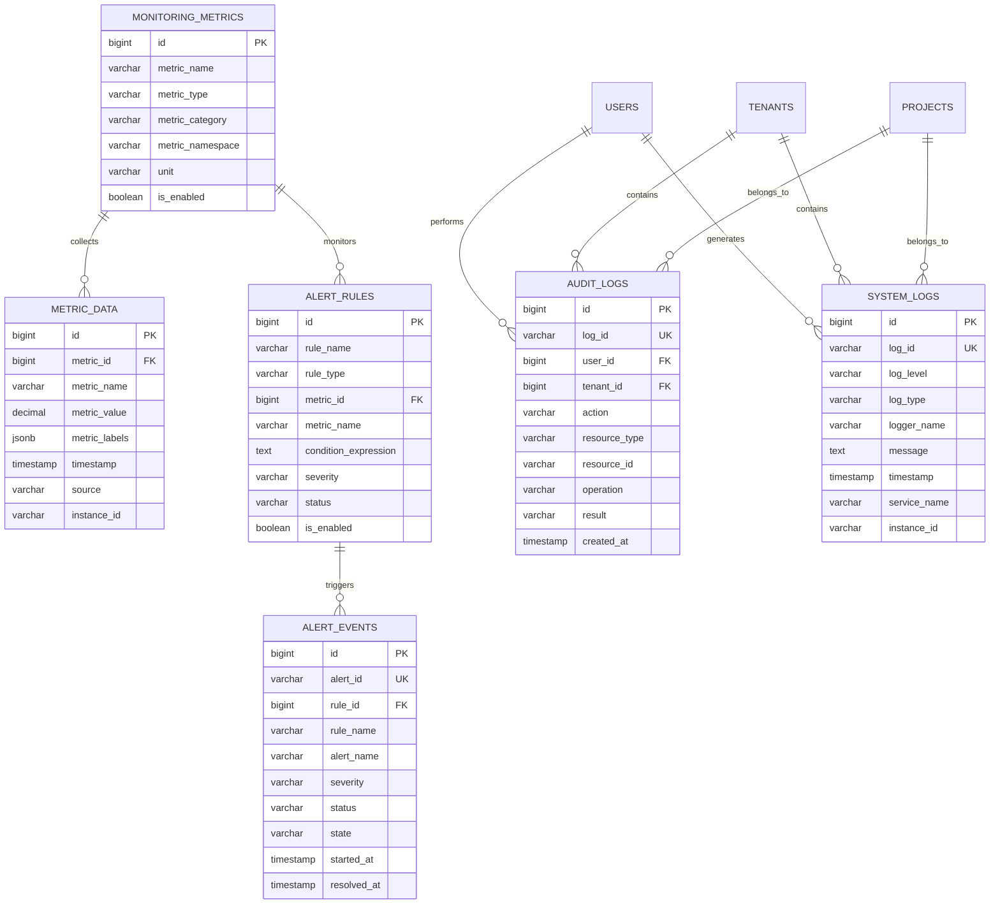

# 监控日志模块数据模型设计

> **模块名称**: monitoring_logging  
> **文档版本**: v1.0  
> **更新日期**: 2025-10-17

## 一、模块概述

### 1.1 功能描述

监控日志模块负责LLMOps平台的系统监控、日志管理、告警规则和审计追踪。支持多维度监控指标、实时日志分析、智能告警和完整的审计链路。

### 1.2 核心功能

- **系统监控**: 性能指标、资源使用、服务状态监控
- **日志管理**: 结构化日志、日志聚合、日志分析
- **告警管理**: 告警规则、告警通知、告警处理
- **审计追踪**: 操作审计、安全审计、合规审计
- **性能分析**: 性能指标分析、趋势预测、异常检测

## 二、数据表设计

### 2.1 监控指标表 (monitoring_metrics)

```sql
CREATE TABLE monitoring_metrics (
    id BIGSERIAL PRIMARY KEY,
    uuid UUID NOT NULL DEFAULT gen_random_uuid(),
    metric_name VARCHAR(200) NOT NULL,
    metric_type VARCHAR(50) NOT NULL CHECK (metric_type IN ('counter', 'gauge', 'histogram', 'summary', 'custom')),
    metric_category VARCHAR(50) NOT NULL CHECK (metric_category IN ('system', 'application', 'business', 'infrastructure', 'security', 'performance', 'cost')),
    metric_namespace VARCHAR(100),
    metric_description TEXT,
    unit VARCHAR(20),
    aggregation_type VARCHAR(20) CHECK (aggregation_type IN ('sum', 'avg', 'min', 'max', 'count', 'p50', 'p90', 'p95', 'p99')),
    retention_days INTEGER NOT NULL DEFAULT 30,
    collection_interval INTEGER NOT NULL DEFAULT 60,
    is_enabled BOOLEAN NOT NULL DEFAULT TRUE,
    is_public BOOLEAN NOT NULL DEFAULT FALSE,
    tags JSONB DEFAULT '{}',
    metadata JSONB DEFAULT '{}',
    created_at TIMESTAMP WITH TIME ZONE NOT NULL DEFAULT NOW(),
    updated_at TIMESTAMP WITH TIME ZONE NOT NULL DEFAULT NOW(),
    created_by BIGINT,
    updated_by BIGINT
);

-- 索引
CREATE INDEX idx_monitoring_metrics_metric_name ON monitoring_metrics(metric_name);
CREATE INDEX idx_monitoring_metrics_metric_type ON monitoring_metrics(metric_type);
CREATE INDEX idx_monitoring_metrics_metric_category ON monitoring_metrics(metric_category);
CREATE INDEX idx_monitoring_metrics_metric_namespace ON monitoring_metrics(metric_namespace);
CREATE INDEX idx_monitoring_metrics_is_enabled ON monitoring_metrics(is_enabled);
CREATE INDEX idx_monitoring_metrics_is_public ON monitoring_metrics(is_public);
CREATE INDEX idx_monitoring_metrics_created_at ON monitoring_metrics(created_at);

-- 注释
COMMENT ON TABLE monitoring_metrics IS '监控指标定义表';
COMMENT ON COLUMN monitoring_metrics.metric_name IS '指标名称';
COMMENT ON COLUMN monitoring_metrics.metric_type IS '指标类型：counter-计数器，gauge-仪表盘，histogram-直方图，summary-摘要，custom-自定义';
COMMENT ON COLUMN monitoring_metrics.metric_category IS '指标分类：system-系统，application-应用，business-业务，infrastructure-基础设施，security-安全，performance-性能，cost-成本';
COMMENT ON COLUMN monitoring_metrics.metric_namespace IS '指标命名空间';
COMMENT ON COLUMN monitoring_metrics.unit IS '指标单位';
COMMENT ON COLUMN monitoring_metrics.aggregation_type IS '聚合类型：sum-求和，avg-平均值，min-最小值，max-最大值，count-计数，p50-50分位，p90-90分位，p95-95分位，p99-99分位';
COMMENT ON COLUMN monitoring_metrics.retention_days IS '数据保留天数';
COMMENT ON COLUMN monitoring_metrics.collection_interval IS '采集间隔，单位秒';
COMMENT ON COLUMN monitoring_metrics.is_enabled IS '是否启用';
COMMENT ON COLUMN monitoring_metrics.is_public IS '是否公开';
COMMENT ON COLUMN monitoring_metrics.tags IS '指标标签，JSON格式';
COMMENT ON COLUMN monitoring_metrics.metadata IS '指标元数据，JSON格式';
```

### 2.2 指标数据表 (metric_data)

```sql
CREATE TABLE metric_data (
    id BIGSERIAL PRIMARY KEY,
    uuid UUID NOT NULL DEFAULT gen_random_uuid(),
    metric_id BIGINT NOT NULL,
    metric_name VARCHAR(200) NOT NULL,
    metric_value DECIMAL(20,6) NOT NULL,
    metric_labels JSONB DEFAULT '{}',
    timestamp TIMESTAMP WITH TIME ZONE NOT NULL,
    collection_time TIMESTAMP WITH TIME ZONE NOT NULL DEFAULT NOW(),
    source VARCHAR(100),
    instance_id VARCHAR(100),
    node_name VARCHAR(200),
    region VARCHAR(50),
    zone VARCHAR(50),
    environment VARCHAR(20) CHECK (environment IN ('development', 'testing', 'staging', 'production')),
    tenant_id BIGINT,
    project_id BIGINT,
    service_name VARCHAR(100),
    service_version VARCHAR(50),
    metadata JSONB DEFAULT '{}'
);

-- 索引
CREATE INDEX idx_metric_data_metric_id ON metric_data(metric_id);
CREATE INDEX idx_metric_data_metric_name ON metric_data(metric_name);
CREATE INDEX idx_metric_data_timestamp ON metric_data(timestamp);
CREATE INDEX idx_metric_data_collection_time ON metric_data(collection_time);
CREATE INDEX idx_metric_data_source ON metric_data(source);
CREATE INDEX idx_metric_data_instance_id ON metric_data(instance_id);
CREATE INDEX idx_metric_data_node_name ON metric_data(node_name);
CREATE INDEX idx_metric_data_region ON metric_data(region);
CREATE INDEX idx_metric_data_zone ON metric_data(zone);
CREATE INDEX idx_metric_data_environment ON metric_data(environment);
CREATE INDEX idx_metric_data_tenant_id ON metric_data(tenant_id);
CREATE INDEX idx_metric_data_project_id ON metric_data(project_id);
CREATE INDEX idx_metric_data_service_name ON metric_data(service_name);
CREATE INDEX idx_metric_data_metric_value ON metric_data(metric_value);

-- 外键
ALTER TABLE metric_data ADD CONSTRAINT fk_metric_data_metric 
    FOREIGN KEY (metric_id) REFERENCES monitoring_metrics(id) ON DELETE CASCADE;

-- 注释
COMMENT ON TABLE metric_data IS '指标数据表';
COMMENT ON COLUMN metric_data.metric_id IS '指标ID';
COMMENT ON COLUMN metric_data.metric_name IS '指标名称';
COMMENT ON COLUMN metric_data.metric_value IS '指标值';
COMMENT ON COLUMN metric_data.metric_labels IS '指标标签，JSON格式';
COMMENT ON COLUMN metric_data.timestamp IS '指标时间戳';
COMMENT ON COLUMN metric_data.collection_time IS '采集时间';
COMMENT ON COLUMN metric_data.source IS '数据源';
COMMENT ON COLUMN metric_data.instance_id IS '实例ID';
COMMENT ON COLUMN metric_data.node_name IS '节点名称';
COMMENT ON COLUMN metric_data.region IS '区域';
COMMENT ON COLUMN metric_data.zone IS '可用区';
COMMENT ON COLUMN metric_data.environment IS '环境：development-开发，testing-测试，staging-预发布，production-生产';
COMMENT ON COLUMN metric_data.tenant_id IS '租户ID';
COMMENT ON COLUMN metric_data.project_id IS '项目ID';
COMMENT ON COLUMN metric_data.service_name IS '服务名称';
COMMENT ON COLUMN metric_data.service_version IS '服务版本';
COMMENT ON COLUMN metric_data.metadata IS '元数据，JSON格式';
```

### 2.3 告警规则表 (alert_rules)

```sql
CREATE TABLE alert_rules (
    id BIGSERIAL PRIMARY KEY,
    uuid UUID NOT NULL DEFAULT gen_random_uuid(),
    rule_name VARCHAR(200) NOT NULL,
    rule_description TEXT,
    rule_type VARCHAR(50) NOT NULL CHECK (rule_type IN ('threshold', 'anomaly', 'trend', 'pattern', 'custom')),
    metric_id BIGINT NOT NULL,
    metric_name VARCHAR(200) NOT NULL,
    condition_expression TEXT NOT NULL,
    threshold_value DECIMAL(20,6),
    threshold_operator VARCHAR(10) CHECK (threshold_operator IN ('>', '>=', '<', '<=', '=', '!=', 'in', 'not_in')),
    evaluation_interval INTEGER NOT NULL DEFAULT 60,
    evaluation_duration INTEGER NOT NULL DEFAULT 300,
    severity VARCHAR(20) NOT NULL DEFAULT 'warning' CHECK (severity IN ('info', 'warning', 'error', 'critical')),
    status VARCHAR(20) NOT NULL DEFAULT 'active' CHECK (status IN ('active', 'inactive', 'paused', 'deleted')),
    is_enabled BOOLEAN NOT NULL DEFAULT TRUE,
    labels JSONB DEFAULT '{}',
    annotations JSONB DEFAULT '{}',
    runbook_url VARCHAR(500),
    notification_channels JSONB DEFAULT '[]',
    escalation_policy JSONB DEFAULT '{}',
    suppression_rules JSONB DEFAULT '{}',
    created_at TIMESTAMP WITH TIME ZONE NOT NULL DEFAULT NOW(),
    updated_at TIMESTAMP WITH TIME ZONE NOT NULL DEFAULT NOW(),
    created_by BIGINT,
    updated_by BIGINT
);

-- 索引
CREATE INDEX idx_alert_rules_rule_name ON alert_rules(rule_name);
CREATE INDEX idx_alert_rules_rule_type ON alert_rules(rule_type);
CREATE INDEX idx_alert_rules_metric_id ON alert_rules(metric_id);
CREATE INDEX idx_alert_rules_metric_name ON alert_rules(metric_name);
CREATE INDEX idx_alert_rules_severity ON alert_rules(severity);
CREATE INDEX idx_alert_rules_status ON alert_rules(status);
CREATE INDEX idx_alert_rules_is_enabled ON alert_rules(is_enabled);
CREATE INDEX idx_alert_rules_created_at ON alert_rules(created_at);

-- 外键
ALTER TABLE alert_rules ADD CONSTRAINT fk_alert_rules_metric 
    FOREIGN KEY (metric_id) REFERENCES monitoring_metrics(id) ON DELETE CASCADE;

-- 注释
COMMENT ON TABLE alert_rules IS '告警规则表';
COMMENT ON COLUMN alert_rules.rule_name IS '规则名称';
COMMENT ON COLUMN alert_rules.rule_type IS '规则类型：threshold-阈值，anomaly-异常，trend-趋势，pattern-模式，custom-自定义';
COMMENT ON COLUMN alert_rules.metric_id IS '关联指标ID';
COMMENT ON COLUMN alert_rules.metric_name IS '关联指标名称';
COMMENT ON COLUMN alert_rules.condition_expression IS '告警条件表达式';
COMMENT ON COLUMN alert_rules.threshold_value IS '阈值';
COMMENT ON COLUMN alert_rules.threshold_operator IS '阈值操作符：>-大于，>=-大于等于，<-小于，<=-小于等于，=-等于，!=-不等于，in-包含，not_in-不包含';
COMMENT ON COLUMN alert_rules.evaluation_interval IS '评估间隔，单位秒';
COMMENT ON COLUMN alert_rules.evaluation_duration IS '评估持续时间，单位秒';
COMMENT ON COLUMN alert_rules.severity IS '严重程度：info-信息，warning-警告，error-错误，critical-严重';
COMMENT ON COLUMN alert_rules.status IS '规则状态：active-活跃，inactive-非活跃，paused-暂停，deleted-已删除';
COMMENT ON COLUMN alert_rules.is_enabled IS '是否启用';
COMMENT ON COLUMN alert_rules.labels IS '标签，JSON格式';
COMMENT ON COLUMN alert_rules.annotations IS '注解，JSON格式';
COMMENT ON COLUMN alert_rules.runbook_url IS '运行手册URL';
COMMENT ON COLUMN alert_rules.notification_channels IS '通知渠道，JSON格式';
COMMENT ON COLUMN alert_rules.escalation_policy IS '升级策略，JSON格式';
COMMENT ON COLUMN alert_rules.suppression_rules IS '抑制规则，JSON格式';
```

### 2.4 告警事件表 (alert_events)

```sql
CREATE TABLE alert_events (
    id BIGSERIAL PRIMARY KEY,
    uuid UUID NOT NULL DEFAULT gen_random_uuid(),
    alert_id VARCHAR(100) NOT NULL UNIQUE,
    rule_id BIGINT NOT NULL,
    rule_name VARCHAR(200) NOT NULL,
    alert_name VARCHAR(200) NOT NULL,
    alert_description TEXT,
    severity VARCHAR(20) NOT NULL CHECK (severity IN ('info', 'warning', 'error', 'critical')),
    status VARCHAR(20) NOT NULL DEFAULT 'firing' CHECK (status IN ('firing', 'resolved', 'acknowledged', 'suppressed')),
    state VARCHAR(20) NOT NULL DEFAULT 'active' CHECK (state IN ('active', 'inactive', 'pending', 'resolved')),
    metric_name VARCHAR(200) NOT NULL,
    metric_value DECIMAL(20,6),
    threshold_value DECIMAL(20,6),
    condition_expression TEXT,
    labels JSONB DEFAULT '{}',
    annotations JSONB DEFAULT '{}',
    started_at TIMESTAMP WITH TIME ZONE NOT NULL DEFAULT NOW(),
    resolved_at TIMESTAMP WITH TIME ZONE,
    acknowledged_at TIMESTAMP WITH TIME ZONE,
    acknowledged_by BIGINT,
    acknowledged_reason TEXT,
    suppressed_at TIMESTAMP WITH TIME ZONE,
    suppressed_by BIGINT,
    suppressed_reason TEXT,
    notification_sent BOOLEAN NOT NULL DEFAULT FALSE,
    notification_channels JSONB DEFAULT '[]',
    escalation_level INTEGER NOT NULL DEFAULT 0,
    escalation_count INTEGER NOT NULL DEFAULT 0,
    last_escalation_at TIMESTAMP WITH TIME ZONE,
    runbook_url VARCHAR(500),
    runbook_executed BOOLEAN NOT NULL DEFAULT FALSE,
    runbook_result TEXT,
    source VARCHAR(100),
    instance_id VARCHAR(100),
    node_name VARCHAR(200),
    region VARCHAR(50),
    zone VARCHAR(50),
    environment VARCHAR(20),
    tenant_id BIGINT,
    project_id BIGINT,
    service_name VARCHAR(100),
    metadata JSONB DEFAULT '{}',
    created_at TIMESTAMP WITH TIME ZONE NOT NULL DEFAULT NOW(),
    updated_at TIMESTAMP WITH TIME ZONE NOT NULL DEFAULT NOW()
);

-- 索引
CREATE INDEX idx_alert_events_alert_id ON alert_events(alert_id);
CREATE INDEX idx_alert_events_rule_id ON alert_events(rule_id);
CREATE INDEX idx_alert_events_rule_name ON alert_events(rule_name);
CREATE INDEX idx_alert_events_alert_name ON alert_events(alert_name);
CREATE INDEX idx_alert_events_severity ON alert_events(severity);
CREATE INDEX idx_alert_events_status ON alert_events(status);
CREATE INDEX idx_alert_events_state ON alert_events(state);
CREATE INDEX idx_alert_events_metric_name ON alert_events(metric_name);
CREATE INDEX idx_alert_events_started_at ON alert_events(started_at);
CREATE INDEX idx_alert_events_resolved_at ON alert_events(resolved_at);
CREATE INDEX idx_alert_events_acknowledged_at ON alert_events(acknowledged_at);
CREATE INDEX idx_alert_events_acknowledged_by ON alert_events(acknowledged_by);
CREATE INDEX idx_alert_events_suppressed_at ON alert_events(suppressed_at);
CREATE INDEX idx_alert_events_suppressed_by ON alert_events(suppressed_by);
CREATE INDEX idx_alert_events_notification_sent ON alert_events(notification_sent);
CREATE INDEX idx_alert_events_escalation_level ON alert_events(escalation_level);
CREATE INDEX idx_alert_events_source ON alert_events(source);
CREATE INDEX idx_alert_events_instance_id ON alert_events(instance_id);
CREATE INDEX idx_alert_events_node_name ON alert_events(node_name);
CREATE INDEX idx_alert_events_region ON alert_events(region);
CREATE INDEX idx_alert_events_zone ON alert_events(zone);
CREATE INDEX idx_alert_events_environment ON alert_events(environment);
CREATE INDEX idx_alert_events_tenant_id ON alert_events(tenant_id);
CREATE INDEX idx_alert_events_project_id ON alert_events(project_id);
CREATE INDEX idx_alert_events_service_name ON alert_events(service_name);

-- 外键
ALTER TABLE alert_events ADD CONSTRAINT fk_alert_events_rule 
    FOREIGN KEY (rule_id) REFERENCES alert_rules(id) ON DELETE CASCADE;
ALTER TABLE alert_events ADD CONSTRAINT fk_alert_events_acknowledged_by 
    FOREIGN KEY (acknowledged_by) REFERENCES users(id) ON DELETE SET NULL;
ALTER TABLE alert_events ADD CONSTRAINT fk_alert_events_suppressed_by 
    FOREIGN KEY (suppressed_by) REFERENCES users(id) ON DELETE SET NULL;

-- 注释
COMMENT ON TABLE alert_events IS '告警事件表';
COMMENT ON COLUMN alert_events.alert_id IS '告警唯一标识符';
COMMENT ON COLUMN alert_events.rule_id IS '关联规则ID';
COMMENT ON COLUMN alert_events.rule_name IS '关联规则名称';
COMMENT ON COLUMN alert_events.alert_name IS '告警名称';
COMMENT ON COLUMN alert_events.alert_description IS '告警描述';
COMMENT ON COLUMN alert_events.severity IS '严重程度：info-信息，warning-警告，error-错误，critical-严重';
COMMENT ON COLUMN alert_events.status IS '告警状态：firing-触发中，resolved-已解决，acknowledged-已确认，suppressed-已抑制';
COMMENT ON COLUMN alert_events.state IS '告警状态：active-活跃，inactive-非活跃，pending-等待中，resolved-已解决';
COMMENT ON COLUMN alert_events.metric_name IS '关联指标名称';
COMMENT ON COLUMN alert_events.metric_value IS '指标值';
COMMENT ON COLUMN alert_events.threshold_value IS '阈值';
COMMENT ON COLUMN alert_events.condition_expression IS '告警条件表达式';
COMMENT ON COLUMN alert_events.labels IS '标签，JSON格式';
COMMENT ON COLUMN alert_events.annotations IS '注解，JSON格式';
COMMENT ON COLUMN alert_events.started_at IS '开始时间';
COMMENT ON COLUMN alert_events.resolved_at IS '解决时间';
COMMENT ON COLUMN alert_events.acknowledged_at IS '确认时间';
COMMENT ON COLUMN alert_events.acknowledged_by IS '确认人ID';
COMMENT ON COLUMN alert_events.acknowledged_reason IS '确认原因';
COMMENT ON COLUMN alert_events.suppressed_at IS '抑制时间';
COMMENT ON COLUMN alert_events.suppressed_by IS '抑制人ID';
COMMENT ON COLUMN alert_events.suppressed_reason IS '抑制原因';
COMMENT ON COLUMN alert_events.notification_sent IS '是否已发送通知';
COMMENT ON COLUMN alert_events.notification_channels IS '通知渠道，JSON格式';
COMMENT ON COLUMN alert_events.escalation_level IS '升级级别';
COMMENT ON COLUMN alert_events.escalation_count IS '升级次数';
COMMENT ON COLUMN alert_events.last_escalation_at IS '最后升级时间';
COMMENT ON COLUMN alert_events.runbook_url IS '运行手册URL';
COMMENT ON COLUMN alert_events.runbook_executed IS '是否已执行运行手册';
COMMENT ON COLUMN alert_events.runbook_result IS '运行手册执行结果';
COMMENT ON COLUMN alert_events.source IS '数据源';
COMMENT ON COLUMN alert_events.instance_id IS '实例ID';
COMMENT ON COLUMN alert_events.node_name IS '节点名称';
COMMENT ON COLUMN alert_events.region IS '区域';
COMMENT ON COLUMN alert_events.zone IS '可用区';
COMMENT ON COLUMN alert_events.environment IS '环境';
COMMENT ON COLUMN alert_events.tenant_id IS '租户ID';
COMMENT ON COLUMN alert_events.project_id IS '项目ID';
COMMENT ON COLUMN alert_events.service_name IS '服务名称';
COMMENT ON COLUMN alert_events.metadata IS '元数据，JSON格式';
```

### 2.5 审计日志表 (audit_logs)

```sql
CREATE TABLE audit_logs (
    id BIGSERIAL PRIMARY KEY,
    uuid UUID NOT NULL DEFAULT gen_random_uuid(),
    log_id VARCHAR(100) NOT NULL UNIQUE,
    user_id BIGINT,
    tenant_id BIGINT,
    project_id BIGINT,
    session_id VARCHAR(100),
    request_id VARCHAR(100),
    action VARCHAR(100) NOT NULL,
    resource_type VARCHAR(50) NOT NULL,
    resource_id VARCHAR(100),
    resource_name VARCHAR(200),
    operation VARCHAR(20) NOT NULL CHECK (operation IN ('create', 'read', 'update', 'delete', 'execute', 'login', 'logout', 'access', 'export', 'import')),
    result VARCHAR(20) NOT NULL CHECK (result IN ('success', 'failure', 'error', 'denied')),
    status_code INTEGER,
    error_code VARCHAR(50),
    error_message TEXT,
    old_values JSONB,
    new_values JSONB,
    changed_fields TEXT[],
    ip_address INET,
    user_agent TEXT,
    device_info JSONB,
    location_info JSONB,
    risk_level VARCHAR(20) CHECK (risk_level IN ('low', 'medium', 'high', 'critical')),
    security_event BOOLEAN NOT NULL DEFAULT FALSE,
    compliance_category VARCHAR(50),
    data_classification VARCHAR(20) CHECK (data_classification IN ('public', 'internal', 'confidential', 'restricted')),
    retention_days INTEGER NOT NULL DEFAULT 2555, -- 7 years
    created_at TIMESTAMP WITH TIME ZONE NOT NULL DEFAULT NOW()
);

-- 索引
CREATE INDEX idx_audit_logs_log_id ON audit_logs(log_id);
CREATE INDEX idx_audit_logs_user_id ON audit_logs(user_id);
CREATE INDEX idx_audit_logs_tenant_id ON audit_logs(tenant_id);
CREATE INDEX idx_audit_logs_project_id ON audit_logs(project_id);
CREATE INDEX idx_audit_logs_session_id ON audit_logs(session_id);
CREATE INDEX idx_audit_logs_request_id ON audit_logs(request_id);
CREATE INDEX idx_audit_logs_action ON audit_logs(action);
CREATE INDEX idx_audit_logs_resource_type ON audit_logs(resource_type);
CREATE INDEX idx_audit_logs_resource_id ON audit_logs(resource_id);
CREATE INDEX idx_audit_logs_operation ON audit_logs(operation);
CREATE INDEX idx_audit_logs_result ON audit_logs(result);
CREATE INDEX idx_audit_logs_status_code ON audit_logs(status_code);
CREATE INDEX idx_audit_logs_error_code ON audit_logs(error_code);
CREATE INDEX idx_audit_logs_ip_address ON audit_logs(ip_address);
CREATE INDEX idx_audit_logs_risk_level ON audit_logs(risk_level);
CREATE INDEX idx_audit_logs_security_event ON audit_logs(security_event);
CREATE INDEX idx_audit_logs_compliance_category ON audit_logs(compliance_category);
CREATE INDEX idx_audit_logs_data_classification ON audit_logs(data_classification);
CREATE INDEX idx_audit_logs_created_at ON audit_logs(created_at);

-- 外键
ALTER TABLE audit_logs ADD CONSTRAINT fk_audit_logs_user 
    FOREIGN KEY (user_id) REFERENCES users(id) ON DELETE SET NULL;
ALTER TABLE audit_logs ADD CONSTRAINT fk_audit_logs_tenant 
    FOREIGN KEY (tenant_id) REFERENCES tenants(id) ON DELETE SET NULL;
ALTER TABLE audit_logs ADD CONSTRAINT fk_audit_logs_project 
    FOREIGN KEY (project_id) REFERENCES projects(id) ON DELETE SET NULL;

-- 注释
COMMENT ON TABLE audit_logs IS '审计日志表';
COMMENT ON COLUMN audit_logs.log_id IS '日志唯一标识符';
COMMENT ON COLUMN audit_logs.user_id IS '用户ID';
COMMENT ON COLUMN audit_logs.tenant_id IS '租户ID';
COMMENT ON COLUMN audit_logs.project_id IS '项目ID';
COMMENT ON COLUMN audit_logs.session_id IS '会话ID';
COMMENT ON COLUMN audit_logs.request_id IS '请求ID';
COMMENT ON COLUMN audit_logs.action IS '操作动作';
COMMENT ON COLUMN audit_logs.resource_type IS '资源类型';
COMMENT ON COLUMN audit_logs.resource_id IS '资源ID';
COMMENT ON COLUMN audit_logs.resource_name IS '资源名称';
COMMENT ON COLUMN audit_logs.operation IS '操作类型：create-创建，read-读取，update-更新，delete-删除，execute-执行，login-登录，logout-登出，access-访问，export-导出，import-导入';
COMMENT ON COLUMN audit_logs.result IS '操作结果：success-成功，failure-失败，error-错误，denied-拒绝';
COMMENT ON COLUMN audit_logs.status_code IS 'HTTP状态码';
COMMENT ON COLUMN audit_logs.error_code IS '错误代码';
COMMENT ON COLUMN audit_logs.error_message IS '错误消息';
COMMENT ON COLUMN audit_logs.old_values IS '变更前的值，JSON格式';
COMMENT ON COLUMN audit_logs.new_values IS '变更后的值，JSON格式';
COMMENT ON COLUMN audit_logs.changed_fields IS '变更的字段列表';
COMMENT ON COLUMN audit_logs.ip_address IS 'IP地址';
COMMENT ON COLUMN audit_logs.user_agent IS '用户代理';
COMMENT ON COLUMN audit_logs.device_info IS '设备信息，JSON格式';
COMMENT ON COLUMN audit_logs.location_info IS '位置信息，JSON格式';
COMMENT ON COLUMN audit_logs.risk_level IS '风险级别：low-低，medium-中，high-高，critical-严重';
COMMENT ON COLUMN audit_logs.security_event IS '是否为安全事件';
COMMENT ON COLUMN audit_logs.compliance_category IS '合规分类';
COMMENT ON COLUMN audit_logs.data_classification IS '数据分类：public-公开，internal-内部，confidential-机密，restricted-受限';
COMMENT ON COLUMN audit_logs.retention_days IS '保留天数';
```

### 2.6 系统日志表 (system_logs)

```sql
CREATE TABLE system_logs (
    id BIGSERIAL PRIMARY KEY,
    uuid UUID NOT NULL DEFAULT gen_random_uuid(),
    log_id VARCHAR(100) NOT NULL UNIQUE,
    log_level VARCHAR(10) NOT NULL CHECK (log_level IN ('DEBUG', 'INFO', 'WARN', 'ERROR', 'FATAL')),
    log_type VARCHAR(50) NOT NULL CHECK (log_type IN ('application', 'system', 'security', 'audit', 'performance', 'access', 'error', 'debug')),
    logger_name VARCHAR(200) NOT NULL,
    message TEXT NOT NULL,
    stack_trace TEXT,
    thread_name VARCHAR(100),
    process_id INTEGER,
    thread_id BIGINT,
    source_file VARCHAR(200),
    source_line INTEGER,
    source_method VARCHAR(200),
    exception_type VARCHAR(200),
    exception_message TEXT,
    mdc_data JSONB DEFAULT '{}',
    ndc_data TEXT[],
    tags TEXT[],
    labels JSONB DEFAULT '{}',
    timestamp TIMESTAMP WITH TIME ZONE NOT NULL DEFAULT NOW(),
    created_at TIMESTAMP WITH TIME ZONE NOT NULL DEFAULT NOW(),
    service_name VARCHAR(100),
    service_version VARCHAR(50),
    instance_id VARCHAR(100),
    node_name VARCHAR(200),
    region VARCHAR(50),
    zone VARCHAR(50),
    environment VARCHAR(20) CHECK (environment IN ('development', 'testing', 'staging', 'production')),
    tenant_id BIGINT,
    project_id BIGINT,
    user_id BIGINT,
    session_id VARCHAR(100),
    request_id VARCHAR(100),
    trace_id VARCHAR(100),
    span_id VARCHAR(100),
    parent_span_id VARCHAR(100),
    correlation_id VARCHAR(100),
    metadata JSONB DEFAULT '{}'
);

-- 索引
CREATE INDEX idx_system_logs_log_id ON system_logs(log_id);
CREATE INDEX idx_system_logs_log_level ON system_logs(log_level);
CREATE INDEX idx_system_logs_log_type ON system_logs(log_type);
CREATE INDEX idx_system_logs_logger_name ON system_logs(logger_name);
CREATE INDEX idx_system_logs_timestamp ON system_logs(timestamp);
CREATE INDEX idx_system_logs_created_at ON system_logs(created_at);
CREATE INDEX idx_system_logs_service_name ON system_logs(service_name);
CREATE INDEX idx_system_logs_service_version ON system_logs(service_version);
CREATE INDEX idx_system_logs_instance_id ON system_logs(instance_id);
CREATE INDEX idx_system_logs_node_name ON system_logs(node_name);
CREATE INDEX idx_system_logs_region ON system_logs(region);
CREATE INDEX idx_system_logs_zone ON system_logs(zone);
CREATE INDEX idx_system_logs_environment ON system_logs(environment);
CREATE INDEX idx_system_logs_tenant_id ON system_logs(tenant_id);
CREATE INDEX idx_system_logs_project_id ON system_logs(project_id);
CREATE INDEX idx_system_logs_user_id ON system_logs(user_id);
CREATE INDEX idx_system_logs_session_id ON system_logs(session_id);
CREATE INDEX idx_system_logs_request_id ON system_logs(request_id);
CREATE INDEX idx_system_logs_trace_id ON system_logs(trace_id);
CREATE INDEX idx_system_logs_span_id ON system_logs(span_id);
CREATE INDEX idx_system_logs_parent_span_id ON system_logs(parent_span_id);
CREATE INDEX idx_system_logs_correlation_id ON system_logs(correlation_id);
CREATE INDEX idx_system_logs_exception_type ON system_logs(exception_type);
CREATE INDEX idx_system_logs_tags ON system_logs USING GIN(tags);
CREATE INDEX idx_system_logs_labels ON system_logs USING GIN(labels);

-- 外键
ALTER TABLE system_logs ADD CONSTRAINT fk_system_logs_user 
    FOREIGN KEY (user_id) REFERENCES users(id) ON DELETE SET NULL;
ALTER TABLE system_logs ADD CONSTRAINT fk_system_logs_tenant 
    FOREIGN KEY (tenant_id) REFERENCES tenants(id) ON DELETE SET NULL;
ALTER TABLE system_logs ADD CONSTRAINT fk_system_logs_project 
    FOREIGN KEY (project_id) REFERENCES projects(id) ON DELETE SET NULL;

-- 注释
COMMENT ON TABLE system_logs IS '系统日志表';
COMMENT ON COLUMN system_logs.log_id IS '日志唯一标识符';
COMMENT ON COLUMN system_logs.log_level IS '日志级别：DEBUG-调试，INFO-信息，WARN-警告，ERROR-错误，FATAL-致命';
COMMENT ON COLUMN system_logs.log_type IS '日志类型：application-应用，system-系统，security-安全，audit-审计，performance-性能，access-访问，error-错误，debug-调试';
COMMENT ON COLUMN system_logs.logger_name IS '日志记录器名称';
COMMENT ON COLUMN system_logs.message IS '日志消息';
COMMENT ON COLUMN system_logs.stack_trace IS '堆栈跟踪';
COMMENT ON COLUMN system_logs.thread_name IS '线程名称';
COMMENT ON COLUMN system_logs.process_id IS '进程ID';
COMMENT ON COLUMN system_logs.thread_id IS '线程ID';
COMMENT ON COLUMN system_logs.source_file IS '源文件';
COMMENT ON COLUMN system_logs.source_line IS '源行号';
COMMENT ON COLUMN system_logs.source_method IS '源方法';
COMMENT ON COLUMN system_logs.exception_type IS '异常类型';
COMMENT ON COLUMN system_logs.exception_message IS '异常消息';
COMMENT ON COLUMN system_logs.mdc_data IS 'MDC数据，JSON格式';
COMMENT ON COLUMN system_logs.ndc_data IS 'NDC数据';
COMMENT ON COLUMN system_logs.tags IS '标签';
COMMENT ON COLUMN system_logs.labels IS '标签，JSON格式';
COMMENT ON COLUMN system_logs.timestamp IS '日志时间戳';
COMMENT ON COLUMN system_logs.service_name IS '服务名称';
COMMENT ON COLUMN system_logs.service_version IS '服务版本';
COMMENT ON COLUMN system_logs.instance_id IS '实例ID';
COMMENT ON COLUMN system_logs.node_name IS '节点名称';
COMMENT ON COLUMN system_logs.region IS '区域';
COMMENT ON COLUMN system_logs.zone IS '可用区';
COMMENT ON COLUMN system_logs.environment IS '环境：development-开发，testing-测试，staging-预发布，production-生产';
COMMENT ON COLUMN system_logs.tenant_id IS '租户ID';
COMMENT ON COLUMN system_logs.project_id IS '项目ID';
COMMENT ON COLUMN system_logs.user_id IS '用户ID';
COMMENT ON COLUMN system_logs.session_id IS '会话ID';
COMMENT ON COLUMN system_logs.request_id IS '请求ID';
COMMENT ON COLUMN system_logs.trace_id IS '链路追踪ID';
COMMENT ON COLUMN system_logs.span_id IS 'Span ID';
COMMENT ON COLUMN system_logs.parent_span_id IS '父Span ID';
COMMENT ON COLUMN system_logs.correlation_id IS '关联ID';
COMMENT ON COLUMN system_logs.metadata IS '元数据，JSON格式';
```

## 三、数据关系图



## 四、业务规则

### 4.1 监控指标规则

```yaml
指标类型:
  - counter: 计数器，单调递增
  - gauge: 仪表盘，可增可减
  - histogram: 直方图，分布统计
  - summary: 摘要，分位数统计
  - custom: 自定义指标

指标分类:
  - system: 系统指标（CPU、内存、磁盘）
  - application: 应用指标（请求数、响应时间）
  - business: 业务指标（用户数、订单数）
  - infrastructure: 基础设施指标（网络、存储）
  - security: 安全指标（登录失败、权限变更）
  - performance: 性能指标（吞吐量、延迟）
  - cost: 成本指标（费用、资源使用）

数据保留:
  - 原始数据：30天
  - 聚合数据：1年
  - 归档数据：7年
  - 自动清理过期数据

采集间隔:
  - 系统指标：60秒
  - 应用指标：30秒
  - 业务指标：300秒
  - 自定义指标：可配置
```

### 4.2 告警规则规则

```yaml
告警类型:
  - threshold: 阈值告警
  - anomaly: 异常检测告警
  - trend: 趋势告警
  - pattern: 模式匹配告警
  - custom: 自定义告警

严重程度:
  - info: 信息级别
  - warning: 警告级别
  - error: 错误级别
  - critical: 严重级别

告警状态:
  - firing: 触发中
  - resolved: 已解决
  - acknowledged: 已确认
  - suppressed: 已抑制

评估策略:
  - 评估间隔：60秒
  - 评估持续时间：300秒
  - 连续触发才告警
  - 支持告警抑制
  - 支持告警升级
```

### 4.3 审计日志规则

```yaml
审计范围:
  - 用户操作：登录、登出、权限变更
  - 数据操作：创建、读取、更新、删除
  - 系统操作：配置变更、服务启停
  - 安全操作：权限检查、访问控制

操作类型:
  - create: 创建操作
  - read: 读取操作
  - update: 更新操作
  - delete: 删除操作
  - execute: 执行操作
  - login: 登录操作
  - logout: 登出操作
  - access: 访问操作
  - export: 导出操作
  - import: 导入操作

数据分类:
  - public: 公开数据
  - internal: 内部数据
  - confidential: 机密数据
  - restricted: 受限数据

保留策略:
  - 审计日志：7年
  - 系统日志：1年
  - 应用日志：90天
  - 调试日志：30天
```

### 4.4 日志管理规则

```yaml
日志级别:
  - DEBUG: 调试信息
  - INFO: 一般信息
  - WARN: 警告信息
  - ERROR: 错误信息
  - FATAL: 致命错误

日志类型:
  - application: 应用日志
  - system: 系统日志
  - security: 安全日志
  - audit: 审计日志
  - performance: 性能日志
  - access: 访问日志
  - error: 错误日志
  - debug: 调试日志

日志格式:
  - 结构化日志：JSON格式
  - 时间戳：ISO 8601格式
  - 链路追踪：Trace ID + Span ID
  - 关联信息：Request ID + Session ID

日志传输:
  - 实时传输：Kafka
  - 批量传输：文件上传
  - 压缩传输：Gzip压缩
  - 加密传输：TLS加密
```

## 五、性能优化

### 5.1 索引优化

```sql
-- 复合索引
CREATE INDEX idx_metric_data_metric_timestamp ON metric_data(metric_id, timestamp);
CREATE INDEX idx_metric_data_metric_name_timestamp ON metric_data(metric_name, timestamp);
CREATE INDEX idx_metric_data_tenant_timestamp ON metric_data(tenant_id, timestamp);
CREATE INDEX idx_metric_data_project_timestamp ON metric_data(project_id, timestamp);
CREATE INDEX idx_metric_data_service_timestamp ON metric_data(service_name, timestamp);
CREATE INDEX idx_alert_events_rule_status ON alert_events(rule_id, status);
CREATE INDEX idx_alert_events_severity_status ON alert_events(severity, status);
CREATE INDEX idx_alert_events_tenant_status ON alert_events(tenant_id, status);
CREATE INDEX idx_alert_events_project_status ON alert_events(project_id, status);
CREATE INDEX idx_audit_logs_user_created ON audit_logs(user_id, created_at);
CREATE INDEX idx_audit_logs_tenant_created ON audit_logs(tenant_id, created_at);
CREATE INDEX idx_audit_logs_project_created ON audit_logs(project_id, created_at);
CREATE INDEX idx_audit_logs_resource_created ON audit_logs(resource_type, resource_id, created_at);
CREATE INDEX idx_system_logs_level_timestamp ON system_logs(log_level, timestamp);
CREATE INDEX idx_system_logs_type_timestamp ON system_logs(log_type, timestamp);
CREATE INDEX idx_system_logs_service_timestamp ON system_logs(service_name, timestamp);
CREATE INDEX idx_system_logs_tenant_timestamp ON system_logs(tenant_id, timestamp);
CREATE INDEX idx_system_logs_project_timestamp ON system_logs(project_id, timestamp);

-- 部分索引
CREATE INDEX idx_metric_data_recent ON metric_data(id) WHERE timestamp >= NOW() - INTERVAL '7 days';
CREATE INDEX idx_alert_events_active ON alert_events(id) WHERE status = 'firing';
CREATE INDEX idx_alert_events_recent ON alert_events(id) WHERE started_at >= NOW() - INTERVAL '30 days';
CREATE INDEX idx_audit_logs_recent ON audit_logs(id) WHERE created_at >= NOW() - INTERVAL '90 days';
CREATE INDEX idx_system_logs_error ON system_logs(id) WHERE log_level IN ('ERROR', 'FATAL');
CREATE INDEX idx_system_logs_recent ON system_logs(id) WHERE timestamp >= NOW() - INTERVAL '30 days';

-- 表达式索引
CREATE INDEX idx_metric_data_lower_metric_name ON metric_data(lower(metric_name));
CREATE INDEX idx_alert_events_lower_alert_name ON alert_events(lower(alert_name));
CREATE INDEX idx_audit_logs_lower_action ON audit_logs(lower(action));
CREATE INDEX idx_system_logs_lower_logger_name ON system_logs(lower(logger_name));
```

### 5.2 查询优化

```sql
-- 监控指标统计查询优化
CREATE VIEW metric_statistics AS
SELECT 
    md.metric_id,
    mm.metric_name,
    mm.metric_type,
    mm.metric_category,
    DATE_TRUNC('hour', md.timestamp) as stat_hour,
    COUNT(*) as data_points,
    AVG(md.metric_value) as avg_value,
    MIN(md.metric_value) as min_value,
    MAX(md.metric_value) as max_value,
    STDDEV(md.metric_value) as stddev_value,
    PERCENTILE_CONT(0.5) WITHIN GROUP (ORDER BY md.metric_value) as p50_value,
    PERCENTILE_CONT(0.9) WITHIN GROUP (ORDER BY md.metric_value) as p90_value,
    PERCENTILE_CONT(0.95) WITHIN GROUP (ORDER BY md.metric_value) as p95_value,
    PERCENTILE_CONT(0.99) WITHIN GROUP (ORDER BY md.metric_value) as p99_value
FROM metric_data md
JOIN monitoring_metrics mm ON md.metric_id = mm.id
WHERE md.timestamp >= NOW() - INTERVAL '24 hours'
GROUP BY md.metric_id, mm.metric_name, mm.metric_type, mm.metric_category, DATE_TRUNC('hour', md.timestamp);

-- 告警事件统计查询优化
CREATE VIEW alert_statistics AS
SELECT 
    ae.rule_id,
    ar.rule_name,
    ar.severity,
    DATE_TRUNC('day', ae.started_at) as stat_date,
    COUNT(*) as total_alerts,
    COUNT(CASE WHEN ae.status = 'firing' THEN 1 END) as active_alerts,
    COUNT(CASE WHEN ae.status = 'resolved' THEN 1 END) as resolved_alerts,
    COUNT(CASE WHEN ae.status = 'acknowledged' THEN 1 END) as acknowledged_alerts,
    AVG(EXTRACT(EPOCH FROM (ae.resolved_at - ae.started_at))) as avg_resolution_time_seconds,
    MAX(EXTRACT(EPOCH FROM (ae.resolved_at - ae.started_at))) as max_resolution_time_seconds
FROM alert_events ae
JOIN alert_rules ar ON ae.rule_id = ar.id
WHERE ae.started_at >= NOW() - INTERVAL '30 days'
GROUP BY ae.rule_id, ar.rule_name, ar.severity, DATE_TRUNC('day', ae.started_at);

-- 审计日志统计查询优化
CREATE VIEW audit_statistics AS
SELECT 
    DATE_TRUNC('day', created_at) as stat_date,
    tenant_id,
    project_id,
    operation,
    result,
    COUNT(*) as operation_count,
    COUNT(DISTINCT user_id) as unique_users,
    COUNT(DISTINCT resource_type) as unique_resource_types,
    COUNT(CASE WHEN security_event = TRUE THEN 1 END) as security_events,
    COUNT(CASE WHEN risk_level = 'high' THEN 1 END) as high_risk_events,
    COUNT(CASE WHEN risk_level = 'critical' THEN 1 END) as critical_risk_events
FROM audit_logs
WHERE created_at >= NOW() - INTERVAL '30 days'
GROUP BY DATE_TRUNC('day', created_at), tenant_id, project_id, operation, result;
```

### 5.3 缓存策略

```yaml
监控指标缓存:
  - 缓存键: metric:{metric_id}:latest
  - 缓存时间: 5分钟
  - 更新策略: 指标数据更新时主动失效

告警规则缓存:
  - 缓存键: alert_rules:{metric_id}
  - 缓存时间: 1小时
  - 更新策略: 告警规则变更时主动失效

告警事件缓存:
  - 缓存键: alert_events:{rule_id}:active
  - 缓存时间: 30秒
  - 更新策略: 告警状态变更时主动失效

审计日志缓存:
  - 缓存键: audit_logs:{user_id}:recent
  - 缓存时间: 10分钟
  - 更新策略: 新审计日志创建时主动失效

系统日志缓存:
  - 缓存键: system_logs:{service_name}:recent
  - 缓存时间: 5分钟
  - 更新策略: 新系统日志创建时主动失效
```

## 六、安全设计

### 6.1 日志安全

```sql
-- 敏感数据脱敏函数
CREATE OR REPLACE FUNCTION mask_sensitive_log_data(log_data JSONB, mask_level VARCHAR DEFAULT 'medium')
RETURNS JSONB AS $$
DECLARE
    result JSONB;
    key TEXT;
    value TEXT;
BEGIN
    result := log_data;
    
    -- 根据脱敏级别处理敏感字段
    IF mask_level = 'high' THEN
        -- 高级脱敏：完全隐藏敏感信息
        result := result - 'password' - 'token' - 'secret' - 'key' - 'authorization' - 'cookie';
    ELSIF mask_level = 'medium' THEN
        -- 中级脱敏：部分隐藏敏感信息
        FOR key IN SELECT jsonb_object_keys(result) LOOP
            IF key IN ('password', 'token', 'secret', 'key', 'authorization', 'cookie') THEN
                result := jsonb_set(result, ARRAY[key], '"***"');
            ELSIF key = 'email' THEN
                value := result ->> key;
                IF value ~ '@' THEN
                    result := jsonb_set(result, ARRAY[key], to_jsonb(regexp_replace(value, '^(.{2}).*(@.*)$', '\1***\2')));
                END IF;
            ELSIF key = 'phone' THEN
                value := result ->> key;
                IF length(value) > 4 THEN
                    result := jsonb_set(result, ARRAY[key], to_jsonb(regexp_replace(value, '^(.{3}).*(.{4})$', '\1****\2')));
                END IF;
            END IF;
        END LOOP;
    ELSIF mask_level = 'low' THEN
        -- 低级脱敏：仅隐藏关键信息
        IF result ? 'password' THEN
            result := jsonb_set(result, ARRAY['password'], '"***"');
        END IF;
    END IF;
    
    RETURN result;
END;
$$ LANGUAGE plpgsql;
```

### 6.2 访问控制

```sql
-- 监控数据访问权限检查函数
CREATE OR REPLACE FUNCTION check_monitoring_access_permission(
    p_user_id BIGINT,
    p_tenant_id BIGINT,
    p_project_id BIGINT,
    p_metric_id BIGINT
) RETURNS BOOLEAN AS $$
DECLARE
    metric_info RECORD;
    user_role VARCHAR;
BEGIN
    -- 获取指标信息
    SELECT mm.*, p.owner_id, p.tenant_id as project_tenant_id
    INTO metric_info
    FROM monitoring_metrics mm
    LEFT JOIN projects p ON mm.metadata ->> 'project_id' = p.id::TEXT
    WHERE mm.id = p_metric_id;
    
    IF metric_info IS NULL THEN
        RETURN FALSE;
    END IF;
    
    -- 检查是否为公开指标
    IF metric_info.is_public THEN
        RETURN TRUE;
    END IF;
    
    -- 检查租户权限
    IF metric_info.metadata ->> 'tenant_id' = p_tenant_id::TEXT THEN
        RETURN TRUE;
    END IF;
    
    -- 检查项目权限
    IF metric_info.metadata ->> 'project_id' = p_project_id::TEXT THEN
        SELECT pm.role INTO user_role
        FROM project_members pm
        WHERE pm.project_id = p_project_id 
          AND pm.user_id = p_user_id 
          AND pm.status = 'active';
        
        IF user_role IS NOT NULL THEN
            RETURN user_role IN ('owner', 'admin', 'developer', 'tester', 'viewer');
        END IF;
    END IF;
    
    RETURN FALSE;
END;
$$ LANGUAGE plpgsql;
```

### 6.3 审计追踪

```sql
-- 监控操作审计触发器
CREATE OR REPLACE FUNCTION monitoring_audit_trigger()
RETURNS TRIGGER AS $$
BEGIN
    IF TG_OP = 'INSERT' THEN
        INSERT INTO audit_logs (
            user_id, tenant_id, project_id, action, resource_type, 
            resource_id, operation, result, new_values
        ) VALUES (
            NEW.created_by, 
            COALESCE((NEW.metadata ->> 'tenant_id')::BIGINT, 0),
            COALESCE((NEW.metadata ->> 'project_id')::BIGINT, 0),
            'monitoring_metric_created', 'monitoring_metric', 
            NEW.id::TEXT, 'create', 'success', to_jsonb(NEW)
        );
        RETURN NEW;
    ELSIF TG_OP = 'UPDATE' THEN
        INSERT INTO audit_logs (
            user_id, tenant_id, project_id, action, resource_type, 
            resource_id, operation, result, old_values, new_values
        ) VALUES (
            NEW.updated_by,
            COALESCE((NEW.metadata ->> 'tenant_id')::BIGINT, 0),
            COALESCE((NEW.metadata ->> 'project_id')::BIGINT, 0),
            'monitoring_metric_updated', 'monitoring_metric', 
            NEW.id::TEXT, 'update', 'success', to_jsonb(OLD), to_jsonb(NEW)
        );
        RETURN NEW;
    ELSIF TG_OP = 'DELETE' THEN
        INSERT INTO audit_logs (
            user_id, tenant_id, project_id, action, resource_type, 
            resource_id, operation, result, old_values
        ) VALUES (
            OLD.updated_by,
            COALESCE((OLD.metadata ->> 'tenant_id')::BIGINT, 0),
            COALESCE((OLD.metadata ->> 'project_id')::BIGINT, 0),
            'monitoring_metric_deleted', 'monitoring_metric', 
            OLD.id::TEXT, 'delete', 'success', to_jsonb(OLD)
        );
        RETURN OLD;
    END IF;
    RETURN NULL;
END;
$$ LANGUAGE plpgsql;

-- 为监控指标表创建审计触发器
CREATE TRIGGER monitoring_metrics_audit_trigger
    AFTER INSERT OR UPDATE OR DELETE ON monitoring_metrics
    FOR EACH ROW EXECUTE FUNCTION monitoring_audit_trigger();
```

## 七、初始化数据

### 7.1 默认监控指标

```sql
-- 插入默认监控指标
INSERT INTO monitoring_metrics (metric_name, metric_type, metric_category, metric_namespace, metric_description, unit, aggregation_type, retention_days, collection_interval, is_enabled, is_public) VALUES
-- 系统指标
('cpu_usage_percent', 'gauge', 'system', 'node', 'CPU使用率', 'percent', 'avg', 30, 60, TRUE, TRUE),
('memory_usage_bytes', 'gauge', 'system', 'node', '内存使用量', 'bytes', 'avg', 30, 60, TRUE, TRUE),
('disk_usage_percent', 'gauge', 'system', 'node', '磁盘使用率', 'percent', 'avg', 30, 60, TRUE, TRUE),
('network_rx_bytes', 'counter', 'system', 'node', '网络接收字节数', 'bytes', 'sum', 30, 60, TRUE, TRUE),
('network_tx_bytes', 'counter', 'system', 'node', '网络发送字节数', 'bytes', 'sum', 30, 60, TRUE, TRUE),

-- 应用指标
('http_requests_total', 'counter', 'application', 'http', 'HTTP请求总数', 'requests', 'sum', 30, 30, TRUE, TRUE),
('http_request_duration_seconds', 'histogram', 'application', 'http', 'HTTP请求持续时间', 'seconds', 'avg', 30, 30, TRUE, TRUE),
('http_requests_in_flight', 'gauge', 'application', 'http', '正在处理的HTTP请求数', 'requests', 'avg', 30, 30, TRUE, TRUE),
('http_requests_failed_total', 'counter', 'application', 'http', 'HTTP请求失败总数', 'requests', 'sum', 30, 30, TRUE, TRUE),

-- 业务指标
('inference_requests_total', 'counter', 'business', 'inference', '推理请求总数', 'requests', 'sum', 90, 60, TRUE, FALSE),
('inference_request_duration_seconds', 'histogram', 'business', 'inference', '推理请求持续时间', 'seconds', 'avg', 90, 60, TRUE, FALSE),
('inference_tokens_total', 'counter', 'business', 'inference', '推理Token总数', 'tokens', 'sum', 90, 60, TRUE, FALSE),
('inference_cost_total', 'counter', 'cost', 'inference', '推理成本总数', 'usd', 'sum', 365, 60, TRUE, FALSE),

-- 安全指标
('login_attempts_total', 'counter', 'security', 'auth', '登录尝试总数', 'attempts', 'sum', 90, 60, TRUE, FALSE),
('login_failures_total', 'counter', 'security', 'auth', '登录失败总数', 'failures', 'sum', 90, 60, TRUE, FALSE),
('permission_denied_total', 'counter', 'security', 'auth', '权限拒绝总数', 'denials', 'sum', 90, 60, TRUE, FALSE),
('security_events_total', 'counter', 'security', 'security', '安全事件总数', 'events', 'sum', 365, 60, TRUE, FALSE);
```

### 7.2 默认告警规则

```sql
-- 插入默认告警规则
INSERT INTO alert_rules (rule_name, rule_description, rule_type, metric_id, metric_name, condition_expression, threshold_value, threshold_operator, evaluation_interval, evaluation_duration, severity, is_enabled, labels, annotations) VALUES
-- 系统告警规则
('High CPU Usage', 'CPU使用率过高', 'threshold', 1, 'cpu_usage_percent', 'cpu_usage_percent > 80', 80.0, '>', 60, 300, 'warning', TRUE, '{"severity": "warning", "team": "platform"}', '{"summary": "High CPU usage detected", "description": "CPU usage is above 80% for more than 5 minutes"}'),
('High Memory Usage', '内存使用率过高', 'threshold', 2, 'memory_usage_bytes', 'memory_usage_bytes > 8589934592', 8589934592, '>', 60, 300, 'warning', TRUE, '{"severity": "warning", "team": "platform"}', '{"summary": "High memory usage detected", "description": "Memory usage is above 8GB for more than 5 minutes"}'),
('High Disk Usage', '磁盘使用率过高', 'threshold', 3, 'disk_usage_percent', 'disk_usage_percent > 90', 90.0, '>', 60, 300, 'critical', TRUE, '{"severity": "critical", "team": "platform"}', '{"summary": "High disk usage detected", "description": "Disk usage is above 90% for more than 5 minutes"}'),

-- 应用告警规则
('High HTTP Error Rate', 'HTTP错误率过高', 'threshold', 8, 'http_requests_failed_total', 'http_requests_failed_total / http_requests_total > 0.05', 0.05, '>', 30, 180, 'error', TRUE, '{"severity": "error", "team": "application"}', '{"summary": "High HTTP error rate detected", "description": "HTTP error rate is above 5% for more than 3 minutes"}'),
('High HTTP Latency', 'HTTP延迟过高', 'threshold', 7, 'http_request_duration_seconds', 'http_request_duration_seconds > 2', 2.0, '>', 30, 180, 'warning', TRUE, '{"severity": "warning", "team": "application"}', '{"summary": "High HTTP latency detected", "description": "HTTP latency is above 2 seconds for more than 3 minutes"}'),

-- 业务告警规则
('High Inference Latency', '推理延迟过高', 'threshold', 12, 'inference_request_duration_seconds', 'inference_request_duration_seconds > 10', 10.0, '>', 60, 300, 'warning', TRUE, '{"severity": "warning", "team": "ai"}', '{"summary": "High inference latency detected", "description": "Inference latency is above 10 seconds for more than 5 minutes"}'),
('High Inference Cost', '推理成本过高', 'threshold', 14, 'inference_cost_total', 'inference_cost_total > 1000', 1000.0, '>', 60, 300, 'warning', TRUE, '{"severity": "warning", "team": "finance"}', '{"summary": "High inference cost detected", "description": "Inference cost is above $1000 for more than 5 minutes"}'),

-- 安全告警规则
('High Login Failure Rate', '登录失败率过高', 'threshold', 16, 'login_failures_total', 'login_failures_total / login_attempts_total > 0.1', 0.1, '>', 60, 300, 'error', TRUE, '{"severity": "error", "team": "security"}', '{"summary": "High login failure rate detected", "description": "Login failure rate is above 10% for more than 5 minutes"}'),
('Security Event Detected', '安全事件检测', 'threshold', 19, 'security_events_total', 'security_events_total > 0', 0, '>', 60, 60, 'critical', TRUE, '{"severity": "critical", "team": "security"}', '{"summary": "Security event detected", "description": "A security event has been detected"}');
```

## 八、总结

监控日志模块是LLMOps平台的重要模块，提供了完整的系统监控、日志管理、告警规则和审计追踪功能。

### 核心特性

1. **多维度监控**: 系统、应用、业务、安全等多维度指标监控
2. **智能告警**: 阈值、异常、趋势等多种告警类型
3. **完整审计**: 操作审计、安全审计、合规审计
4. **日志管理**: 结构化日志、日志聚合、日志分析
5. **性能分析**: 性能指标分析、趋势预测、异常检测
6. **安全设计**: 数据脱敏、访问控制、审计追踪

### 扩展性

- 支持自定义监控指标
- 支持灵活的告警规则
- 支持多种日志类型
- 支持自定义审计规则
- 支持多种通知渠道

---

**文档维护**: 本文档应随业务需求变化持续更新，保持与系统架构的一致性。

**版本历史**:
- v1.0 (2025-10-17): 初始版本，完整监控日志模块设计

