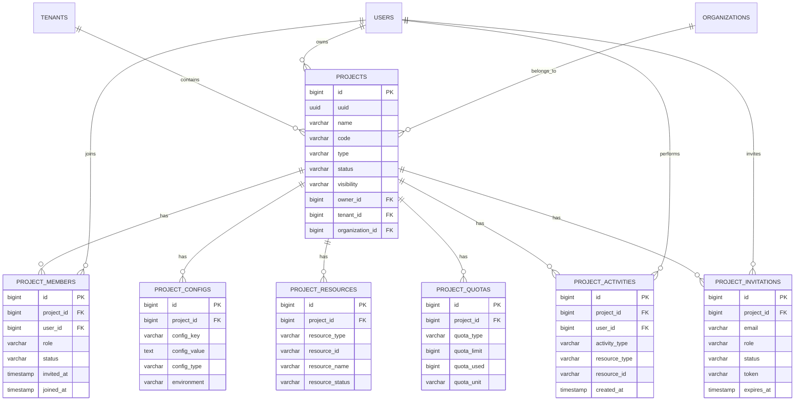

# 项目管理模块数据模型设计

> **模块名称**: project_management  
> **文档版本**: v1.0  
> **更新日期**: 2025-10-17

## 一、模块概述

### 1.1 功能描述

项目管理模块负责LLMOps平台的项目生命周期管理，包括项目创建、成员管理、资源配置、配额控制和项目级别的权限隔离。支持多租户环境下的项目资源管理和协作。

### 1.2 核心功能

- **项目管理**: 项目创建、配置、状态管理
- **成员管理**: 项目成员邀请、角色分配、权限控制
- **资源管理**: 项目资源分配、使用监控、配额管理
- **配置管理**: 项目级配置、环境变量、集成设置
- **协作管理**: 项目内协作、通知、活动记录

## 二、数据表设计

### 2.1 项目表 (projects)

```sql
CREATE TABLE projects (
    id BIGSERIAL PRIMARY KEY,
    uuid UUID NOT NULL DEFAULT gen_random_uuid(),
    name VARCHAR(200) NOT NULL,
    code VARCHAR(50) NOT NULL,
    description TEXT,
    type VARCHAR(20) NOT NULL DEFAULT 'general' CHECK (type IN ('general', 'research', 'production', 'demo')),
    status VARCHAR(20) NOT NULL DEFAULT 'active' CHECK (status IN ('active', 'inactive', 'archived', 'deleted')),
    visibility VARCHAR(20) NOT NULL DEFAULT 'private' CHECK (visibility IN ('private', 'internal', 'public')),
    avatar_url VARCHAR(500),
    website_url VARCHAR(500),
    repository_url VARCHAR(500),
    tags TEXT[],
    settings JSONB DEFAULT '{}',
    metadata JSONB DEFAULT '{}',
    owner_id BIGINT NOT NULL,
    tenant_id BIGINT NOT NULL,
    organization_id BIGINT,
    created_at TIMESTAMP WITH TIME ZONE NOT NULL DEFAULT NOW(),
    updated_at TIMESTAMP WITH TIME ZONE NOT NULL DEFAULT NOW(),
    created_by BIGINT,
    updated_by BIGINT,
    UNIQUE(tenant_id, code)
);

-- 索引
CREATE INDEX idx_projects_tenant_id ON projects(tenant_id);
CREATE INDEX idx_projects_code ON projects(code);
CREATE INDEX idx_projects_owner_id ON projects(owner_id);
CREATE INDEX idx_projects_organization_id ON projects(organization_id);
CREATE INDEX idx_projects_status ON projects(status);
CREATE INDEX idx_projects_type ON projects(type);
CREATE INDEX idx_projects_visibility ON projects(visibility);
CREATE INDEX idx_projects_created_at ON projects(created_at);
CREATE INDEX idx_projects_tags ON projects USING GIN(tags);

-- 外键
ALTER TABLE projects ADD CONSTRAINT fk_projects_owner 
    FOREIGN KEY (owner_id) REFERENCES users(id) ON DELETE RESTRICT;
ALTER TABLE projects ADD CONSTRAINT fk_projects_tenant 
    FOREIGN KEY (tenant_id) REFERENCES tenants(id) ON DELETE CASCADE;
ALTER TABLE projects ADD CONSTRAINT fk_projects_organization 
    FOREIGN KEY (organization_id) REFERENCES organizations(id) ON DELETE SET NULL;

-- 注释
COMMENT ON TABLE projects IS '项目信息表';
COMMENT ON COLUMN projects.code IS '项目代码，租户内唯一';
COMMENT ON COLUMN projects.type IS '项目类型：general-通用，research-研究，production-生产，demo-演示';
COMMENT ON COLUMN projects.status IS '项目状态：active-活跃，inactive-非活跃，archived-已归档，deleted-已删除';
COMMENT ON COLUMN projects.visibility IS '项目可见性：private-私有，internal-内部，public-公开';
COMMENT ON COLUMN projects.settings IS '项目设置，JSON格式';
COMMENT ON COLUMN projects.metadata IS '项目元数据，JSON格式';
COMMENT ON COLUMN projects.owner_id IS '项目所有者ID';
```

### 2.2 项目成员表 (project_members)

```sql
CREATE TABLE project_members (
    id BIGSERIAL PRIMARY KEY,
    project_id BIGINT NOT NULL,
    user_id BIGINT NOT NULL,
    role VARCHAR(50) NOT NULL DEFAULT 'member' CHECK (role IN ('owner', 'admin', 'developer', 'tester', 'viewer', 'member')),
    permissions JSONB DEFAULT '{}',
    invited_by BIGINT,
    invited_at TIMESTAMP WITH TIME ZONE NOT NULL DEFAULT NOW(),
    joined_at TIMESTAMP WITH TIME ZONE,
    status VARCHAR(20) NOT NULL DEFAULT 'pending' CHECK (status IN ('pending', 'active', 'inactive', 'declined')),
    expires_at TIMESTAMP WITH TIME ZONE,
    created_at TIMESTAMP WITH TIME ZONE NOT NULL DEFAULT NOW(),
    updated_at TIMESTAMP WITH TIME ZONE NOT NULL DEFAULT NOW(),
    UNIQUE(project_id, user_id)
);

-- 索引
CREATE INDEX idx_project_members_project_id ON project_members(project_id);
CREATE INDEX idx_project_members_user_id ON project_members(user_id);
CREATE INDEX idx_project_members_role ON project_members(role);
CREATE INDEX idx_project_members_status ON project_members(status);
CREATE INDEX idx_project_members_invited_by ON project_members(invited_by);

-- 外键
ALTER TABLE project_members ADD CONSTRAINT fk_project_members_project 
    FOREIGN KEY (project_id) REFERENCES projects(id) ON DELETE CASCADE;
ALTER TABLE project_members ADD CONSTRAINT fk_project_members_user 
    FOREIGN KEY (user_id) REFERENCES users(id) ON DELETE CASCADE;
ALTER TABLE project_members ADD CONSTRAINT fk_project_members_invited_by 
    FOREIGN KEY (invited_by) REFERENCES users(id) ON DELETE SET NULL;

-- 注释
COMMENT ON TABLE project_members IS '项目成员表';
COMMENT ON COLUMN project_members.role IS '成员角色：owner-所有者，admin-管理员，developer-开发者，tester-测试者，viewer-查看者，member-普通成员';
COMMENT ON COLUMN project_members.permissions IS '成员权限，JSON格式，可覆盖项目默认权限';
COMMENT ON COLUMN project_members.status IS '成员状态：pending-待确认，active-活跃，inactive-非活跃，declined-已拒绝';
COMMENT ON COLUMN project_members.expires_at IS '成员权限过期时间，NULL表示永不过期';
```

### 2.3 项目配置表 (project_configs)

```sql
CREATE TABLE project_configs (
    id BIGSERIAL PRIMARY KEY,
    project_id BIGINT NOT NULL,
    config_key VARCHAR(100) NOT NULL,
    config_value TEXT,
    config_type VARCHAR(20) NOT NULL DEFAULT 'string' CHECK (config_type IN ('string', 'number', 'boolean', 'json', 'secret')),
    description TEXT,
    is_encrypted BOOLEAN NOT NULL DEFAULT FALSE,
    is_required BOOLEAN NOT NULL DEFAULT FALSE,
    default_value TEXT,
    validation_rule VARCHAR(200),
    environment VARCHAR(20) NOT NULL DEFAULT 'default' CHECK (environment IN ('default', 'development', 'testing', 'staging', 'production')),
    sort_order INTEGER NOT NULL DEFAULT 0,
    status VARCHAR(20) NOT NULL DEFAULT 'active' CHECK (status IN ('active', 'inactive', 'deleted')),
    created_at TIMESTAMP WITH TIME ZONE NOT NULL DEFAULT NOW(),
    updated_at TIMESTAMP WITH TIME ZONE NOT NULL DEFAULT NOW(),
    created_by BIGINT,
    updated_by BIGINT,
    UNIQUE(project_id, config_key, environment)
);

-- 索引
CREATE INDEX idx_project_configs_project_id ON project_configs(project_id);
CREATE INDEX idx_project_configs_config_key ON project_configs(config_key);
CREATE INDEX idx_project_configs_environment ON project_configs(environment);
CREATE INDEX idx_project_configs_status ON project_configs(status);
CREATE INDEX idx_project_configs_type ON project_configs(config_type);

-- 外键
ALTER TABLE project_configs ADD CONSTRAINT fk_project_configs_project 
    FOREIGN KEY (project_id) REFERENCES projects(id) ON DELETE CASCADE;

-- 注释
COMMENT ON TABLE project_configs IS '项目配置表';
COMMENT ON COLUMN project_configs.config_type IS '配置类型：string-字符串，number-数字，boolean-布尔值，json-JSON对象，secret-密钥';
COMMENT ON COLUMN project_configs.is_encrypted IS '是否加密存储';
COMMENT ON COLUMN project_configs.environment IS '环境：default-默认，development-开发，testing-测试，staging-预发布，production-生产';
COMMENT ON COLUMN project_configs.validation_rule IS '验证规则，正则表达式或验证函数';
```

### 2.4 项目资源表 (project_resources)

```sql
CREATE TABLE project_resources (
    id BIGSERIAL PRIMARY KEY,
    project_id BIGINT NOT NULL,
    resource_type VARCHAR(50) NOT NULL CHECK (resource_type IN ('model', 'dataset', 'service', 'storage', 'compute', 'network')),
    resource_id VARCHAR(100) NOT NULL,
    resource_name VARCHAR(200) NOT NULL,
    resource_config JSONB DEFAULT '{}',
    resource_status VARCHAR(20) NOT NULL DEFAULT 'active' CHECK (resource_status IN ('active', 'inactive', 'deleted', 'error')),
    allocated_at TIMESTAMP WITH TIME ZONE NOT NULL DEFAULT NOW(),
    released_at TIMESTAMP WITH TIME ZONE,
    usage_stats JSONB DEFAULT '{}',
    cost_info JSONB DEFAULT '{}',
    metadata JSONB DEFAULT '{}',
    created_at TIMESTAMP WITH TIME ZONE NOT NULL DEFAULT NOW(),
    updated_at TIMESTAMP WITH TIME ZONE NOT NULL DEFAULT NOW(),
    created_by BIGINT,
    updated_by BIGINT,
    UNIQUE(project_id, resource_type, resource_id)
);

-- 索引
CREATE INDEX idx_project_resources_project_id ON project_resources(project_id);
CREATE INDEX idx_project_resources_resource_type ON project_resources(resource_type);
CREATE INDEX idx_project_resources_resource_id ON project_resources(resource_id);
CREATE INDEX idx_project_resources_resource_status ON project_resources(resource_status);
CREATE INDEX idx_project_resources_allocated_at ON project_resources(allocated_at);

-- 外键
ALTER TABLE project_resources ADD CONSTRAINT fk_project_resources_project 
    FOREIGN KEY (project_id) REFERENCES projects(id) ON DELETE CASCADE;

-- 注释
COMMENT ON TABLE project_resources IS '项目资源表';
COMMENT ON COLUMN project_resources.resource_type IS '资源类型：model-模型，dataset-数据集，service-服务，storage-存储，compute-计算，network-网络';
COMMENT ON COLUMN project_resources.resource_id IS '资源ID，对应具体资源的唯一标识';
COMMENT ON COLUMN project_resources.resource_config IS '资源配置，JSON格式';
COMMENT ON COLUMN project_resources.usage_stats IS '使用统计，JSON格式';
COMMENT ON COLUMN project_resources.cost_info IS '成本信息，JSON格式';
```

### 2.5 项目配额表 (project_quotas)

```sql
CREATE TABLE project_quotas (
    id BIGSERIAL PRIMARY KEY,
    project_id BIGINT NOT NULL,
    quota_type VARCHAR(50) NOT NULL CHECK (quota_type IN ('storage', 'compute', 'network', 'api_calls', 'users', 'models', 'datasets')),
    quota_limit BIGINT NOT NULL,
    quota_used BIGINT NOT NULL DEFAULT 0,
    quota_unit VARCHAR(20) NOT NULL DEFAULT 'count' CHECK (quota_unit IN ('count', 'bytes', 'seconds', 'requests', 'gb_hours')),
    reset_period VARCHAR(20) NOT NULL DEFAULT 'monthly' CHECK (reset_period IN ('daily', 'weekly', 'monthly', 'yearly', 'never')),
    reset_date DATE,
    warning_threshold DECIMAL(5,2) NOT NULL DEFAULT 80.00,
    critical_threshold DECIMAL(5,2) NOT NULL DEFAULT 95.00,
    is_hard_limit BOOLEAN NOT NULL DEFAULT TRUE,
    status VARCHAR(20) NOT NULL DEFAULT 'active' CHECK (status IN ('active', 'inactive', 'suspended')),
    created_at TIMESTAMP WITH TIME ZONE NOT NULL DEFAULT NOW(),
    updated_at TIMESTAMP WITH TIME ZONE NOT NULL DEFAULT NOW(),
    created_by BIGINT,
    updated_by BIGINT,
    UNIQUE(project_id, quota_type)
);

-- 索引
CREATE INDEX idx_project_quotas_project_id ON project_quotas(project_id);
CREATE INDEX idx_project_quotas_quota_type ON project_quotas(quota_type);
CREATE INDEX idx_project_quotas_status ON project_quotas(status);
CREATE INDEX idx_project_quotas_reset_date ON project_quotas(reset_date);

-- 外键
ALTER TABLE project_quotas ADD CONSTRAINT fk_project_quotas_project 
    FOREIGN KEY (project_id) REFERENCES projects(id) ON DELETE CASCADE;

-- 注释
COMMENT ON TABLE project_quotas IS '项目配额表';
COMMENT ON COLUMN project_quotas.quota_type IS '配额类型：storage-存储，compute-计算，network-网络，api_calls-API调用，users-用户，models-模型，datasets-数据集';
COMMENT ON COLUMN project_quotas.quota_limit IS '配额限制值';
COMMENT ON COLUMN project_quotas.quota_used IS '已使用配额';
COMMENT ON COLUMN project_quotas.quota_unit IS '配额单位：count-数量，bytes-字节，seconds-秒，requests-请求，gb_hours-GB小时';
COMMENT ON COLUMN project_quotas.reset_period IS '重置周期：daily-每日，weekly-每周，monthly-每月，yearly-每年，never-从不';
COMMENT ON COLUMN project_quotas.is_hard_limit IS '是否为硬限制，硬限制达到后拒绝服务';
```

### 2.6 项目活动表 (project_activities)

```sql
CREATE TABLE project_activities (
    id BIGSERIAL PRIMARY KEY,
    project_id BIGINT NOT NULL,
    user_id BIGINT NOT NULL,
    activity_type VARCHAR(50) NOT NULL CHECK (activity_type IN ('created', 'updated', 'deleted', 'joined', 'left', 'invited', 'role_changed', 'config_changed', 'resource_allocated', 'resource_released')),
    resource_type VARCHAR(50),
    resource_id VARCHAR(100),
    resource_name VARCHAR(200),
    old_values JSONB,
    new_values JSONB,
    description TEXT,
    ip_address INET,
    user_agent TEXT,
    created_at TIMESTAMP WITH TIME ZONE NOT NULL DEFAULT NOW()
);

-- 索引
CREATE INDEX idx_project_activities_project_id ON project_activities(project_id);
CREATE INDEX idx_project_activities_user_id ON project_activities(user_id);
CREATE INDEX idx_project_activities_activity_type ON project_activities(activity_type);
CREATE INDEX idx_project_activities_resource_type ON project_activities(resource_type);
CREATE INDEX idx_project_activities_created_at ON project_activities(created_at);

-- 外键
ALTER TABLE project_activities ADD CONSTRAINT fk_project_activities_project 
    FOREIGN KEY (project_id) REFERENCES projects(id) ON DELETE CASCADE;
ALTER TABLE project_activities ADD CONSTRAINT fk_project_activities_user 
    FOREIGN KEY (user_id) REFERENCES users(id) ON DELETE CASCADE;

-- 注释
COMMENT ON TABLE project_activities IS '项目活动表';
COMMENT ON COLUMN project_activities.activity_type IS '活动类型：created-创建，updated-更新，deleted-删除，joined-加入，left-离开，invited-邀请，role_changed-角色变更，config_changed-配置变更，resource_allocated-资源分配，resource_released-资源释放';
COMMENT ON COLUMN project_activities.resource_type IS '相关资源类型';
COMMENT ON COLUMN project_activities.resource_id IS '相关资源ID';
COMMENT ON COLUMN project_activities.old_values IS '变更前的值，JSON格式';
COMMENT ON COLUMN project_activities.new_values IS '变更后的值，JSON格式';
```

### 2.7 项目邀请表 (project_invitations)

```sql
CREATE TABLE project_invitations (
    id BIGSERIAL PRIMARY KEY,
    project_id BIGINT NOT NULL,
    email VARCHAR(100) NOT NULL,
    role VARCHAR(50) NOT NULL DEFAULT 'member' CHECK (role IN ('admin', 'developer', 'tester', 'viewer', 'member')),
    permissions JSONB DEFAULT '{}',
    message TEXT,
    invited_by BIGINT NOT NULL,
    invited_at TIMESTAMP WITH TIME ZONE NOT NULL DEFAULT NOW(),
    expires_at TIMESTAMP WITH TIME ZONE NOT NULL,
    accepted_at TIMESTAMP WITH TIME ZONE,
    declined_at TIMESTAMP WITH TIME ZONE,
    status VARCHAR(20) NOT NULL DEFAULT 'pending' CHECK (status IN ('pending', 'accepted', 'declined', 'expired', 'cancelled')),
    token VARCHAR(128) NOT NULL UNIQUE,
    created_at TIMESTAMP WITH TIME ZONE NOT NULL DEFAULT NOW(),
    updated_at TIMESTAMP WITH TIME ZONE NOT NULL DEFAULT NOW()
);

-- 索引
CREATE INDEX idx_project_invitations_project_id ON project_invitations(project_id);
CREATE INDEX idx_project_invitations_email ON project_invitations(email);
CREATE INDEX idx_project_invitations_invited_by ON project_invitations(invited_by);
CREATE INDEX idx_project_invitations_status ON project_invitations(status);
CREATE INDEX idx_project_invitations_token ON project_invitations(token);
CREATE INDEX idx_project_invitations_expires_at ON project_invitations(expires_at);

-- 外键
ALTER TABLE project_invitations ADD CONSTRAINT fk_project_invitations_project 
    FOREIGN KEY (project_id) REFERENCES projects(id) ON DELETE CASCADE;
ALTER TABLE project_invitations ADD CONSTRAINT fk_project_invitations_invited_by 
    FOREIGN KEY (invited_by) REFERENCES users(id) ON DELETE CASCADE;

-- 注释
COMMENT ON TABLE project_invitations IS '项目邀请表';
COMMENT ON COLUMN project_invitations.email IS '被邀请人邮箱';
COMMENT ON COLUMN project_invitations.role IS '邀请的角色';
COMMENT ON COLUMN project_invitations.permissions IS '邀请的权限，JSON格式';
COMMENT ON COLUMN project_invitations.message IS '邀请消息';
COMMENT ON COLUMN project_invitations.token IS '邀请令牌，用于验证邀请';
COMMENT ON COLUMN project_invitations.expires_at IS '邀请过期时间';
```

## 三、数据关系图



## 四、业务规则

### 4.1 项目管理规则

```yaml
项目创建:
  - 项目代码在租户内唯一
  - 项目名称不能重复
  - 创建者自动成为项目所有者
  - 项目默认状态为active
  - 项目默认可见性为private

项目状态:
  - active: 正常使用状态
  - inactive: 暂停使用，保留数据
  - archived: 归档状态，只读访问
  - deleted: 软删除，30天后物理删除

项目类型:
  - general: 通用项目，标准功能
  - research: 研究项目，实验性功能
  - production: 生产项目，稳定功能
  - demo: 演示项目，展示功能

项目可见性:
  - private: 私有项目，仅成员可见
  - internal: 内部项目，租户内可见
  - public: 公开项目，所有用户可见
```

### 4.2 成员管理规则

```yaml
成员角色:
  - owner: 项目所有者，拥有所有权限
  - admin: 管理员，管理项目设置和成员
  - developer: 开发者，开发和部署功能
  - tester: 测试者，测试和评估功能
  - viewer: 查看者，只能查看数据
  - member: 普通成员，基础功能权限

成员邀请:
  - 只有admin和owner可以邀请成员
  - 邀请邮件有效期7天
  - 被邀请人必须注册平台账号
  - 邀请可以设置过期时间
  - 邀请可以取消

成员权限:
  - 基于角色的默认权限
  - 可以自定义成员权限
  - 权限可以设置过期时间
  - 权限变更需要记录审计日志
```

### 4.3 资源管理规则

```yaml
资源分配:
  - 资源必须分配给具体项目
  - 资源分配需要检查配额限制
  - 资源分配需要记录使用统计
  - 资源释放需要清理相关数据

资源类型:
  - model: 模型资源，包括模型文件和配置
  - dataset: 数据集资源，包括训练和测试数据
  - service: 服务资源，包括推理服务和API
  - storage: 存储资源，包括文件存储和数据库
  - compute: 计算资源，包括CPU和GPU
  - network: 网络资源，包括带宽和连接数

资源状态:
  - active: 正常使用状态
  - inactive: 暂停使用状态
  - deleted: 已删除状态
  - error: 错误状态，需要处理
```

### 4.4 配额管理规则

```yaml
配额类型:
  - storage: 存储空间配额，单位GB
  - compute: 计算资源配额，单位GB小时
  - network: 网络带宽配额，单位GB/月
  - api_calls: API调用配额，单位次/月
  - users: 用户数量配额，单位个
  - models: 模型数量配额，单位个
  - datasets: 数据集数量配额，单位个

配额限制:
  - 硬限制：达到后拒绝服务
  - 软限制：达到后发送告警
  - 警告阈值：默认80%
  - 严重阈值：默认95%

配额重置:
  - 支持按日、周、月、年重置
  - 重置时间可以自定义
  - 重置后使用量清零
  - 重置历史需要保留
```

## 五、性能优化

### 5.1 索引优化

```sql
-- 复合索引
CREATE INDEX idx_projects_tenant_status ON projects(tenant_id, status);
CREATE INDEX idx_projects_owner_status ON projects(owner_id, status);
CREATE INDEX idx_project_members_project_status ON project_members(project_id, status);
CREATE INDEX idx_project_members_user_status ON project_members(user_id, status);
CREATE INDEX idx_project_resources_project_type ON project_resources(project_id, resource_type);
CREATE INDEX idx_project_quotas_project_type ON project_quotas(project_id, quota_type);

-- 部分索引
CREATE INDEX idx_projects_active ON projects(id) WHERE status = 'active';
CREATE INDEX idx_project_members_active ON project_members(id) WHERE status = 'active';
CREATE INDEX idx_project_configs_active ON project_configs(id) WHERE status = 'active';
CREATE INDEX idx_project_resources_active ON project_resources(id) WHERE resource_status = 'active';

-- 表达式索引
CREATE INDEX idx_projects_lower_name ON projects(lower(name));
CREATE INDEX idx_projects_lower_code ON projects(lower(code));
```

### 5.2 查询优化

```sql
-- 项目成员权限查询优化
CREATE VIEW project_user_permissions AS
SELECT 
    p.id as project_id,
    p.name as project_name,
    p.tenant_id,
    pm.user_id,
    pm.role,
    pm.permissions,
    pm.status as member_status,
    u.username,
    u.email
FROM projects p
JOIN project_members pm ON p.id = pm.project_id AND pm.status = 'active'
JOIN users u ON pm.user_id = u.id AND u.status = 'active'
WHERE p.status = 'active';

-- 项目资源使用统计查询
CREATE VIEW project_resource_usage AS
SELECT 
    p.id as project_id,
    p.name as project_name,
    pr.resource_type,
    COUNT(*) as resource_count,
    SUM(CASE WHEN pr.resource_status = 'active' THEN 1 ELSE 0 END) as active_count,
    SUM(CASE WHEN pr.resource_status = 'inactive' THEN 1 ELSE 0 END) as inactive_count
FROM projects p
LEFT JOIN project_resources pr ON p.id = pr.project_id
WHERE p.status = 'active'
GROUP BY p.id, p.name, pr.resource_type;

-- 项目配额使用情况查询
CREATE VIEW project_quota_usage AS
SELECT 
    p.id as project_id,
    p.name as project_name,
    pq.quota_type,
    pq.quota_limit,
    pq.quota_used,
    pq.quota_unit,
    ROUND((pq.quota_used::DECIMAL / pq.quota_limit * 100), 2) as usage_percentage,
    CASE 
        WHEN pq.quota_used >= pq.quota_limit THEN 'exceeded'
        WHEN pq.quota_used >= (pq.quota_limit * pq.critical_threshold / 100) THEN 'critical'
        WHEN pq.quota_used >= (pq.quota_limit * pq.warning_threshold / 100) THEN 'warning'
        ELSE 'normal'
    END as quota_status
FROM projects p
JOIN project_quotas pq ON p.id = pq.project_id
WHERE p.status = 'active' AND pq.status = 'active';
```

### 5.3 缓存策略

```yaml
项目信息缓存:
  - 缓存键: project:{project_id}
  - 缓存时间: 1小时
  - 更新策略: 项目信息变更时主动失效

项目成员缓存:
  - 缓存键: project_members:{project_id}
  - 缓存时间: 30分钟
  - 更新策略: 成员变更时主动失效

项目配置缓存:
  - 缓存键: project_config:{project_id}:{environment}
  - 缓存时间: 2小时
  - 更新策略: 配置变更时主动失效

项目配额缓存:
  - 缓存键: project_quota:{project_id}
  - 缓存时间: 10分钟
  - 更新策略: 配额使用更新时主动失效
```

## 六、安全设计

### 6.1 数据加密

```sql
-- 敏感配置加密存储
CREATE OR REPLACE FUNCTION encrypt_project_config(value TEXT, is_secret BOOLEAN)
RETURNS TEXT AS $$
BEGIN
    IF is_secret THEN
        RETURN encode(encrypt(value::bytea, current_setting('app.encryption_key')::bytea, 'aes'), 'base64');
    ELSE
        RETURN value;
    END IF;
END;
$$ LANGUAGE plpgsql;

-- 敏感配置解密
CREATE OR REPLACE FUNCTION decrypt_project_config(encrypted_value TEXT, is_secret BOOLEAN)
RETURNS TEXT AS $$
BEGIN
    IF is_secret THEN
        RETURN convert_from(decrypt(decode(encrypted_value, 'base64'), current_setting('app.encryption_key')::bytea, 'aes'), 'UTF8');
    ELSE
        RETURN encrypted_value;
    END IF;
END;
$$ LANGUAGE plpgsql;
```

### 6.2 权限控制

```sql
-- 项目访问权限检查函数
CREATE OR REPLACE FUNCTION check_project_access(
    p_project_id BIGINT,
    p_user_id BIGINT,
    p_required_role VARCHAR DEFAULT 'viewer'
) RETURNS BOOLEAN AS $$
DECLARE
    user_role VARCHAR;
    role_level INTEGER;
    required_level INTEGER;
BEGIN
    -- 获取用户角色
    SELECT pm.role INTO user_role
    FROM project_members pm
    WHERE pm.project_id = p_project_id 
      AND pm.user_id = p_user_id 
      AND pm.status = 'active';
    
    IF user_role IS NULL THEN
        RETURN FALSE;
    END IF;
    
    -- 角色级别映射
    role_level := CASE user_role
        WHEN 'owner' THEN 100
        WHEN 'admin' THEN 90
        WHEN 'developer' THEN 70
        WHEN 'tester' THEN 60
        WHEN 'viewer' THEN 40
        WHEN 'member' THEN 50
        ELSE 0
    END;
    
    required_level := CASE p_required_role
        WHEN 'owner' THEN 100
        WHEN 'admin' THEN 90
        WHEN 'developer' THEN 70
        WHEN 'tester' THEN 60
        WHEN 'viewer' THEN 40
        WHEN 'member' THEN 50
        ELSE 0
    END;
    
    RETURN role_level >= required_level;
END;
$$ LANGUAGE plpgsql;
```

### 6.3 审计日志

```sql
-- 项目操作审计触发器
CREATE OR REPLACE FUNCTION project_audit_trigger()
RETURNS TRIGGER AS $$
BEGIN
    IF TG_OP = 'INSERT' THEN
        INSERT INTO project_activities (
            project_id, user_id, activity_type, resource_type, 
            resource_id, resource_name, new_values, description
        ) VALUES (
            NEW.id, NEW.created_by, 'created', 'project', 
            NEW.id::TEXT, NEW.name, to_jsonb(NEW), 
            'Project created: ' || NEW.name
        );
        RETURN NEW;
    ELSIF TG_OP = 'UPDATE' THEN
        INSERT INTO project_activities (
            project_id, user_id, activity_type, resource_type, 
            resource_id, resource_name, old_values, new_values, description
        ) VALUES (
            NEW.id, NEW.updated_by, 'updated', 'project', 
            NEW.id::TEXT, NEW.name, to_jsonb(OLD), to_jsonb(NEW),
            'Project updated: ' || NEW.name
        );
        RETURN NEW;
    ELSIF TG_OP = 'DELETE' THEN
        INSERT INTO project_activities (
            project_id, user_id, activity_type, resource_type, 
            resource_id, resource_name, old_values, description
        ) VALUES (
            OLD.id, OLD.updated_by, 'deleted', 'project', 
            OLD.id::TEXT, OLD.name, to_jsonb(OLD),
            'Project deleted: ' || OLD.name
        );
        RETURN OLD;
    END IF;
    RETURN NULL;
END;
$$ LANGUAGE plpgsql;

-- 为项目表创建审计触发器
CREATE TRIGGER projects_audit_trigger
    AFTER INSERT OR UPDATE OR DELETE ON projects
    FOR EACH ROW EXECUTE FUNCTION project_audit_trigger();
```

## 七、初始化数据

### 7.1 默认项目配置

```sql
-- 插入默认项目配置模板
INSERT INTO project_configs (project_id, config_key, config_value, config_type, description, is_required, environment) VALUES
-- 通用配置
(1, 'project.description', '', 'string', '项目描述', FALSE, 'default'),
(1, 'project.website', '', 'string', '项目网站', FALSE, 'default'),
(1, 'project.repository', '', 'string', '代码仓库地址', FALSE, 'default'),

-- 模型配置
(1, 'model.default_framework', 'pytorch', 'string', '默认模型框架', TRUE, 'default'),
(1, 'model.default_precision', 'fp16', 'string', '默认精度', TRUE, 'default'),
(1, 'model.max_size', '10GB', 'string', '模型最大大小', TRUE, 'default'),

-- 推理配置
(1, 'inference.default_batch_size', '1', 'number', '默认批处理大小', TRUE, 'default'),
(1, 'inference.max_concurrent_requests', '100', 'number', '最大并发请求数', TRUE, 'default'),
(1, 'inference.timeout', '30', 'number', '推理超时时间(秒)', TRUE, 'default'),

-- 存储配置
(1, 'storage.default_provider', 'minio', 'string', '默认存储提供商', TRUE, 'default'),
(1, 'storage.default_bucket', 'llmops-models', 'string', '默认存储桶', TRUE, 'default'),
(1, 'storage.encryption_enabled', 'true', 'boolean', '是否启用存储加密', TRUE, 'default'),

-- 监控配置
(1, 'monitoring.enabled', 'true', 'boolean', '是否启用监控', TRUE, 'default'),
(1, 'monitoring.metrics_retention', '30d', 'string', '指标保留时间', TRUE, 'default'),
(1, 'monitoring.log_level', 'info', 'string', '日志级别', TRUE, 'default');
```

### 7.2 默认项目配额

```sql
-- 插入默认项目配额模板
INSERT INTO project_quotas (project_id, quota_type, quota_limit, quota_unit, reset_period, warning_threshold, critical_threshold) VALUES
-- 基础配额
(1, 'storage', 100, 'gb', 'monthly', 80.00, 95.00),
(1, 'compute', 1000, 'gb_hours', 'monthly', 80.00, 95.00),
(1, 'network', 1000, 'gb', 'monthly', 80.00, 95.00),
(1, 'api_calls', 100000, 'requests', 'monthly', 80.00, 95.00),

-- 资源配额
(1, 'users', 10, 'count', 'never', 80.00, 95.00),
(1, 'models', 50, 'count', 'never', 80.00, 95.00),
(1, 'datasets', 20, 'count', 'never', 80.00, 95.00);
```

## 八、总结

项目管理模块是LLMOps平台的核心模块，提供了完整的项目生命周期管理功能，包括项目创建、成员管理、资源配置、配额控制和协作管理。

### 核心特性

1. **多租户支持**: 项目按租户隔离，支持多组织架构
2. **灵活权限控制**: 基于角色的细粒度权限管理
3. **资源管理**: 完整的资源分配、监控和配额管理
4. **配置管理**: 多环境配置管理和敏感信息加密
5. **协作功能**: 成员邀请、活动记录和通知机制

### 扩展性

- 支持自定义项目类型和配置
- 支持灵活的资源类型扩展
- 支持多种配额类型和重置策略
- 支持项目级别的权限定制

---

**文档维护**: 本文档应随业务需求变化持续更新，保持与系统架构的一致性。

**版本历史**:
- v1.0 (2025-10-17): 初始版本，完整项目管理模块设计

