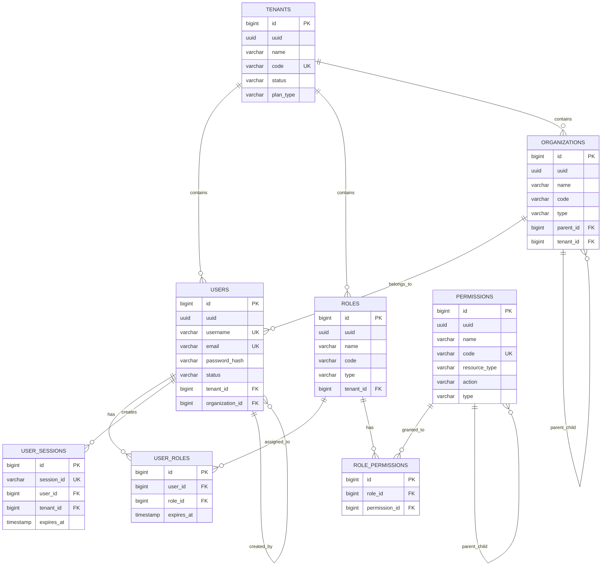

# 用户权限模块数据模型设计

> **模块名称**: user_permission  
> **文档版本**: v1.0  
> **更新日期**: 2025-10-17

## 一、模块概述

### 1.1 功能描述

用户权限模块负责LLMOps平台的用户管理、角色权限控制、组织架构管理和多租户数据隔离。支持细粒度的RBAC权限控制,确保数据安全和访问合规。

### 1.2 核心功能

- **用户管理**: 用户注册、认证、信息维护
- **角色管理**: 角色定义、权限分配、角色继承
- **权限控制**: 细粒度权限控制、资源级权限
- **组织管理**: 组织架构、部门管理、层级关系
- **租户管理**: 多租户数据隔离、租户配置

## 二、数据表设计

### 2.1 用户表 (users)

```sql
CREATE TABLE users (
    id BIGSERIAL PRIMARY KEY,
    uuid UUID NOT NULL DEFAULT gen_random_uuid(),
    username VARCHAR(50) NOT NULL UNIQUE,
    email VARCHAR(100) NOT NULL UNIQUE,
    phone VARCHAR(20),
    password_hash VARCHAR(255) NOT NULL,
    salt VARCHAR(32) NOT NULL,
    real_name VARCHAR(100),
    avatar_url VARCHAR(500),
    status VARCHAR(20) NOT NULL DEFAULT 'active' CHECK (status IN ('active', 'inactive', 'locked', 'deleted')),
    email_verified BOOLEAN NOT NULL DEFAULT FALSE,
    phone_verified BOOLEAN NOT NULL DEFAULT FALSE,
    last_login_at TIMESTAMP WITH TIME ZONE,
    last_login_ip INET,
    login_count INTEGER NOT NULL DEFAULT 0,
    failed_login_count INTEGER NOT NULL DEFAULT 0,
    locked_until TIMESTAMP WITH TIME ZONE,
    password_changed_at TIMESTAMP WITH TIME ZONE NOT NULL DEFAULT NOW(),
    password_expires_at TIMESTAMP WITH TIME ZONE,
    mfa_enabled BOOLEAN NOT NULL DEFAULT FALSE,
    mfa_secret VARCHAR(32),
    timezone VARCHAR(50) DEFAULT 'UTC',
    language VARCHAR(10) DEFAULT 'zh-CN',
    tenant_id BIGINT NOT NULL,
    organization_id BIGINT,
    created_at TIMESTAMP WITH TIME ZONE NOT NULL DEFAULT NOW(),
    updated_at TIMESTAMP WITH TIME ZONE NOT NULL DEFAULT NOW(),
    created_by BIGINT,
    updated_by BIGINT
);

-- 索引
CREATE INDEX idx_users_username ON users(username);
CREATE INDEX idx_users_email ON users(email);
CREATE INDEX idx_users_tenant_id ON users(tenant_id);
CREATE INDEX idx_users_organization_id ON users(organization_id);
CREATE INDEX idx_users_status ON users(status);
CREATE INDEX idx_users_created_at ON users(created_at);

-- 注释
COMMENT ON TABLE users IS '用户基础信息表';
COMMENT ON COLUMN users.uuid IS '用户唯一标识符';
COMMENT ON COLUMN users.username IS '用户名，唯一';
COMMENT ON COLUMN users.email IS '邮箱地址，唯一';
COMMENT ON COLUMN users.password_hash IS '密码哈希值';
COMMENT ON COLUMN users.salt IS '密码盐值';
COMMENT ON COLUMN users.status IS '用户状态：active-活跃，inactive-未激活，locked-锁定，deleted-已删除';
COMMENT ON COLUMN users.tenant_id IS '所属租户ID';
COMMENT ON COLUMN users.organization_id IS '所属组织ID';
```

### 2.2 角色表 (roles)

```sql
CREATE TABLE roles (
    id BIGSERIAL PRIMARY KEY,
    uuid UUID NOT NULL DEFAULT gen_random_uuid(),
    name VARCHAR(100) NOT NULL,
    code VARCHAR(50) NOT NULL,
    description TEXT,
    type VARCHAR(20) NOT NULL DEFAULT 'custom' CHECK (type IN ('system', 'custom')),
    level INTEGER NOT NULL DEFAULT 1,
    is_default BOOLEAN NOT NULL DEFAULT FALSE,
    status VARCHAR(20) NOT NULL DEFAULT 'active' CHECK (status IN ('active', 'inactive', 'deleted')),
    tenant_id BIGINT NOT NULL,
    created_at TIMESTAMP WITH TIME ZONE NOT NULL DEFAULT NOW(),
    updated_at TIMESTAMP WITH TIME ZONE NOT NULL DEFAULT NOW(),
    created_by BIGINT,
    updated_by BIGINT,
    UNIQUE(tenant_id, code)
);

-- 索引
CREATE INDEX idx_roles_tenant_id ON roles(tenant_id);
CREATE INDEX idx_roles_code ON roles(code);
CREATE INDEX idx_roles_type ON roles(type);
CREATE INDEX idx_roles_status ON roles(status);

-- 注释
COMMENT ON TABLE roles IS '角色定义表';
COMMENT ON COLUMN roles.code IS '角色代码，租户内唯一';
COMMENT ON COLUMN roles.type IS '角色类型：system-系统角色，custom-自定义角色';
COMMENT ON COLUMN roles.level IS '角色级别，数字越大权限越高';
COMMENT ON COLUMN roles.is_default IS '是否为默认角色';
```

### 2.3 权限表 (permissions)

```sql
CREATE TABLE permissions (
    id BIGSERIAL PRIMARY KEY,
    uuid UUID NOT NULL DEFAULT gen_random_uuid(),
    name VARCHAR(100) NOT NULL,
    code VARCHAR(100) NOT NULL UNIQUE,
    description TEXT,
    resource_type VARCHAR(50) NOT NULL,
    action VARCHAR(50) NOT NULL,
    resource_pattern VARCHAR(200),
    conditions JSONB,
    type VARCHAR(20) NOT NULL DEFAULT 'api' CHECK (type IN ('api', 'menu', 'button', 'data')),
    parent_id BIGINT,
    sort_order INTEGER NOT NULL DEFAULT 0,
    status VARCHAR(20) NOT NULL DEFAULT 'active' CHECK (status IN ('active', 'inactive', 'deleted')),
    created_at TIMESTAMP WITH TIME ZONE NOT NULL DEFAULT NOW(),
    updated_at TIMESTAMP WITH TIME ZONE NOT NULL DEFAULT NOW(),
    created_by BIGINT,
    updated_by BIGINT
);

-- 索引
CREATE INDEX idx_permissions_code ON permissions(code);
CREATE INDEX idx_permissions_resource_type ON permissions(resource_type);
CREATE INDEX idx_permissions_action ON permissions(action);
CREATE INDEX idx_permissions_type ON permissions(type);
CREATE INDEX idx_permissions_parent_id ON permissions(parent_id);
CREATE INDEX idx_permissions_status ON permissions(status);

-- 外键
ALTER TABLE permissions ADD CONSTRAINT fk_permissions_parent 
    FOREIGN KEY (parent_id) REFERENCES permissions(id) ON DELETE CASCADE;

-- 注释
COMMENT ON TABLE permissions IS '权限定义表';
COMMENT ON COLUMN permissions.code IS '权限代码，全局唯一';
COMMENT ON COLUMN permissions.resource_type IS '资源类型：user, project, model, inference等';
COMMENT ON COLUMN permissions.action IS '操作类型：create, read, update, delete, execute等';
COMMENT ON COLUMN permissions.resource_pattern IS '资源模式，支持通配符';
COMMENT ON COLUMN permissions.conditions IS '权限条件，JSON格式';
COMMENT ON COLUMN permissions.type IS '权限类型：api-接口权限，menu-菜单权限，button-按钮权限，data-数据权限';
```

### 2.4 用户角色关联表 (user_roles)

```sql
CREATE TABLE user_roles (
    id BIGSERIAL PRIMARY KEY,
    user_id BIGINT NOT NULL,
    role_id BIGINT NOT NULL,
    granted_by BIGINT,
    granted_at TIMESTAMP WITH TIME ZONE NOT NULL DEFAULT NOW(),
    expires_at TIMESTAMP WITH TIME ZONE,
    status VARCHAR(20) NOT NULL DEFAULT 'active' CHECK (status IN ('active', 'inactive', 'expired')),
    created_at TIMESTAMP WITH TIME ZONE NOT NULL DEFAULT NOW(),
    updated_at TIMESTAMP WITH TIME ZONE NOT NULL DEFAULT NOW(),
    UNIQUE(user_id, role_id)
);

-- 索引
CREATE INDEX idx_user_roles_user_id ON user_roles(user_id);
CREATE INDEX idx_user_roles_role_id ON user_roles(role_id);
CREATE INDEX idx_user_roles_status ON user_roles(status);
CREATE INDEX idx_user_roles_expires_at ON user_roles(expires_at);

-- 外键
ALTER TABLE user_roles ADD CONSTRAINT fk_user_roles_user 
    FOREIGN KEY (user_id) REFERENCES users(id) ON DELETE CASCADE;
ALTER TABLE user_roles ADD CONSTRAINT fk_user_roles_role 
    FOREIGN KEY (role_id) REFERENCES roles(id) ON DELETE CASCADE;
ALTER TABLE user_roles ADD CONSTRAINT fk_user_roles_granted_by 
    FOREIGN KEY (granted_by) REFERENCES users(id) ON DELETE SET NULL;

-- 注释
COMMENT ON TABLE user_roles IS '用户角色关联表';
COMMENT ON COLUMN user_roles.expires_at IS '角色过期时间，NULL表示永不过期';
COMMENT ON COLUMN user_roles.granted_by IS '授权人ID';
```

### 2.5 角色权限关联表 (role_permissions)

```sql
CREATE TABLE role_permissions (
    id BIGSERIAL PRIMARY KEY,
    role_id BIGINT NOT NULL,
    permission_id BIGINT NOT NULL,
    granted_by BIGINT,
    granted_at TIMESTAMP WITH TIME ZONE NOT NULL DEFAULT NOW(),
    status VARCHAR(20) NOT NULL DEFAULT 'active' CHECK (status IN ('active', 'inactive')),
    created_at TIMESTAMP WITH TIME ZONE NOT NULL DEFAULT NOW(),
    updated_at TIMESTAMP WITH TIME ZONE NOT NULL DEFAULT NOW(),
    UNIQUE(role_id, permission_id)
);

-- 索引
CREATE INDEX idx_role_permissions_role_id ON role_permissions(role_id);
CREATE INDEX idx_role_permissions_permission_id ON role_permissions(permission_id);
CREATE INDEX idx_role_permissions_status ON role_permissions(status);

-- 外键
ALTER TABLE role_permissions ADD CONSTRAINT fk_role_permissions_role 
    FOREIGN KEY (role_id) REFERENCES roles(id) ON DELETE CASCADE;
ALTER TABLE role_permissions ADD CONSTRAINT fk_role_permissions_permission 
    FOREIGN KEY (permission_id) REFERENCES permissions(id) ON DELETE CASCADE;
ALTER TABLE role_permissions ADD CONSTRAINT fk_role_permissions_granted_by 
    FOREIGN KEY (granted_by) REFERENCES users(id) ON DELETE SET NULL;

-- 注释
COMMENT ON TABLE role_permissions IS '角色权限关联表';
COMMENT ON COLUMN role_permissions.granted_by IS '授权人ID';
```

### 2.6 组织表 (organizations)

```sql
CREATE TABLE organizations (
    id BIGSERIAL PRIMARY KEY,
    uuid UUID NOT NULL DEFAULT gen_random_uuid(),
    name VARCHAR(200) NOT NULL,
    code VARCHAR(50) NOT NULL,
    description TEXT,
    type VARCHAR(20) NOT NULL DEFAULT 'department' CHECK (type IN ('company', 'department', 'team')),
    parent_id BIGINT,
    level INTEGER NOT NULL DEFAULT 1,
    path VARCHAR(500),
    sort_order INTEGER NOT NULL DEFAULT 0,
    manager_id BIGINT,
    contact_person VARCHAR(100),
    contact_phone VARCHAR(20),
    contact_email VARCHAR(100),
    address TEXT,
    status VARCHAR(20) NOT NULL DEFAULT 'active' CHECK (status IN ('active', 'inactive', 'deleted')),
    tenant_id BIGINT NOT NULL,
    created_at TIMESTAMP WITH TIME ZONE NOT NULL DEFAULT NOW(),
    updated_at TIMESTAMP WITH TIME ZONE NOT NULL DEFAULT NOW(),
    created_by BIGINT,
    updated_by BIGINT,
    UNIQUE(tenant_id, code)
);

-- 索引
CREATE INDEX idx_organizations_tenant_id ON organizations(tenant_id);
CREATE INDEX idx_organizations_code ON organizations(code);
CREATE INDEX idx_organizations_parent_id ON organizations(parent_id);
CREATE INDEX idx_organizations_path ON organizations(path);
CREATE INDEX idx_organizations_manager_id ON organizations(manager_id);
CREATE INDEX idx_organizations_status ON organizations(status);

-- 外键
ALTER TABLE organizations ADD CONSTRAINT fk_organizations_parent 
    FOREIGN KEY (parent_id) REFERENCES organizations(id) ON DELETE CASCADE;
ALTER TABLE organizations ADD CONSTRAINT fk_organizations_manager 
    FOREIGN KEY (manager_id) REFERENCES users(id) ON DELETE SET NULL;

-- 注释
COMMENT ON TABLE organizations IS '组织架构表';
COMMENT ON COLUMN organizations.code IS '组织代码，租户内唯一';
COMMENT ON COLUMN organizations.type IS '组织类型：company-公司，department-部门，team-团队';
COMMENT ON COLUMN organizations.level IS '组织层级';
COMMENT ON COLUMN organizations.path IS '组织路径，如：/1/2/3';
COMMENT ON COLUMN organizations.manager_id IS '组织负责人ID';
```

### 2.7 租户表 (tenants)

```sql
CREATE TABLE tenants (
    id BIGSERIAL PRIMARY KEY,
    uuid UUID NOT NULL DEFAULT gen_random_uuid(),
    name VARCHAR(200) NOT NULL,
    code VARCHAR(50) NOT NULL UNIQUE,
    description TEXT,
    domain VARCHAR(100),
    logo_url VARCHAR(500),
    contact_person VARCHAR(100),
    contact_phone VARCHAR(20),
    contact_email VARCHAR(100),
    address TEXT,
    timezone VARCHAR(50) DEFAULT 'UTC',
    language VARCHAR(10) DEFAULT 'zh-CN',
    currency VARCHAR(10) DEFAULT 'CNY',
    status VARCHAR(20) NOT NULL DEFAULT 'active' CHECK (status IN ('active', 'inactive', 'suspended', 'deleted')),
    plan_type VARCHAR(20) NOT NULL DEFAULT 'basic' CHECK (plan_type IN ('basic', 'standard', 'premium', 'enterprise')),
    max_users INTEGER,
    max_projects INTEGER,
    max_models INTEGER,
    max_inference_requests INTEGER,
    storage_quota BIGINT,
    bandwidth_quota BIGINT,
    expires_at TIMESTAMP WITH TIME ZONE,
    created_at TIMESTAMP WITH TIME ZONE NOT NULL DEFAULT NOW(),
    updated_at TIMESTAMP WITH TIME ZONE NOT NULL DEFAULT NOW(),
    created_by BIGINT,
    updated_by BIGINT
);

-- 索引
CREATE INDEX idx_tenants_code ON tenants(code);
CREATE INDEX idx_tenants_domain ON tenants(domain);
CREATE INDEX idx_tenants_status ON tenants(status);
CREATE INDEX idx_tenants_plan_type ON tenants(plan_type);
CREATE INDEX idx_tenants_expires_at ON tenants(expires_at);

-- 注释
COMMENT ON TABLE tenants IS '租户信息表';
COMMENT ON COLUMN tenants.code IS '租户代码，全局唯一';
COMMENT ON COLUMN tenants.domain IS '租户域名';
COMMENT ON COLUMN tenants.plan_type IS '套餐类型：basic-基础版，standard-标准版，premium-高级版，enterprise-企业版';
COMMENT ON COLUMN tenants.max_users IS '最大用户数限制';
COMMENT ON COLUMN tenants.max_projects IS '最大项目数限制';
COMMENT ON COLUMN tenants.storage_quota IS '存储配额，单位字节';
COMMENT ON COLUMN tenants.bandwidth_quota IS '带宽配额，单位字节/月';
```

### 2.8 用户会话表 (user_sessions)

```sql
CREATE TABLE user_sessions (
    id BIGSERIAL PRIMARY KEY,
    session_id VARCHAR(128) NOT NULL UNIQUE,
    user_id BIGINT NOT NULL,
    tenant_id BIGINT NOT NULL,
    ip_address INET,
    user_agent TEXT,
    device_info JSONB,
    login_time TIMESTAMP WITH TIME ZONE NOT NULL DEFAULT NOW(),
    last_activity TIMESTAMP WITH TIME ZONE NOT NULL DEFAULT NOW(),
    expires_at TIMESTAMP WITH TIME ZONE NOT NULL,
    status VARCHAR(20) NOT NULL DEFAULT 'active' CHECK (status IN ('active', 'expired', 'revoked')),
    created_at TIMESTAMP WITH TIME ZONE NOT NULL DEFAULT NOW(),
    updated_at TIMESTAMP WITH TIME ZONE NOT NULL DEFAULT NOW()
);

-- 索引
CREATE INDEX idx_user_sessions_session_id ON user_sessions(session_id);
CREATE INDEX idx_user_sessions_user_id ON user_sessions(user_id);
CREATE INDEX idx_user_sessions_tenant_id ON user_sessions(tenant_id);
CREATE INDEX idx_user_sessions_expires_at ON user_sessions(expires_at);
CREATE INDEX idx_user_sessions_status ON user_sessions(status);
CREATE INDEX idx_user_sessions_last_activity ON user_sessions(last_activity);

-- 外键
ALTER TABLE user_sessions ADD CONSTRAINT fk_user_sessions_user 
    FOREIGN KEY (user_id) REFERENCES users(id) ON DELETE CASCADE;
ALTER TABLE user_sessions ADD CONSTRAINT fk_user_sessions_tenant 
    FOREIGN KEY (tenant_id) REFERENCES tenants(id) ON DELETE CASCADE;

-- 注释
COMMENT ON TABLE user_sessions IS '用户会话表';
COMMENT ON COLUMN user_sessions.session_id IS '会话ID，用于Redis缓存键';
COMMENT ON COLUMN user_sessions.device_info IS '设备信息，JSON格式';
COMMENT ON COLUMN user_sessions.expires_at IS '会话过期时间';
```

## 三、数据关系图



## 四、业务规则

### 4.1 用户管理规则

```yaml
用户注册:
  - 用户名全局唯一
  - 邮箱全局唯一
  - 密码强度要求：至少8位，包含大小写字母、数字、特殊字符
  - 注册后需要邮箱验证
  - 默认状态为inactive，验证后变为active

用户认证:
  - 支持用户名/邮箱登录
  - 密码错误5次后锁定30分钟
  - 支持MFA双因子认证
  - 会话超时时间：8小时
  - 支持单点登录(SSO)

用户状态:
  - active: 正常使用
  - inactive: 未激活，需要验证
  - locked: 被锁定，需要管理员解锁
  - deleted: 已删除，软删除

密码策略:
  - 密码有效期：90天
  - 密码历史：不能使用最近5个密码
  - 密码复杂度：必须包含大小写字母、数字、特殊字符
  - 密码长度：8-32位
```

### 4.2 权限控制规则

```yaml
RBAC模型:
  - 用户通过角色获得权限
  - 角色可以继承其他角色权限
  - 支持临时权限授权
  - 权限可以设置过期时间

权限类型:
  - api: 接口访问权限
  - menu: 菜单访问权限
  - button: 按钮操作权限
  - data: 数据访问权限

权限粒度:
  - 系统级：全局权限
  - 租户级：租户内权限
  - 项目级：项目内权限
  - 资源级：具体资源权限

权限继承:
  - 组织权限继承：子组织继承父组织权限
  - 角色权限继承：子角色继承父角色权限
  - 用户权限继承：用户继承组织默认权限
```

### 4.3 多租户规则

```yaml
数据隔离:
  - 租户间数据完全隔离
  - 用户只能访问所属租户数据
  - 角色和权限按租户隔离
  - 组织架构按租户隔离

资源限制:
  - 用户数量限制
  - 项目数量限制
  - 存储空间限制
  - 带宽使用限制
  - 推理请求限制

套餐管理:
  - basic: 基础功能，限制较多
  - standard: 标准功能，适中限制
  - premium: 高级功能，较少限制
  - enterprise: 企业功能，无限制
```

## 五、性能优化

### 5.1 索引优化

```sql
-- 复合索引
CREATE INDEX idx_users_tenant_status ON users(tenant_id, status);
CREATE INDEX idx_users_org_status ON users(organization_id, status);
CREATE INDEX idx_roles_tenant_type ON roles(tenant_id, type);
CREATE INDEX idx_permissions_type_resource ON permissions(type, resource_type);

-- 部分索引
CREATE INDEX idx_users_active ON users(id) WHERE status = 'active';
CREATE INDEX idx_roles_active ON roles(id) WHERE status = 'active';
CREATE INDEX idx_permissions_active ON permissions(id) WHERE status = 'active';

-- 表达式索引
CREATE INDEX idx_users_lower_username ON users(lower(username));
CREATE INDEX idx_users_lower_email ON users(lower(email));
```

### 5.2 查询优化

```sql
-- 用户权限查询优化
CREATE VIEW user_permissions AS
SELECT DISTINCT
    u.id as user_id,
    u.username,
    u.tenant_id,
    p.code as permission_code,
    p.resource_type,
    p.action,
    p.type as permission_type
FROM users u
JOIN user_roles ur ON u.id = ur.user_id AND ur.status = 'active'
JOIN roles r ON ur.role_id = r.id AND r.status = 'active'
JOIN role_permissions rp ON r.id = rp.role_id AND rp.status = 'active'
JOIN permissions p ON rp.permission_id = p.id AND p.status = 'active'
WHERE u.status = 'active'
  AND (ur.expires_at IS NULL OR ur.expires_at > NOW());

-- 组织层级查询优化
WITH RECURSIVE org_hierarchy AS (
    SELECT id, name, code, parent_id, level, path, 0 as depth
    FROM organizations
    WHERE parent_id IS NULL AND status = 'active'
    
    UNION ALL
    
    SELECT o.id, o.name, o.code, o.parent_id, o.level, o.path, oh.depth + 1
    FROM organizations o
    JOIN org_hierarchy oh ON o.parent_id = oh.id
    WHERE o.status = 'active'
)
SELECT * FROM org_hierarchy ORDER BY depth, sort_order;
```

### 5.3 缓存策略

```yaml
用户信息缓存:
  - 缓存键: user:{user_id}
  - 缓存时间: 30分钟
  - 更新策略: 用户信息变更时主动失效

用户权限缓存:
  - 缓存键: user_permissions:{user_id}
  - 缓存时间: 15分钟
  - 更新策略: 角色权限变更时主动失效

会话信息缓存:
  - 缓存键: session:{session_id}
  - 缓存时间: 8小时
  - 更新策略: 会话过期或主动登出时删除

组织信息缓存:
  - 缓存键: org:{org_id}
  - 缓存时间: 1小时
  - 更新策略: 组织信息变更时主动失效
```

## 六、安全设计

### 6.1 数据加密

```sql
-- 敏感字段加密
-- 密码使用bcrypt加密，salt存储在salt字段
-- 手机号、邮箱等敏感信息可以考虑加密存储

-- 创建加密函数
CREATE OR REPLACE FUNCTION encrypt_sensitive_data(data TEXT, key TEXT)
RETURNS TEXT AS $$
BEGIN
    RETURN encode(encrypt(data::bytea, key::bytea, 'aes'), 'base64');
END;
$$ LANGUAGE plpgsql;

-- 创建解密函数
CREATE OR REPLACE FUNCTION decrypt_sensitive_data(encrypted_data TEXT, key TEXT)
RETURNS TEXT AS $$
BEGIN
    RETURN convert_from(decrypt(decode(encrypted_data, 'base64'), key::bytea, 'aes'), 'UTF8');
END;
$$ LANGUAGE plpgsql;
```

### 6.2 审计日志

```sql
-- 创建审计日志表
CREATE TABLE audit_logs (
    id BIGSERIAL PRIMARY KEY,
    user_id BIGINT,
    tenant_id BIGINT,
    action VARCHAR(50) NOT NULL,
    resource_type VARCHAR(50) NOT NULL,
    resource_id BIGINT,
    old_values JSONB,
    new_values JSONB,
    ip_address INET,
    user_agent TEXT,
    created_at TIMESTAMP WITH TIME ZONE NOT NULL DEFAULT NOW()
);

-- 创建审计触发器函数
CREATE OR REPLACE FUNCTION audit_trigger_function()
RETURNS TRIGGER AS $$
BEGIN
    IF TG_OP = 'INSERT' THEN
        INSERT INTO audit_logs (user_id, tenant_id, action, resource_type, resource_id, new_values)
        VALUES (NEW.created_by, NEW.tenant_id, 'INSERT', TG_TABLE_NAME, NEW.id, to_jsonb(NEW));
        RETURN NEW;
    ELSIF TG_OP = 'UPDATE' THEN
        INSERT INTO audit_logs (user_id, tenant_id, action, resource_type, resource_id, old_values, new_values)
        VALUES (NEW.updated_by, NEW.tenant_id, 'UPDATE', TG_TABLE_NAME, NEW.id, to_jsonb(OLD), to_jsonb(NEW));
        RETURN NEW;
    ELSIF TG_OP = 'DELETE' THEN
        INSERT INTO audit_logs (user_id, tenant_id, action, resource_type, resource_id, old_values)
        VALUES (OLD.updated_by, OLD.tenant_id, 'DELETE', TG_TABLE_NAME, OLD.id, to_jsonb(OLD));
        RETURN OLD;
    END IF;
    RETURN NULL;
END;
$$ LANGUAGE plpgsql;

-- 为用户表创建审计触发器
CREATE TRIGGER users_audit_trigger
    AFTER INSERT OR UPDATE OR DELETE ON users
    FOR EACH ROW EXECUTE FUNCTION audit_trigger_function();
```

## 七、初始化数据

### 7.1 系统角色初始化

```sql
-- 插入系统默认角色
INSERT INTO roles (name, code, description, type, level, is_default, tenant_id) VALUES
('超级管理员', 'super_admin', '系统超级管理员，拥有所有权限', 'system', 100, true, 1),
('平台管理员', 'platform_admin', '平台管理员，管理平台配置和用户', 'system', 90, true, 1),
('项目管理员', 'project_admin', '项目管理员，管理项目相关资源', 'system', 80, true, 1),
('开发人员', 'developer', '开发人员，开发和调试模型', 'system', 70, true, 1),
('测试人员', 'tester', '测试人员，测试和评估模型', 'system', 60, true, 1),
('普通用户', 'user', '普通用户，使用平台功能', 'system', 50, true, 1),
('只读用户', 'viewer', '只读用户，只能查看数据', 'system', 40, true, 1);
```

### 7.2 系统权限初始化

```sql
-- 插入系统默认权限
INSERT INTO permissions (name, code, description, resource_type, action, type) VALUES
-- 用户管理权限
('用户查看', 'user:read', '查看用户信息', 'user', 'read', 'api'),
('用户创建', 'user:create', '创建用户', 'user', 'create', 'api'),
('用户更新', 'user:update', '更新用户信息', 'user', 'update', 'api'),
('用户删除', 'user:delete', '删除用户', 'user', 'delete', 'api'),

-- 角色管理权限
('角色查看', 'role:read', '查看角色信息', 'role', 'read', 'api'),
('角色创建', 'role:create', '创建角色', 'role', 'create', 'api'),
('角色更新', 'role:update', '更新角色信息', 'role', 'update', 'api'),
('角色删除', 'role:delete', '删除角色', 'role', 'delete', 'api'),

-- 项目管理权限
('项目查看', 'project:read', '查看项目信息', 'project', 'read', 'api'),
('项目创建', 'project:create', '创建项目', 'project', 'create', 'api'),
('项目更新', 'project:update', '更新项目信息', 'project', 'update', 'api'),
('项目删除', 'project:delete', '删除项目', 'project', 'delete', 'api'),

-- 模型管理权限
('模型查看', 'model:read', '查看模型信息', 'model', 'read', 'api'),
('模型创建', 'model:create', '创建模型', 'model', 'create', 'api'),
('模型更新', 'model:update', '更新模型信息', 'model', 'update', 'api'),
('模型删除', 'model:delete', '删除模型', 'model', 'delete', 'api'),
('模型部署', 'model:deploy', '部署模型', 'model', 'deploy', 'api'),

-- 推理服务权限
('推理请求', 'inference:request', '发起推理请求', 'inference', 'request', 'api'),
('推理查看', 'inference:read', '查看推理结果', 'inference', 'read', 'api'),

-- 成本管理权限
('成本查看', 'cost:read', '查看成本信息', 'cost', 'read', 'api'),
('成本管理', 'cost:manage', '管理成本配置', 'cost', 'manage', 'api'),

-- 监控权限
('监控查看', 'monitor:read', '查看监控数据', 'monitor', 'read', 'api'),
('告警管理', 'alert:manage', '管理告警规则', 'alert', 'manage', 'api');
```

## 八、总结

用户权限模块是LLMOps平台的基础模块，提供了完整的用户管理、角色权限控制、组织架构管理和多租户数据隔离功能。

### 核心特性

1. **多租户架构**: 支持完全的数据隔离和资源限制
2. **RBAC权限模型**: 基于角色的细粒度权限控制
3. **组织架构管理**: 支持层级化的组织架构
4. **安全设计**: 密码加密、会话管理、审计日志
5. **性能优化**: 索引优化、查询优化、缓存策略

### 扩展性

- 支持自定义角色和权限
- 支持权限继承和临时授权
- 支持多种认证方式
- 支持细粒度的资源权限控制

---

**文档维护**: 本文档应随业务需求变化持续更新，保持与系统架构的一致性。

**版本历史**:
- v1.0 (2025-10-17): 初始版本，完整用户权限模块设计

