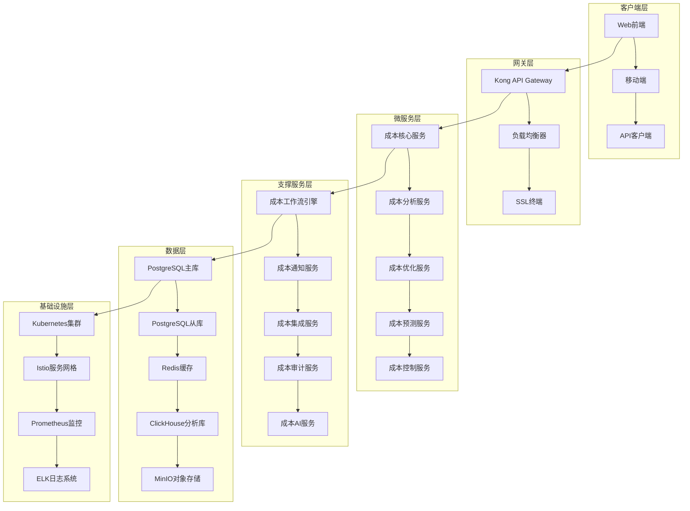
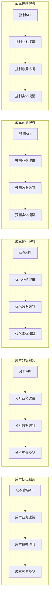
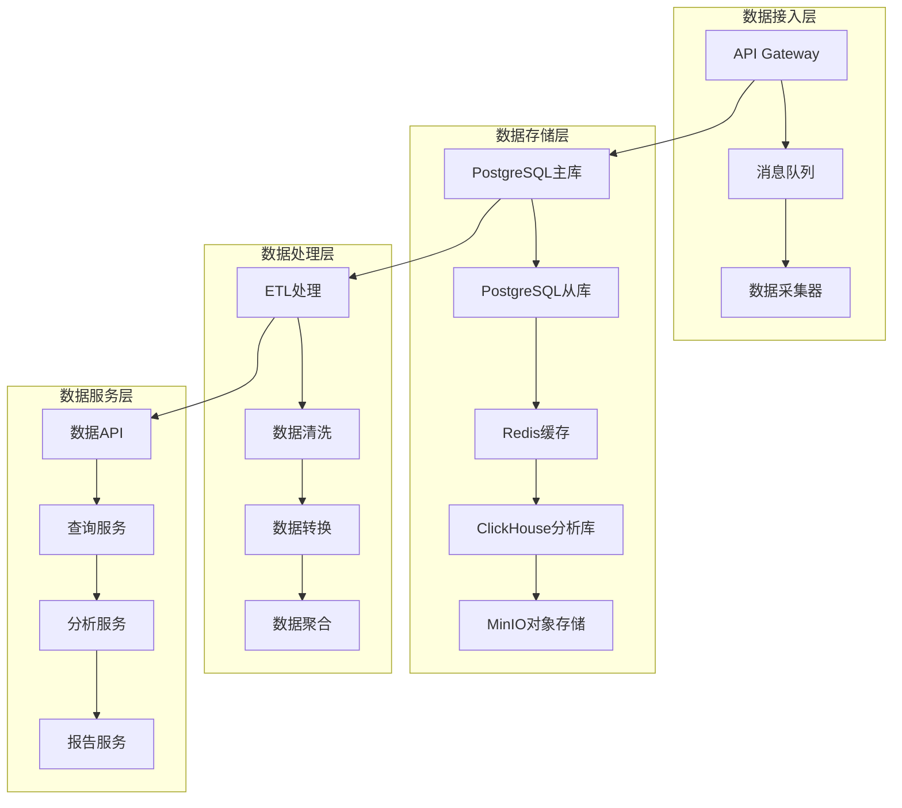
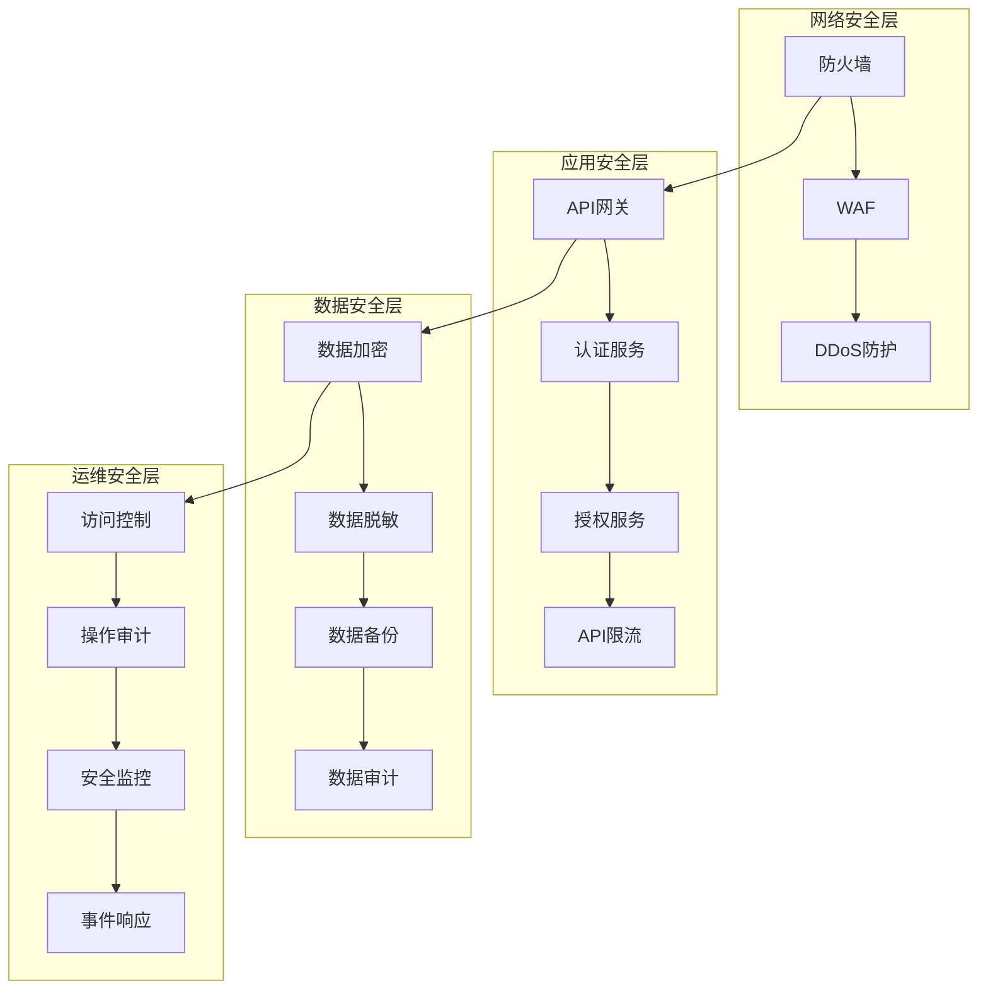
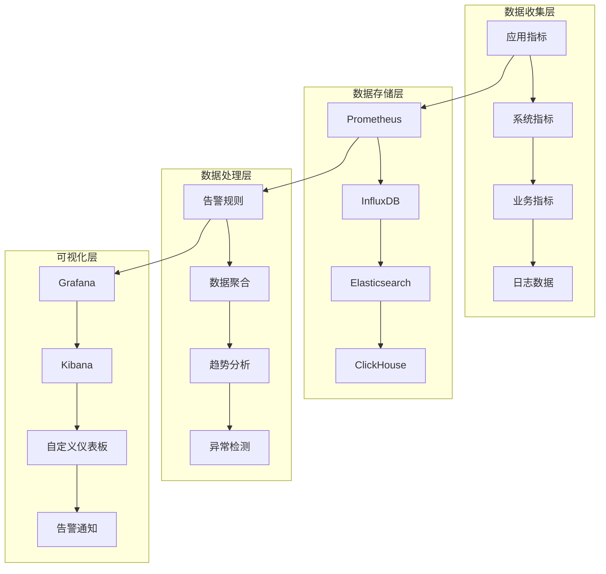
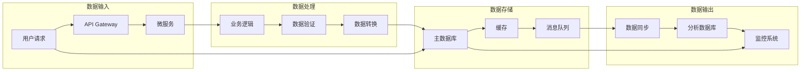

# LLMOps成本管理模块技术架构设计

## 📋 文档信息

- **文档版本**: v1.0.0
- **创建时间**: 2024年12月
- **创建人**: CTO & 技术架构师
- **适用范围**: LLMOps成本管理模块
- **更新频率**: 月度更新

## 🎯 架构概述

### 设计原则

1. **微服务架构**: 采用微服务架构，实现服务解耦和独立部署
2. **领域驱动设计**: 基于DDD设计模式，确保业务逻辑清晰
3. **云原生**: 支持容器化部署和云原生运维
4. **高可用**: 确保系统高可用性和容错能力
5. **可扩展**: 支持水平扩展和垂直扩展
6. **安全性**: 多层次安全防护和权限控制
7. **可观测性**: 完善的监控、日志和追踪体系

### 技术栈选择

```yaml
后端技术栈:
  - 语言: Go 1.21+ (高性能、并发友好)
  - Web框架: Gin (轻量级、高性能)
  - ORM: GORM (功能丰富、易用)
  - 数据库: PostgreSQL 15+ (ACID、JSON支持)
  - 缓存: Redis 7+ (高性能、丰富数据结构)
  - 消息队列: Apache Kafka (高吞吐、持久化)

微服务技术:
  - 服务网格: Istio (流量管理、安全、可观测性)
  - API网关: Kong (API管理、限流、认证)
  - 服务发现: Consul (服务注册、健康检查)
  - 配置中心: Consul Config (配置管理、热更新)
  - 监控: Prometheus + Grafana (指标收集、可视化)
  - 日志: ELK Stack (日志收集、分析、搜索)

AI/ML技术:
  - 机器学习: scikit-learn, TensorFlow
  - 时间序列: Prophet, ARIMA
  - 数据分析: Pandas, NumPy
  - 可视化: Matplotlib, Plotly
```

## 🏗️ 整体架构设计

### 系统架构图



### 服务架构图



## 🔧 微服务详细设计

### 1. 成本核心服务 (Cost Core Service)

#### 1.1 服务职责
- 成本记录管理
- 预算管理
- 计费规则管理
- 基础成本分析

#### 1.2 技术架构
```yaml
服务结构:
  - 端口: 8085
  - 语言: Go 1.21+
  - 框架: Gin
  - 数据库: PostgreSQL
  - 缓存: Redis

API设计:
  - RESTful API
  - GraphQL支持
  - gRPC内部通信
  - WebSocket实时通信

数据模型:
  - CostRecord: 成本记录
  - Budget: 预算
  - BillingRule: 计费规则
  - CostAnalysis: 成本分析
```

#### 1.3 核心功能模块
```go
// 成本服务接口
type CostService interface {
    // 成本记录管理
    CreateCostRecord(ctx context.Context, req *CreateCostRecordRequest) (*CostRecord, error)
    GetCostRecord(ctx context.Context, costID uuid.UUID) (*CostRecord, error)
    UpdateCostRecord(ctx context.Context, req *UpdateCostRecordRequest) (*CostRecord, error)
    DeleteCostRecord(ctx context.Context, costID uuid.UUID) error
    ListCostRecords(ctx context.Context, req *ListCostRecordsRequest) (*ListCostRecordsResponse, error)
    
    // 预算管理
    CreateBudget(ctx context.Context, req *CreateBudgetRequest) (*Budget, error)
    GetBudget(ctx context.Context, budgetID uuid.UUID) (*Budget, error)
    UpdateBudget(ctx context.Context, req *UpdateBudgetRequest) (*Budget, error)
    DeleteBudget(ctx context.Context, budgetID uuid.UUID) error
    ListBudgets(ctx context.Context, req *ListBudgetsRequest) (*ListBudgetsResponse, error)
    
    // 计费规则管理
    CreateBillingRule(ctx context.Context, req *CreateBillingRuleRequest) (*BillingRule, error)
    GetBillingRule(ctx context.Context, ruleID uuid.UUID) (*BillingRule, error)
    UpdateBillingRule(ctx context.Context, req *UpdateBillingRuleRequest) (*BillingRule, error)
    DeleteBillingRule(ctx context.Context, ruleID uuid.UUID) error
    ListBillingRules(ctx context.Context, req *ListBillingRulesRequest) (*ListBillingRulesResponse, error)
    
    // 基础成本分析
    GetCostSummary(ctx context.Context, req *GetCostSummaryRequest) (*CostSummary, error)
    GetCostTrend(ctx context.Context, req *GetCostTrendRequest) (*CostTrend, error)
    GetCostBreakdown(ctx context.Context, req *GetCostBreakdownRequest) (*CostBreakdown, error)
}
```

### 2. 成本分析服务 (Cost Analysis Service)

#### 2.1 服务职责
- 多维度成本分析
- 成本归因分析
- 成本对比分析
- 成本效益分析

#### 2.2 技术架构
```yaml
服务结构:
  - 端口: 8086
  - 语言: Python 3.11+
  - 框架: FastAPI
  - 数据库: ClickHouse
  - 缓存: Redis

分析技术:
  - 数据分析: Pandas, NumPy
  - 机器学习: scikit-learn, TensorFlow
  - 可视化: Matplotlib, Plotly
  - 时间序列: Prophet, ARIMA
```

#### 2.3 核心功能模块
```python
# 成本分析服务接口
class CostAnalysisService:
    async def analyze_cost_attribution(self, project_id: str) -> CostAttributionAnalysis:
        """成本归因分析"""
        pass
    
    async def analyze_cost_breakdown(self, project_id: str) -> CostBreakdownAnalysis:
        """成本分解分析"""
        pass
    
    async def analyze_cost_comparison(self, project_id: str) -> CostComparisonAnalysis:
        """成本对比分析"""
        pass
    
    async def analyze_cost_efficiency(self, project_id: str) -> CostEfficiencyAnalysis:
        """成本效益分析"""
        pass
    
    async def generate_cost_insights(self, project_id: str) -> List[CostInsight]:
        """生成成本洞察"""
        pass
```

### 3. 成本优化服务 (Cost Optimization Service)

#### 3.1 服务职责
- 成本优化建议
- 自动成本优化
- 成本优化策略
- 成本优化效果评估

#### 3.2 技术架构
```yaml
服务结构:
  - 端口: 8087
  - 语言: Go 1.21+
  - 框架: Gin
  - 数据库: PostgreSQL
  - 缓存: Redis
  - 消息队列: Kafka

优化技术:
  - 优化算法: 遗传算法、模拟退火
  - 机器学习: 强化学习、深度学习
  - 数学优化: 线性规划、整数规划
```

#### 3.3 核心功能模块
```go
// 成本优化服务接口
type CostOptimizationService interface {
    // 优化建议
    GenerateOptimizationSuggestions(ctx context.Context, req *GenerateSuggestionsRequest) ([]*OptimizationSuggestion, error)
    GetOptimizationSuggestions(ctx context.Context, req *GetSuggestionsRequest) (*GetSuggestionsResponse, error)
    ApplyOptimizationSuggestion(ctx context.Context, req *ApplySuggestionRequest) error
    
    // 自动优化
    EnableAutoOptimization(ctx context.Context, req *EnableAutoOptimizationRequest) error
    DisableAutoOptimization(ctx context.Context, projectID uuid.UUID) error
    GetAutoOptimizationStatus(ctx context.Context, projectID uuid.UUID) (*AutoOptimizationStatus, error)
    
    // 优化策略
    CreateOptimizationStrategy(ctx context.Context, req *CreateStrategyRequest) (*OptimizationStrategy, error)
    UpdateOptimizationStrategy(ctx context.Context, req *UpdateStrategyRequest) (*OptimizationStrategy, error)
    DeleteOptimizationStrategy(ctx context.Context, strategyID uuid.UUID) error
    ListOptimizationStrategies(ctx context.Context, req *ListStrategiesRequest) (*ListStrategiesResponse, error)
    
    // 优化效果评估
    EvaluateOptimizationEffect(ctx context.Context, req *EvaluateEffectRequest) (*OptimizationEffect, error)
    GetOptimizationHistory(ctx context.Context, req *GetHistoryRequest) (*OptimizationHistory, error)
}
```

### 4. 成本预测服务 (Cost Prediction Service)

#### 4.1 服务职责
- 成本预测模型
- 成本趋势预测
- 成本异常检测
- 成本预测准确性评估

#### 4.2 技术架构
```yaml
服务结构:
  - 端口: 8088
  - 语言: Python 3.11+
  - 框架: FastAPI
  - 数据库: ClickHouse
  - 缓存: Redis

预测技术:
  - 时间序列: Prophet, ARIMA, LSTM
  - 机器学习: scikit-learn, TensorFlow
  - 深度学习: PyTorch, Keras
  - 统计分析: Statsmodels, SciPy
```

#### 4.3 核心功能模块
```python
# 成本预测服务接口
class CostPredictionService:
    async def predict_cost_trend(self, project_id: str, period: str) -> CostTrendPrediction:
        """预测成本趋势"""
        pass
    
    async def predict_cost_anomaly(self, project_id: str) -> CostAnomalyPrediction:
        """预测成本异常"""
        pass
    
    async def predict_budget_usage(self, budget_id: str) -> BudgetUsagePrediction:
        """预测预算使用"""
        pass
    
    async def train_prediction_model(self, project_id: str) -> ModelTrainingResult:
        """训练预测模型"""
        pass
    
    async def evaluate_prediction_accuracy(self, project_id: str) -> PredictionAccuracy:
        """评估预测准确性"""
        pass
```

### 5. 成本控制服务 (Cost Control Service)

#### 5.1 服务职责
- 成本阈值控制
- 成本预警管理
- 成本控制策略
- 成本控制效果评估

#### 5.2 技术架构
```yaml
服务结构:
  - 端口: 8089
  - 语言: Go 1.21+
  - 框架: Gin
  - 数据库: PostgreSQL
  - 缓存: Redis
  - 消息队列: Kafka

控制技术:
  - 规则引擎: Drools, Easy Rules
  - 工作流引擎: Camunda, Zeebe
  - 通知系统: WebSocket, SSE
```

#### 5.3 核心功能模块
```go
// 成本控制服务接口
type CostControlService interface {
    // 成本阈值控制
    SetCostThreshold(ctx context.Context, req *SetThresholdRequest) error
    GetCostThreshold(ctx context.Context, projectID uuid.UUID) (*CostThreshold, error)
    UpdateCostThreshold(ctx context.Context, req *UpdateThresholdRequest) error
    DeleteCostThreshold(ctx context.Context, thresholdID uuid.UUID) error
    
    // 成本预警管理
    CreateCostAlert(ctx context.Context, req *CreateAlertRequest) (*CostAlert, error)
    GetCostAlerts(ctx context.Context, req *GetAlertsRequest) (*GetAlertsResponse, error)
    UpdateCostAlert(ctx context.Context, req *UpdateAlertRequest) (*CostAlert, error)
    DeleteCostAlert(ctx context.Context, alertID uuid.UUID) error
    
    // 成本控制策略
    CreateControlStrategy(ctx context.Context, req *CreateStrategyRequest) (*ControlStrategy, error)
    ExecuteControlStrategy(ctx context.Context, req *ExecuteStrategyRequest) error
    GetControlStrategies(ctx context.Context, req *GetStrategiesRequest) (*GetStrategiesResponse, error)
    
    // 成本控制效果评估
    EvaluateControlEffect(ctx context.Context, req *EvaluateEffectRequest) (*ControlEffect, error)
    GetControlHistory(ctx context.Context, req *GetHistoryRequest) (*ControlHistory, error)
}
```

## 🗄️ 数据架构设计

### 数据分层架构



### 数据库设计

#### 主数据库 (PostgreSQL)
```sql
-- 成本记录表
CREATE TABLE cost_records (
    id UUID PRIMARY KEY DEFAULT gen_random_uuid(),
    project_id UUID NOT NULL,
    model_id UUID,
    user_id UUID NOT NULL,
    tenant_id UUID NOT NULL,
    cost_type VARCHAR(50) NOT NULL,
    amount DECIMAL(15,4) NOT NULL,
    currency VARCHAR(3) DEFAULT 'USD',
    description TEXT,
    metadata JSONB,
    created_at TIMESTAMP WITH TIME ZONE DEFAULT CURRENT_TIMESTAMP,
    updated_at TIMESTAMP WITH TIME ZONE DEFAULT CURRENT_TIMESTAMP
);

-- 预算表
CREATE TABLE budgets (
    id UUID PRIMARY KEY DEFAULT gen_random_uuid(),
    project_id UUID NOT NULL,
    name VARCHAR(255) NOT NULL,
    amount DECIMAL(15,4) NOT NULL,
    currency VARCHAR(3) DEFAULT 'USD',
    period VARCHAR(20) NOT NULL,
    start_date DATE NOT NULL,
    end_date DATE NOT NULL,
    alert_threshold DECIMAL(5,2) DEFAULT 80.00,
    status VARCHAR(20) DEFAULT 'active',
    created_at TIMESTAMP WITH TIME ZONE DEFAULT CURRENT_TIMESTAMP,
    updated_at TIMESTAMP WITH TIME ZONE DEFAULT CURRENT_TIMESTAMP
);

-- 计费规则表
CREATE TABLE billing_rules (
    id UUID PRIMARY KEY DEFAULT gen_random_uuid(),
    project_id UUID NOT NULL,
    tenant_id UUID NOT NULL,
    name VARCHAR(255) NOT NULL,
    rule_type VARCHAR(50) NOT NULL,
    rate DECIMAL(15,4) NOT NULL,
    currency VARCHAR(3) DEFAULT 'USD',
    is_active BOOLEAN DEFAULT TRUE,
    metadata JSONB,
    created_at TIMESTAMP WITH TIME ZONE DEFAULT CURRENT_TIMESTAMP,
    updated_at TIMESTAMP WITH TIME ZONE DEFAULT CURRENT_TIMESTAMP
);

-- 成本优化建议表
CREATE TABLE cost_optimizations (
    id UUID PRIMARY KEY DEFAULT gen_random_uuid(),
    project_id UUID NOT NULL,
    tenant_id UUID NOT NULL,
    title VARCHAR(255) NOT NULL,
    description TEXT,
    category VARCHAR(50) NOT NULL,
    priority VARCHAR(20) NOT NULL,
    potential_savings DECIMAL(15,4),
    currency VARCHAR(3) DEFAULT 'USD',
    status VARCHAR(20) DEFAULT 'pending',
    metadata JSONB,
    created_at TIMESTAMP WITH TIME ZONE DEFAULT CURRENT_TIMESTAMP,
    updated_at TIMESTAMP WITH TIME ZONE DEFAULT CURRENT_TIMESTAMP
);
```

#### 分析数据库 (ClickHouse)
```sql
-- 成本指标表
CREATE TABLE cost_metrics (
    project_id String,
    cost_type String,
    amount Float64,
    currency String,
    labels Map(String, String),
    timestamp DateTime64(3),
    date Date MATERIALIZED toDate(timestamp)
) ENGINE = MergeTree()
PARTITION BY date
ORDER BY (project_id, cost_type, timestamp);

-- 成本预测表
CREATE TABLE cost_predictions (
    project_id String,
    prediction_type String,
    predicted_amount Float64,
    confidence Float64,
    prediction_date Date,
    created_at DateTime64(3)
) ENGINE = MergeTree()
PARTITION BY prediction_date
ORDER BY (project_id, prediction_type, prediction_date);

-- 成本优化效果表
CREATE TABLE optimization_effects (
    project_id String,
    optimization_id String,
    original_cost Float64,
    optimized_cost Float64,
    savings Float64,
    savings_percentage Float64,
    applied_at DateTime64(3),
    date Date MATERIALIZED toDate(applied_at)
) ENGINE = MergeTree()
PARTITION BY date
ORDER BY (project_id, optimization_id, applied_at);
```

### 缓存策略

#### Redis缓存设计
```yaml
缓存层级:
  - L1缓存: 本地缓存 (成本基础信息)
  - L2缓存: Redis缓存 (成本分析结果、预算信息)
  - L3缓存: 数据库缓存 (查询结果缓存)

缓存策略:
  - 成本信息: 30分钟过期
  - 预算信息: 15分钟过期
  - 分析结果: 1小时过期
  - 预测结果: 6小时过期

缓存键设计:
  - 成本信息: cost:{project_id}:{cost_id}
  - 预算信息: budget:{project_id}:{budget_id}
  - 分析结果: analysis:{project_id}:{analysis_type}
  - 预测结果: prediction:{project_id}:{prediction_type}
```

## 🔒 安全架构设计

### 安全分层架构



### 认证授权设计

#### JWT Token设计
```go
type Claims struct {
    UserID    string   `json:"user_id"`
    TenantID  string   `json:"tenant_id"`
    Roles     []string `json:"roles"`
    Permissions []string `json:"permissions"`
    ExpiresAt int64    `json:"exp"`
    IssuedAt  int64    `json:"iat"`
    NotBefore int64    `json:"nbf"`
    Issuer    string   `json:"iss"`
    Subject   string   `json:"sub"`
    Audience  string   `json:"aud"`
}
```

#### 权限控制设计
```go
// 权限检查中间件
func PermissionMiddleware(requiredPermission string) gin.HandlerFunc {
    return func(c *gin.Context) {
        // 获取用户信息
        user := getUserFromContext(c)
        
        // 检查权限
        hasPermission := checkPermission(user, requiredPermission)
        if !hasPermission {
            c.JSON(http.StatusForbidden, gin.H{"error": "Insufficient permissions"})
            c.Abort()
            return
        }
        
        c.Next()
    }
}
```

## 📊 监控和可观测性

### 监控架构



### 监控指标设计

#### 应用指标
```yaml
HTTP指标:
  - http_requests_total: 请求总数
  - http_request_duration_seconds: 请求耗时
  - http_requests_in_flight: 正在处理的请求数
  - http_requests_failed_total: 失败请求数

业务指标:
  - cost_records_total: 成本记录数
  - cost_amount_total: 成本总金额
  - budget_usage_percentage: 预算使用率
  - optimization_suggestions_total: 优化建议数

系统指标:
  - go_goroutines: Goroutine数量
  - go_memstats_alloc_bytes: 内存分配
  - go_gc_duration_seconds: GC耗时
  - process_cpu_seconds_total: CPU使用时间
```

#### 告警规则
```yaml
告警规则:
  - 高错误率: http_requests_failed_total / http_requests_total > 0.05
  - 高延迟: http_request_duration_seconds > 1.0
  - 高内存使用: go_memstats_alloc_bytes > 1GB
  - 高CPU使用: process_cpu_seconds_total > 80%
  - 服务不可用: up == 0
  - 成本超支: budget_usage_percentage > 100
  - 成本异常: cost_amount_total > threshold
```

## 🚀 部署架构设计

### 容器化部署

#### Dockerfile设计
```dockerfile
# 多阶段构建
FROM golang:1.21-alpine AS builder

WORKDIR /app
COPY go.mod go.sum ./
RUN go mod download

COPY . .
RUN CGO_ENABLED=0 GOOS=linux go build -a -installsuffix cgo -o main cmd/server/main.go

FROM alpine:latest
RUN apk --no-cache add ca-certificates
WORKDIR /root/

COPY --from=builder /app/main .
COPY --from=builder /app/configs ./configs

EXPOSE 8085
CMD ["./main"]
```

#### Kubernetes部署
```yaml
apiVersion: apps/v1
kind: Deployment
metadata:
  name: cost-service
spec:
  replicas: 3
  selector:
    matchLabels:
      app: cost-service
  template:
    metadata:
      labels:
        app: cost-service
    spec:
      containers:
      - name: cost-service
        image: llmops/cost-service:latest
        ports:
        - containerPort: 8085
        env:
        - name: DB_HOST
          value: "postgres-service"
        - name: REDIS_HOST
          value: "redis-service"
        resources:
          requests:
            memory: "256Mi"
            cpu: "250m"
          limits:
            memory: "512Mi"
            cpu: "500m"
        livenessProbe:
          httpGet:
            path: /health
            port: 8085
          initialDelaySeconds: 30
          periodSeconds: 10
        readinessProbe:
          httpGet:
            path: /ready
            port: 8085
          initialDelaySeconds: 5
          periodSeconds: 5
```

### 服务网格配置

#### Istio配置
```yaml
apiVersion: networking.istio.io/v1alpha3
kind: VirtualService
metadata:
  name: cost-service
spec:
  hosts:
  - cost-service
  http:
  - match:
    - uri:
        prefix: /api/v1/costs
    route:
    - destination:
        host: cost-service
        port:
          number: 8085
    timeout: 30s
    retries:
      attempts: 3
      perTryTimeout: 10s
```

## 🔄 数据流设计

### 数据流架构



### 事件驱动架构

#### 事件设计
```go
// 成本创建事件
type CostCreatedEvent struct {
    EventID     string    `json:"event_id"`
    EventType   string    `json:"event_type"`
    ProjectID   string    `json:"project_id"`
    CostID      string    `json:"cost_id"`
    Amount      float64   `json:"amount"`
    CostType    string    `json:"cost_type"`
    Timestamp   time.Time `json:"timestamp"`
    Metadata    map[string]interface{} `json:"metadata"`
}

// 预算超支事件
type BudgetExceededEvent struct {
    EventID     string    `json:"event_id"`
    EventType   string    `json:"event_type"`
    ProjectID   string    `json:"project_id"`
    BudgetID    string    `json:"budget_id"`
    UsagePercentage float64 `json:"usage_percentage"`
    Threshold   float64   `json:"threshold"`
    Timestamp   time.Time `json:"timestamp"`
}
```

#### 事件处理
```go
// 事件处理器
type EventHandler interface {
    Handle(event Event) error
}

// 成本创建事件处理器
type CostCreatedHandler struct {
    analysisService AnalysisService
    alertService    AlertService
}

func (h *CostCreatedHandler) Handle(event Event) error {
    // 更新成本分析
    err := h.analysisService.UpdateCostAnalysis(event)
    if err != nil {
        return err
    }
    
    // 检查预算告警
    err = h.alertService.CheckBudgetAlerts(event)
    if err != nil {
        return err
    }
    
    return nil
}
```

## 📈 性能优化设计

### 性能优化策略

#### 1. 数据库优化
```yaml
索引优化:
  - 主键索引: 自动创建
  - 唯一索引: 业务唯一字段
  - 复合索引: 多字段查询
  - 部分索引: 条件查询优化

查询优化:
  - 查询计划分析
  - 慢查询监控
  - 查询缓存
  - 连接池优化

分区策略:
  - 时间分区: 按时间分表
  - 哈希分区: 按ID分表
  - 范围分区: 按数值范围分表
```

#### 2. 缓存优化
```yaml
缓存策略:
  - 读缓存: 热点数据缓存
  - 写缓存: 批量写入优化
  - 分布式缓存: Redis集群
  - 本地缓存: 应用内存缓存

缓存更新:
  - 主动更新: 数据变更时更新
  - 被动更新: 缓存过期时更新
  - 定时更新: 定时任务更新
  - 事件更新: 事件驱动更新
```

#### 3. 应用优化
```yaml
并发优化:
  - 协程池: 控制并发数量
  - 连接池: 数据库连接复用
  - 对象池: 对象复用
  - 内存池: 内存复用

算法优化:
  - 时间复杂度优化
  - 空间复杂度优化
  - 数据结构优化
  - 算法选择优化
```

## 🔧 开发工具链

### 开发环境配置

#### 本地开发环境
```yaml
开发工具:
  - IDE: GoLand / VS Code
  - 数据库: PostgreSQL (Docker)
  - 缓存: Redis (Docker)
  - 消息队列: Kafka (Docker)
  - 监控: Prometheus + Grafana (Docker)

开发脚本:
  - 环境启动: ./scripts/dev-start.sh
  - 环境停止: ./scripts/dev-stop.sh
  - 数据初始化: ./scripts/init-data.sh
  - 测试运行: ./scripts/test.sh
```

#### CI/CD流水线
```yaml
构建阶段:
  - 代码检查: golangci-lint
  - 单元测试: go test
  - 集成测试: go test -tags=integration
  - 安全扫描: gosec
  - 代码覆盖率: go test -cover

部署阶段:
  - 镜像构建: Docker build
  - 镜像推送: Docker push
  - 环境部署: kubectl apply
  - 健康检查: curl /health
  - 回滚机制: kubectl rollback
```

## 📋 总结

本技术架构设计文档详细规划了LLMOps成本管理模块的技术架构，包括：

### 核心特点
1. **微服务架构**: 服务解耦，独立部署
2. **云原生**: 容器化部署，服务网格
3. **高可用**: 多副本部署，故障转移
4. **可扩展**: 水平扩展，垂直扩展
5. **安全性**: 多层次安全防护
6. **可观测性**: 完善监控体系

### 技术优势
1. **性能优化**: 多级缓存，数据库优化
2. **开发效率**: 完善工具链，自动化部署
3. **运维友好**: 监控告警，自动扩缩容
4. **安全可靠**: 权限控制，数据加密

### 实施建议
1. **分阶段实施**: 按服务优先级逐步实施
2. **技术选型**: 选择成熟稳定的技术栈
3. **团队培训**: 加强团队技术能力建设
4. **持续优化**: 根据运行情况持续优化

通过本架构的实施，将构建一个高性能、高可用、可扩展的成本管理平台，为LLM运营提供强有力的技术支撑。

---

**文档维护**: 本文档将根据技术发展和项目需求持续更新，确保架构设计始终符合最佳实践。