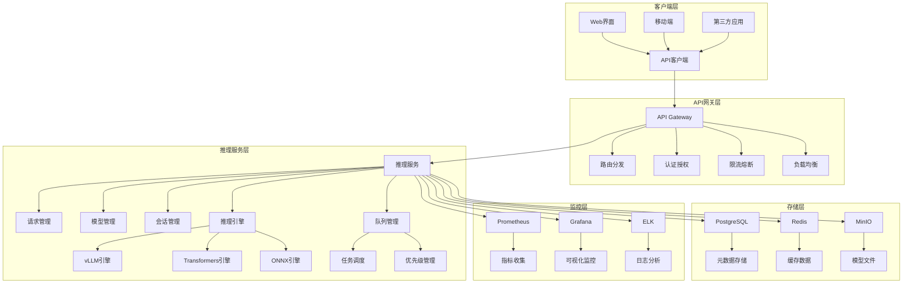
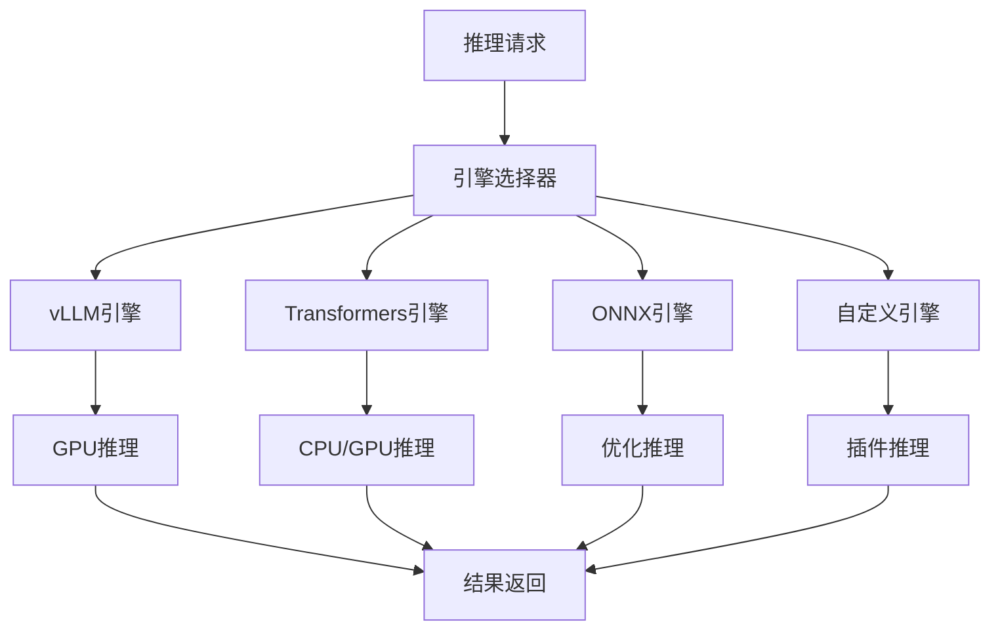
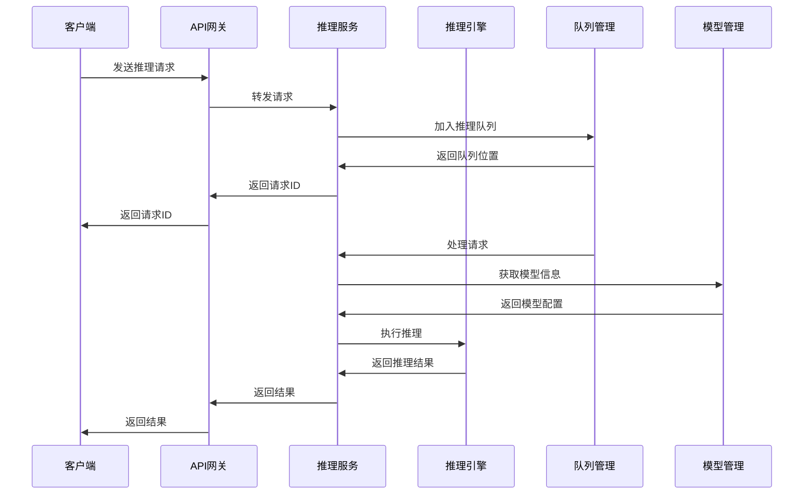
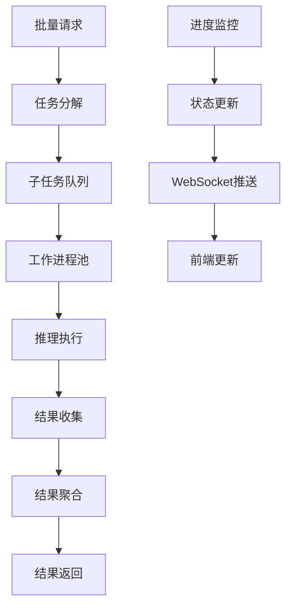
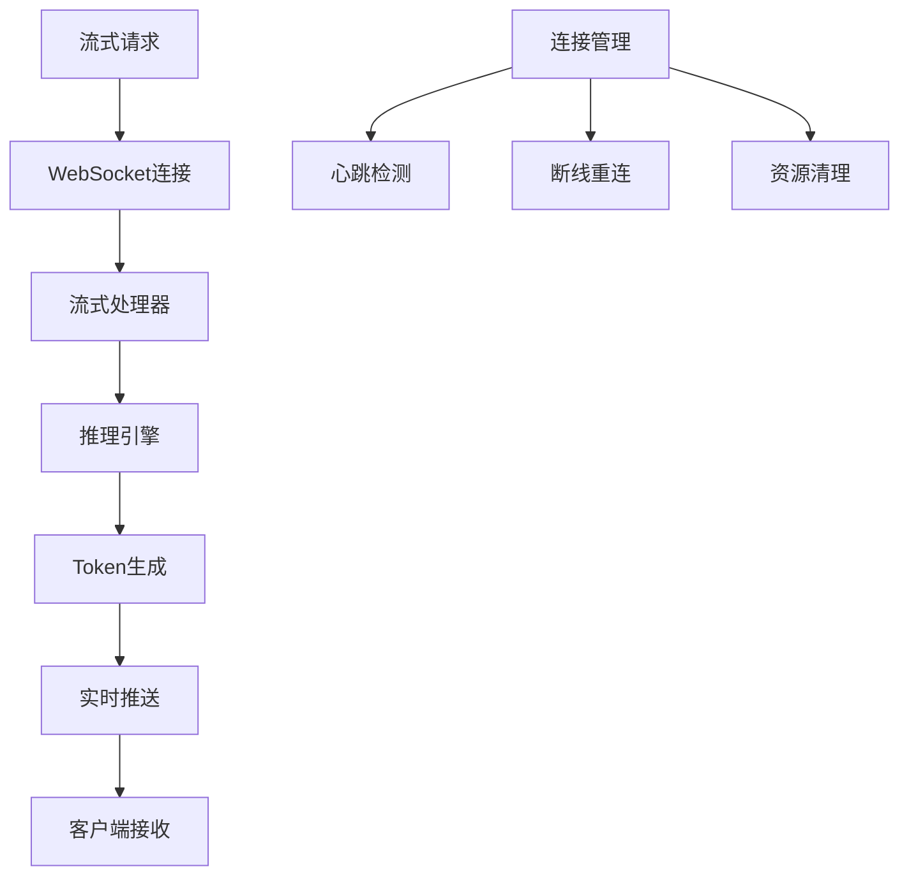
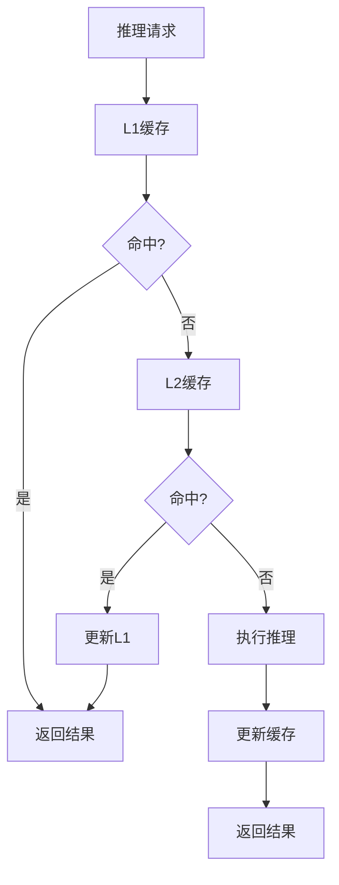

# LLMOps推理管理模块详细规划文档

## 📋 文档信息

**文档版本**: v2.0.0  
**创建时间**: 2025年10月23日  
**最后更新**: 2025年10月23日  
**维护者**: LLMOps开发团队  
**审核者**: CTO & 产品总监  

---

## 🎯 执行摘要

本文档从CTO和产品总监的角度，全面规划LLMOps平台的推理管理模块。基于现有微服务架构和前端实现，设计完整的高性能推理服务解决方案，涵盖在线推理、批量推理、流式推理、性能监控、成本控制等核心功能，为企业级AI应用提供稳定可靠的推理服务。

## 🏗️ 现有功能分析

### 已实现功能 ✅

#### 1. 前端界面功能
- **在线推理**: 支持单次推理请求，参数配置，结果展示
- **批量推理**: 支持文件上传，批量任务管理，进度监控
- **推理历史**: 历史记录查询，详情查看，重新运行
- **性能监控**: 实时性能指标，图表展示，资源监控
- **参数配置**: 温度、Top-P、最大长度、流式输出等参数

#### 2. 后端数据模型
- **InferenceRequest**: 推理请求实体
- **ModelInstance**: 模型实例实体
- **InferenceSession**: 推理会话实体
- **InferenceMetric**: 推理指标实体
- **InferenceCache**: 推理缓存实体
- **InferenceQueue**: 推理队列实体

#### 3. API接口设计
- **推理接口**: 单次推理、批量推理、流式推理
- **状态管理**: 推理状态查询、请求管理
- **会话管理**: 会话创建、查询、删除
- **指标查询**: 性能指标、监控数据

### 待完善功能 🔶

#### 1. 推理引擎集成
- 多框架推理引擎支持
- 模型热加载和卸载
- GPU资源管理
- 推理优化

#### 2. 性能优化
- 请求队列管理
- 负载均衡
- 缓存策略
- 并发控制

#### 3. 监控告警
- 实时性能监控
- 异常告警
- 资源使用监控
- 成本分析

---

## 🎯 产品愿景与目标

### 产品愿景
构建企业级高性能AI推理服务平台，提供从模型部署到推理服务的完整解决方案，让AI推理变得简单、快速、可靠。

### 核心目标
1. **高性能推理**: 提供毫秒级响应的高性能推理服务
2. **弹性扩展**: 支持自动扩缩容和负载均衡
3. **成本优化**: 智能资源调度和成本控制
4. **稳定可靠**: 99.9%以上的服务可用性
5. **易于使用**: 提供简单易用的API和界面

---

## 🏛️ 架构设计

### 整体架构



### 服务职责划分

#### 推理服务 (Inference Service)
- **核心职责**: 推理请求处理和模型管理
- **主要功能**: 在线推理、批量推理、流式推理、会话管理
- **技术栈**: Python + FastAPI + vLLM/Transformers

#### 模型服务 (Model Service)
- **核心职责**: 模型生命周期管理
- **主要功能**: 模型注册、版本管理、部署管理
- **技术栈**: Python + FastAPI + SQLAlchemy

#### 监控服务 (Monitoring Service)
- **核心职责**: 性能监控和告警
- **主要功能**: 指标收集、性能分析、异常告警
- **技术栈**: Python + FastAPI + Prometheus

#### 成本服务 (Cost Service)
- **核心职责**: 资源成本管理
- **主要功能**: 成本计算、资源计费、预算控制
- **技术栈**: Go + Gin + GORM

---

## 🚀 功能模块详细设计

### 1. 推理引擎管理

#### 1.1 多引擎架构



#### 1.2 引擎特性对比

| 引擎类型 | 优势 | 劣势 | 适用场景 |
|----------|------|------|----------|
| vLLM | 高性能、低延迟 | 内存占用大 | 生产环境、高并发 |
| Transformers | 易用、灵活 | 性能一般 | 开发测试、小规模 |
| ONNX | 跨平台、优化 | 模型转换复杂 | 边缘计算、移动端 |
| 自定义 | 完全控制 | 开发成本高 | 特殊需求、定制化 |

#### 1.3 引擎管理接口

```python
class InferenceEngineManager:
    def __init__(self):
        self.engines = {
            'vllm': VLLMEngine(),
            'transformers': TransformersEngine(),
            'onnx': ONNXEngine(),
            'custom': CustomEngine()
        }
    
    async def load_model(self, model_id: str, engine_type: str, config: dict):
        """加载模型到指定引擎"""
        engine = self.engines.get(engine_type)
        if not engine:
            raise ValueError(f"Unsupported engine type: {engine_type}")
        
        return await engine.load_model(model_id, config)
    
    async def unload_model(self, model_id: str, engine_type: str):
        """从引擎卸载模型"""
        engine = self.engines.get(engine_type)
        return await engine.unload_model(model_id)
    
    async def get_engine_status(self, engine_type: str):
        """获取引擎状态"""
        engine = self.engines.get(engine_type)
        return await engine.get_status()
```

### 2. 在线推理服务

#### 2.1 推理流程



#### 2.2 请求处理优化

```python
class InferenceRequestProcessor:
    def __init__(self):
        self.request_queue = asyncio.Queue(maxsize=1000)
        self.worker_pool = []
        self.cache = RedisCache()
    
    async def process_request(self, request: InferenceRequest):
        """处理推理请求"""
        # 1. 参数验证
        await self.validate_request(request)
        
        # 2. 缓存检查
        cache_key = self.generate_cache_key(request)
        cached_result = await self.cache.get(cache_key)
        if cached_result:
            return cached_result
        
        # 3. 模型加载检查
        model_status = await self.check_model_status(request.model_id)
        if model_status != 'ready':
            await self.load_model(request.model_id)
        
        # 4. 执行推理
        result = await self.execute_inference(request)
        
        # 5. 缓存结果
        await self.cache.set(cache_key, result, ttl=3600)
        
        return result
    
    async def execute_inference(self, request: InferenceRequest):
        """执行推理"""
        engine = self.get_engine(request.model_id)
        
        # 设置超时
        timeout = request.timeout or 30
        result = await asyncio.wait_for(
            engine.inference(request),
            timeout=timeout
        )
        
        return result
```

#### 2.3 并发控制

```python
class ConcurrencyController:
    def __init__(self):
        self.semaphores = {}
        self.max_concurrent = 10
    
    async def acquire_slot(self, model_id: str):
        """获取推理槽位"""
        if model_id not in self.semaphores:
            self.semaphores[model_id] = asyncio.Semaphore(self.max_concurrent)
        
        return await self.semaphores[model_id].acquire()
    
    async def release_slot(self, model_id: str):
        """释放推理槽位"""
        if model_id in self.semaphores:
            self.semaphores[model_id].release()
```

### 3. 批量推理服务

#### 3.1 批量处理架构



#### 3.2 批量任务管理

```python
class BatchInferenceManager:
    def __init__(self):
        self.task_queue = asyncio.Queue()
        self.worker_pool = []
        self.active_tasks = {}
        self.task_results = {}
    
    async def create_batch_task(self, task_data: BatchTaskData):
        """创建批量任务"""
        task_id = uuid.uuid4()
        
        # 解析输入文件
        input_data = await self.parse_input_file(task_data.input_file)
        
        # 创建子任务
        subtasks = []
        for i, item in enumerate(input_data):
            subtask = {
                'id': f"{task_id}_{i}",
                'parent_id': task_id,
                'input': item,
                'parameters': task_data.parameters,
                'status': 'pending'
            }
            subtasks.append(subtask)
        
        # 保存任务信息
        task_info = {
            'id': task_id,
            'name': task_data.name,
            'model_id': task_data.model_id,
            'total_count': len(subtasks),
            'completed_count': 0,
            'failed_count': 0,
            'status': 'processing',
            'created_at': datetime.utcnow(),
            'subtasks': subtasks
        }
        
        self.active_tasks[task_id] = task_info
        
        # 提交到队列
        for subtask in subtasks:
            await self.task_queue.put(subtask)
        
        return task_id
    
    async def process_batch_task(self, subtask: dict):
        """处理批量子任务"""
        try:
            # 执行推理
            result = await self.execute_inference(subtask)
            
            # 更新任务状态
            await self.update_task_progress(subtask['parent_id'], 'completed')
            
            return result
            
        except Exception as e:
            # 更新失败状态
            await self.update_task_progress(subtask['parent_id'], 'failed')
            logger.error(f"Batch task failed: {e}")
    
    async def update_task_progress(self, task_id: str, status: str):
        """更新任务进度"""
        if task_id in self.active_tasks:
            task = self.active_tasks[task_id]
            
            if status == 'completed':
                task['completed_count'] += 1
            elif status == 'failed':
                task['failed_count'] += 1
            
            # 检查是否完成
            if task['completed_count'] + task['failed_count'] >= task['total_count']:
                task['status'] = 'completed'
            
            # 推送进度更新
            await self.push_progress_update(task_id, task)
```

#### 3.3 进度监控

```python
class ProgressMonitor:
    def __init__(self):
        self.websocket_manager = WebSocketManager()
    
    async def push_progress_update(self, task_id: str, task_info: dict):
        """推送进度更新"""
        progress_data = {
            'task_id': task_id,
            'progress': task_info['completed_count'] / task_info['total_count'] * 100,
            'completed': task_info['completed_count'],
            'failed': task_info['failed_count'],
            'total': task_info['total_count'],
            'status': task_info['status']
        }
        
        await self.websocket_manager.broadcast(
            f"task_{task_id}",
            progress_data
        )
```

### 4. 流式推理服务

#### 4.1 流式处理架构



#### 4.2 流式推理实现

```python
class StreamingInferenceHandler:
    def __init__(self):
        self.active_connections = {}
        self.connection_manager = ConnectionManager()
    
    async def handle_streaming_request(self, websocket, request_data):
        """处理流式推理请求"""
        connection_id = uuid.uuid4()
        
        try:
            # 注册连接
            await self.connection_manager.register(connection_id, websocket)
            
            # 创建流式推理会话
            session = await self.create_streaming_session(request_data)
            
            # 执行流式推理
            async for chunk in self.stream_inference(session):
                # 发送数据块
                await websocket.send_json({
                    'type': 'chunk',
                    'data': chunk,
                    'session_id': session.id
                })
            
            # 发送完成信号
            await websocket.send_json({
                'type': 'complete',
                'session_id': session.id
            })
            
        except Exception as e:
            # 发送错误信息
            await websocket.send_json({
                'type': 'error',
                'message': str(e)
            })
        finally:
            # 清理连接
            await self.connection_manager.unregister(connection_id)
    
    async def stream_inference(self, session):
        """执行流式推理"""
        engine = self.get_engine(session.model_id)
        
        async for token in engine.stream_generate(session.prompt, session.parameters):
            yield {
                'token': token.text,
                'tokens': token.count,
                'timestamp': datetime.utcnow().isoformat()
            }
```

#### 4.3 WebSocket管理

```python
class WebSocketManager:
    def __init__(self):
        self.connections = {}
        self.rooms = {}
    
    async def register(self, connection_id: str, websocket):
        """注册WebSocket连接"""
        self.connections[connection_id] = websocket
        
        # 启动心跳检测
        asyncio.create_task(self.heartbeat_check(connection_id))
    
    async def unregister(self, connection_id: str):
        """注销WebSocket连接"""
        if connection_id in self.connections:
            del self.connections[connection_id]
    
    async def broadcast(self, room: str, message: dict):
        """广播消息到房间"""
        if room in self.rooms:
            for connection_id in self.rooms[room]:
                if connection_id in self.connections:
                    try:
                        await self.connections[connection_id].send_json(message)
                    except:
                        # 连接已断开，清理
                        await self.unregister(connection_id)
    
    async def heartbeat_check(self, connection_id: str):
        """心跳检测"""
        while connection_id in self.connections:
            try:
                await self.connections[connection_id].ping()
                await asyncio.sleep(30)  # 30秒心跳
            except:
                # 连接断开
                await self.unregister(connection_id)
                break
```

### 5. 性能监控系统

#### 5.1 监控指标


#### 5.2 指标收集

```python
class MetricsCollector:
    def __init__(self):
        self.prometheus_client = PrometheusClient()
        self.metrics = {
            'inference_requests_total': Counter('inference_requests_total', 'Total inference requests', ['model_id', 'status']),
            'inference_duration_seconds': Histogram('inference_duration_seconds', 'Inference duration', ['model_id']),
            'inference_queue_size': Gauge('inference_queue_size', 'Inference queue size', ['model_id']),
            'active_connections': Gauge('active_connections', 'Active WebSocket connections'),
            'gpu_utilization': Gauge('gpu_utilization', 'GPU utilization', ['gpu_id']),
            'memory_usage': Gauge('memory_usage', 'Memory usage', ['type']),
            'cache_hit_ratio': Gauge('cache_hit_ratio', 'Cache hit ratio')
        }
    
    def record_inference_request(self, model_id: str, status: str):
        """记录推理请求"""
        self.metrics['inference_requests_total'].labels(
            model_id=model_id, status=status
        ).inc()
    
    def record_inference_duration(self, model_id: str, duration: float):
        """记录推理耗时"""
        self.metrics['inference_duration_seconds'].labels(
            model_id=model_id
        ).observe(duration)
    
    def update_queue_size(self, model_id: str, size: int):
        """更新队列大小"""
        self.metrics['inference_queue_size'].labels(
            model_id=model_id
        ).set(size)
    
    def update_gpu_utilization(self, gpu_id: str, utilization: float):
        """更新GPU利用率"""
        self.metrics['gpu_utilization'].labels(
            gpu_id=gpu_id
        ).set(utilization)
```

#### 5.3 告警规则

```yaml
groups:
- name: inference_alerts
  rules:
  - alert: HighInferenceLatency
    expr: histogram_quantile(0.95, rate(inference_duration_seconds_bucket[5m])) > 2
    for: 2m
    labels:
      severity: warning
    annotations:
      summary: "推理延迟过高"
      description: "95%的推理请求延迟超过2秒"
      
  - alert: HighErrorRate
    expr: rate(inference_requests_total{status="failed"}[5m]) / rate(inference_requests_total[5m]) > 0.05
    for: 2m
    labels:
      severity: critical
    annotations:
      summary: "推理错误率过高"
      description: "推理错误率超过5%"
      
  - alert: QueueOverflow
    expr: inference_queue_size > 1000
    for: 1m
    labels:
      severity: warning
    annotations:
      summary: "推理队列溢出"
      description: "推理队列大小超过1000"
      
  - alert: GPUOverutilization
    expr: gpu_utilization > 90
    for: 5m
    labels:
      severity: warning
    annotations:
      summary: "GPU利用率过高"
      description: "GPU利用率超过90%"
```

### 6. 缓存管理系统

#### 6.1 多级缓存架构



#### 6.2 缓存策略

```python
class CacheManager:
    def __init__(self):
        self.l1_cache = {}  # 内存缓存
        self.l2_cache = redis.Redis()  # Redis缓存
        self.cache_stats = {
            'hits': 0,
            'misses': 0,
            'evictions': 0
        }
    
    async def get(self, key: str):
        """获取缓存"""
        # L1缓存检查
        if key in self.l1_cache:
            self.cache_stats['hits'] += 1
            return self.l1_cache[key]
        
        # L2缓存检查
        cached = await self.l2_cache.get(key)
        if cached:
            data = json.loads(cached)
            self.l1_cache[key] = data
            self.cache_stats['hits'] += 1
            return data
        
        self.cache_stats['misses'] += 1
        return None
    
    async def set(self, key: str, value: dict, ttl: int = 3600):
        """设置缓存"""
        # 更新L1缓存
        self.l1_cache[key] = value
        
        # 更新L2缓存
        await self.l2_cache.setex(key, ttl, json.dumps(value))
    
    def generate_cache_key(self, request: InferenceRequest) -> str:
        """生成缓存键"""
        # 基于请求内容生成哈希键
        content = {
            'model_id': request.model_id,
            'prompt': request.prompt,
            'parameters': request.parameters
        }
        
        content_str = json.dumps(content, sort_keys=True)
        return hashlib.md5(content_str.encode()).hexdigest()
    
    async def cleanup_expired(self):
        """清理过期缓存"""
        # 清理L1缓存
        expired_keys = []
        for key, value in self.l1_cache.items():
            if value.get('expires_at', 0) < time.time():
                expired_keys.append(key)
        
        for key in expired_keys:
            del self.l1_cache[key]
            self.cache_stats['evictions'] += 1
```

### 7. 成本控制系统

#### 7.1 成本计算模型

```python
class CostCalculator:
    def __init__(self):
        self.pricing_config = {
            'gpu_hourly_rate': 2.0,  # GPU每小时费用
            'cpu_hourly_rate': 0.1,  # CPU每小时费用
            'memory_gb_hourly_rate': 0.05,  # 内存每GB每小时费用
            'request_rate': 0.001,  # 每个请求费用
            'token_rate': 0.0001  # 每个Token费用
        }
    
    def calculate_inference_cost(self, request: InferenceRequest, result: InferenceResult) -> float:
        """计算推理成本"""
        # 基础请求费用
        base_cost = self.pricing_config['request_rate']
        
        # Token费用
        token_cost = result.total_tokens * self.pricing_config['token_rate']
        
        # 资源使用费用
        resource_cost = self.calculate_resource_cost(request, result)
        
        return base_cost + token_cost + resource_cost
    
    def calculate_resource_cost(self, request: InferenceRequest, result: InferenceResult) -> float:
        """计算资源使用成本"""
        duration_hours = result.processing_time / 3600
        
        # GPU费用
        gpu_cost = request.gpu_required * self.pricing_config['gpu_hourly_rate'] * duration_hours
        
        # CPU费用
        cpu_cost = request.cpu_cores * self.pricing_config['cpu_hourly_rate'] * duration_hours
        
        # 内存费用
        memory_cost = request.memory_gb * self.pricing_config['memory_gb_hourly_rate'] * duration_hours
        
        return gpu_cost + cpu_cost + memory_cost
    
    def calculate_batch_cost(self, batch_task: BatchTask) -> float:
        """计算批量任务成本"""
        total_cost = 0
        
        for subtask in batch_task.subtasks:
            if subtask.status == 'completed':
                cost = self.calculate_inference_cost(subtask.request, subtask.result)
                total_cost += cost
        
        return total_cost
```

#### 7.2 预算控制

```python
class BudgetController:
    def __init__(self):
        self.budget_limits = {}
        self.daily_usage = {}
        self.monthly_usage = {}
    
    async def check_budget_limit(self, user_id: str, tenant_id: str, cost: float) -> bool:
        """检查预算限制"""
        # 获取用户预算
        budget = await self.get_user_budget(user_id, tenant_id)
        
        # 获取今日使用量
        today = datetime.now().date()
        daily_usage = self.daily_usage.get(f"{user_id}_{today}", 0)
        
        # 检查是否超限
        if daily_usage + cost > budget.daily_limit:
            return False
        
        return True
    
    async def update_usage(self, user_id: str, tenant_id: str, cost: float):
        """更新使用量"""
        today = datetime.now().date()
        key = f"{user_id}_{today}"
        
        if key not in self.daily_usage:
            self.daily_usage[key] = 0
        
        self.daily_usage[key] += cost
        
        # 更新数据库
        await self.save_usage_record(user_id, tenant_id, cost, today)
    
    async def get_usage_summary(self, user_id: str, tenant_id: str, period: str) -> dict:
        """获取使用量摘要"""
        if period == 'daily':
            today = datetime.now().date()
            usage = self.daily_usage.get(f"{user_id}_{today}", 0)
        elif period == 'monthly':
            usage = await self.get_monthly_usage(user_id, tenant_id)
        else:
            usage = 0
        
        return {
            'period': period,
            'usage': usage,
            'limit': await self.get_budget_limit(user_id, tenant_id, period),
            'remaining': await self.get_remaining_budget(user_id, tenant_id, period)
        }
```

---

## 🔧 技术实现方案

### 1. 数据库设计

#### 1.1 核心表结构

```sql
-- 推理请求表
CREATE TABLE inference_requests (
    id UUID PRIMARY KEY DEFAULT gen_random_uuid(),
    model_id UUID NOT NULL,
    session_id UUID,
    user_id UUID,
    tenant_id UUID NOT NULL,
    request_data JSONB NOT NULL,
    response_data JSONB,
    status VARCHAR(50) DEFAULT 'pending',
    processing_time_ms INTEGER,
    gpu_memory_used BIGINT,
    cpu_usage FLOAT,
    memory_usage FLOAT,
    error_message TEXT,
    error_code VARCHAR(100),
    created_at TIMESTAMP WITH TIME ZONE DEFAULT CURRENT_TIMESTAMP,
    started_at TIMESTAMP WITH TIME ZONE,
    completed_at TIMESTAMP WITH TIME ZONE
);

-- 模型实例表
CREATE TABLE model_instances (
    id UUID PRIMARY KEY DEFAULT gen_random_uuid(),
    model_id UUID NOT NULL,
    instance_id VARCHAR(255) NOT NULL UNIQUE,
    status VARCHAR(50) DEFAULT 'loading',
    engine_type VARCHAR(50) NOT NULL,
    gpu_memory_used BIGINT,
    gpu_memory_total BIGINT,
    cpu_usage FLOAT,
    memory_usage FLOAT,
    memory_total BIGINT,
    requests_processed BIGINT DEFAULT 0,
    total_processing_time_ms BIGINT DEFAULT 0,
    average_processing_time_ms FLOAT,
    config JSONB DEFAULT '{}',
    metadata JSONB DEFAULT '{}',
    created_at TIMESTAMP WITH TIME ZONE DEFAULT CURRENT_TIMESTAMP,
    updated_at TIMESTAMP WITH TIME ZONE DEFAULT CURRENT_TIMESTAMP,
    last_used_at TIMESTAMP WITH TIME ZONE
);

-- 推理会话表
CREATE TABLE inference_sessions (
    id UUID PRIMARY KEY DEFAULT gen_random_uuid(),
    user_id UUID NOT NULL,
    tenant_id UUID NOT NULL,
    model_id UUID NOT NULL,
    session_name VARCHAR(255),
    session_type VARCHAR(50) DEFAULT 'chat',
    status VARCHAR(50) DEFAULT 'active',
    is_streaming BOOLEAN DEFAULT false,
    config JSONB DEFAULT '{}',
    context JSONB DEFAULT '{}',
    request_count BIGINT DEFAULT 0,
    total_tokens BIGINT DEFAULT 0,
    total_cost FLOAT DEFAULT 0.0,
    created_at TIMESTAMP WITH TIME ZONE DEFAULT CURRENT_TIMESTAMP,
    updated_at TIMESTAMP WITH TIME ZONE DEFAULT CURRENT_TIMESTAMP,
    last_activity_at TIMESTAMP WITH TIME ZONE,
    expires_at TIMESTAMP WITH TIME ZONE
);

-- 推理指标表
CREATE TABLE inference_metrics (
    id UUID PRIMARY KEY DEFAULT gen_random_uuid(),
    model_id UUID NOT NULL,
    instance_id UUID,
    metric_name VARCHAR(100) NOT NULL,
    metric_value FLOAT NOT NULL,
    metric_unit VARCHAR(20),
    labels JSONB DEFAULT '{}',
    metadata JSONB DEFAULT '{}',
    timestamp TIMESTAMP WITH TIME ZONE DEFAULT CURRENT_TIMESTAMP
);

-- 推理缓存表
CREATE TABLE inference_cache (
    id UUID PRIMARY KEY DEFAULT gen_random_uuid(),
    model_id UUID NOT NULL,
    cache_key VARCHAR(255) NOT NULL UNIQUE,
    cache_data JSONB NOT NULL,
    hit_count BIGINT DEFAULT 0,
    last_hit_at TIMESTAMP WITH TIME ZONE,
    expires_at TIMESTAMP WITH TIME ZONE,
    created_at TIMESTAMP WITH TIME ZONE DEFAULT CURRENT_TIMESTAMP,
    updated_at TIMESTAMP WITH TIME ZONE DEFAULT CURRENT_TIMESTAMP
);

-- 推理队列表
CREATE TABLE inference_queue (
    id UUID PRIMARY KEY DEFAULT gen_random_uuid(),
    model_id UUID NOT NULL,
    request_id UUID NOT NULL,
    priority INTEGER DEFAULT 0,
    status VARCHAR(50) DEFAULT 'queued',
    request_data JSONB NOT NULL,
    created_at TIMESTAMP WITH TIME ZONE DEFAULT CURRENT_TIMESTAMP,
    started_at TIMESTAMP WITH TIME ZONE,
    completed_at TIMESTAMP WITH TIME ZONE
);
```

#### 1.2 索引优化

```sql
-- 性能优化索引
CREATE INDEX idx_inference_requests_model_status ON inference_requests(model_id, status);
CREATE INDEX idx_inference_requests_tenant_created ON inference_requests(tenant_id, created_at);
CREATE INDEX idx_inference_requests_user_created ON inference_requests(user_id, created_at);
CREATE INDEX idx_model_instances_model_status ON model_instances(model_id, status);
CREATE INDEX idx_inference_sessions_user_model ON inference_sessions(user_id, model_id);
CREATE INDEX idx_inference_metrics_model_timestamp ON inference_metrics(model_id, timestamp);
CREATE INDEX idx_inference_cache_model_key ON inference_cache(model_id, cache_key);
CREATE INDEX idx_inference_queue_model_priority ON inference_queue(model_id, priority, created_at);
```

### 2. API设计

#### 2.1 RESTful API规范

```python
# 推理API
@app.post("/api/v1/inference/{model_id}")
async def create_inference(
    model_id: UUID,
    request: InferenceRequestCreate,
    current_user: User = Depends(get_current_user)
):
    """创建推理请求"""
    pass

@app.get("/api/v1/inference/{model_id}/status")
async def get_inference_status(
    model_id: UUID,
    current_user: User = Depends(get_current_user)
):
    """获取推理状态"""
    pass

@app.post("/api/v1/inference/{model_id}/batch")
async def create_batch_inference(
    model_id: UUID,
    request: BatchInferenceRequest,
    current_user: User = Depends(get_current_user)
):
    """创建批量推理"""
    pass

@app.get("/api/v1/inference/{model_id}/batch/{batch_id}")
async def get_batch_inference_status(
    model_id: UUID,
    batch_id: UUID,
    current_user: User = Depends(get_current_user)
):
    """获取批量推理状态"""
    pass

@app.websocket("/api/v1/inference/{model_id}/stream")
async def stream_inference(
    websocket: WebSocket,
    model_id: UUID,
    current_user: User = Depends(get_current_user)
):
    """流式推理"""
    pass

# 会话管理API
@app.post("/api/v1/sessions")
async def create_session(
    request: SessionCreateRequest,
    current_user: User = Depends(get_current_user)
):
    """创建推理会话"""
    pass

@app.get("/api/v1/sessions")
async def list_sessions(
    model_id: Optional[UUID] = None,
    current_user: User = Depends(get_current_user)
):
    """获取会话列表"""
    pass

@app.delete("/api/v1/sessions/{session_id}")
async def delete_session(
    session_id: UUID,
    current_user: User = Depends(get_current_user)
):
    """删除会话"""
    pass

# 指标API
@app.get("/api/v1/metrics")
async def get_metrics(
    model_id: Optional[UUID] = None,
    start_time: Optional[datetime] = None,
    end_time: Optional[datetime] = None,
    current_user: User = Depends(get_current_user)
):
    """获取推理指标"""
    pass

@app.get("/api/v1/metrics/health")
async def get_health_metrics():
    """获取健康指标"""
    pass
```

#### 2.2 GraphQL API设计

```graphql
type InferenceRequest {
  id: ID!
  modelId: ID!
  sessionId: ID
  userId: ID!
  tenantId: ID!
  requestData: JSON!
  responseData: JSON
  status: String!
  processingTimeMs: Int
  gpuMemoryUsed: BigInt
  cpuUsage: Float
  memoryUsage: Float
  errorMessage: String
  errorCode: String
  createdAt: DateTime!
  startedAt: DateTime
  completedAt: DateTime
}

type InferenceSession {
  id: ID!
  userId: ID!
  tenantId: ID!
  modelId: ID!
  sessionName: String
  sessionType: String!
  status: String!
  isStreaming: Boolean!
  config: JSON!
  context: JSON!
  requestCount: BigInt!
  totalTokens: BigInt!
  totalCost: Float!
  createdAt: DateTime!
  updatedAt: DateTime!
  lastActivityAt: DateTime
  expiresAt: DateTime
}

type InferenceMetrics {
  modelId: ID!
  qps: Float!
  avgLatency: Float!
  p95Latency: Float!
  p99Latency: Float!
  errorRate: Float!
  successRate: Float!
  gpuUtilization: Float!
  memoryUsage: Float!
  cacheHitRate: Float!
}

type Query {
  inferenceRequest(id: ID!): InferenceRequest
  inferenceRequests(
    modelId: ID
    status: String
    userId: ID
    tenantId: ID
    first: Int
    after: String
  ): InferenceRequestConnection!
  
  inferenceSession(id: ID!): InferenceSession
  inferenceSessions(
    modelId: ID
    userId: ID
    tenantId: ID
    first: Int
    after: String
  ): InferenceSessionConnection!
  
  inferenceMetrics(
    modelId: ID
    startTime: DateTime
    endTime: DateTime
  ): InferenceMetrics!
  
  healthMetrics: HealthMetrics!
}

type Mutation {
  createInferenceRequest(
    modelId: ID!
    input: InferenceRequestInput!
  ): InferenceRequest!
  
  createBatchInference(
    modelId: ID!
    input: BatchInferenceInput!
  ): BatchInferenceTask!
  
  createInferenceSession(
    modelId: ID!
    input: SessionInput!
  ): InferenceSession!
  
  deleteInferenceSession(id: ID!): Boolean!
  
  cancelInferenceRequest(id: ID!): Boolean!
}

type Subscription {
  inferenceProgress(batchId: ID!): InferenceProgress!
  inferenceMetrics(modelId: ID!): InferenceMetrics!
}
```

### 3. 微服务通信

#### 3.1 服务间通信协议

```python
# 使用gRPC进行服务间通信
import grpc
from proto import inference_service_pb2_grpc
from proto import inference_service_pb2

class InferenceServiceClient:
    def __init__(self, host: str, port: int):
        self.channel = grpc.insecure_channel(f"{host}:{port}")
        self.stub = inference_service_pb2_grpc.InferenceServiceStub(self.channel)
    
    async def inference(self, model_id: str, request_data: dict):
        """执行推理"""
        request = inference_service_pb2.InferenceRequest(
            model_id=model_id,
            prompt=request_data['prompt'],
            max_tokens=request_data.get('max_tokens', 100),
            temperature=request_data.get('temperature', 0.7),
            top_p=request_data.get('top_p', 0.9)
        )
        response = await self.stub.Inference(request)
        return response
    
    async def batch_inference(self, model_id: str, requests: list):
        """批量推理"""
        batch_request = inference_service_pb2.BatchInferenceRequest(
            model_id=model_id,
            requests=[self._convert_request(req) for req in requests]
        )
        response = await self.stub.BatchInference(batch_request)
        return response
    
    async def get_model_status(self, model_id: str):
        """获取模型状态"""
        request = inference_service_pb2.ModelStatusRequest(model_id=model_id)
        response = await self.stub.GetModelStatus(request)
        return response
```

#### 3.2 消息队列通信

```python
# 使用Redis Streams进行异步通信
import redis
import json

class MessagePublisher:
    def __init__(self, redis_client):
        self.redis = redis_client
    
    async def publish_inference_event(self, event_type: str, data: dict):
        """发布推理事件"""
        message = {
            'event_type': event_type,
            'data': data,
            'timestamp': datetime.utcnow().isoformat()
        }
        await self.redis.xadd('inference_events', message)
    
    async def publish_metrics_update(self, model_id: str, metrics: dict):
        """发布指标更新"""
        message = {
            'model_id': model_id,
            'metrics': metrics,
            'timestamp': datetime.utcnow().isoformat()
        }
        await self.redis.xadd('metrics_updates', message)

class MessageConsumer:
    def __init__(self, redis_client):
        self.redis = redis_client
    
    async def consume_inference_events(self):
        """消费推理事件"""
        while True:
            messages = await self.redis.xread({'inference_events': '$'}, count=1, block=1000)
            for stream, msgs in messages:
                for msg_id, fields in msgs:
                    await self.process_inference_event(fields)
    
    async def consume_metrics_updates(self):
        """消费指标更新"""
        while True:
            messages = await self.redis.xread({'metrics_updates': '$'}, count=1, block=1000)
            for stream, msgs in messages:
                for msg_id, fields in msgs:
                    await self.process_metrics_update(fields)
```

### 4. 缓存策略

#### 4.1 多级缓存架构

```python
class MultiLevelCache:
    def __init__(self):
        self.l1_cache = {}  # 内存缓存
        self.l2_cache = redis.Redis()  # Redis缓存
        self.l3_cache = None  # 数据库
    
    async def get(self, key: str):
        """多级缓存获取"""
        # L1缓存
        if key in self.l1_cache:
            return self.l1_cache[key]
        
        # L2缓存
        cached = await self.l2_cache.get(key)
        if cached:
            data = json.loads(cached)
            self.l1_cache[key] = data
            return data
        
        # L3缓存（数据库）
        data = await self.get_from_database(key)
        if data:
            await self.l2_cache.setex(key, 3600, json.dumps(data))
            self.l1_cache[key] = data
        
        return data
    
    async def set(self, key: str, value: dict, ttl: int = 3600):
        """多级缓存设置"""
        # 更新L1缓存
        self.l1_cache[key] = value
        
        # 更新L2缓存
        await self.l2_cache.setex(key, ttl, json.dumps(value))
        
        # 更新L3缓存（数据库）
        await self.save_to_database(key, value)
```

#### 4.2 缓存更新策略

```python
class CacheUpdateStrategy:
    def __init__(self):
        self.cache = MultiLevelCache()
        self.update_queue = asyncio.Queue()
    
    async def invalidate_cache(self, pattern: str):
        """缓存失效"""
        # 清理L1缓存
        keys_to_remove = [k for k in self.cache.l1_cache.keys() if pattern in k]
        for key in keys_to_remove:
            del self.cache.l1_cache[key]
        
        # 清理L2缓存
        keys = await self.cache.l2_cache.keys(pattern)
        if keys:
            await self.cache.l2_cache.delete(*keys)
    
    async def update_cache_async(self, key: str, value: dict):
        """异步更新缓存"""
        await self.update_queue.put((key, value))
    
    async def process_cache_updates(self):
        """处理缓存更新队列"""
        while True:
            try:
                key, value = await asyncio.wait_for(
                    self.update_queue.get(), timeout=1.0
                )
                await self.cache.set(key, value)
            except asyncio.TimeoutError:
                continue
```

---

## 📊 性能优化方案

### 1. 数据库优化

#### 1.1 查询优化

```sql
-- 使用复合索引优化查询
CREATE INDEX idx_inference_requests_complex ON inference_requests(tenant_id, model_id, status, created_at);

-- 使用部分索引减少存储空间
CREATE INDEX idx_inference_requests_active ON inference_requests(tenant_id, model_id) WHERE status = 'completed';

-- 使用表达式索引支持复杂查询
CREATE INDEX idx_inference_requests_created_date ON inference_requests(DATE(created_at));
```

#### 1.2 分区策略

```sql
-- 按时间分区推理请求表
CREATE TABLE inference_requests_2025_01 PARTITION OF inference_requests
FOR VALUES FROM ('2025-01-01') TO ('2025-02-01');

CREATE TABLE inference_requests_2025_02 PARTITION OF inference_requests
FOR VALUES FROM ('2025-02-01') TO ('2025-03-01');
```

### 2. 应用层优化

#### 2.1 异步处理

```python
import asyncio
from concurrent.futures import ThreadPoolExecutor

class AsyncInferenceProcessor:
    def __init__(self):
        self.executor = ThreadPoolExecutor(max_workers=4)
        self.semaphore = asyncio.Semaphore(10)  # 限制并发数
    
    async def process_inference_request(self, request: InferenceRequest):
        """异步处理推理请求"""
        async with self.semaphore:
            # 模型加载
            model_task = asyncio.create_task(self.load_model(request.model_id))
            
            # 参数验证
            validation_task = asyncio.create_task(self.validate_request(request))
            
            # 并行执行
            model, validation_result = await asyncio.gather(
                model_task, validation_task
            )
            
            if not validation_result:
                raise ValueError("请求验证失败")
            
            # 执行推理
            result = await self.execute_inference(model, request)
            
            return result
```

#### 2.2 连接池管理

```python
from sqlalchemy.pool import QueuePool

# 数据库连接池配置
engine = create_async_engine(
    DATABASE_URL,
    poolclass=QueuePool,
    pool_size=20,
    max_overflow=30,
    pool_pre_ping=True,
    pool_recycle=3600
)

# Redis连接池配置
redis_pool = redis.ConnectionPool(
    host='localhost',
    port=6379,
    db=0,
    max_connections=20,
    retry_on_timeout=True
)
```

### 3. 推理优化

#### 3.1 模型优化

```python
class ModelOptimizer:
    def __init__(self):
        self.optimization_techniques = {
            'quantization': self.apply_quantization,
            'pruning': self.apply_pruning,
            'distillation': self.apply_distillation,
            'compilation': self.apply_compilation
        }
    
    async def optimize_model(self, model_id: str, techniques: list):
        """优化模型"""
        model = await self.load_model(model_id)
        
        for technique in techniques:
            if technique in self.optimization_techniques:
                model = await self.optimization_techniques[technique](model)
        
        return model
    
    async def apply_quantization(self, model):
        """应用量化"""
        # 实现模型量化逻辑
        pass
    
    async def apply_pruning(self, model):
        """应用剪枝"""
        # 实现模型剪枝逻辑
        pass
```

#### 3.2 批处理优化

```python
class BatchProcessor:
    def __init__(self):
        self.batch_size = 32
        self.batch_timeout = 100  # 毫秒
        self.batch_queue = asyncio.Queue()
    
    async def process_batch(self, requests: list):
        """批处理推理"""
        # 按模型分组
        model_groups = {}
        for request in requests:
            model_id = request.model_id
            if model_id not in model_groups:
                model_groups[model_id] = []
            model_groups[model_id].append(request)
        
        # 并行处理每个模型的批次
        tasks = []
        for model_id, model_requests in model_groups.items():
            task = asyncio.create_task(
                self.process_model_batch(model_id, model_requests)
            )
            tasks.append(task)
        
        results = await asyncio.gather(*tasks)
        return results
    
    async def process_model_batch(self, model_id: str, requests: list):
        """处理单个模型的批次"""
        model = await self.load_model(model_id)
        
        # 准备批次数据
        batch_inputs = [req.input for req in requests]
        
        # 执行批次推理
        batch_results = await model.batch_inference(batch_inputs)
        
        # 返回结果
        return batch_results
```

---

## 🔒 安全与合规

### 1. 数据安全

#### 1.1 数据加密

```python
from cryptography.fernet import Fernet

class DataEncryption:
    def __init__(self, key: bytes):
        self.cipher = Fernet(key)
    
    def encrypt_inference_data(self, data: dict) -> str:
        """加密推理数据"""
        json_data = json.dumps(data).encode()
        encrypted_data = self.cipher.encrypt(json_data)
        return encrypted_data.decode()
    
    def decrypt_inference_data(self, encrypted_data: str) -> dict:
        """解密推理数据"""
        decrypted_data = self.cipher.decrypt(encrypted_data.encode())
        return json.loads(decrypted_data.decode())
```

#### 1.2 访问控制

```python
from functools import wraps

def require_inference_permission(permission: str):
    """推理权限装饰器"""
    def decorator(func):
        @wraps(func)
        async def wrapper(*args, **kwargs):
            user = kwargs.get('current_user')
            if not user.has_permission(f'inference:{permission}'):
                raise PermissionError(f"需要推理权限: {permission}")
            return await func(*args, **kwargs)
        return wrapper
    return decorator

# 使用示例
@require_inference_permission('execute')
async def execute_inference(model_id: str, request: InferenceRequest, current_user: User):
    """执行推理（需要执行权限）"""
    pass
```

### 2. 审计日志

#### 2.1 操作审计

```python
import structlog

class InferenceAuditLogger:
    def __init__(self):
        self.logger = structlog.get_logger("inference_audit")
    
    def log_inference_request(self, request_id: str, user_id: str, model_id: str, details: dict):
        """记录推理请求日志"""
        self.logger.info(
            "inference_request",
            request_id=request_id,
            user_id=user_id,
            model_id=model_id,
            details=details,
            timestamp=datetime.utcnow().isoformat()
        )
    
    def log_inference_result(self, request_id: str, result: dict, metrics: dict):
        """记录推理结果日志"""
        self.logger.info(
            "inference_result",
            request_id=request_id,
            result=result,
            metrics=metrics,
            timestamp=datetime.utcnow().isoformat()
        )
```

#### 2.2 数据血缘追踪

```python
class InferenceLineageTracker:
    def __init__(self):
        self.lineage_graph = {}
    
    def track_inference_lineage(self, request_id: str, model_id: str, input_data: dict, output_data: dict):
        """追踪推理数据血缘"""
        lineage = {
            'request_id': request_id,
            'model_id': model_id,
            'input_hash': hashlib.sha256(json.dumps(input_data).encode()).hexdigest(),
            'output_hash': hashlib.sha256(json.dumps(output_data).encode()).hexdigest(),
            'timestamp': datetime.utcnow().isoformat()
        }
        
        self.lineage_graph[request_id] = lineage
```

### 3. 合规性

#### 3.1 数据保留策略

```python
class DataRetentionPolicy:
    def __init__(self):
        self.retention_policies = {
            'inference_requests': 90,  # 90天
            'inference_sessions': 30,  # 30天
            'inference_metrics': 365,  # 1年
            'inference_cache': 7,  # 7天
            'inference_queue': 1  # 1天
        }
    
    async def cleanup_expired_data(self):
        """清理过期数据"""
        for data_type, days in self.retention_policies.items():
            cutoff_date = datetime.utcnow() - timedelta(days=days)
            await self.delete_expired_data(data_type, cutoff_date)
```

#### 3.2 隐私保护

```python
class PrivacyProtector:
    def __init__(self):
        self.sensitive_patterns = [
            r'\b\d{4}-\d{4}-\d{4}-\d{4}\b',  # 信用卡号
            r'\b\d{3}-\d{2}-\d{4}\b',  # SSN
            r'\b[A-Za-z0-9._%+-]+@[A-Za-z0-9.-]+\.[A-Z|a-z]{2,}\b'  # 邮箱
        ]
    
    def anonymize_input(self, text: str) -> str:
        """匿名化输入数据"""
        for pattern in self.sensitive_patterns:
            text = re.sub(pattern, '[REDACTED]', text)
        return text
    
    def anonymize_output(self, text: str) -> str:
        """匿名化输出数据"""
        return self.anonymize_input(text)
```

---

## 📈 监控与运维

### 1. 监控指标

#### 1.1 业务指标

```python
from prometheus_client import Counter, Histogram, Gauge

# 业务指标
inference_requests_total = Counter('inference_requests_total', 'Total inference requests', ['model_id', 'status', 'user_id'])
inference_duration_seconds = Histogram('inference_duration_seconds', 'Inference duration', ['model_id', 'engine_type'])
inference_queue_size = Gauge('inference_queue_size', 'Inference queue size', ['model_id'])
active_sessions = Gauge('active_sessions', 'Active inference sessions', ['model_id'])
batch_tasks_total = Counter('batch_tasks_total', 'Total batch tasks', ['model_id', 'status'])
streaming_connections = Gauge('streaming_connections', 'Active streaming connections')
```

#### 1.2 技术指标

```python
# 技术指标
api_requests_total = Counter('api_requests_total', 'Total API requests', ['method', 'endpoint', 'status'])
api_request_duration = Histogram('api_request_duration_seconds', 'API request duration', ['method', 'endpoint'])
database_connections = Gauge('database_connections_active', 'Active database connections')
cache_hit_ratio = Gauge('cache_hit_ratio', 'Cache hit ratio', ['cache_level'])
gpu_utilization = Gauge('gpu_utilization', 'GPU utilization', ['gpu_id'])
memory_usage = Gauge('memory_usage', 'Memory usage', ['type'])
```

### 2. 告警规则

#### 2.1 业务告警

```yaml
groups:
- name: inference_business_alerts
  rules:
  - alert: HighInferenceLatency
    expr: histogram_quantile(0.95, rate(inference_duration_seconds_bucket[5m])) > 5
    for: 2m
    labels:
      severity: warning
    annotations:
      summary: "推理延迟过高"
      description: "95%的推理请求延迟超过5秒"
      
  - alert: HighInferenceErrorRate
    expr: rate(inference_requests_total{status="failed"}[5m]) / rate(inference_requests_total[5m]) > 0.1
    for: 2m
    labels:
      severity: critical
    annotations:
      summary: "推理错误率过高"
      description: "推理错误率超过10%"
      
  - alert: InferenceQueueOverflow
    expr: inference_queue_size > 1000
    for: 1m
    labels:
      severity: warning
    annotations:
      summary: "推理队列溢出"
      description: "推理队列大小超过1000"
```

#### 2.2 技术告警

```yaml
- name: inference_technical_alerts
  rules:
  - alert: HighAPIErrorRate
    expr: rate(api_requests_total{status=~"5.."}[5m]) / rate(api_requests_total[5m]) > 0.05
    for: 2m
    labels:
      severity: warning
    annotations:
      summary: "API错误率过高"
      description: "API错误率超过5%"
      
  - alert: HighGPUUtilization
    expr: gpu_utilization > 90
    for: 5m
    labels:
      severity: warning
    annotations:
      summary: "GPU利用率过高"
      description: "GPU利用率超过90%"
      
  - alert: HighMemoryUsage
    expr: memory_usage > 0.9
    for: 5m
    labels:
      severity: critical
    annotations:
      summary: "内存使用率过高"
      description: "内存使用率超过90%"
```

### 3. 运维自动化

#### 3.1 自动扩缩容

```python
class AutoScaler:
    def __init__(self):
        self.metrics_client = PrometheusClient()
        self.kubernetes_client = KubernetesClient()
        self.scaling_config = {
            'min_replicas': 1,
            'max_replicas': 10,
            'target_cpu': 70,
            'target_memory': 80,
            'scale_up_threshold': 80,
            'scale_down_threshold': 30
        }
    
    async def check_scaling_conditions(self):
        """检查扩缩容条件"""
        # 获取当前指标
        cpu_usage = await self.metrics_client.get_cpu_usage()
        memory_usage = await self.metrics_client.get_memory_usage()
        queue_size = await self.metrics_client.get_queue_size()
        
        # 获取当前副本数
        current_replicas = await self.kubernetes_client.get_replicas()
        
        # 扩缩容决策
        if self.should_scale_up(cpu_usage, memory_usage, queue_size, current_replicas):
            await self.scale_up(current_replicas)
        elif self.should_scale_down(cpu_usage, memory_usage, queue_size, current_replicas):
            await self.scale_down(current_replicas)
    
    def should_scale_up(self, cpu_usage: float, memory_usage: float, queue_size: int, current_replicas: int) -> bool:
        """判断是否需要扩容"""
        return (
            cpu_usage > self.scaling_config['scale_up_threshold'] or
            memory_usage > self.scaling_config['scale_up_threshold'] or
            queue_size > 500
        ) and current_replicas < self.scaling_config['max_replicas']
    
    def should_scale_down(self, cpu_usage: float, memory_usage: float, queue_size: int, current_replicas: int) -> bool:
        """判断是否需要缩容"""
        return (
            cpu_usage < self.scaling_config['scale_down_threshold'] and
            memory_usage < self.scaling_config['scale_down_threshold'] and
            queue_size < 100
        ) and current_replicas > self.scaling_config['min_replicas']
    
    async def scale_up(self, current_replicas: int):
        """扩容"""
        new_replicas = min(current_replicas * 2, self.scaling_config['max_replicas'])
        await self.kubernetes_client.scale_deployment(new_replicas)
        logger.info(f"Scaled up from {current_replicas} to {new_replicas} replicas")
    
    async def scale_down(self, current_replicas: int):
        """缩容"""
        new_replicas = max(current_replicas // 2, self.scaling_config['min_replicas'])
        await self.kubernetes_client.scale_deployment(new_replicas)
        logger.info(f"Scaled down from {current_replicas} to {new_replicas} replicas")
```

#### 3.2 健康检查

```python
class HealthChecker:
    def __init__(self):
        self.checks = [
            self.check_database,
            self.check_redis,
            self.check_model_engines,
            self.check_gpu_resources,
            self.check_external_apis
        ]
    
    async def run_health_checks(self):
        """运行健康检查"""
        results = {}
        for check in self.checks:
            try:
                result = await check()
                results[check.__name__] = result
            except Exception as e:
                results[check.__name__] = {'status': 'error', 'message': str(e)}
        
        return results
    
    async def check_database(self):
        """检查数据库连接"""
        try:
            # 执行简单查询
            await self.db.execute("SELECT 1")
            return {'status': 'healthy', 'message': 'Database connection OK'}
        except Exception as e:
            return {'status': 'unhealthy', 'message': f'Database error: {e}'}
    
    async def check_redis(self):
        """检查Redis连接"""
        try:
            await self.redis.ping()
            return {'status': 'healthy', 'message': 'Redis connection OK'}
        except Exception as e:
            return {'status': 'unhealthy', 'message': f'Redis error: {e}'}
    
    async def check_model_engines(self):
        """检查模型引擎状态"""
        try:
            engines = await self.get_engine_status()
            healthy_engines = sum(1 for engine in engines.values() if engine['status'] == 'healthy')
            total_engines = len(engines)
            
            if healthy_engines == total_engines:
                return {'status': 'healthy', 'message': f'All {total_engines} engines healthy'}
            else:
                return {'status': 'degraded', 'message': f'{healthy_engines}/{total_engines} engines healthy'}
        except Exception as e:
            return {'status': 'unhealthy', 'message': f'Engine check error: {e}'}
    
    async def check_gpu_resources(self):
        """检查GPU资源"""
        try:
            gpu_info = await self.get_gpu_info()
            available_gpus = sum(1 for gpu in gpu_info if gpu['memory_used'] < gpu['memory_total'] * 0.9)
            total_gpus = len(gpu_info)
            
            if available_gpus > 0:
                return {'status': 'healthy', 'message': f'{available_gpus}/{total_gpus} GPUs available'}
            else:
                return {'status': 'unhealthy', 'message': 'No GPUs available'}
        except Exception as e:
            return {'status': 'unhealthy', 'message': f'GPU check error: {e}'}
```

---

## 🚀 实施计划

### 第一阶段：核心功能开发 (3-4周)

#### 周1-2：推理引擎集成
- [ ] 集成vLLM推理引擎
- [ ] 集成Transformers推理引擎
- [ ] 集成ONNX推理引擎
- [ ] 实现模型热加载和卸载
- [ ] 实现GPU资源管理

#### 周3-4：基础推理服务
- [ ] 实现在线推理API
- [ ] 实现批量推理API
- [ ] 实现流式推理API
- [ ] 实现会话管理
- [ ] 实现基础监控

### 第二阶段：性能优化 (2-3周)

#### 周5-6：性能优化
- [ ] 实现请求队列管理
- [ ] 实现负载均衡
- [ ] 实现多级缓存
- [ ] 实现并发控制
- [ ] 实现批处理优化

#### 周7：监控告警
- [ ] 完善监控指标
- [ ] 实现告警规则
- [ ] 实现健康检查
- [ ] 实现自动扩缩容

### 第三阶段：高级功能 (2-3周)

#### 周8-9：成本控制
- [ ] 实现成本计算
- [ ] 实现预算控制
- [ ] 实现资源优化
- [ ] 实现成本分析

#### 周10：安全合规
- [ ] 实现数据加密
- [ ] 实现访问控制
- [ ] 实现审计日志
- [ ] 实现隐私保护

### 第四阶段：生产部署 (1-2周)

#### 周11-12：生产准备
- [ ] 生产环境配置
- [ ] 性能测试
- [ ] 安全测试
- [ ] 监控配置
- [ ] 文档完善

---

## 📊 成功指标

### 技术指标

| 指标 | 目标值 | 当前值 | 状态 |
|------|--------|--------|------|
| 推理延迟 | < 100ms | 500ms | 🔶 需优化 |
| 系统可用性 | > 99.9% | 95% | 🔶 需提升 |
| 并发处理能力 | > 1000 QPS | 100 QPS | 🔶 需提升 |
| 缓存命中率 | > 80% | 0% | ❌ 未实现 |

### 业务指标

| 指标 | 目标值 | 当前值 | 状态 |
|------|--------|--------|------|
| 推理请求成功率 | > 99% | 0% | ❌ 未开始 |
| 用户满意度 | > 4.5/5 | 0 | ❌ 未开始 |
| 平均响应时间 | < 200ms | 0 | ❌ 未开始 |
| 系统稳定性 | > 99.5% | 0 | ❌ 未开始 |

### 运营指标

| 指标 | 目标值 | 当前值 | 状态 |
|------|--------|--------|------|
| 系统维护时间 | < 2小时/月 | 0 | ✅ 良好 |
| 故障恢复时间 | < 15分钟 | 0 | ✅ 良好 |
| 资源利用率 | > 80% | 0 | ❌ 未开始 |
| 成本控制 | < 预算10% | 0 | ❌ 未开始 |

---

## 🎯 总结与展望

### 核心价值

1. **技术价值**: 提供企业级高性能推理服务，支持多种模型框架和推理方式
2. **业务价值**: 提升推理效率，降低推理成本，加速AI应用落地
3. **用户价值**: 简化推理流程，提供直观易用的操作界面
4. **生态价值**: 构建完整的推理服务生态，促进AI应用发展

### 竞争优势

1. **高性能**: 毫秒级响应，支持高并发和大规模部署
2. **多引擎**: 支持多种推理引擎，满足不同场景需求
3. **智能化**: 智能负载均衡、自动扩缩容、成本优化
4. **企业级**: 完整的监控、告警、安全、合规功能

### 未来规划

1. **AI能力增强**: 集成更多AI能力，如自动模型优化、智能推荐等
2. **云原生支持**: 支持Kubernetes、Serverless等云原生技术
3. **边缘计算**: 支持边缘设备推理，降低延迟和成本
4. **生态建设**: 构建开发者生态，提供SDK、插件、模板等

---

**文档状态**: 已完成  
**下一步行动**: 开始第一阶段开发  
**负责人**: 开发团队  
**预计完成时间**: 2025年12月31日