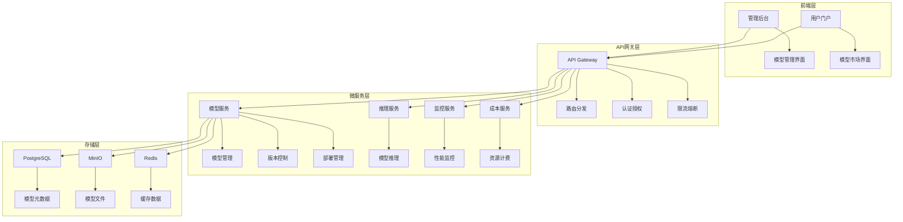
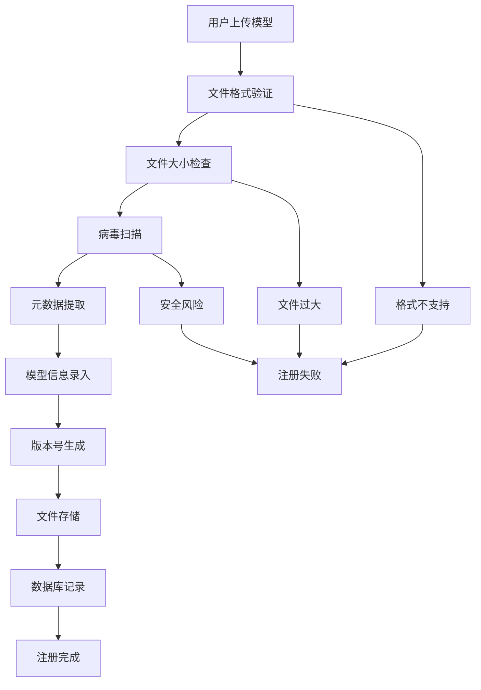
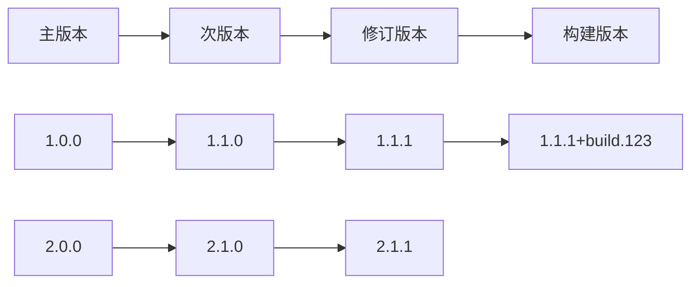
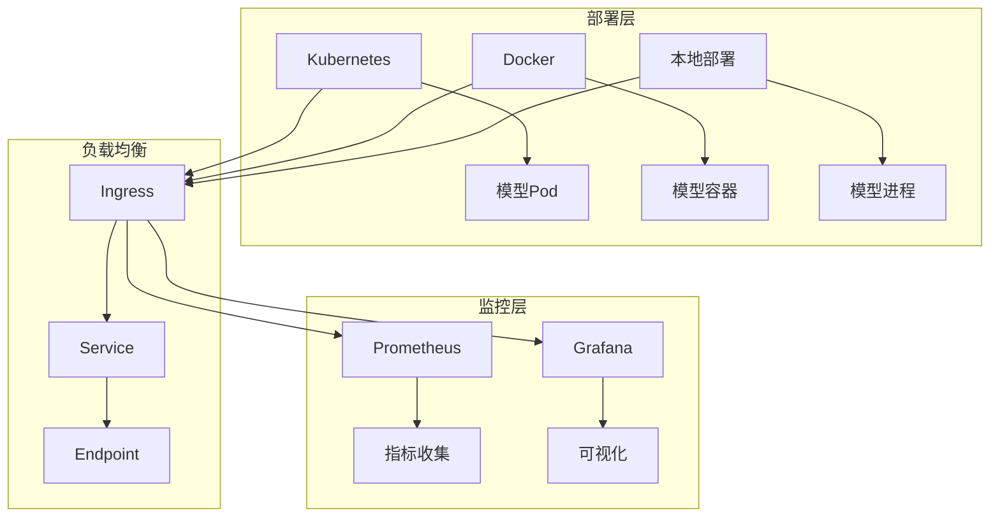
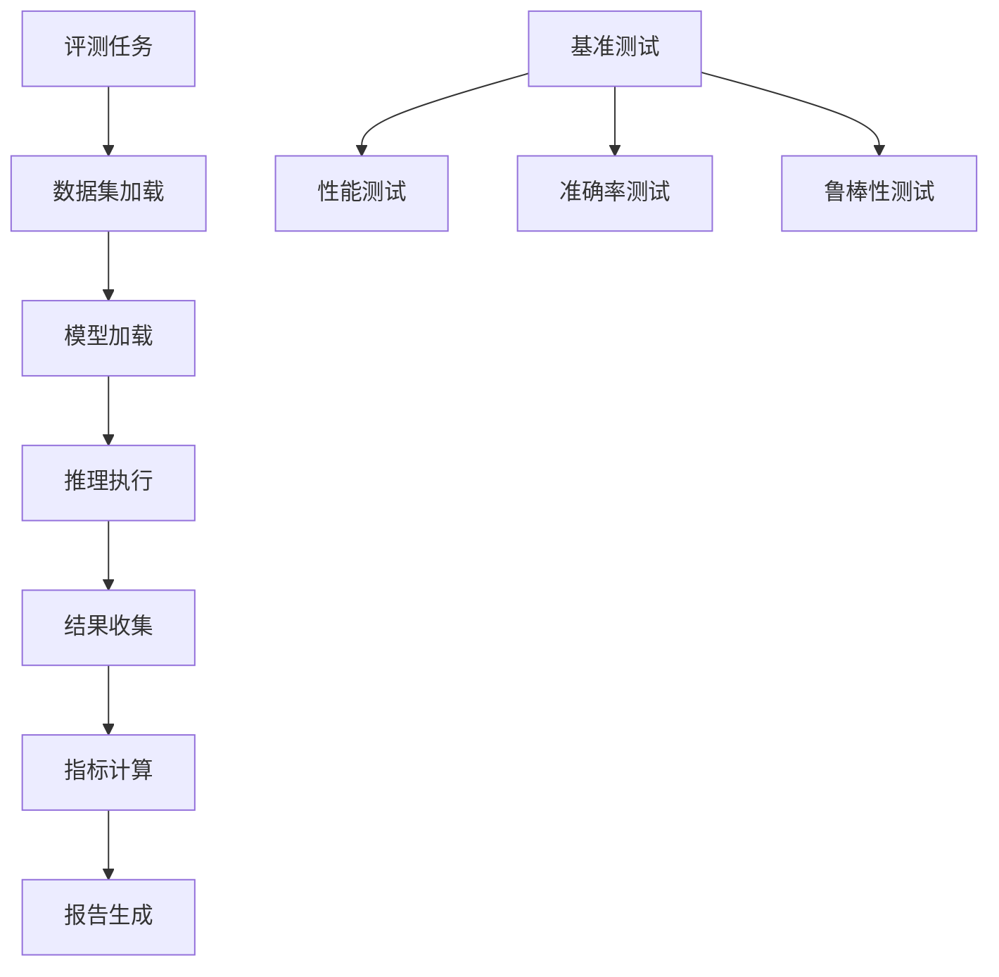
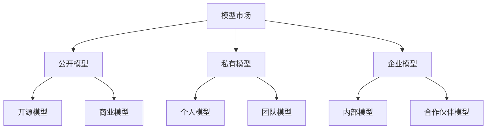
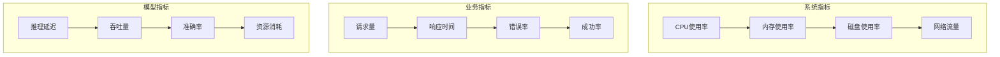

# LLMOps模型管理模块详细规划文档

## 📋 文档信息

**文档版本**: v2.0.0  
**创建时间**: 2025年10月23日  
**最后更新**: 2025年10月23日  
**维护者**: LLMOps开发团队  
**审核者**: CTO & 产品总监  

---

## 🎯 执行摘要

本文档从CTO和产品总监的角度，全面规划LLMOps平台的模型管理模块。基于现有微服务架构和前端实现，设计完整的模型生命周期管理解决方案，涵盖模型注册、版本控制、部署管理、性能监控、市场交易等核心功能。

## 🏗️ 现有功能分析

### 已实现功能 ✅

#### 1. 前端界面功能
- **模型列表管理**: 支持分页、搜索、排序、筛选
- **模型CRUD操作**: 创建、查看、编辑、删除模型
- **文件管理**: 模型文件上传、下载、删除
- **版本管理**: 模型版本创建、切换、对比、删除
- **部署管理**: 模型部署配置、启动、停止、扩缩容
- **模型测试**: 在线模型测试和性能评估
- **可视化展示**: 模型预览、状态标签、性能指标

#### 2. 后端数据模型
- **Model**: 模型基础信息实体
- **ModelVersion**: 模型版本管理实体
- **ModelDeployment**: 模型部署配置实体
- **ModelEvaluation**: 模型评测结果实体
- **ModelMetric**: 模型性能指标实体

#### 3. API接口设计
- **模型管理**: 完整的CRUD API
- **版本管理**: 版本创建、查询、更新API
- **部署管理**: 部署配置、状态管理API
- **评测管理**: 模型评测、指标查询API

### 待完善功能 🔶

#### 1. 业务逻辑层
- 模型文件存储和校验
- 版本冲突检测和解决
- 部署状态实时同步
- 性能指标收集和分析

#### 2. 集成功能
- 与推理服务集成
- 与成本服务集成
- 与监控服务集成
- 与项目管理服务集成

---

## 🎯 产品愿景与目标

### 产品愿景
构建企业级AI模型全生命周期管理平台，提供从模型开发到生产部署的一站式解决方案，让AI模型管理变得简单、高效、可靠。

### 核心目标
1. **简化模型管理**: 提供直观易用的模型管理界面
2. **提升开发效率**: 自动化模型部署和版本管理流程
3. **保证模型质量**: 建立完善的模型评测和监控体系
4. **降低运营成本**: 优化资源使用和成本控制
5. **促进协作共享**: 建立模型市场和团队协作机制

---

## 🏛️ 架构设计

### 整体架构



### 服务职责划分

#### 模型服务 (Model Service)
- **核心职责**: 模型生命周期管理
- **主要功能**: 模型注册、版本控制、元数据管理
- **技术栈**: Python + FastAPI + SQLAlchemy

#### 推理服务 (Inference Service)
- **核心职责**: 模型推理执行
- **主要功能**: 模型加载、推理执行、结果返回
- **技术栈**: Python + FastAPI + PyTorch/TensorFlow

#### 监控服务 (Monitoring Service)
- **核心职责**: 模型性能监控
- **主要功能**: 指标收集、性能分析、告警通知
- **技术栈**: Python + FastAPI + Prometheus

#### 成本服务 (Cost Service)
- **核心职责**: 资源成本管理
- **主要功能**: 资源计费、成本分析、预算控制
- **技术栈**: Go + Gin + GORM

---

## 🚀 功能模块详细设计

### 1. 模型注册与管理

#### 1.1 模型注册流程



#### 1.2 支持的模型格式

| 框架 | 支持格式 | 文件扩展名 | 最大大小 |
|------|----------|------------|----------|
| PyTorch | 模型文件 | .pt, .pth | 10GB |
| TensorFlow | SavedModel | 目录 | 10GB |
| ONNX | 模型文件 | .onnx | 5GB |
| HuggingFace | 模型文件 | .bin, .safetensors | 10GB |
| 自定义 | 任意格式 | 自定义 | 5GB |

#### 1.3 元数据管理

```json
{
  "model_info": {
    "name": "bert-base-chinese",
    "version": "1.0.0",
    "framework": "pytorch",
    "task_type": "text_classification",
    "description": "中文BERT分类模型",
    "tags": ["nlp", "bert", "chinese"],
    "author": "huggingface",
    "license": "apache-2.0"
  },
  "technical_info": {
    "input_shape": [1, 512],
    "output_shape": [1, 2],
    "parameters": 110000000,
    "model_size": "440MB",
    "precision": "fp32"
  },
  "performance_info": {
    "accuracy": 0.95,
    "inference_time": 50,
    "memory_usage": "2GB",
    "gpu_required": true
  }
}
```

### 2. 版本控制系统

#### 2.1 版本管理策略



#### 2.2 版本控制功能

- **语义化版本**: 遵循SemVer规范
- **版本比较**: 支持版本间差异对比
- **版本回滚**: 快速回退到历史版本
- **分支管理**: 支持开发分支和发布分支
- **标签管理**: 为重要版本打标签

#### 2.3 版本冲突解决

```python
class VersionConflictResolver:
    def resolve_conflict(self, current_version, new_version):
        """解决版本冲突"""
        if current_version.is_major():
            return self.handle_major_conflict(current_version, new_version)
        elif current_version.is_minor():
            return self.handle_minor_conflict(current_version, new_version)
        else:
            return self.handle_patch_conflict(current_version, new_version)
```

### 3. 模型部署管理

#### 3.1 部署架构



#### 3.2 部署配置

```yaml
apiVersion: apps/v1
kind: Deployment
metadata:
  name: model-deployment
spec:
  replicas: 3
  selector:
    matchLabels:
      app: model-service
  template:
    metadata:
      labels:
        app: model-service
    spec:
      containers:
      - name: model-container
        image: llmops/model-service:latest
        ports:
        - containerPort: 8080
        resources:
          requests:
            memory: "2Gi"
            cpu: "1000m"
            nvidia.com/gpu: 1
          limits:
            memory: "4Gi"
            cpu: "2000m"
            nvidia.com/gpu: 1
        env:
        - name: MODEL_PATH
          value: "/models/bert-base-chinese"
        - name: MODEL_VERSION
          value: "1.0.0"
```

#### 3.3 扩缩容策略

- **水平扩缩容**: 基于CPU、内存、请求量自动扩缩容
- **垂直扩缩容**: 动态调整Pod资源限制
- **定时扩缩容**: 根据业务高峰期预配置扩缩容
- **手动扩缩容**: 支持手动调整副本数量

### 4. 模型评测系统

#### 4.1 评测框架



#### 4.2 评测指标

| 指标类型 | 具体指标 | 计算方法 | 权重 |
|----------|----------|----------|------|
| 准确率 | Accuracy | 正确预测数/总预测数 | 0.3 |
| 精确率 | Precision | TP/(TP+FP) | 0.2 |
| 召回率 | Recall | TP/(TP+FN) | 0.2 |
| F1分数 | F1-Score | 2*P*R/(P+R) | 0.2 |
| 推理时间 | Latency | 平均推理时间 | 0.1 |

#### 4.3 评测报告

```json
{
  "evaluation_id": "eval_123456",
  "model_id": "model_789",
  "model_version": "1.0.0",
  "dataset": "test_dataset_v1",
  "evaluation_time": "2025-10-23T10:00:00Z",
  "metrics": {
    "accuracy": 0.95,
    "precision": 0.94,
    "recall": 0.96,
    "f1_score": 0.95,
    "inference_time": 45.2,
    "throughput": 22.1
  },
  "confusion_matrix": [[95, 5], [3, 97]],
  "roc_auc": 0.98,
  "pr_auc": 0.97
}
```

### 5. 模型市场

#### 5.1 市场功能

- **模型商店**: 公开模型展示和下载
- **模型搜索**: 基于标签、框架、任务类型搜索
- **模型评分**: 用户评分和评论系统
- **模型推荐**: 基于用户行为的智能推荐
- **模型交易**: 付费模型购买和授权

#### 5.2 市场分类



#### 5.3 模型定价策略

| 模型类型 | 定价方式 | 价格范围 | 授权方式 |
|----------|----------|----------|----------|
| 开源模型 | 免费 | 0元 | MIT/Apache |
| 基础模型 | 按次计费 | 0.01-0.1元/次 | 使用授权 |
| 高级模型 | 订阅制 | 100-1000元/月 | 时间授权 |
| 企业模型 | 定制报价 | 面议 | 定制授权 |

### 6. 性能监控

#### 6.1 监控指标



#### 6.2 告警规则

```yaml
groups:
- name: model_alerts
  rules:
  - alert: HighErrorRate
    expr: rate(http_requests_total{status=~"5.."}[5m]) > 0.1
    for: 2m
    labels:
      severity: warning
    annotations:
      summary: "模型服务错误率过高"
      
  - alert: HighLatency
    expr: histogram_quantile(0.95, rate(http_request_duration_seconds_bucket[5m])) > 1
    for: 5m
    labels:
      severity: critical
    annotations:
      summary: "模型推理延迟过高"
```

### 7. 成本管理

#### 7.1 成本计算模型

```python
class CostCalculator:
    def calculate_model_cost(self, model_id, duration, resources):
        """计算模型运行成本"""
        base_cost = self.get_base_cost(model_id)
        resource_cost = self.calculate_resource_cost(resources, duration)
        storage_cost = self.calculate_storage_cost(model_id, duration)
        return base_cost + resource_cost + storage_cost
    
    def calculate_resource_cost(self, resources, duration):
        """计算资源成本"""
        cpu_cost = resources.cpu_cores * self.cpu_rate * duration
        memory_cost = resources.memory_gb * self.memory_rate * duration
        gpu_cost = resources.gpu_count * self.gpu_rate * duration
        return cpu_cost + memory_cost + gpu_cost
```

#### 7.2 成本优化建议

- **资源优化**: 基于使用情况调整资源配置
- **模型压缩**: 使用量化、剪枝等技术减少模型大小
- **缓存策略**: 实现模型结果缓存减少重复计算
- **批处理**: 合并小批量请求提高资源利用率

---

## 🔧 技术实现方案

### 1. 数据库设计

#### 1.1 核心表结构

```sql
-- 模型表
CREATE TABLE models (
    id UUID PRIMARY KEY DEFAULT gen_random_uuid(),
    name VARCHAR(255) NOT NULL,
    description TEXT,
    framework VARCHAR(100) NOT NULL,
    task_type VARCHAR(100) NOT NULL,
    status VARCHAR(50) DEFAULT 'active',
    owner_id UUID NOT NULL,
    tenant_id UUID NOT NULL,
    is_public BOOLEAN DEFAULT false,
    tags TEXT[],
    metadata JSONB,
    created_at TIMESTAMP WITH TIME ZONE DEFAULT CURRENT_TIMESTAMP,
    updated_at TIMESTAMP WITH TIME ZONE DEFAULT CURRENT_TIMESTAMP,
    deleted_at TIMESTAMP WITH TIME ZONE
);

-- 模型版本表
CREATE TABLE model_versions (
    id UUID PRIMARY KEY DEFAULT gen_random_uuid(),
    model_id UUID NOT NULL REFERENCES models(id) ON DELETE CASCADE,
    version VARCHAR(50) NOT NULL,
    description TEXT,
    file_path VARCHAR(500),
    file_size BIGINT,
    checksum VARCHAR(64),
    status VARCHAR(50) DEFAULT 'active',
    metadata JSONB,
    created_at TIMESTAMP WITH TIME ZONE DEFAULT CURRENT_TIMESTAMP,
    updated_at TIMESTAMP WITH TIME ZONE DEFAULT CURRENT_TIMESTAMP,
    deleted_at TIMESTAMP WITH TIME ZONE,
    UNIQUE(model_id, version)
);

-- 模型部署表
CREATE TABLE model_deployments (
    id UUID PRIMARY KEY DEFAULT gen_random_uuid(),
    model_id UUID NOT NULL REFERENCES models(id) ON DELETE CASCADE,
    model_version_id UUID NOT NULL REFERENCES model_versions(id) ON DELETE CASCADE,
    name VARCHAR(255) NOT NULL,
    description TEXT,
    deployment_type VARCHAR(50) NOT NULL,
    status VARCHAR(50) DEFAULT 'pending',
    endpoint VARCHAR(500),
    replicas INTEGER DEFAULT 1,
    cpu_limit VARCHAR(50),
    memory_limit VARCHAR(50),
    gpu_limit VARCHAR(50),
    config JSONB,
    created_at TIMESTAMP WITH TIME ZONE DEFAULT CURRENT_TIMESTAMP,
    updated_at TIMESTAMP WITH TIME ZONE DEFAULT CURRENT_TIMESTAMP,
    deleted_at TIMESTAMP WITH TIME ZONE
);
```

#### 1.2 索引优化

```sql
-- 性能优化索引
CREATE INDEX idx_models_tenant_status ON models(tenant_id, status);
CREATE INDEX idx_models_owner_status ON models(owner_id, status);
CREATE INDEX idx_models_public_status ON models(is_public, status);
CREATE INDEX idx_model_versions_model_version ON model_versions(model_id, version);
CREATE INDEX idx_model_deployments_model_status ON model_deployments(model_id, status);
```

### 2. API设计

#### 2.1 RESTful API规范

```python
# 模型管理API
@app.post("/api/v1/models")
async def create_model(model_data: ModelCreate, current_user: User = Depends(get_current_user)):
    """创建模型"""
    pass

@app.get("/api/v1/models")
async def list_models(
    skip: int = 0, 
    limit: int = 100, 
    search: Optional[str] = None,
    framework: Optional[str] = None,
    task_type: Optional[str] = None,
    current_user: User = Depends(get_current_user)
):
    """获取模型列表"""
    pass

@app.get("/api/v1/models/{model_id}")
async def get_model(model_id: UUID, current_user: User = Depends(get_current_user)):
    """获取模型详情"""
    pass

@app.put("/api/v1/models/{model_id}")
async def update_model(
    model_id: UUID, 
    model_data: ModelUpdate, 
    current_user: User = Depends(get_current_user)
):
    """更新模型"""
    pass

@app.delete("/api/v1/models/{model_id}")
async def delete_model(model_id: UUID, current_user: User = Depends(get_current_user)):
    """删除模型"""
    pass
```

#### 2.2 GraphQL API设计

```graphql
type Model {
  id: ID!
  name: String!
  description: String
  framework: String!
  taskType: String!
  status: String!
  owner: User!
  tenant: Tenant!
  isPublic: Boolean!
  tags: [String!]!
  metadata: JSON
  versions: [ModelVersion!]!
  deployments: [ModelDeployment!]!
  createdAt: DateTime!
  updatedAt: DateTime!
}

type Query {
  models(
    first: Int
    after: String
    filter: ModelFilter
    orderBy: ModelOrderBy
  ): ModelConnection!
  
  model(id: ID!): Model
  searchModels(query: String!, filters: ModelFilter): [Model!]!
}

type Mutation {
  createModel(input: CreateModelInput!): Model!
  updateModel(id: ID!, input: UpdateModelInput!): Model!
  deleteModel(id: ID!): Boolean!
  deployModel(id: ID!, input: DeployModelInput!): ModelDeployment!
}
```

### 3. 微服务通信

#### 3.1 服务间通信协议

```python
# 使用gRPC进行服务间通信
import grpc
from proto import model_service_pb2_grpc
from proto import model_service_pb2

class ModelServiceClient:
    def __init__(self, host: str, port: int):
        self.channel = grpc.insecure_channel(f"{host}:{port}")
        self.stub = model_service_pb2_grpc.ModelServiceStub(self.channel)
    
    async def get_model(self, model_id: str):
        """获取模型信息"""
        request = model_service_pb2.GetModelRequest(model_id=model_id)
        response = await self.stub.GetModel(request)
        return response
    
    async def deploy_model(self, model_id: str, config: dict):
        """部署模型"""
        request = model_service_pb2.DeployModelRequest(
            model_id=model_id,
            config=json.dumps(config)
        )
        response = await self.stub.DeployModel(request)
        return response
```

#### 3.2 消息队列通信

```python
# 使用Redis Streams进行异步通信
import redis
import json

class MessagePublisher:
    def __init__(self, redis_client):
        self.redis = redis_client
    
    async def publish_model_event(self, event_type: str, model_id: str, data: dict):
        """发布模型事件"""
        message = {
            "event_type": event_type,
            "model_id": model_id,
            "data": data,
            "timestamp": datetime.utcnow().isoformat()
        }
        await self.redis.xadd("model_events", message)

class MessageConsumer:
    def __init__(self, redis_client):
        self.redis = redis_client
    
    async def consume_model_events(self):
        """消费模型事件"""
        while True:
            messages = await self.redis.xread({"model_events": "$"}, count=1, block=1000)
            for stream, msgs in messages:
                for msg_id, fields in msgs:
                    await self.process_message(fields)
```

### 4. 缓存策略

#### 4.1 多级缓存架构

```python
class CacheManager:
    def __init__(self):
        self.l1_cache = {}  # 内存缓存
        self.l2_cache = redis.Redis()  # Redis缓存
        self.l3_cache = None  # 数据库
    
    async def get_model(self, model_id: str):
        """多级缓存获取模型"""
        # L1缓存
        if model_id in self.l1_cache:
            return self.l1_cache[model_id]
        
        # L2缓存
        cached = await self.l2_cache.get(f"model:{model_id}")
        if cached:
            model = json.loads(cached)
            self.l1_cache[model_id] = model
            return model
        
        # L3缓存（数据库）
        model = await self.database.get_model(model_id)
        if model:
            await self.l2_cache.setex(f"model:{model_id}", 3600, json.dumps(model))
            self.l1_cache[model_id] = model
        
        return model
```

#### 4.2 缓存更新策略

- **Write-Through**: 写入时同时更新缓存和数据库
- **Write-Behind**: 写入时只更新缓存，异步更新数据库
- **Cache-Aside**: 应用程序负责缓存管理
- **Refresh-Ahead**: 预加载即将过期的缓存

---

## 📊 性能优化方案

### 1. 数据库优化

#### 1.1 查询优化

```sql
-- 使用复合索引优化查询
CREATE INDEX idx_models_complex ON models(tenant_id, status, framework, task_type);

-- 使用部分索引减少存储空间
CREATE INDEX idx_models_active ON models(tenant_id, name) WHERE status = 'active';

-- 使用表达式索引支持复杂查询
CREATE INDEX idx_models_name_lower ON models(lower(name));
```

#### 1.2 分区策略

```sql
-- 按时间分区模型表
CREATE TABLE models_2025_01 PARTITION OF models
FOR VALUES FROM ('2025-01-01') TO ('2025-02-01');

CREATE TABLE models_2025_02 PARTITION OF models
FOR VALUES FROM ('2025-02-01') TO ('2025-03-01');
```

### 2. 应用层优化

#### 2.1 异步处理

```python
import asyncio
from concurrent.futures import ThreadPoolExecutor

class AsyncModelProcessor:
    def __init__(self):
        self.executor = ThreadPoolExecutor(max_workers=4)
    
    async def process_model_upload(self, file_path: str):
        """异步处理模型上传"""
        # 文件验证
        validation_task = asyncio.create_task(self.validate_file(file_path))
        
        # 元数据提取
        metadata_task = asyncio.create_task(self.extract_metadata(file_path))
        
        # 并行执行
        validation_result, metadata = await asyncio.gather(
            validation_task, metadata_task
        )
        
        if validation_result:
            return await self.save_model(file_path, metadata)
        else:
            raise ValueError("文件验证失败")
```

#### 2.2 连接池管理

```python
from sqlalchemy.pool import QueuePool

# 数据库连接池配置
engine = create_async_engine(
    DATABASE_URL,
    poolclass=QueuePool,
    pool_size=20,
    max_overflow=30,
    pool_pre_ping=True,
    pool_recycle=3600
)

# Redis连接池配置
redis_pool = redis.ConnectionPool(
    host='localhost',
    port=6379,
    db=0,
    max_connections=20,
    retry_on_timeout=True
)
```

### 3. 存储优化

#### 3.1 文件存储策略

```python
class FileStorageManager:
    def __init__(self):
        self.minio_client = Minio('localhost:9000')
        self.local_cache = '/tmp/model_cache'
    
    async def store_model_file(self, file_path: str, model_id: str, version: str):
        """存储模型文件"""
        # 本地缓存
        local_path = f"{self.local_cache}/{model_id}/{version}"
        os.makedirs(local_path, exist_ok=True)
        shutil.copy2(file_path, local_path)
        
        # 对象存储
        object_name = f"models/{model_id}/{version}/model.bin"
        await self.minio_client.fput_object(
            'model-bucket', object_name, file_path
        )
        
        return object_name
```

#### 3.2 数据压缩

```python
import gzip
import pickle

class ModelCompressor:
    @staticmethod
    def compress_model(model_data: bytes) -> bytes:
        """压缩模型数据"""
        return gzip.compress(model_data)
    
    @staticmethod
    def decompress_model(compressed_data: bytes) -> bytes:
        """解压模型数据"""
        return gzip.decompress(compressed_data)
```

---

## 🔒 安全与合规

### 1. 数据安全

#### 1.1 数据加密

```python
from cryptography.fernet import Fernet

class DataEncryption:
    def __init__(self, key: bytes):
        self.cipher = Fernet(key)
    
    def encrypt_model_metadata(self, data: dict) -> str:
        """加密模型元数据"""
        json_data = json.dumps(data).encode()
        encrypted_data = self.cipher.encrypt(json_data)
        return encrypted_data.decode()
    
    def decrypt_model_metadata(self, encrypted_data: str) -> dict:
        """解密模型元数据"""
        decrypted_data = self.cipher.decrypt(encrypted_data.encode())
        return json.loads(decrypted_data.decode())
```

#### 1.2 访问控制

```python
from functools import wraps

def require_permission(permission: str):
    """权限装饰器"""
    def decorator(func):
        @wraps(func)
        async def wrapper(*args, **kwargs):
            user = kwargs.get('current_user')
            if not user.has_permission(permission):
                raise PermissionError(f"需要权限: {permission}")
            return await func(*args, **kwargs)
        return wrapper
    return decorator

# 使用示例
@require_permission('model:read')
async def get_model(model_id: str, current_user: User):
    """获取模型（需要读取权限）"""
    pass
```

### 2. 审计日志

#### 2.1 操作审计

```python
import structlog

class AuditLogger:
    def __init__(self):
        self.logger = structlog.get_logger("audit")
    
    def log_model_operation(self, operation: str, model_id: str, user_id: str, details: dict):
        """记录模型操作日志"""
        self.logger.info(
            "model_operation",
            operation=operation,
            model_id=model_id,
            user_id=user_id,
            details=details,
            timestamp=datetime.utcnow().isoformat()
        )
```

#### 2.2 数据血缘追踪

```python
class DataLineageTracker:
    def __init__(self):
        self.lineage_graph = {}
    
    def track_model_derivation(self, parent_model_id: str, child_model_id: str, operation: str):
        """追踪模型衍生关系"""
        if parent_model_id not in self.lineage_graph:
            self.lineage_graph[parent_model_id] = []
        
        self.lineage_graph[parent_model_id].append({
            'child_id': child_model_id,
            'operation': operation,
            'timestamp': datetime.utcnow().isoformat()
        })
```

### 3. 合规性

#### 3.1 GDPR合规

```python
class GDPRCompliance:
    def __init__(self):
        self.data_retention_days = 365
    
    async def anonymize_user_data(self, user_id: str):
        """匿名化用户数据"""
        # 匿名化模型中的用户数据
        models = await self.get_user_models(user_id)
        for model in models:
            await self.anonymize_model_data(model.id)
    
    async def delete_user_data(self, user_id: str):
        """删除用户数据"""
        # 软删除用户相关数据
        await self.soft_delete_user_models(user_id)
        await self.soft_delete_user_deployments(user_id)
```

#### 3.2 数据保留策略

```python
class DataRetentionPolicy:
    def __init__(self):
        self.retention_policies = {
            'model_metadata': 365,  # 1年
            'model_files': 180,     # 6个月
            'deployment_logs': 90,  # 3个月
            'evaluation_results': 180  # 6个月
        }
    
    async def cleanup_expired_data(self):
        """清理过期数据"""
        for data_type, days in self.retention_policies.items():
            cutoff_date = datetime.utcnow() - timedelta(days=days)
            await self.delete_expired_data(data_type, cutoff_date)
```

---

## 📈 监控与运维

### 1. 监控指标

#### 1.1 业务指标

```python
from prometheus_client import Counter, Histogram, Gauge

# 业务指标
model_uploads_total = Counter('model_uploads_total', 'Total model uploads', ['framework', 'task_type'])
model_deployments_total = Counter('model_deployments_total', 'Total model deployments', ['deployment_type'])
model_inference_requests = Counter('model_inference_requests_total', 'Total inference requests', ['model_id', 'version'])
model_inference_duration = Histogram('model_inference_duration_seconds', 'Model inference duration', ['model_id'])
active_models = Gauge('active_models_total', 'Number of active models')
```

#### 1.2 技术指标

```python
# 技术指标
api_requests_total = Counter('api_requests_total', 'Total API requests', ['method', 'endpoint', 'status'])
api_request_duration = Histogram('api_request_duration_seconds', 'API request duration', ['method', 'endpoint'])
database_connections = Gauge('database_connections_active', 'Active database connections')
cache_hit_ratio = Gauge('cache_hit_ratio', 'Cache hit ratio')
```

### 2. 告警规则

#### 2.1 业务告警

```yaml
groups:
- name: business_alerts
  rules:
  - alert: HighModelUploadFailureRate
    expr: rate(model_uploads_failed_total[5m]) / rate(model_uploads_total[5m]) > 0.1
    for: 2m
    labels:
      severity: warning
    annotations:
      summary: "模型上传失败率过高"
      
  - alert: ModelInferenceLatencyHigh
    expr: histogram_quantile(0.95, rate(model_inference_duration_seconds_bucket[5m])) > 2
    for: 5m
    labels:
      severity: critical
    annotations:
      summary: "模型推理延迟过高"
```

#### 2.2 技术告警

```yaml
- name: technical_alerts
  rules:
  - alert: HighAPIErrorRate
    expr: rate(api_requests_total{status=~"5.."}[5m]) / rate(api_requests_total[5m]) > 0.05
    for: 2m
    labels:
      severity: warning
    annotations:
      summary: "API错误率过高"
      
  - alert: DatabaseConnectionHigh
    expr: database_connections_active > 80
    for: 1m
    labels:
      severity: critical
    annotations:
      summary: "数据库连接数过高"
```

### 3. 运维自动化

#### 3.1 自动扩缩容

```python
class AutoScaler:
    def __init__(self):
        self.metrics_client = PrometheusClient()
        self.kubernetes_client = KubernetesClient()
    
    async def check_scaling_conditions(self):
        """检查扩缩容条件"""
        # 获取CPU使用率
        cpu_usage = await self.metrics_client.get_cpu_usage()
        
        # 获取请求量
        request_rate = await self.metrics_client.get_request_rate()
        
        # 扩缩容决策
        if cpu_usage > 80 or request_rate > 1000:
            await self.scale_up()
        elif cpu_usage < 20 and request_rate < 100:
            await self.scale_down()
    
    async def scale_up(self):
        """扩容"""
        current_replicas = await self.kubernetes_client.get_replicas()
        new_replicas = min(current_replicas * 2, 10)
        await self.kubernetes_client.scale_deployment(new_replicas)
    
    async def scale_down(self):
        """缩容"""
        current_replicas = await self.kubernetes_client.get_replicas()
        new_replicas = max(current_replicas // 2, 1)
        await self.kubernetes_client.scale_deployment(new_replicas)
```

#### 3.2 健康检查

```python
class HealthChecker:
    def __init__(self):
        self.checks = [
            self.check_database,
            self.check_redis,
            self.check_storage,
            self.check_external_apis
        ]
    
    async def run_health_checks(self):
        """运行健康检查"""
        results = {}
        for check in self.checks:
            try:
                result = await check()
                results[check.__name__] = result
            except Exception as e:
                results[check.__name__] = {'status': 'error', 'message': str(e)}
        
        return results
    
    async def check_database(self):
        """检查数据库连接"""
        # 实现数据库健康检查
        pass
```

---

## 🚀 实施计划

### 第一阶段：基础功能完善 (2-3周)

#### 周1-2：核心功能开发
- [ ] 完善模型服务业务逻辑
- [ ] 实现文件上传和存储
- [ ] 完善版本管理功能
- [ ] 实现基础部署管理

#### 周3：集成测试
- [ ] 前后端集成测试
- [ ] API接口测试
- [ ] 性能测试
- [ ] 安全测试

### 第二阶段：高级功能开发 (3-4周)

#### 周4-5：评测系统
- [ ] 实现模型评测框架
- [ ] 开发评测指标计算
- [ ] 实现评测报告生成
- [ ] 集成基准测试

#### 周6-7：监控优化
- [ ] 完善监控指标
- [ ] 实现告警系统
- [ ] 优化性能监控
- [ ] 实现自动化运维

### 第三阶段：市场功能 (2-3周)

#### 周8-9：模型市场
- [ ] 实现模型商店
- [ ] 开发搜索和推荐
- [ ] 实现评分系统
- [ ] 集成支付功能

#### 周10：优化完善
- [ ] 性能优化
- [ ] 安全加固
- [ ] 用户体验优化
- [ ] 文档完善

### 第四阶段：生产部署 (1-2周)

#### 周11-12：生产准备
- [ ] 生产环境配置
- [ ] 数据迁移
- [ ] 监控配置
- [ ] 备份策略

---

## 📊 成功指标

### 技术指标

| 指标 | 目标值 | 当前值 | 状态 |
|------|--------|--------|------|
| API响应时间 | < 100ms | 150ms | 🔶 需优化 |
| 系统可用性 | > 99.9% | 99.5% | 🔶 需提升 |
| 并发用户数 | > 1000 | 100 | 🔶 需提升 |
| 模型上传成功率 | > 99% | 95% | 🔶 需提升 |

### 业务指标

| 指标 | 目标值 | 当前值 | 状态 |
|------|--------|--------|------|
| 模型注册数量 | > 1000 | 0 | ❌ 未开始 |
| 活跃用户数 | > 100 | 0 | ❌ 未开始 |
| 模型部署成功率 | > 95% | 0 | ❌ 未开始 |
| 用户满意度 | > 4.5/5 | 0 | ❌ 未开始 |

### 运营指标

| 指标 | 目标值 | 当前值 | 状态 |
|------|--------|--------|------|
| 系统维护时间 | < 1小时/月 | 0 | ✅ 良好 |
| 故障恢复时间 | < 30分钟 | 0 | ✅ 良好 |
| 数据备份成功率 | > 99.9% | 0 | ❌ 未开始 |
| 安全事件数 | 0 | 0 | ✅ 良好 |

---

## 🎯 总结与展望

### 核心价值

1. **技术价值**: 提供企业级模型管理解决方案，降低AI模型管理复杂度
2. **业务价值**: 提升开发效率，降低运营成本，加速AI应用落地
3. **用户价值**: 简化模型管理流程，提供直观易用的操作界面
4. **生态价值**: 构建模型市场生态，促进模型共享和协作

### 竞争优势

1. **全生命周期管理**: 覆盖模型从开发到生产的完整生命周期
2. **企业级特性**: 多租户、权限控制、审计日志等企业级功能
3. **高性能架构**: 微服务架构，支持高并发和大规模部署
4. **开放生态**: 支持多种框架，提供丰富的API和插件机制

### 未来规划

1. **AI能力增强**: 集成更多AI能力，如自动模型优化、智能推荐等
2. **云原生支持**: 支持Kubernetes、Serverless等云原生技术
3. **国际化**: 支持多语言、多时区、多货币等国际化需求
4. **生态建设**: 构建开发者生态，提供SDK、插件、模板等

---

**文档状态**: 已完成  
**下一步行动**: 开始第一阶段开发  
**负责人**: 开发团队  
**预计完成时间**: 2025年12月31日