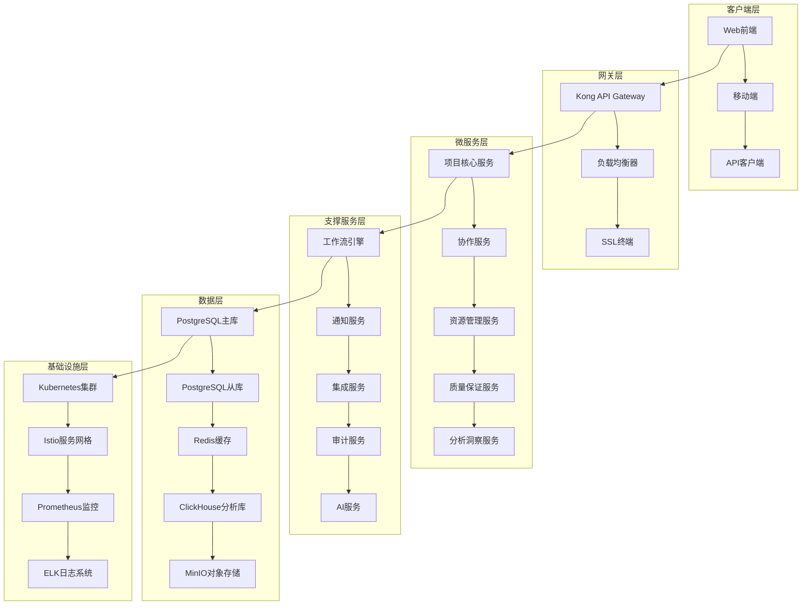
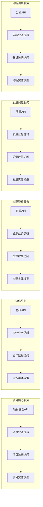
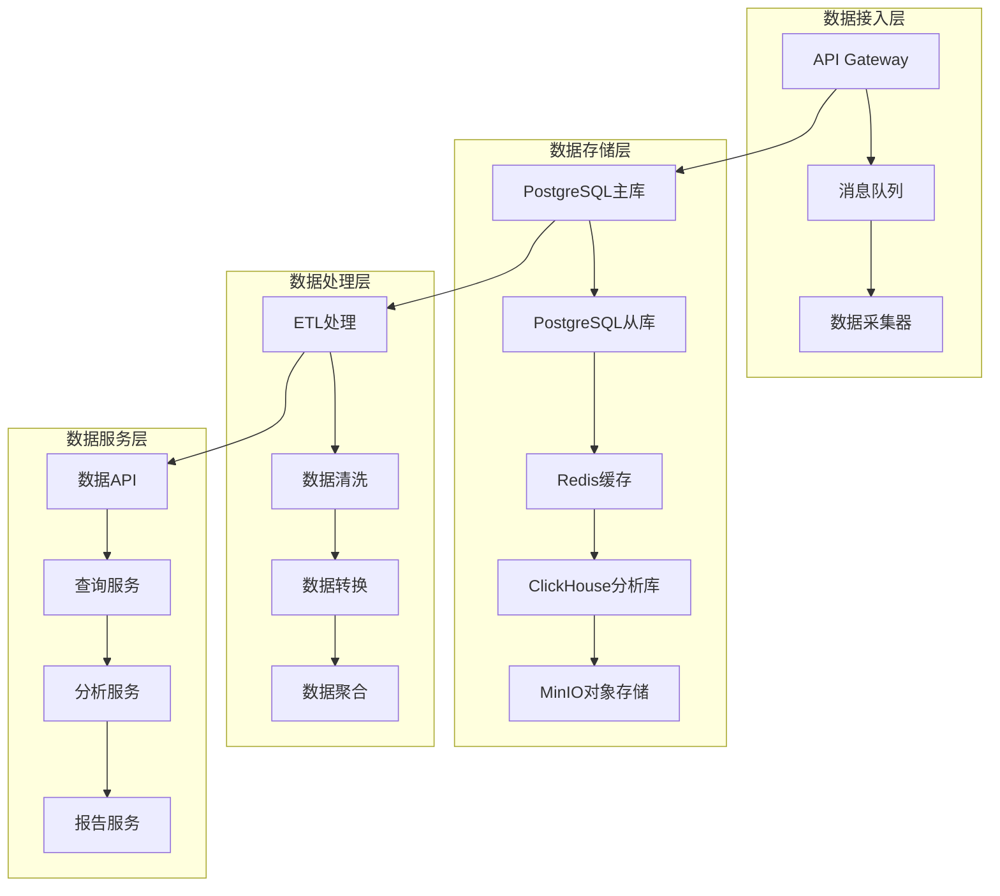
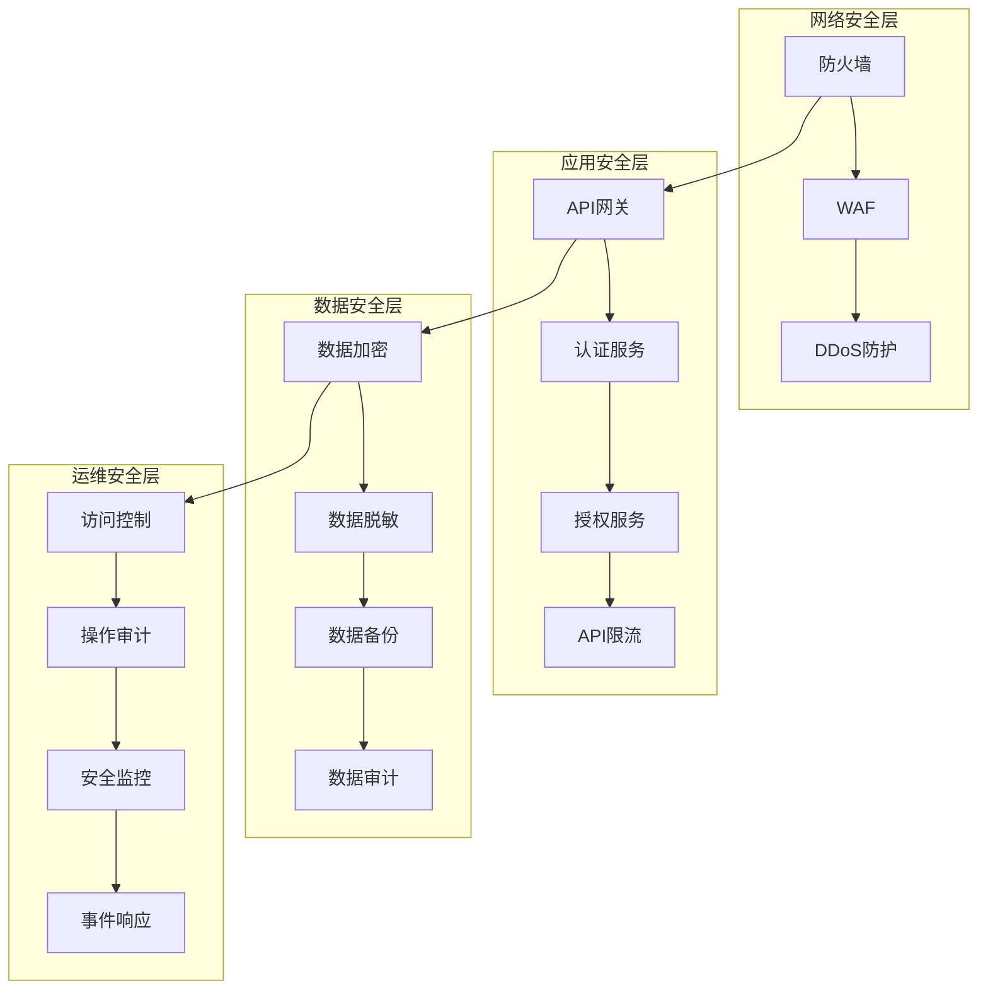
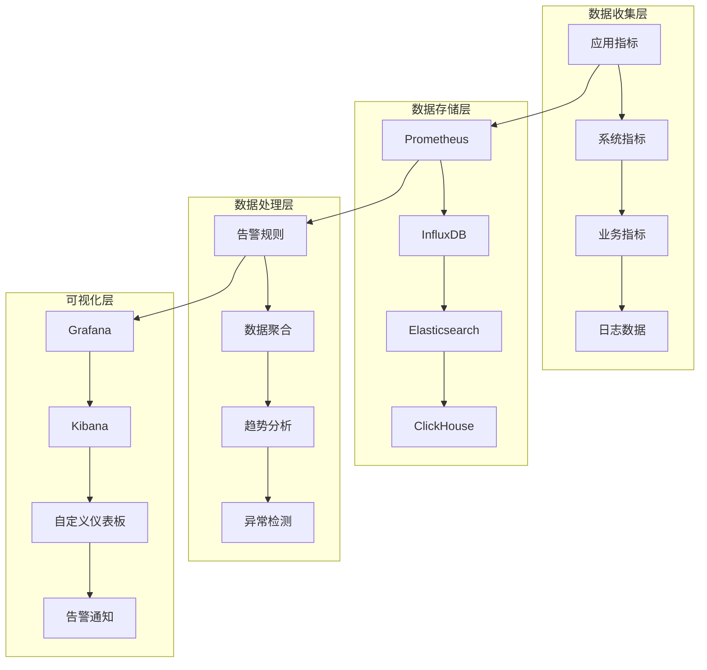
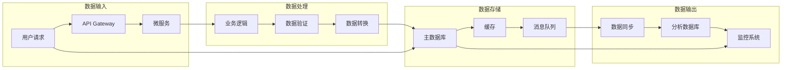

# LLMOps项目管理模块技术架构设计

## 📋 文档信息

- **文档版本**: v1.0.0
- **创建时间**: 2024年12月
- **创建人**: CTO & 技术架构师
- **适用范围**: LLMOps项目管理模块
- **更新频率**: 月度更新

## 🎯 架构概述

### 设计原则

1. **微服务架构**: 采用微服务架构，实现服务解耦和独立部署
2. **领域驱动设计**: 基于DDD设计模式，确保业务逻辑清晰
3. **云原生**: 支持容器化部署和云原生运维
4. **高可用**: 确保系统高可用性和容错能力
5. **可扩展**: 支持水平扩展和垂直扩展
6. **安全性**: 多层次安全防护和权限控制
7. **可观测性**: 完善的监控、日志和追踪体系

### 技术栈选择

```yaml
后端技术栈:
  - 语言: Go 1.21+ (高性能、并发友好)
  - Web框架: Gin (轻量级、高性能)
  - ORM: GORM (功能丰富、易用)
  - 数据库: PostgreSQL 15+ (ACID、JSON支持)
  - 缓存: Redis 7+ (高性能、丰富数据结构)
  - 消息队列: Apache Kafka (高吞吐、持久化)

微服务技术:
  - 服务网格: Istio (流量管理、安全、可观测性)
  - API网关: Kong (API管理、限流、认证)
  - 服务发现: Consul (服务注册、健康检查)
  - 配置中心: Consul Config (配置管理、热更新)
  - 监控: Prometheus + Grafana (指标收集、可视化)
  - 日志: ELK Stack (日志收集、分析、搜索)

AI/ML技术:
  - 机器学习: scikit-learn, TensorFlow
  - 自然语言处理: spaCy, NLTK
  - 数据分析: Pandas, NumPy
  - 可视化: Matplotlib, Plotly
```

## 🏗️ 整体架构设计

### 系统架构图



### 服务架构图



## 🔧 微服务详细设计

### 1. 项目核心服务 (Project Core Service)

#### 1.1 服务职责
- 项目生命周期管理
- 项目基础信息管理
- 项目状态管理
- 项目配置管理

#### 1.2 技术架构
```yaml
服务结构:
  - 端口: 8082
  - 语言: Go 1.21+
  - 框架: Gin
  - 数据库: PostgreSQL
  - 缓存: Redis

API设计:
  - RESTful API
  - GraphQL支持
  - gRPC内部通信
  - WebSocket实时通信

数据模型:
  - Project: 项目实体
  - ProjectConfig: 项目配置
  - ProjectStatus: 项目状态
  - ProjectTemplate: 项目模板
```

#### 1.3 核心功能模块
```go
// 项目服务接口
type ProjectService interface {
    // 项目CRUD
    CreateProject(ctx context.Context, req *CreateProjectRequest) (*Project, error)
    GetProject(ctx context.Context, projectID uuid.UUID) (*Project, error)
    UpdateProject(ctx context.Context, req *UpdateProjectRequest) (*Project, error)
    DeleteProject(ctx context.Context, projectID uuid.UUID) error
    ListProjects(ctx context.Context, req *ListProjectsRequest) (*ListProjectsResponse, error)
    
    // 项目状态管理
    UpdateProjectStatus(ctx context.Context, req *UpdateStatusRequest) error
    GetProjectStatus(ctx context.Context, projectID uuid.UUID) (*ProjectStatus, error)
    
    // 项目配置管理
    UpdateProjectConfig(ctx context.Context, req *UpdateConfigRequest) error
    GetProjectConfig(ctx context.Context, projectID uuid.UUID) (*ProjectConfig, error)
    
    // 项目模板管理
    CreateFromTemplate(ctx context.Context, req *CreateFromTemplateRequest) (*Project, error)
    GetTemplates(ctx context.Context, req *GetTemplatesRequest) (*TemplatesResponse, error)
}
```

### 2. 协作服务 (Collaboration Service)

#### 2.1 服务职责
- 团队成员管理
- 权限控制
- 协作工具集成
- 实时通信

#### 2.2 技术架构
```yaml
服务结构:
  - 端口: 8083
  - 语言: Go 1.21+
  - 框架: Gin
  - 数据库: PostgreSQL
  - 缓存: Redis
  - 消息队列: Kafka

实时通信:
  - WebSocket
  - Server-Sent Events
  - 消息推送

权限控制:
  - RBAC模型
  - 细粒度权限
  - 动态权限计算
```

#### 2.3 核心功能模块
```go
// 协作服务接口
type CollaborationService interface {
    // 成员管理
    AddMember(ctx context.Context, req *AddMemberRequest) error
    RemoveMember(ctx context.Context, req *RemoveMemberRequest) error
    UpdateMemberRole(ctx context.Context, req *UpdateRoleRequest) error
    GetMembers(ctx context.Context, projectID uuid.UUID) ([]*Member, error)
    
    // 权限管理
    CheckPermission(ctx context.Context, req *CheckPermissionRequest) (bool, error)
    GetUserPermissions(ctx context.Context, userID uuid.UUID, projectID uuid.UUID) ([]string, error)
    
    // 协作功能
    CreateDiscussion(ctx context.Context, req *CreateDiscussionRequest) (*Discussion, error)
    AddComment(ctx context.Context, req *AddCommentRequest) (*Comment, error)
    AssignTask(ctx context.Context, req *AssignTaskRequest) (*Task, error)
}
```

### 3. 资源管理服务 (Resource Management Service)

#### 3.1 服务职责
- 资源配额管理
- 资源使用监控
- 资源优化建议
- 多环境管理

#### 3.2 技术架构
```yaml
服务结构:
  - 端口: 8084
  - 语言: Go 1.21+
  - 框架: Gin
  - 数据库: PostgreSQL
  - 缓存: Redis
  - 监控: Prometheus

资源类型:
  - 计算资源 (CPU, GPU)
  - 存储资源 (内存, 磁盘)
  - 网络资源 (带宽, 连接数)
  - 服务资源 (API调用, 数据库连接)
```

#### 3.3 核心功能模块
```go
// 资源管理服务接口
type ResourceService interface {
    // 资源配额管理
    SetResourceQuota(ctx context.Context, req *SetQuotaRequest) error
    GetResourceQuota(ctx context.Context, projectID uuid.UUID) (*ResourceQuota, error)
    CheckResourceAvailability(ctx context.Context, req *CheckAvailabilityRequest) (bool, error)
    
    // 资源使用监控
    GetResourceUsage(ctx context.Context, projectID uuid.UUID) (*ResourceUsage, error)
    GetResourceMetrics(ctx context.Context, req *GetMetricsRequest) (*MetricsResponse, error)
    
    // 资源优化
    GetOptimizationSuggestions(ctx context.Context, projectID uuid.UUID) ([]*OptimizationSuggestion, error)
    ApplyOptimization(ctx context.Context, req *ApplyOptimizationRequest) error
}
```

### 4. 质量保证服务 (Quality Assurance Service)

#### 4.1 服务职责
- 代码质量管理
- 模型质量保证
- 测试管理
- 质量报告生成

#### 4.2 技术架构
```yaml
服务结构:
  - 端口: 8085
  - 语言: Python 3.11+
  - 框架: FastAPI
  - 数据库: PostgreSQL
  - 缓存: Redis
  - 消息队列: Kafka

集成工具:
  - 代码分析: SonarQube, ESLint
  - 测试框架: pytest, Jest
  - 安全扫描: OWASP ZAP, Snyk
  - 性能测试: JMeter, K6
```

#### 4.3 核心功能模块
```python
# 质量保证服务接口
class QualityService:
    async def analyze_code_quality(self, project_id: str) -> CodeQualityReport:
        """分析代码质量"""
        pass
    
    async def run_tests(self, project_id: str, test_config: TestConfig) -> TestResult:
        """运行测试"""
        pass
    
    async def scan_security(self, project_id: str) -> SecurityReport:
        """安全扫描"""
        pass
    
    async def generate_quality_report(self, project_id: str) -> QualityReport:
        """生成质量报告"""
        pass
```

### 5. 分析洞察服务 (Analytics Service)

#### 5.1 服务职责
- 项目数据分析
- 趋势预测
- 智能洞察
- 报告生成

#### 5.2 技术架构
```yaml
服务结构:
  - 端口: 8086
  - 语言: Python 3.11+
  - 框架: FastAPI
  - 数据库: ClickHouse (分析库)
  - 缓存: Redis
  - 消息队列: Kafka

AI/ML技术:
  - 机器学习: scikit-learn, TensorFlow
  - 数据分析: Pandas, NumPy
  - 可视化: Matplotlib, Plotly
  - 自然语言处理: spaCy, NLTK
```

#### 5.3 核心功能模块
```python
# 分析洞察服务接口
class AnalyticsService:
    async def analyze_project_health(self, project_id: str) -> ProjectHealthAnalysis:
        """分析项目健康度"""
        pass
    
    async def predict_trends(self, project_id: str) -> TrendPrediction:
        """预测趋势"""
        pass
    
    async def generate_insights(self, project_id: str) -> List[Insight]:
        """生成智能洞察"""
        pass
    
    async def create_dashboard(self, project_id: str) -> Dashboard:
        """创建仪表板"""
        pass
```

## 🗄️ 数据架构设计

### 数据分层架构



### 数据库设计

#### 主数据库 (PostgreSQL)
```sql
-- 项目表
CREATE TABLE projects (
    id UUID PRIMARY KEY DEFAULT gen_random_uuid(),
    name VARCHAR(255) NOT NULL,
    description TEXT,
    status VARCHAR(50) NOT NULL DEFAULT 'active',
    owner_id UUID NOT NULL,
    tenant_id UUID NOT NULL,
    settings JSONB,
    created_at TIMESTAMP WITH TIME ZONE DEFAULT CURRENT_TIMESTAMP,
    updated_at TIMESTAMP WITH TIME ZONE DEFAULT CURRENT_TIMESTAMP,
    deleted_at TIMESTAMP WITH TIME ZONE
);

-- 项目成员表
CREATE TABLE project_members (
    id UUID PRIMARY KEY DEFAULT gen_random_uuid(),
    project_id UUID NOT NULL REFERENCES projects(id) ON DELETE CASCADE,
    user_id UUID NOT NULL,
    role VARCHAR(50) NOT NULL,
    permissions TEXT[],
    status VARCHAR(50) DEFAULT 'active',
    created_at TIMESTAMP WITH TIME ZONE DEFAULT CURRENT_TIMESTAMP,
    updated_at TIMESTAMP WITH TIME ZONE DEFAULT CURRENT_TIMESTAMP
);

-- 资源配额表
CREATE TABLE resource_quotas (
    id UUID PRIMARY KEY DEFAULT gen_random_uuid(),
    project_id UUID NOT NULL REFERENCES projects(id) ON DELETE CASCADE,
    resource_type VARCHAR(50) NOT NULL,
    resource_name VARCHAR(255) NOT NULL,
    limit_value BIGINT NOT NULL,
    used_value BIGINT DEFAULT 0,
    unit VARCHAR(20),
    created_at TIMESTAMP WITH TIME ZONE DEFAULT CURRENT_TIMESTAMP,
    updated_at TIMESTAMP WITH TIME ZONE DEFAULT CURRENT_TIMESTAMP
);

-- 项目活动表
CREATE TABLE project_activities (
    id UUID PRIMARY KEY DEFAULT gen_random_uuid(),
    project_id UUID NOT NULL REFERENCES projects(id) ON DELETE CASCADE,
    user_id UUID NOT NULL,
    action VARCHAR(100) NOT NULL,
    resource VARCHAR(100),
    details TEXT,
    metadata JSONB,
    created_at TIMESTAMP WITH TIME ZONE DEFAULT CURRENT_TIMESTAMP
);
```

#### 分析数据库 (ClickHouse)
```sql
-- 项目指标表
CREATE TABLE project_metrics (
    project_id String,
    metric_name String,
    metric_value Float64,
    metric_unit String,
    labels Map(String, String),
    timestamp DateTime64(3),
    date Date MATERIALIZED toDate(timestamp)
) ENGINE = MergeTree()
PARTITION BY date
ORDER BY (project_id, metric_name, timestamp);

-- 用户行为表
CREATE TABLE user_behaviors (
    user_id String,
    project_id String,
    action String,
    resource String,
    duration UInt32,
    success UInt8,
    error_message String,
    timestamp DateTime64(3),
    date Date MATERIALIZED toDate(timestamp)
) ENGINE = MergeTree()
PARTITION BY date
ORDER BY (user_id, project_id, timestamp);
```

### 缓存策略

#### Redis缓存设计
```yaml
缓存层级:
  - L1缓存: 本地缓存 (项目基础信息)
  - L2缓存: Redis缓存 (用户权限、配置信息)
  - L3缓存: 数据库缓存 (查询结果缓存)

缓存策略:
  - 项目信息: 30分钟过期
  - 用户权限: 15分钟过期
  - 配置信息: 1小时过期
  - 统计数据: 5分钟过期

缓存键设计:
  - 项目信息: project:{project_id}
  - 用户权限: user:{user_id}:project:{project_id}:permissions
  - 配置信息: project:{project_id}:config
  - 统计数据: project:{project_id}:stats:{date}
```

## 🔒 安全架构设计

### 安全分层架构



### 认证授权设计

#### JWT Token设计
```go
type Claims struct {
    UserID    string   `json:"user_id"`
    TenantID  string   `json:"tenant_id"`
    Roles     []string `json:"roles"`
    Permissions []string `json:"permissions"`
    ExpiresAt int64    `json:"exp"`
    IssuedAt  int64    `json:"iat"`
    NotBefore int64    `json:"nbf"`
    Issuer    string   `json:"iss"`
    Subject   string   `json:"sub"`
    Audience  string   `json:"aud"`
}
```

#### 权限控制设计
```go
// 权限检查中间件
func PermissionMiddleware(requiredPermission string) gin.HandlerFunc {
    return func(c *gin.Context) {
        // 获取用户信息
        user := getUserFromContext(c)
        
        // 检查权限
        hasPermission := checkPermission(user, requiredPermission)
        if !hasPermission {
            c.JSON(http.StatusForbidden, gin.H{"error": "Insufficient permissions"})
            c.Abort()
            return
        }
        
        c.Next()
    }
}
```

## 📊 监控和可观测性

### 监控架构



### 监控指标设计

#### 应用指标
```yaml
HTTP指标:
  - http_requests_total: 请求总数
  - http_request_duration_seconds: 请求耗时
  - http_requests_in_flight: 正在处理的请求数
  - http_requests_failed_total: 失败请求数

业务指标:
  - project_created_total: 项目创建数
  - project_active_total: 活跃项目数
  - user_login_total: 用户登录数
  - resource_usage_percent: 资源使用率

系统指标:
  - go_goroutines: Goroutine数量
  - go_memstats_alloc_bytes: 内存分配
  - go_gc_duration_seconds: GC耗时
  - process_cpu_seconds_total: CPU使用时间
```

#### 告警规则
```yaml
告警规则:
  - 高错误率: http_requests_failed_total / http_requests_total > 0.05
  - 高延迟: http_request_duration_seconds > 1.0
  - 高内存使用: go_memstats_alloc_bytes > 1GB
  - 高CPU使用: process_cpu_seconds_total > 80%
  - 服务不可用: up == 0
```

## 🚀 部署架构设计

### 容器化部署

#### Dockerfile设计
```dockerfile
# 多阶段构建
FROM golang:1.21-alpine AS builder

WORKDIR /app
COPY go.mod go.sum ./
RUN go mod download

COPY . .
RUN CGO_ENABLED=0 GOOS=linux go build -a -installsuffix cgo -o main cmd/server/main.go

FROM alpine:latest
RUN apk --no-cache add ca-certificates
WORKDIR /root/

COPY --from=builder /app/main .
COPY --from=builder /app/configs ./configs

EXPOSE 8082
CMD ["./main"]
```

#### Kubernetes部署
```yaml
apiVersion: apps/v1
kind: Deployment
metadata:
  name: project-service
spec:
  replicas: 3
  selector:
    matchLabels:
      app: project-service
  template:
    metadata:
      labels:
        app: project-service
    spec:
      containers:
      - name: project-service
        image: llmops/project-service:latest
        ports:
        - containerPort: 8082
        env:
        - name: DB_HOST
          value: "postgres-service"
        - name: REDIS_HOST
          value: "redis-service"
        resources:
          requests:
            memory: "256Mi"
            cpu: "250m"
          limits:
            memory: "512Mi"
            cpu: "500m"
        livenessProbe:
          httpGet:
            path: /health
            port: 8082
          initialDelaySeconds: 30
          periodSeconds: 10
        readinessProbe:
          httpGet:
            path: /ready
            port: 8082
          initialDelaySeconds: 5
          periodSeconds: 5
```

### 服务网格配置

#### Istio配置
```yaml
apiVersion: networking.istio.io/v1alpha3
kind: VirtualService
metadata:
  name: project-service
spec:
  hosts:
  - project-service
  http:
  - match:
    - uri:
        prefix: /api/v1/projects
    route:
    - destination:
        host: project-service
        port:
          number: 8082
    timeout: 30s
    retries:
      attempts: 3
      perTryTimeout: 10s
```

## 🔄 数据流设计

### 数据流架构



### 事件驱动架构

#### 事件设计
```go
// 项目创建事件
type ProjectCreatedEvent struct {
    EventID     string    `json:"event_id"`
    EventType   string    `json:"event_type"`
    ProjectID   string    `json:"project_id"`
    OwnerID     string    `json:"owner_id"`
    TenantID    string    `json:"tenant_id"`
    Timestamp   time.Time `json:"timestamp"`
    Metadata    map[string]interface{} `json:"metadata"`
}

// 成员添加事件
type MemberAddedEvent struct {
    EventID     string    `json:"event_id"`
    EventType   string    `json:"event_type"`
    ProjectID   string    `json:"project_id"`
    UserID      string    `json:"user_id"`
    Role        string    `json:"role"`
    AddedBy     string    `json:"added_by"`
    Timestamp   time.Time `json:"timestamp"`
}
```

#### 事件处理
```go
// 事件处理器
type EventHandler interface {
    Handle(event Event) error
}

// 项目创建事件处理器
type ProjectCreatedHandler struct {
    notificationService NotificationService
    auditService       AuditService
}

func (h *ProjectCreatedHandler) Handle(event Event) error {
    // 发送通知
    err := h.notificationService.SendProjectCreatedNotification(event)
    if err != nil {
        return err
    }
    
    // 记录审计日志
    err = h.auditService.LogProjectCreated(event)
    if err != nil {
        return err
    }
    
    return nil
}
```

## 📈 性能优化设计

### 性能优化策略

#### 1. 数据库优化
```yaml
索引优化:
  - 主键索引: 自动创建
  - 唯一索引: 业务唯一字段
  - 复合索引: 多字段查询
  - 部分索引: 条件查询优化

查询优化:
  - 查询计划分析
  - 慢查询监控
  - 查询缓存
  - 连接池优化

分区策略:
  - 时间分区: 按时间分表
  - 哈希分区: 按ID分表
  - 范围分区: 按数值范围分表
```

#### 2. 缓存优化
```yaml
缓存策略:
  - 读缓存: 热点数据缓存
  - 写缓存: 批量写入优化
  - 分布式缓存: Redis集群
  - 本地缓存: 应用内存缓存

缓存更新:
  - 主动更新: 数据变更时更新
  - 被动更新: 缓存过期时更新
  - 定时更新: 定时任务更新
  - 事件更新: 事件驱动更新
```

#### 3. 应用优化
```yaml
并发优化:
  - 协程池: 控制并发数量
  - 连接池: 数据库连接复用
  - 对象池: 对象复用
  - 内存池: 内存复用

算法优化:
  - 时间复杂度优化
  - 空间复杂度优化
  - 数据结构优化
  - 算法选择优化
```

## 🔧 开发工具链

### 开发环境配置

#### 本地开发环境
```yaml
开发工具:
  - IDE: GoLand / VS Code
  - 数据库: PostgreSQL (Docker)
  - 缓存: Redis (Docker)
  - 消息队列: Kafka (Docker)
  - 监控: Prometheus + Grafana (Docker)

开发脚本:
  - 环境启动: ./scripts/dev-start.sh
  - 环境停止: ./scripts/dev-stop.sh
  - 数据初始化: ./scripts/init-data.sh
  - 测试运行: ./scripts/test.sh
```

#### CI/CD流水线
```yaml
构建阶段:
  - 代码检查: golangci-lint
  - 单元测试: go test
  - 集成测试: go test -tags=integration
  - 安全扫描: gosec
  - 代码覆盖率: go test -cover

部署阶段:
  - 镜像构建: Docker build
  - 镜像推送: Docker push
  - 环境部署: kubectl apply
  - 健康检查: curl /health
  - 回滚机制: kubectl rollback
```

## 📋 总结

本技术架构设计文档详细规划了LLMOps项目管理模块的技术架构，包括：

### 核心特点
1. **微服务架构**: 服务解耦，独立部署
2. **云原生**: 容器化部署，服务网格
3. **高可用**: 多副本部署，故障转移
4. **可扩展**: 水平扩展，垂直扩展
5. **安全性**: 多层次安全防护
6. **可观测性**: 完善监控体系

### 技术优势
1. **性能优化**: 多级缓存，数据库优化
2. **开发效率**: 完善工具链，自动化部署
3. **运维友好**: 监控告警，自动扩缩容
4. **安全可靠**: 权限控制，数据加密

### 实施建议
1. **分阶段实施**: 按服务优先级逐步实施
2. **技术选型**: 选择成熟稳定的技术栈
3. **团队培训**: 加强团队技术能力建设
4. **持续优化**: 根据运行情况持续优化

通过本架构的实施，将构建一个高性能、高可用、可扩展的项目管理平台，为LLM运营提供强有力的技术支撑。

---

**文档维护**: 本文档将根据技术发展和项目需求持续更新，确保架构设计始终符合最佳实践。